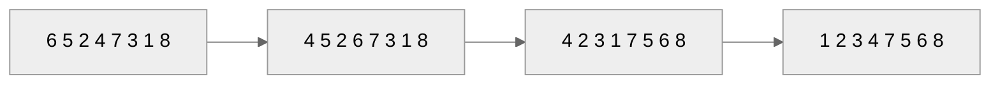
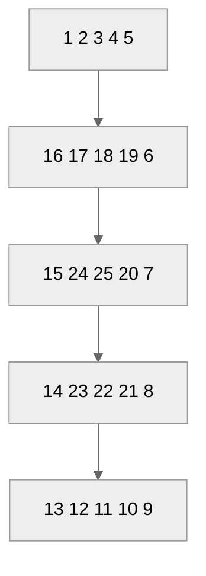

<!-- _class: lead -->

# 软件技术基础

## 数组

**施展**
武汉光电国家研究中心 & 计算机学院
华中科技大学

---

## 本章主要内容
- 一维/二维数组的声明、初始化和使用  
- 数组作为函数参数的使用  
- 字符串数组  
- 多维数组  

---

## 7.1 数组概述
- 描述 **同类型数据** 的集合  
- 元素下标从 **0** 开始，**连续存储**  
- 示例  
  ```c
  #define SIZE 30
  int score[SIZE];   /* 30 个 int，score[0] ~ score[29] */
  ```
- 内存占用：`sizeof(int) * SIZE`

---

## 7.2 一维数组

### 声明
```c
存储类型 类型 数组名[常量] = {初值表};
```
- 合法：`int a[5];`  
- C99 支持：`int n = 4, a[n];`

### 元素引用
```c
a[2]    a[i]    a[i + j]    a[max(a, b)]
```

---

### ⚠️ 下标越界示例
```c
int a[4], i;
for (i = 0; i <= 4; i++)  /* i = 4 越界 */
    a[i] = i + 1;
```

---

### 初始化
```c
int x[5] = {1, 2, 3, 4, 5};          /* 全初始化 */
int y[]  = {1, 2, 3, 4, 5};          /* 自动长度 */
int z[6] = {1, 2, 3, 4};             /* 前 4 个有效 */
```

---

### 数组作为函数参数
```c
void fun(int y[], int n) {
    for (int i = 0; i < n; i++) y[i]++;
}
```
- **地址传递**（共享同一段内存）

---

## 冒泡排序 BubbleSort

### 算法思路
1. 每轮比较相邻元素，**最大/小沉底**  
2. 共 `n-1` 轮，第 `i` 轮比较 `n-i` 次  

### 代码
```c
void BubbleSort(int a[], int n) {
    for (int i = 1; i < n; i++)
        for (int j = 0; j < n - i; j++)
            if (a[j] > a[j + 1]) {
                int t = a[j];
                a[j] = a[j + 1];
                a[j + 1] = t;
            }
}
```

---

## 二分查找 BinarySearch

### 思路
- 已排序数组，每次 **折半**  
- 比较中间元素，递归/迭代缩小范围  

### 迭代实现
```c
int BinarySearch(int a[], int x, int n) {
    int left = 0, right = n - 1;
    while (left <= right) {
        int mid = (left + right) / 2;
        if (x < a[mid])       right = mid - 1;
        else if (x > a[mid])  left  = mid + 1;
        else                  return mid;
    }
    return -1;
}
```

---

### 递归实现
```c
int BinarySearch(int a[], int x, int left, int right) {
    if (left > right) return -1;
    int mid = (left + right) / 2;
    if (x == a[mid]) return mid;
    else if (x > a[mid])
        return BinarySearch(a, x, mid + 1, right);
    else
        return BinarySearch(a, x, left, mid - 1);
}
```

---

## 分治法示例：找最大值
- 数组大小为 1 → 直接返回  
- 数组大小为 2 → 一次比较  
- 数组大小 > 2 → 二分递归  

---

## 快速排序 QuickSort
1. **分解**：选切分元素，分成左右子集  
2. **递归**：对子集调用 QuickSort  
3. **合并**：天然有序  

```c
void QuickSort(int a[], int left, int right) {
    if (left < right) {
        int split = partition(a, left, right);
        QuickSort(a, left, split - 1);
        QuickSort(a, split + 1, right);
    }
}
```

---

### 分区示例（方法1）



---

## 7.3 二维数组
- 两个下标，表示矩阵或表格  
- 按行连续存储  
- 声明  
  ```c
  int score[30][4];  /* 30 行 4 列 */
  ```

---

### 初始化
```c
/* 按行 */
int x[2][3] = {{85, 91, 0}, {82, 95, 0}};

/* 按存储顺序 */
int a[2][2] = {85, 91, 82, 95};
```

---

### 示例：计算学生平均成绩
```c
#define N 10   /* 人数 */
#define M 4    /* 课程数 */
int score[N][M + 1];   /* 最后一列存平均 */

/* 输入 & 计算 */
for (int i = 0; i < N; i++) {
    int sum = 0;
    for (int j = 0; j < M; j++) {
        scanf("%d", &score[i][j]);
        sum += score[i][j];
    }
    score[i][M] = (int)(sum * 1.0 / M + 0.5);   /* 四舍五入 */
}
```

---

### 二维数组作函数参数
```c
void fun(int a[][M + 1], int n) { ... }
/* 或者 */
void fun(int n, int m, int a[][m]) { ... }
```

---

### 旋转方阵（n 阶）



---

## 7.4 n 维数组
- 三维数组描述空间点集  
- 示例  
  ```c
  int a[][3][3] = {
      {{81,82,90},{73,94,90},{65,70,80}},
      {{80,86,87},{78,90,80},{89,60,70}}
  };
  ```

---

## 7.5 字符数组与字符串
- 字符串：以 `\0` 结尾的一维字符数组  
- 长度 = 存储长度 - 1  

---

### 声明与使用
```c
char s[81];   /* 最多存 80 个字符 + '\0' */
```

### 构造字符串
```c
char Capital[27];
for (int i = 0; i < 26; i++)
    Capital[i] = 'A' + i;
Capital[26] = '\0';
puts(Capital);
```

---

### 初始化
```c
/* 字符列表 */
char s1[] = {'W','u','h','a','n','\0'};

/* 字符串常量（推荐） */
char s2[] = "Wuhan";
```

---

## 常用字符串函数
| 函数 | 作用 |
|---|---|
| `strlen` | 长度（不含 `\0`） |
| `strcpy` | 拷贝 |
| `strcmp` | 比较 |
| `strcat` | 连接 |
| `strstr` | 找子串 |
| `strchr` | 找字符 |

---

### 自定义实现示例
```c
/* 求长度 */
int mystrlen(char s[]) {
    int j = 0;
    while (s[j] != '\0') j++;
    return j;
}

/* 反转 */
void mystrrev(char s[]) {
    for (int i = 0, j = strlen(s) - 1; i < j; i++, j--) {
        char c = s[i];
        s[i] = s[j];
        s[j] = c;
    }
}
```

---

## 字符串 ↔ 数字
| 方向 | 函数 | 示例 |
|---|---|---|
| 串 → 整数 | `atoi` | `"123"` → `123` |
| 串 → 浮点 | `atof` | `"3.14"` → `3.14` |
| 整数 → 串 | `itoa` | `123` → `"123"` |  

---

### `atoi` 实现
```c
int myatoi(char s[]) {
    int num = 0;
    for (int j = 0; s[j] != '\0'; j++)
        num = num * 10 + (s[j] - '0');
    return num;
}
```

---

## 二维字符数组（字符串数组）
```c
char devices[3][12] = {"hard disk", "CRT", "keyboard"};
```

- 引用单个字符：`devices[2][3]` → `'b'`  
- 引用整串：`printf("%s", devices[1]);` → `CRT`

---

### 输入输出
```c
scanf("%s", devices[1]);      /* 输入到第二行 */
printf("%s\n", devices[i]);   /* 输出第 i 行 */
```
