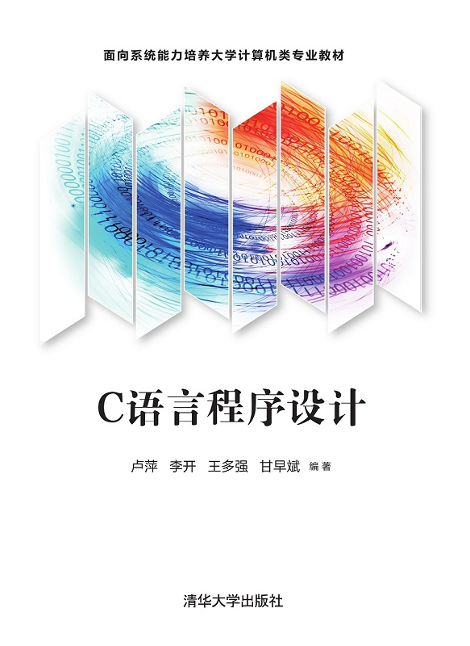

<!-- _class: lead -->

# 软件技术基础

## C语言进阶

**施展**
武汉光电国家研究中心 & 计算机学院
华中科技大学
2025-11-11 (第11周周二) 至 2025-12-19 (第16周周五) @ 东九楼A201

<!-- 
第11周(2025-11-10 至 2025-11-16)至第16周(2025-12-15 至 2025-12-21) 周二(节次：7-8，东九楼A201)和周五(节次：3-4，东九楼A201)
 -->

---

## 授课教师

- **施展** 武汉光电国家研究中心，存储部，C523
- 联系方式
  - EMail <zshi@hust.edu.cn>
  - 电话 027-87792450
  - 主页
    - <https://shizhan.github.io/>
    - <http://faculty.hust.edu.cn/shizhan/zh_CN/index.htm>

---

## 基本信息

<!-- paginate: true -->

<style scoped>
  li {
    font-size: 27px;
  }
</style>



- 课程资料: <https://marp-public.pages.dev/c-language-advanced-pre>  
- 课程平台: 学校官微**课程平台**
- 教材与参考书
  - [**C语言程序设计**](http://www.tup.tsinghua.edu.cn/booksCenter/book_08344701.html), 作者：卢萍、李开、王多强、甘早斌，清华大学出版社, 2021
  - [C语言程序设计典型题解与实验指导](http://www.tup.tsinghua.edu.cn/booksCenter/book_08344801.html)，作者：卢萍、李开、王多强、甘早斌，清华大学出版社，2019

---

<!-- paginate: true -->

## 背景知识

```python
if not 学习过"缺失的一课"，至少第6讲:
    if not 独立维护过Github或Gitee等开放Git仓库:
        随我进行课堂练习
```

[计算机教育中缺失的一课](https://missing-semester-cn.github.io/)，[官网](https://missing.csail.mit.edu/)，[B站](https://www.bilibili.com/video/BV1x7411H7wa/)

与本次课程相关的基础训练

- 1/13: 课程概览与 shell
- 1/14: Shell 工具和脚本
- 1/22: 版本控制([Git](https://git-scm.com/download))

---

## 学习内容

<style scoped>
  table, li {
    font-size: 27px;
  }
</style>

| 授课章节 | 主要内容概要 | 周二(7-8) | 周五(3-4) |
| :---    | :---        | :--- | :--- |
| [第6章 编译预处理](c-language-advanced-compiler) | 宏定义、文件包含、条件编译 | 11-11 | |
| [第7章 数组](c-language-advanced-array) | 一维/二维数组、字符数组 | | 11-14 |
|| 排序与查找算法 | 11-18 ||
| [第8章 指针](c-language-advanced-pointer) | 指针概念、指针与数组/字符串 | | 11-21 |
|| 指针数组、函数指针| 11-25 | 11-28 |
| [第9章 结构与联合](c-language-advanced-struct) | 结构体、联合体 | 12-02 | 12-05 |
|| 结构数组、单链表操作| 12-09 | 12-12|
| [第10章 文件](c-language-advanced-file) | 文件操作、顺序/随机读写、文件状态检测 | 12-16 | 12-19 |

