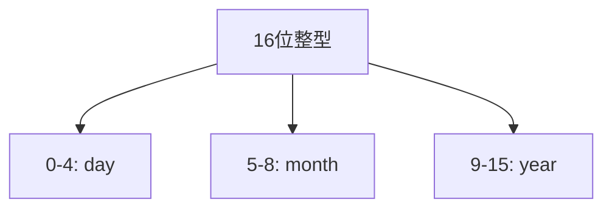
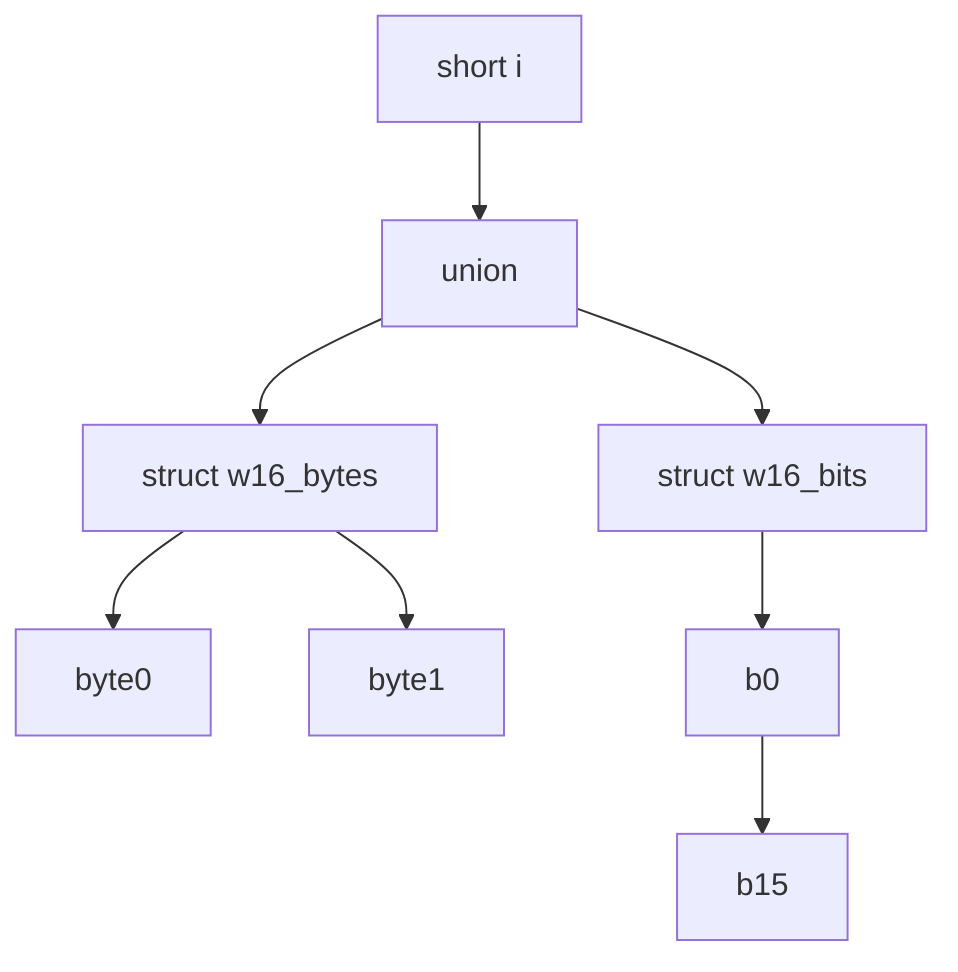
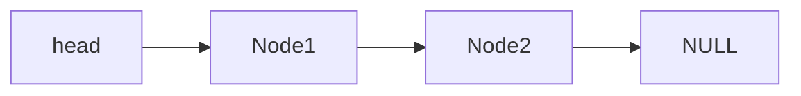
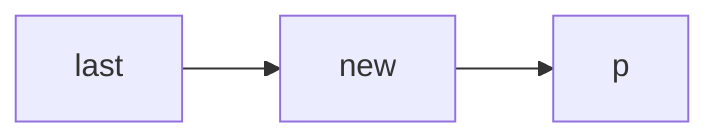
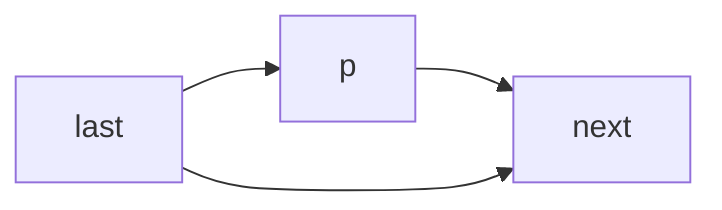
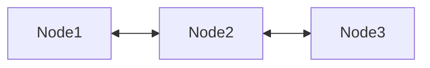
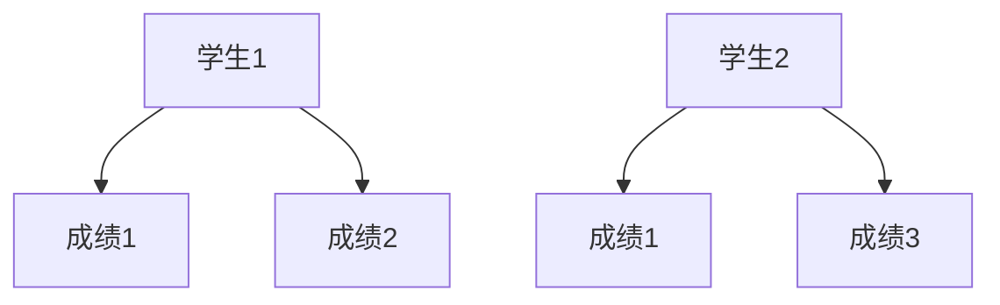

<!-- _class: lead -->

# 软件技术基础

## 结构与联合

**施展**
武汉光电国家研究中心 & 计算机学院
华中科技大学

---

## 目录
- 结构类型
- 结构数组与指针
- 结构作为函数参数与返回值
- 字段结构
- 联合类型
- 结构指针应用：链表

---

## 结构类型（struct）

结构是一组相关联的数据集合，成员类型可以不同。

```c
struct stu {
    char name[20];
    float score;
};
```

---

### 示例：求两点间距离

```c
struct point {
    int x;
    int y;
};

int main() {
    struct point a, b;
    scanf("%d%d%d%d", &a.x, &a.y, &b.x, &b.y);
    double dx = b.x - a.x;
    double dy = b.y - a.y;
    double d = sqrt(dx*dx + dy*dy);
    printf("distance: %f\n", d);
}
```

---

### 将求距离封装为函数

```c
double distance(struct point a1, struct point a2) {
    double dx = a2.x - a1.x;
    double dy = a2.y - a1.y;
    return sqrt(dx*dx + dy*dy);
}
```

---

### 使用结构指针传参

```c
double distance(struct point *p1, struct point *p2) {
    double dx = p2->x - p1->x;
    double dy = p2->y - p1->y;
    return sqrt(dx*dx + dy*dy);
}
```

---

### 结构变量赋值

```c
struct point a = {1, 2}, b;
b = a; // 合法
b = (struct point){3, 5}; // C99复合文字
```

---

## 结构数组

```c
struct student {
    char name[20];
    int score;
};

struct student class[30];
```

---

### 结构数组初始化

```c
struct student class[3] = {
    {"Alice", 90},
    {"Bob", 85},
    {"Charlie", 78}
};
```

---

## 嵌套结构访问

```c
stu[0].timeofenter.year
```

---

## 结构数组排序示例

```c
typedef struct {
    long code;
    char name[20];
    float price;
} GOODS;

void sort(GOODS *p, int n, int (*cmp)(const void*, const void*));
```

---

## 回调函数示例

```c
int cmpbyPrice(const void* s, const void* t) {
    const GOODS *p1 = (const GOODS*)s;
    const GOODS *p2 = (const GOODS*)t;
    return p1->price < p2->price;
}
```

---

## 联合（union）

联合所有成员共享同一段内存。

```c
union data {
    char c;
    short h;
    long l;
} v = {'A'};
```

---

### 判断大小端

```c
int checkCPUendian() {
    union {
        unsigned int a;
        unsigned char b;
    } c;
    c.a = 1;
    return (c.b == 1);
}
```

---

### 分离short高低字节

```c
union {
    short n;
    char bytes[2];
} test;

test.n = 0x1234;
// test.bytes[0] = 0x34
// test.bytes[1] = 0x12
```

---

## 字段结构（bit-field）

```c
struct date {
    unsigned short year : 7;
    unsigned short month : 4;
    unsigned short day : 5;
};
```

---

## 字段结构图示



---

## 联合与字段结合：访问16位字



---

## 结构指针应用：链表

---

### 顺序 vs 链式存储

| 存储方式 | 特点 |
|----------|------|
| 数组     | 固定大小，连续内存 |
| 链表     | 动态大小，非连续内存 |

---

### 链表结点定义

```c
struct intNode {
    int data;
    struct intNode* next;
};
```

---

### 链表结构图示



---

### 创建链表（先进先出）

```c
struct intNode* createList() {
    struct intNode *head = NULL, *tail = NULL;
    int x;
    scanf("%d", &x);
    if (x) {
        head = tail = malloc(sizeof(struct intNode));
        head->data = x;
        while (scanf("%d", &x), x) {
            tail->next = malloc(sizeof(struct intNode));
            tail = tail->next;
            tail->data = x;
        }
        tail->next = NULL;
    }
    return head;
}
```

---

### 遍历链表

```c
void printList(struct intNode* head) {
    while (head) {
        printf("%d ", head->data);
        head = head->next;
    }
}
```

---

### 插入结点



---

### 删除结点



---

### 链表排序（交换数据）

```c
void sortList(struct intNode* head) {
    for (struct intNode* p1 = head; p1; p1 = p1->next)
        for (struct intNode* p2 = p1->next; p2; p2 = p2->next)
            if (p1->data > p2->data) {
                int t = p1->data;
                p1->data = p2->data;
                p2->data = t;
            }
}
```

---

### 双向链表结构



---

### 十字交叉链表（学生信息 + 成绩）



---

## 总结

- 结构体用于封装不同类型数据
- 结构数组、指针、函数传参灵活高效
- 联合节省内存，字段结构压缩数据
- 链表实现动态数据结构，支持插入、删除、排序等操作

