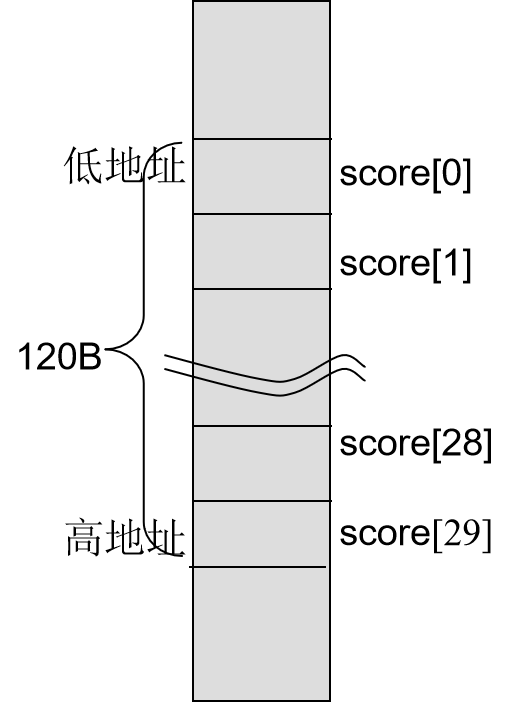
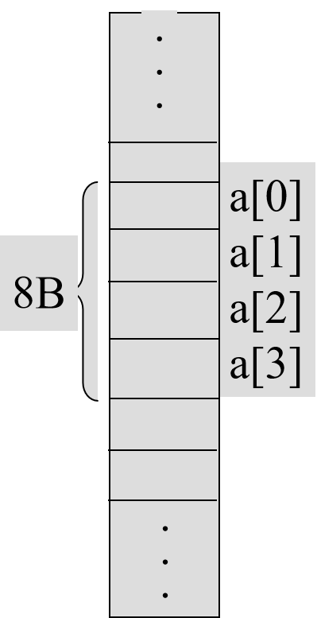
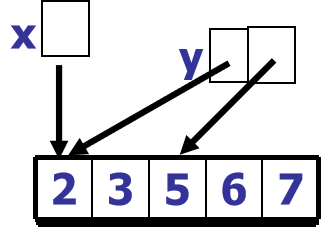

# 软件技术基础

<!-- _class: lead -->

## 数组

**施展**
武汉光电国家研究中心 & 计算机学院
华中科技大学

---

## 主要内容

- 一维/二维数组的声明、初始化和使用
- 数组作为函数参数的使用
- 字符串数组
- 多维数组

---

## 数组概述

<style scoped>
  h2 {
    opacity: 0;
  }
  strong {
    font-size: 80px;
  }
  p {
    text-align: center;
  }
</style>

[**数组概述**](#数组概述)
[一维数组](#一维数组)
[二维数组](#二维数组)
[n维数组](#n维数组)
[字符数组和字符串](#字符数组和字符串)
[基于数组的应用](#基于数组的应用)

---

## 数组基础概念

<style scoped>
.columns {
  display: grid;
  grid-template-columns: 3fr 1fr;
  gap: 2rem;
}
</style>

<div class="columns">

<div>

**数组**：是固定数量的同类型元素的集合。

- 数组元素的下标从0开始
- 各个元素在内存中连续存放

```c
#define SIZE 30
int score[SIZE];  // score是含有30个元素的int型数组
```

- 数组score的30个元素：`score[0]`～`score[29]`
- 数组score所占内存：`sizeof(int) * SIZE`

</div>

<div>



</div>

</div>

---

## 一维数组

<style scoped>
  h2 {
    opacity: 0;
  }
  strong {
    font-size: 80px;
  }
  p {
    text-align: center;
  }
</style>

[数组概述](#数组概述)
[**一维数组**](#一维数组)
[二维数组](#二维数组)
[n维数组](#n维数组)
[字符数组和字符串](#字符数组和字符串)
[基于数组的应用](#基于数组的应用)

---

### 一维数组概念

- 只有**一个**下标
- 可用于表示一个**线性的数据队列**

---

### 一维数组的声明

```c
存储类型 类型说明符 数组名[常量] = {初值表};
```

**示例**：

```c
int score[SIZE];
static int y[10];
extern double s[2];
int n=4, a[n]; // C99支持
```

---

### 一维数组元素的引用

```c
数组名[下标表达式]
```

**下标表达式可以是**：

- 整型常量：`a[2]`
- 整型变量：`a[i]`
- 含有运算符的整型表达式：`a[i+j]`
- 值为整型的函数调用：`a[max(a,b)]`

---

### 下标越界问题

<style scoped>
.columns {
  display: grid;
  grid-template-columns: 3fr 1fr;
  gap: 2rem;
}
</style>

<div class="columns">

<div>

**错误示例**：

```c
int a[4], i;
for(i = 0; i <= 4; i++)
    a[i] = i + 1;  // a[4]越界！
```

**正确示例**：

```c
int a[4], i;
for(i = 0; i < 4; i++)
    a[i] = i + 1;  // 正确：a[0]~a[3]
```

</div>

<div>



</div>

</div>

**警告**：下标越界会**破坏数组以外的变量值**，可能造成严重后果。

---

### 一维数组的初始化

**对全部元素赋初值**：

```c
int x[5] = {1, 2, 3, 4, 5};
// 等价于
int x[] = {1, 2, 3, 4, 5};  // 数组长度由初值个数确定
```

**对部分元素赋初值**：

```c
int z[6] = {1, 2, 3, 4};  // 前4个元素赋值
// z[0]:1, z[1]:2, z[2]:3, z[3]:4, z[4]:0, z[5]:0
```

---

### 一维数组作为函数参数

<style scoped>
.columns {
  display: grid;
  grid-template-columns: 3fr 1fr;
  gap: 2rem;
}
</style>

<div class="columns">

<div>

```c
void fun(int y[], int n) {
    int i;
    for(i = 0; i < n; i++) y[i]++;
}

int main(void) {
    int i, x[5] = {1, 2, 3, 4, 5};
    fun(x, 5);  // 数组名作参数，地址传递
    for(i = 0; i <= 4; i++) printf("%d", x[i]);
    fun(&x[2], 3); // 函数形参为数组名，地址传递
    printf("\n");
    for(i = 0; i <= 4; i++) printf("%d", x[i]);
    return 0;
}
```

</div>

<div>



</div>

</div>

---

### C的参数传递

**C的参数传递**：数组名作参数时为**地址传送**，实参和形参数组共享相同内存单元。

相当于是**值的双向传递**

---

## 二维数组

<style scoped>
  h2 {
    opacity: 0;
  }
  strong {
    font-size: 80px;
  }
  p {
    text-align: center;
  }
</style>

[数组概述](#数组概述)
[一维数组](#一维数组)
[**二维数组**](#二维数组)
[n维数组](#n维数组)
[字符数组和字符串](#字符数组和字符串)
[基于数组的应用](#基于数组的应用)

---

### 二维数组概念

二维数组可用于表示数据阵列（二维数据表格），如课程成绩表：

```c
int score[30][4];  // score是30行4列的int型数组
```

**二维数组的声明**：

```c
存储类 类型名 数组名[常量表达式][常量表达式];
```

**使用**：

```c
数组名[行下标][列下标]
```

---

### 二维数组的存储结构

**存放方式**：按行存放

```c
short x[2][3];
```

**逻辑结构**：

```c
x[0][0]  x[0][1]  x[0][2]
x[1][0]  x[1][1]  x[1][2]
```

**物理存储结构**：

```c
x[0][0] → x[0][1] → x[0][2] → x[1][0] → x[1][1] → x[1][2]
```

---

### 二维数组的初始化

**按照物理存储结构赋初值**（当一维数组处理）：

```c
int a[2][2] = {85, 91, 82, 95};
```

**按照逻辑结构（按行）赋初值**（可读性好）：

```c
int x[2][3] = {{85, 91, 0}, {82, 95, 0}};
int b[][3] = {{1, 3}, {5, 6, 7}};  // 第1维大小可省略
```

---

### 二维数组示例：成绩表

```c
#include<stdio.h>
#define N 10      // 人数
#define M 4       // 课程数

double CalAverage(int [], int);  // 计算平均值

int main(void) {
    int x[N][M+1];
    int i, j;
    for(i = 0; i < N; i++) {
        for(j = 0; j < M; j++)
            scanf("%d", &x[i][j]);     // 输入成绩
        x[i][M] = CalAverage(x[i], M); // 计算学生的平均成绩
    }
    // 输出成绩表...
    return 0;
}
```

---

### 二维数组作为函数参数

```c
// 形参数组第1维不指定大小
void fun(int a[][M+1], int n) {
    int i, j, sum;
    for(i = 0; i < n; i++) {
        for(sum = 0, j = 0; j < M; j++)
            sum += a[i][j];           // 学生i的成绩和
        a[i][j] = sum * 1.0 / j + 0.5; // 学生i的平均成绩(4舍5入)
    }
}
```

**动态数组**：第1维不指定大小，第2维是m

```c
void fun(int n, int m, int a[][m])
```

---

## n维数组

<style scoped>
  h2 {
    opacity: 0;
  }
  strong {
    font-size: 80px;
  }
  p {
    text-align: center;
  }
</style>

[数组概述](#数组概述)
[一维数组](#一维数组)
[二维数组](#二维数组)
[**n维数组**](#n维数组)
[字符数组和字符串](#字符数组和字符串)
[基于数组的应用](#基于数组的应用)

---

### 多维数组概念

- **三维数组**：可以描述空间中的点集
- **n维数组**：用来描述n维线性空间中的n维向量

### 三维数组示例

```c
int a[][3][3] = { 
    { {81, 82, 90}, {73, 94, 90}, {65, 70, 80} },
    { {80, 86, 87}, {78, 90, 80}, {89, 60, 70} }
};
```

n维数组在数学和科学计算中有广泛应用。

---

## 字符数组和字符串

<style scoped>
  h2 {
    opacity: 0;
  }
  strong {
    font-size: 80px;
  }
  p {
    text-align: center;
  }
</style>

[数组概述](#数组概述)
[一维数组](#一维数组)
[二维数组](#二维数组)
[n维数组](#n维数组)
[**字符数组和字符串**](#字符数组和字符串)
[基于数组的应用](#基于数组的应用)

---

### 字符数组和字符串概念

- **字符数组**：类型为char的数组，存放字符数据
- **字符串**：用一维字符数组存放，在末尾加一个空字符`\0`来构造
- **字符串数组**：用二维字符数组存放

**字符串特性**：

- 字符串常量`"..."`隐含有空字符`\0`
- `%s`也会自动加`\0`
- 字符串的长度 = 字符串的存储长度 - 1

---

### 字符数组的声明和使用

```c
char s[81];  // s是字符型数组，可以放入81个字符
```

- 可以表示最多由80个字符组成的字符串
- 字符数组的最小长度 = 该字符串的长度 + 1

---

**示例**：产生26个大写英文字母组成的字符串

```c
#include <stdio.h>
int main(void) {
    char Capital[27];
    int i;
    for(i = 0; i < 26; i++)
        Capital[i] = 'A' + i;
    Capital[26] = '\0';  // 在末尾加'\0'来构造字符串
    puts(Capital);
    return 0;
}
```

---

### 字符数组的初始化

**通过初始化列表**（直接给出字符串中的各字符）：

```c
char s1[8] = {'W', 'u', 'h', 'a', 'n', '\0'}; // '\0'必须在初始化列表中显示给出
```

**指定一个字符串常量**（常用）：

```c
char s2[28] = "Computer Science";  // 末尾自动加上'\0'
char s3[] = "Computer";            // 数组长度由字符串确定
```

**特殊示例**：

```c
char s[] = "Com\0puter"; // strlen(s) = 3, sizeof s = 10
```

---

### 字符串处理函数

`<string.h>`中的串操作函数：

- 求字符串长度(`strlen`) —— 不计`\0`
- 字符串的拷贝(`strcpy`)
- 字符串的比较(`strcmp`)
- 字符串的连接(`strcat`)
- 求字符串的子串(`strstr`)
- 在字符串查找指定字符(`strchr`)
- 将字符串反转等函数(`strrev`) —— 非标准

---

### 求字符串长度的函数

```c
/* gets length of s */
int mystrlen(char s[]) {
    int j = 0;
    while(s[j] != '\0') j++;
    return j;
}

int main(void) {
    char str[100];
    gets(str);
    printf("length of the string is %d\n", mystrlen(str));
    return 0;
}
```

---

### 将字符串反转的函数

```c
void mystrrev(char s[]) {
    int i, j;  // 前、后指示器
    char c;
    for(i = 0, j = strlen(s) - 1; i < j; i++, j--) {
        c = s[i];
        s[i] = s[j];
        s[j] = c;
    }
}
```

**算法**：交换`t[i]`与`t[j]`，当`i >= j`时结束循环。

---

### 字符串拷贝的函数

**正确版本**：

```c
/* copies string s to t */
void mystrcpy(char t[], char s[]) {
    int j = 0;
    while((t[j] = s[j]) != '\0') j++;
}

int main(void) {
    char str1[30], str2[] = "there is a boat on the lake.";
    mystrcpy(str1, str2);
    puts(str1);  // 输出：there is a boat on the lake.
    return 0;
}
```

---

### 两个字符串比较函数

**比较规则**：从两个字符串的第一个字符开始，按照字符ASCII码值的大小进行比较。

```c
/* compares t to s
   return: =0 if s=t, >0 if s>t, <0 if s<t */
int mystrcmp(char s[], char t[]) {
    int j = 0;
    while(s[j] == t[j] && s[j] != '\0') j++;
    return s[j] - t[j];
}
```

---

### 例：验证密码

```c
int main(void) {
    char pw[] = "1234", s[20];
    int count = 3;
    do {
        printf("Input password\n");
        scanf("%s", s);
        count--;
    } while(mystrcmp(pw, s) && count);
    
    if(mystrcmp(pw, s))
        return 1;
    // 进入系统
    return 0;
}
```

---

### 字符串连接函数

**正确版本**：

```c
/* appends s to t */
void mystrcat(char t[], char s[]) {
    int j = 0, k = 0;
    while(t[j++] != '\0');  // 找到t的末尾
    j--;                    // 回退到'\0'的位置
    while((t[j++] = s[k++]));
}

int main(void) {
    char s1[80] = "I like ", s2[] = "the C programming.";
    mystrcat(s1, s2);
    printf("%s\n", s1);  // 输出：I like the C programming.
    return 0;
}
```

---

### 删除字符串首尾空白字符的函数

```c
/* deletes spacing of beginning and end in s */
int trim(char s[]) {
    int i, num, j = 0, k = 0, L = strlen(s);
    
    // 计算首部空白字符的个数
    while(s[j] == ' ' || s[j] == '\t' || s[j] == '\n' || s[j] == '\r') j++;
    
    // 计算尾部空白字符的个数
    i = L - 1;
    while(s[i - k] == ' ' || s[i - k] == '\t' || s[i - k] == '\n' || s[i - k] == '\r') k++;
    
    num = L - j - k;  // 新串字符数
    
    // 移动字符
    for(i = 0; i < num; i++)
        s[i] = s[i + j];
    
    s[num] = '\0';  // 在末尾加'\0'来构造新字符串
    return strlen(s);
}
```

---

### 从串s中删除所有与给定字符c相同的字符

```c
/* deletes all character c in s */
void strdelc(char s[], char c) {
    int j, k;
    for(j = k = 0; s[j] != '\0'; j++)
        if(s[j] != c) s[k++] = s[j];
    s[k] = '\0';
}
```

**算法说明**：

- `j`：读指示器，从头顺序移到尾
- `k`：写指示器，初值为`0`
- 如果`s[j]`不等于`c`，则`s[k] = s[j]`，`k++`

---

### 字符串匹配

字符串匹配——文本处理的一个重要领域，指从文本中找出给定字符串（称为模式）的一个或所有出现的位置。

**`strstr`函数功能**：如果字符串t是字符串s的子串，则返回t在s中第一次出现时的位置（即下标）。否则，返回-1。

**匹配算法**：

- BF(Brute Force)：暴力求解法、穷举
- KMP(Knuth-Morris-Pratt)
- BM(Boyer-Moore)：文本编辑器常用

---

### 暴力法找子串

```c
/* strstr: return index of t in s, -1 if none */
int mystrstr(char s[], char t[]) {
    int i, j, k;
    for(i = 0; s[i] != '\0'; i++) {
        // 开始第i轮匹配
        for(j = i, k = 0; t[k] != '\0'; j++, k++)
            if(s[j] != t[k]) break;  // 结束本轮匹配
        
        // 判断本轮匹配是否成功
        if(t[k] == '\0') return i;  // 匹配成功，返回下标
    }
    return -1;  // 不存在子串，返回-1
}
```

---

**简化写法**：

```c
for(j = i, k = 0; t[k] != '\0' && s[j] == t[k]; j++, k++);
```

---

### 调用子串函数

```c
int main(void) {
    char s1[] = "I like the C programming.", s2[] = "ram";
    int i;
    i = mystrstr(s1, s2);
    if(i >= 0)
        printf("the sub-string's position is %d\n", i);
    else
        printf("\"%s\" does not occur in \"%s\"\n", s2, s1);
    return 0;
}
```

---

### 数字串与数之间转换的函数

`<stdlib.h>`中的串与数值之间的转换函数：

- 十进制串转换为整数(`atoi`)
- 十进制串转换为长整数(`atol`)
- 十进制串转换为浮点型数(`atof`)
- 十六进制串转换为整数(`htoi`)
- 整数转换为十进制串(`itoa`)

---

### 十进制串转换为整数(atoi)

**算法**：ASCII码字符`s[j]`转换为对应数字`s[j] - '0'`，使用本位乘以10加下一位的算法。

```c
#define BASE 10
/* converts a string s to an int */
int myatoi(char s[]) {
    int j = 0, num = 0;
    for(; s[j] != '\0'; j++)
        num = num * BASE + s[j] - '0';
    return num;
}
```

**示例**：`54321 = ((((5)*10+4)*10+3)*10+2*10)+1`

---

### 整数转换为十进制数字串（itoa）

**函数原型**：

```c
void myitoa(int n, char s[]);
```

---

**算法**：分解出`n`的每一位数字存于数组`s`中。

```c
#define BASE 10
/* converts a integer n to a string s */
void myitoa(int n, char s[]) {
    int sign, j = 0;
    if((sign = n) < 0) n = -n;
    
    while(n > 0) {
        s[j++] = n % BASE + '0';
        n /= BASE;
    }
    
    if(sign < 0) s[j++] = '-';
    s[j] = '\0';
    strrev(s);  // 反转字符串
}
```

---

### 十六进制数字串转换为对应的整数(htoi)

```c
int htoi(char s[]) {
    int j = 0, num = 0;
    // 跳过前缀"0x"或"0X"
    if(s[j] == '0' && (s[j + 1] == 'x' || s[j + 1] == 'X'))
        j += 2;
    else
        return -1;  // 不是十六进制数字串
    
    for(; s[j] != '\0'; j++) {
        if(s[j] >= '0' && s[j] <= '9')
            num = num * 16 + s[j] - '0';
        if(s[j] >= 'a' && s[j] <= 'f')
            num = num * 16 + s[j] - 'a' + 10;
        if(s[j] >= 'A' && s[j] <= 'F')
            num = num * 16 + s[j] - 'A' + 10;
    }
    return num;
}
```

**局限性**：不能处理前导空白符和符号位。

---

### 二维字符数组

使用二维字符数组可以产生字符串数组：

```c
char text[25][80];  // 可以存放25个字符串，每个字符串的最大长度为79
```

**初始化**：

```c
// 方式1：字符初始化
char s[2][4] = {'a', 'b', 'c', '\0', 'd', 'e', 'f', '\0'};
char s[2][4] = {{'a', 'b', 'c', '\0'}, {'d', 'e', 'f', '\0'}};

// 方式2：字符串初始化（常用）
char devices[3][12] = {"hard disk", "CRT", "keyboard"};
// 等价于
char devices[][12] = {"hard disk", "CRT", "keyboard"};
```

---

### 二维字符数组的使用

```c
char devices[][10] = {"hard disk", "CRT", "keyboard"};
```

**可以引用单个字符元素**：

```c
devices[2][3]  // 值为 'b'
```

**可以引用字符串**：

```c
devices[i]  // 表示devices数组中第i行字符串的首地址
printf("%s", devices[1]);  // 输出：CRT
```

---

**示例程序**：

```c
#include <stdio.h>
int main(void) {
    int i;
    char devices[][10] = {"hard disk", "CRT", "keyboard"};
    
    devices[0][0] = 'H';  // "hard disk"变为"Hard disk"
    devices[2][0] = 'K';  // "keyboard"变为"Keyboard"
    
    for(i = 0; i < 3; i++)
        printf("%s\n", &devices[i][0]);  // 同devices[i]
    
    scanf("%s", devices[1]);  // 同&devices[i][0]
    
    for(i = 0; i < 3; i++)
        printf("%s\n", devices[i]);
    
    return 0;
}
```

---

## 基于数组的应用

<style scoped>
  h2 {
    opacity: 0;
  }
  strong {
    font-size: 80px;
  }
  p {
    text-align: center;
  }
</style>

[数组概述](#数组概述)
[一维数组](#一维数组)
[二维数组](#二维数组)
[n维数组](#n维数组)
[字符数组和字符串](#字符数组和字符串)
[**基于数组的应用**](#基于数组的应用)

---

### 排序问题

排序——计算机处理数据的一个重要问题。

**冒泡排序函数原型**：

```c
void BubbleSort(int a[], int n);
```

**形式参数**：

- 待排序的整数数组：`a[]`
- 整数的个数：`n`

---

### 冒泡排序法

**基本思路**：设有n个数，需将它们从小到大顺序排列。

1. 对n个元素，依次比较相邻的两个数，小的调到前头，比较(n-1)次后，最大的数"沉底"
2. 对剩下的n-1个元素，比较(n-2)次后，得到次大的数
3. 重复上述过程，直至剩下一个元素

```c
for(i = 1; i < n; i++) {
    for(j = 0; j < n - i; j++)
        if(a[j] > a[j+1])
            // 交换a[j]与a[j+1]
}
```

---

### 冒泡排序示例

```c
#include<stdio.h>
#define N 10

void BubbleSort(int a[], int n) {
    int i, j, t;
    for(i = 1; i < n; i++) {           // 共进行n-1轮"冒泡"
        for(j = 0; j < n - i; j++) {   // 对两两相邻的元素进行比较
            if(a[j] > a[j+1]) {
                t = a[j]; a[j] = a[j+1]; a[j+1] = t;
            }
        }
    }
}

int main() {
    int x[N], i;
    printf("please input %d numbers: \n", N);
    for(i = 0; i < N; i++) scanf("%d", &x[i]);
    BubbleSort(x, N);
    printf("the sorted numbers: \n");
    for(i = 0; i < N; i++) printf("%d ", x[i]);
    return 0;
}
```

---

### 二分查找（折半查找）

**算法思路**：将已排好序的`n`个元素（存放于数组`a`）分成两半：

1. 取`a[n/2]`与`x`比较
2. 如果`x == a[n/2]`，则找到`x`，算法结束
3. 如果`x < a[n/2]`，则在数组`a`的前半部分继续查找`x`
4. 如果`x > a[n/2]`，则在数组`a`的后半部分继续查找`x`

**返回值**：

- 如果找到`x`，返回`x`在数组`a`中的位置（下标）
- 如果没有找到，返回`-1`

---

### 二分查找函数

```c
/* 在升序数组a[0]~a[n-1]中找x
   返回下标，如果没有找到返回-1 */
int BinarySearch(int a[], int x, int n) {
    int left = 0, right = n - 1, mid;
    while(left <= right) {
        mid = (left + right) / 2;  // 计算中间元素的下标
        if(x < a[mid])
            right = mid - 1;       // 在左半部找
        else if(x > a[mid])
            left = mid + 1;        // 在右半部找
        else
            return mid;            // 找到，返回下标
    }
    return -1;                     // 没有找到，返回-1
}
```

---

## 分治法

**分治法的基本思想**：将一个大问题划分成若干子问题，这些子问题：

- 互相独立
- 与原问题相同
- 规模较小

由分治法产生的子问题往往是原问题的较小模式，这为使用递归技术提供了方便。

**分治与递归**：像一对孪生兄弟，经常同时应用在算法设计之中。

---

## 二分查找的递归形式

```c
// 在升序数组a[left]~a[right]中找x
int BinarySearch(int a[], int x, int left, int right) {
    if(left > right) return -1;        // 没有找到
    int mid = (left + right) / 2;
    if(x == a[mid]) return mid;        // 找到x
    else if(x > a[mid])                // x在后半部分
        return BinarySearch(a, x, mid + 1, right);
    else                               // x在前半部分
        return BinarySearch(a, x, left, mid - 1);
}
```

---

## 快速排序

```c
/* quick排序法 */
void QuickSort(int a[], int left, int right) {
    int split;  // 分区位置
    if(left < right) {  // 待排序数组的元素个数至少为2
        split = partition(a, left, right);  // 将数组元素分成两部分
        QuickSort(a, left, split - 1);      // 对左边部分递归排序
        QuickSort(a, split + 1, right);     // 对右边部分递归排序
    }
}
```

---

## 分区函数

```c
/* 将数组a中的元素a[left]至a[right]分成左右两部分，
   返回切分点的下标 */
int partition_v1(int a[], int left, int right) {
    int i, last; 
    int split = (left + right) / 2;  // 选择中间元素作为切分元素
    swap(a, left, split);            // 移切分元素到最左边位置
    last = left;                     // 初始化last
    
    for(i = left + 1; i <= right; i++)  // 分区：从左至右扫描
        if(a[i] < a[left])           // 小的数移到左边
            swap(a, ++last, i);
    
    swap(a, left, last);             // 将切分元素移到两部分之间
    return last;
}
```

---

## 交换函数

```c
/* swap: 交换v[i]和v[j] */
void swap(int v[], int i, int j) {
    int temp;
    temp = v[i];
    v[i] = v[j];
    v[j] = temp;
}
```

**注意**：`stdlib.h`中有函数`qsort`能对任意类型的对象排序。

---

# 总结

- **数组基本概念** - 定义、特点
- **一维数组** - 声明、初始化、使用、函数参数
- **多维数组** - 逻辑结构、存储方式、函数参数
- **字符数组与字符串** - 特点、常用函数、转换函数
- **重要算法** - 排序、查找、字符串处理
- **编程要点** - 边界检查、字符串结尾、参数传递
- **应用场景** - 数据处理、文本处理、算法实现
