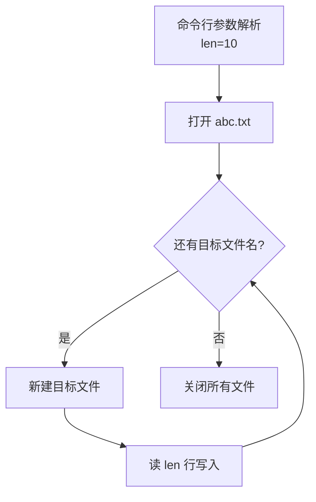
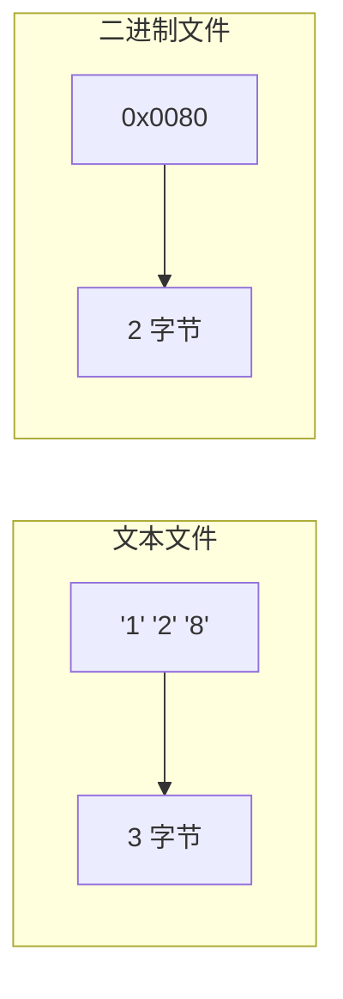
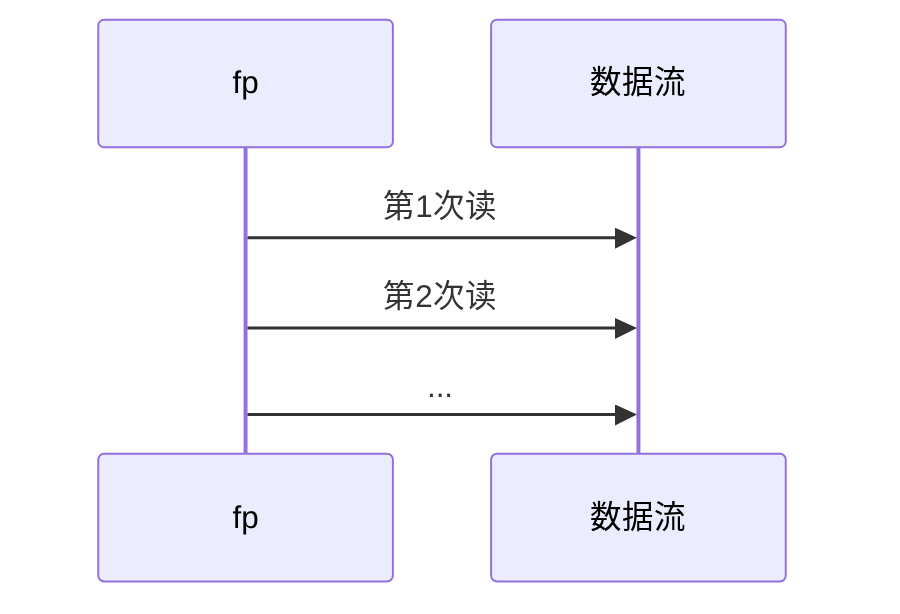
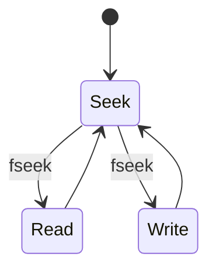

<!-- _class: lead -->

# 软件技术基础

## 文件

**施展**
武汉光电国家研究中心 & 计算机学院
华中科技大学

---

## 文件基本概念

- **变量**和**数组**中的数据存放于**内存**，随程序结束而消失
- **文件**用于永久保存大量数据
- 文件位于**外存**（如硬盘、固态盘、光盘）
- 本章：如何用C程序**建立、更新、处理**数据文件

---

## 主要内容

- 文件的打开与关闭  
  `fopen`、`fclose`、`freopen` 函数
- 文本文件的读写  
  `fgetc`、`fputc`、`fgets`、`fputs`、`fprintf`、`fscanf` 等函数
- 二进制文件的读写  
  `fread`、`fwrite` 函数
- 文件的随机读写  
  `fseek`、`rewind`、`ftell`、`fsetpos`、`fgetpos` 等文件指针定位函数

---

## 场景问题

> 从键盘输入若干行字符，保存到 `d:\a.txt` 中，该如何做？


### 方案：**savefile.exe** 运行示意


---

## 示例：将键盘输入写入文件

```c
#include<stdio.h>

int main() {
    FILE *fp;
    char ch;
    if ((fp = fopen("d:\\a.txt", "w")) == NULL) {
        printf("can't open the file!");
        return -1;
    }
    while ((ch = getchar()) != EOF)
        fputc(ch, fp);
    fclose(fp);
    return 0;
}
```

---

## 文件操作步骤

1. **打开文件** —— 建立文件指针与文件间联系
2. 通过**文件指针**对文件进行读写操作
3. **关闭文件** —— 取消文件指针与文件间的联系

**提示**：打开文件时，就已确定文件读写格式和读写方式！

---

## 打开文件函数 `fopen()`

<style scoped>
  .columns {
    display: grid;
    grid-template-columns: 1fr 1fr;
    gap: 2rem;
  }
</style>

```c
FILE *fopen(const char *filename, const char *mode);
```

按照`mode`方式打开文件`filename`  
成功：返回文件指针  
失败：返回`NULL`

<div class="columns">

<div>

```c
FILE *fp;
fp＝fopen("c:\\test.txt", "w");
```

</div>

<div>


</div>

</div>

---

## FILE 结构体

```c
struct _iobuf {
    char  *_ptr;
    int   _cnt;
    char  *_base;
    int   _flag;
    int   _file;
    int   _charbuf;
    int   _bufsiz;
    char  *_tmpfname;
};
typedef struct _iobuf FILE;
```

---

## 标准文件指针

```c
#define stdin   (&_iob[0])
#define stdout  (&_iob[1])
#define stderr  (&_iob[2])
```

---

## 打开方式 `mode`

| 模式 | 说明 |
|------|------|
| r    | 只读文本文件 |
| w    | 只写文本文件（清空） |
| a    | 追加文本文件 |
| rb   | 只读二进制文件 |
| wb   | 只写二进制文件（清空） |
| ab   | 追加二进制文件 |
| r+   | 读写文本文件 |
| w+   | 读写文本文件（清空） |
| a+   | 读写文本文件（追加） |
| rb+  | 读写二进制文件 |

---

## 注意事项

- 使用 `r+`、`w+`、`a+` 时，读写可切换
- 从读切到写：需遇到 `EOF` 或调用 `fseek`、`rewind`
- 从写切到读：需调用 `fflush` 或文件定位函数

---

## 关闭文件函数 `fclose()`

```c
int fclose(FILE *stream);
```
关闭成功返回 `0`，失败返回 `EOF(-1)`

---

## 字符读写函数

- `int fgetc(FILE *stream);`  
- `int fputc(int c, FILE *stream);`

| 等价关系               | 说明               |
|------------------------|--------------------|
| `fgetc(stdin)`         | `getchar()`        |
| `fputc(c, stdout)`     | `putchar(c)`       |

---

## 读取文件内容并显示
```c
#include <stdio.h>

int main(void) {
    FILE *fp;
    char ch;

    if ((fp = fopen("d:\\a.txt", "r")) == NULL) {
        printf("can't open the file!");
        return -1;
    }

    while ((ch = fgetc(fp)) != EOF)
        putchar(ch);        /* 也可用 fputc(ch, stdout); */

    fclose(fp);
    return 0;
}
```

---

## 文件重定向函数 `freopen()`

```c
FILE *freopen(const char *filename, const char *mode, FILE *fp);
```
相当于：
```c
fclose(fp);
fp = fopen(filename, mode);
```

---

## 使用 `freopen` 重定向输出

```c
#include<stdio.h>
int main()
{
    char ch;
    if (freopen("d:\\a.txt", "w", stdout) == NULL)
    {
        printf("can't open the file!");
        return -1;
    }
    while ((ch = getchar()) != EOF)
        putchar(ch);
    return 0;
}
```

---

## 读取文件内容并显示

```c
#include<stdio.h>
int main()
{
    FILE *fp;
    char ch;
    if ((fp = fopen("d:\\a.txt", "r")) == NULL)
    {
        printf("can't open the file!");
        return -1;
    }
    while ((ch = fgetc(fp)) != EOF)
        putchar(ch);
    fclose(fp);
    return 0;
}
```

---

## 字符串读写函数
- `char *fgets(char *s, int n, FILE *stream);`  
- `int   fputs(const char *s, FILE *stream);`

| 函数        | 特点                           |
|-------------|--------------------------------|
| `fgets`     | 会把换行符读入                 |
| `gets`      | **已废弃**，不读入换行符       |
| `fputs`     | 不自动追加换行符               |
| `puts`      | 自动追加换行符                 |

---

## 格式读写函数
- `int fprintf(FILE *stream, const char *fmt, …);`  
- `int fscanf(FILE *stream, const char *fmt, …);`

| 等价关系                        | 说明          |
|---------------------------------|---------------|
| `fscanf(stdin, "%d", &x)`       | `scanf(...)`  |
| `fprintf(stdout, "%d", x)`      | `printf(...)` |

---

## 文本文件的复制

功能类似于 `copy source_file target_file` 命令。

---

## 文本文件的分解

命令行：
```
parts abc.txt a.txt b.txt c.txt 10
```
> 把 `abc.txt` 每 10 行切成一个小文件

---

### 分解流程图


---

## 数据采集与处理程序

- 从键盘输入：商品名称、数量、单价  
- 计算总金额  
- 数据保存到 `d:\goods.txt`

---

### 主函数

```c
#include <stdio.h>
#include <stdlib.h>

void data_write(char *);
void data_cal(char *, float);

int main(void) {
    char file[20] = "d:\\goods.txt";
    data_write(file);
    data_cal(file);
    return 0;
}
```

---

### data_write：输入并保存

```c
void data_write(char *filename) {
    FILE *out;
    char name[20];
    int number;
    float price;

    if ((out = fopen(filename, "w")) == NULL)
        exit(-1);

    puts("input name、number and price please!");
    while (scanf("%s%d%f", name, &number, &price) != EOF)
        fprintf(out, "%s %d %f\n", name, number, price);

    fclose(out);
}
```

---

### data_cal：读取并计算
```c
void data_cal(char *filename) {
    FILE *in;
    char name[5];
    int number;
    float price;

    if ((in = fopen(filename, "r")) == NULL)
        exit(-1);

    while (fscanf(in, "%s%d%f", name, &number, &price) != EOF)
        printf("%s\t%d\t%8.2f\n", name, number, price * number);

    fclose(in);
}
```

---

## 文本文件数据的间隔符

写入多个数据时需加间隔符，以便正确读取。

---

## 文件类型
| 类型       | 描述                       |
|------------|----------------------------|
| 文本文件   | ASCII 字符序列             |
| 二进制文件 | 内存映像的原始数据序列     |

---

## 存储空间举例
> 短整数 `x = 128` 分别占多少字节？



---

## 二进制文件读写

- `size_t fread(void *ptr, size_t size, size_t n, FILE *stream);`  
- `size_t fwrite(const void *ptr, size_t size, size_t n, FILE *stream);`

---

### 写示例

```c
int x[] = {12, 8, 34, 421};
FILE *fp = fopen("d:\\a.dat", "wb");

/* 写法 1：一次性写 4 个 int */
fwrite(x, sizeof(int), 4, fp);

/* 写法 2：循环写 */
for (int i = 0; i < 4; i++)
    fwrite(x + i, sizeof(int), 1, fp);

fclose(fp);
```

---

### 读示例

```c
int x[10], i = 0;
FILE *fp = fopen("d:\\a.dat", "rb");

while (fread(x + i, sizeof(int), 1, fp) == 1)
    i++;

fclose(fp);
```

---

### 文本 vs 二进制读取差异

```c
short x;

/* 按二进制读 */
fread(&x, sizeof(short), 1, fp);   // x = 0x3231

/* 按文本读 */
fscanf(fp, "%hd", &x);             // x = 123
```

---

## 商品信息二进制版（结构体）

- 将结构体数组整体写入文件  
- 再从文件随机读取

---

### 写结构体

```c
struct goods {
    long code;
    char name[20];
    float price;
} g;

/* 把 g 写入文件 */
fwrite(&g, sizeof(struct goods), 1, fp);
```

---

### 读结构体

```c
while (fread(&g, sizeof(struct goods), 1, in) == 1)
    printf("%ld\t%s\t%f\n", g.code, g.name, g.price);
```

---

## 文件尾测试

```c
int feof(FILE *stream);  // 到文件尾返回非0
int ferror(FILE *stream); // 出错返回非0
```

```c
/* 正确用法 */
while (!feof(in)) {
    if (fread(&g, sizeof(struct goods), 1, in) != 1) break;
    printf("%ld\t%s\t%f\n", g.code, g.name, g.price);
}
```

---

## 顺序 vs 随机读写

| 方式     | 特点                          | 适用文件 |
|----------|-------------------------------|----------|
| 顺序     | 读写指针自动后移              | 文本/二进制 |
| 随机     | 可定位任意位置读写            | 二进制   |

---

### 顺序读写示意



---

### 随机读写示意



---

## 文件定位函数

```c
int fseek(FILE *stream, long offset, int origin);
long ftell(FILE *stream);
void rewind(FILE *stream);
int fgetpos(FILE *stream, fpos_t *pos);
int fsetpos(FILE *stream, const fpos_t *pos);
```

---

## 其它文件操作
| 函数        | 说明               |
|-------------|--------------------|
| fflush      | 强制刷新缓冲区     |
| setvbuf     | 自定义缓冲区       |
| remove      | 删除文件           |
| rename      | 重命名文件         |
| tmpfile     | 创建临时文件       |
| tmpnam      | 生成临时文件名     |
| clearerr    | 清除错误标志       |
| ferror      | 测试流错误         |
| perror      | 打印错误信息       |

---

## 总结

- 文件操作是C语言中重要的数据持久化手段
- 掌握文本文件和二进制文件的区别及适用场景
- 熟练使用各种文件读写函数（字符、字符串、格式、二进制）
- 理解顺序读写和随机读写的原理及应用
- 掌握文件定位和错误处理的方法
