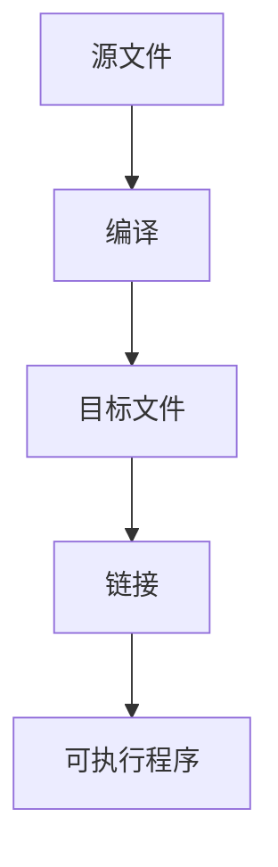

<!-- _class: lead -->

# 第5章 函数

**C语言程序设计**

---

# 主要内容

- 结构化编程和C程序的一般结构
- 函数的机制：函数定义、函数声明、函数调用
- 变量的存储类型
- 递归

---

# 5.1 模块化程序设计

- 把一个问题逐步细化分解为若干子问题，用函数实现子问题。
- 优点：
  - 程序编制方便，易于管理、修改和调试
  - 增强可读性、可维护性、可扩充性
  - 函数可公用，避免重复代码
  - 提高软件可重用性

---

# 蒙特卡罗模拟：猜数游戏

- 模拟算法：模拟随机事件（抛硬币、掷骰子等）
- 随机数：具有不确定性和偶然性
- 应用领域：软件测试、加密系统、网络验证码
- 随机数发生器：`int rand(void);`（在 `stdlib.h` 中）

---

# 主程序结构

```c
do {
    magic = GetNum();      // 产生随机数
    GuessNum(magic);       // 猜数
    printf("Play again? (Y/N) ");
    scanf("%1s", &cmd);
} while (cmd == 'y' || cmd == 'Y');
```

---

# 子任务1：GetNum(void)

```c
int GetNum(void) {
    int x;
    printf("A magic number between 1 and %d has been chosen.\n", MAX_NUMBER);
    x = rand();
    x = x % MAX_NUMBER + 1;
    return x;
}
```

---

# 函数 GuessNum 与 main

```c
#include <stdio.h>
#include <stdlib.h>
#include <time.h>
#define MAX_NUMBER 1000

int GetNum(void);
void GuessNum(int x);

int main(void) {
    char command;
    int magic;
    do {
        magic = GetNum();
        GuessNum(magic);
        printf("Play again? (Y/N) ");
        scanf("%1s", &command);
    } while (command == 'y' || command == 'Y');
    return 0;
}
```

---

# 伪随机数算法

- 递推公式（线性同余法）：
  ```
  a₀ = seed
  aₙ = (A * aₙ₋₁ + B) % M, n ≥ 1
  ```
- 种子参数 `seed` 决定随机序列
- 初始化种子：`srand(unsigned int x);`

---

# 初始化语句的位置

```c
srand(time(NULL));  // 使用系统时间作为种子
```

- `time(NULL)` 返回自 1970年1月1日以来的秒数
- 需包含头文件 `time.h`

---

# C程序的结构



---

# 练习：蒙特卡罗法求圆周率

- 正方形内切圆，投掷飞镖 n 次
- 比值 ≈ π/4
- n 越大，结果越精确

---

# 5.2 自定义函数

使用自定义函数的三个步骤：

1. 定义函数
2. 声明函数（可选，视情况）
3. 调用函数

---

# 函数的定义

```c
类型名 函数名(参数列表) {
    // 声明部分
    // 语句部分
}
```

- 无参数：`void` 或空
- 无返回值：类型为 `void`

---

# 函数返回值

```c
return;           // 无返回值
return 表达式;    // 有返回值
```

- 执行 `return` 后立即返回
- `void` 函数可不写 `return`

---

# 函数原型

```c
类型名 函数名(参数类型表);
```

示例：

```c
int max(int x, int y);
int max(int, int);
```

---

# 良好的编程风格

- 在调用函数前必须给出其定义或原型
- 标准头文件中包含函数原型

---

# 函数调用与参数传递

```c
函数名(实参列表);
```

示例：

```c
putchar(c);
c = getchar();
printf("%f", sqrt(x));
GuessNum(GetNum());
```

---

# 实参的求值顺序

- 由编译器决定（从左到右或从右到左）
- 应避免使用有副作用的实参表达式

---

# 传地址（引用）调用

```c
int x;
scanf("%d", &x);  // 传递变量地址
```

---

# 5.3 变量的存储类型

存储类型决定：

- 作用域
- 存储分配方式
- 生命周期
- 初始化方式

关键字：`auto`、`extern`、`static`、`register`

---

# 作用域

- 局部变量：定义在函数内部
- 全局变量：定义在函数外部

---

# 自动变量

```c
auto int a;  // 等价于 int a;
```

- 作用域：定义所在块
- 存储方式：动态分配
- 生命周期：块执行期间

---

# 外部变量

```c
extern int seed;  // 引用性声明
int seed = 0;     // 定义性声明
```

- 作用域：从定义处到文件尾
- 存储方式：静态分配
- 生命周期：整个程序运行期间

---

# 静态变量

```c
static int count = 0;
```

- 静态局部变量：作用域同自动变量，生命周期永久
- 静态外部变量：作用域限于本文件

---

# 寄存器变量

```c
register int i;
```

- 建议编译器将变量存入寄存器
- 不能取地址（`&`）

---

# 5.4 递归

```c
void prn_int(int n) {
    if (n > 0) {
        printf("%d ", n);
        prn_int(n - 1);
    }
    printf("%d ", n);
}
```

输出：`4 3 2 1 0 1 2 3 4`

---

# 递归概述

- 递归：函数直接或间接调用自身
- 优点：代码简洁，易于理解
- 缺点：效率低，占用内存多

---

# 递归法求 n!

```c
long fact(int n) {
    if (n == 0 || n == 1)
        return 1;
    else
        return n * fact(n - 1);
}
```

---

# n! 的递归执行过程

```mermaid
graph TD
  A[fact(4)] --> B[4 * fact(3)]
  B --> C[3 * fact(2)]
  C --> D[2 * fact(1)]
  D --> E[返回 1]
  E --> F[返回 2]
  F --> G[返回 6]
  G --> H[返回 24]
```

---

# n! 的迭代实现

```c
long factorial_iteration(int n) {
    int result = 1;
    while (n > 1) {
        result *= n;
        n--;
    }
    return result;
}
```

---

# 递归 vs 迭代

| 递归 | 迭代 |
|------|------|
| 代码简洁 | 效率高 |
| 易理解 | 内存占用少 |
| 适合递归数据结构 | 适合简单循环 |

---

# 递归的要素

1. 每次调用规模缩小
2. 必须有递归结束条件

---

# 递归求 Fibonacci 数列

```c
long long fibo(long n) {
    if (n == 1 || n == 2) return 1;
    else return fibo(n - 1) + fibo(n - 2);
}
```

---

# 优化1：记忆化搜索

```c
long long fibo(long n) {
    static long long f[1000] = {0, 1, 1};
    if (f[n]) return f[n];
    return f[n] = fibo(n - 1) + fibo(n - 2);
}
```

---

# 优化2：不重复求解

```c
long long fibo(long n) {
    static long long a = 1;
    long long b, c;
    if (n == 1 || n == 2) return 1;
    b = fibo(n - 1);
    c = b + a;
    a = b;
    return c;
}
```

---

# 优化3：尾递归

```c
long long fibo_tail_rec(int n, long long first, long long second) {
    if (n <= 1) return first;
    else return fibo_tail_rec(n - 1, second, first + second);
}
```

---

# 字符串的递归处理

```c
int strlen(char s[]) {
    if (s[0] == '\0') return 0;
    else return 1 + strlen(s + 1);
}
```

---

# 汉诺塔问题

- 将 n 个盘子从 A 借助 B 移到 C
- 每次只能移动一个盘子
- 大盘不能放在小盘上

---

# 汉诺塔递归算法

```c
void move(int n, int a, int b, int c) {
    if (n == 1)
        printf("%c --> %c\n", a, c);
    else {
        move(n - 1, a, c, b);
        printf("%c --> %c\n", a, c);
        move(n - 1, b, a, c);
    }
}
```

---

# 递归练习

1. 逆序输出整数：`reverse(123)` → 输出 `321`
2. 判断回文字符串：`is_palindrome("Level")` → 返回 `1`

---

# 整数的分划问题

将正整数 M 划分为一系列正整数之和。

示例：M=6

```
6
5+1
4+2, 4+1+1
3+3, 3+2+1, 3+1+1+1
...
```

---

# 递归求解整数分划

```c
void split(int n, int cur) {
    if (n == 0) {
        // 输出分划方案
    } else {
        for (int i = n; i >= 1; i--) {
            if (i 值可行) {
                a[cur] = i;
                split(n - i, cur + 1);
            }
        }
    }
}
```

---

# 枚举的递归实现

```c
void find(int a[], int k) {
    if (k == 5) {
        // 输出解
    } else {
        for (int i = 0; i < 10; i++) {
            if (i 未用过) {
                a[k] = i;
                find(a, k + 1);
            }
        }
    }
}
```

---

# 八皇后问题

在 8×8 棋盘上放置 8 个皇后，使其互不攻击。

```c
void find(int a[], int i) {
    if (i == 8) {
        // 输出解
    } else {
        for (int j = 0; j < 8; j++) {
            if (互不攻击) {
                a[i] = j;
                find(a, i + 1);
            }
        }
    }
}
```

---

## 总结

- 能够设计模块化的程序结构
- 熟练运用各种存储类型的变量
- 理解并实现递归算法
- 能够对递归程序进行优化
- 解决经典递归问题（汉诺塔、八皇后等）
