# 软件技术基础

<!-- _class: lead -->

## 指针

**施展**
武汉光电国家研究中心 & 计算机学院
华中科技大学

---

## 主要内容

<style scoped>
.columns {
  display: grid;
  grid-template-columns: 3fr 4fr; /* 创建两等宽的栏 */
  gap: 2rem; /* 设置两栏之间的间距 */
}
</style>

<div class="columns">

<div>

- 指针的**基本概念与操作**
- 指针作为**函数参数**的使用
- 指针与**一维数组的关系**
- 指针与**字符串的处理**
- 指针数组与**二级指针**

</div>

<div>

- 带参数的main函数与**命令行参数**
- **指针函数**与**函数指针**
- 指针与**二维数组的关系**
- 复杂指针声明与**typedef**使用

</div>

</div>

---

## 指针的概念

<style scoped>
  h2 {
    font-size: 10px;
    opacity: 0;
  }
  strong {
    font-size: 60px;
  }
  p {
    text-align: center;
  }
</style>

[**指针的概念**](#指针的概念)
[指针参数](#指针参数)
[指针和一维数组](#指针和一维数组)
[指针和字符串](#指针和字符串)
[指针数组](#指针数组)
[带参数的main函数](#带参数的main函数)
[指针函数](#指针函数)
[函数的指针](#函数的指针)
[指针与二维数组](#指针与二维数组)
[用typedef定义类型](#用typedef定义类型)
[复杂声明](#复杂声明)

---

## 变量与地址

<style scoped>
.columns {
  display: grid;
  grid-template-columns: 3fr 1fr;
  gap: 2rem;
}
</style>

<div class="columns">

<div>

- 变量占有一定量（根据类型）的连续存储单元

```c
short x;
char a[5];
```

- 变量的连续存储单元首地址称为**变量的地址**

```c
&x, a <= => &a[0]
```

- **思考**: 地址数据又是什么类型的变量?

</div>

<div>

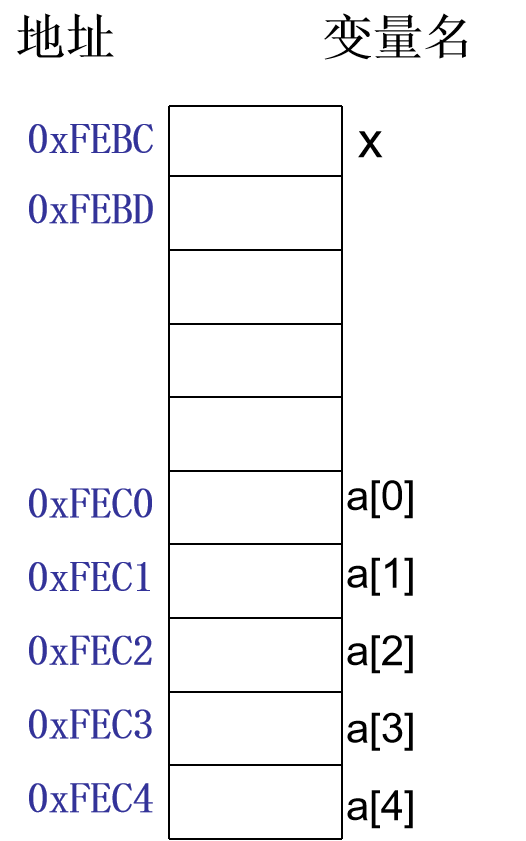

</div>

</div>

---

## 指针定义

<style scoped>
.columns {
  display: grid;
  grid-template-columns: 3fr 1fr;
  gap: 2rem;
}
</style>

<div class="columns">

<div>

- **指针**: 变量的地址
  - `&x`: 指针常量
  - `p`: 指针变量

- **指针变量**: 存放地址数据的变量
  - 指针变量也是一种变量，也要**占用一定的内存单元**
  - 特殊之处在于它存放的是另一个变量所占存储单元的**起始地址**

</div>

<div>

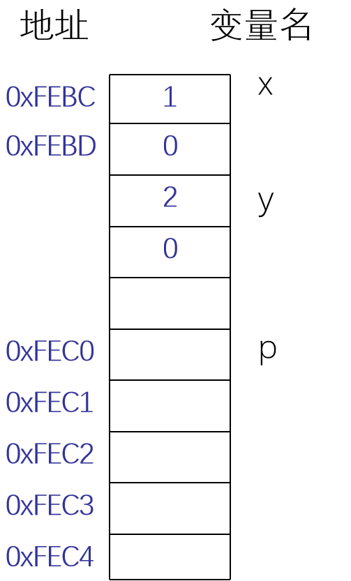

</div>

</div>

---

## 指针变量的声明

```c
数据类型 *标识符;
```

↑所指变量的数据类型

```c
short x = 1, y = 2, a[10], *p;
p = &x;     // √
p = a;      // √
p = a[0];   // ×
```

**思考**: 为什么使用指针？

---

## 为什么使用指针？

<style scoped>
.columns {
  display: grid;
  grid-template-columns: 3fr 1fr;
  gap: 2rem;
}
</style>

<div class="columns">

<div>

**直接访问**: 通过变量名存取变量

```c
x = 0x1234;
printf("%x", x);
```

**间接访问**: 通过变量的地址存取变量

```c
p = &x;
printf("%x", *p);
```

先访问`p`，得到`x`的地址，再通过该地址找到它所指向的单元中的值。

</div>

<div>

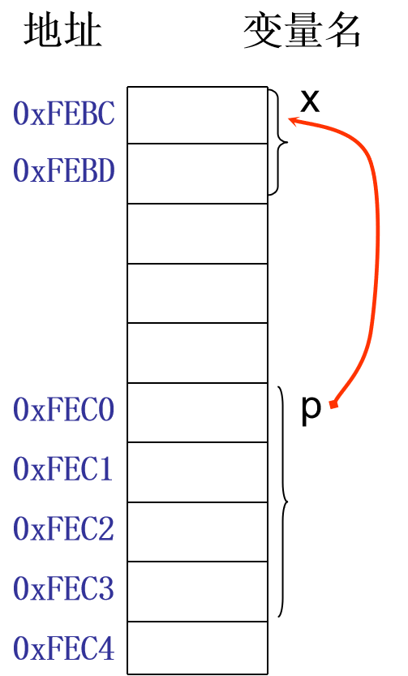

</div>

</div>

---

## 指针运算符 `*`

<style scoped>
.columns {
  display: grid;
  grid-template-columns: 3fr 1fr;
  gap: 2rem;
}
</style>

<div class="columns">

<div>

```c
short x = 1, y = 2, *p; // p是short型指针变量
p = &x;        // 指针p指向x
y = *p;        // *p<==>x
*p += 10;      // x+=10
printf("x=%hd,y=%hd", x, y);
```

</div>

<div>

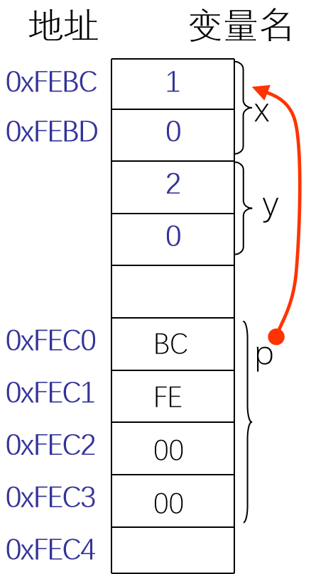

</div>

</div>

---

## 指针运算符 `*` …

<style scoped>
.columns {
  display: grid;
  grid-template-columns: 3fr 1fr;
  gap: 2rem;
}
</style>

<div class="columns">

<div>

```c
short x = 1, y = 2, *p; // p是short型指针变量
p = &x;        // 指针p指向x
y = *p;        // *p<==>x
*p += 10;      // x+=10
printf("x=%hd,y=%hd", x, y);
```

输出:

```bash
x=11, y=1
```

**思考**: 为什么指针有类型?

</div>

<div>

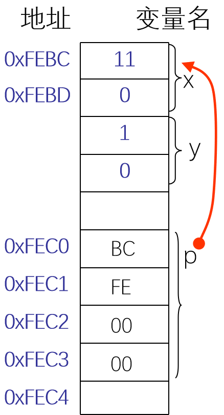

</div>

</div>

---

## 为什么指针有类型？

<style scoped>
.columns {
  display: grid;
  grid-template-columns: 3fr 1fr;
  gap: 2rem;
}
</style>

<div class="columns">

<div>

```c
int x = 0x1234ABCD, a, b, *p1;
char *p2;
p1 = &x; p2 = (char *)&x;
a = *p1; b = *p2;
printf("%x,%x", a, b);  // 输出: 1234ABCD,CD
b = *(p2 + 1);
printf("%x", b);        // 后面谈移动也与之有关
```

</div>

<div>

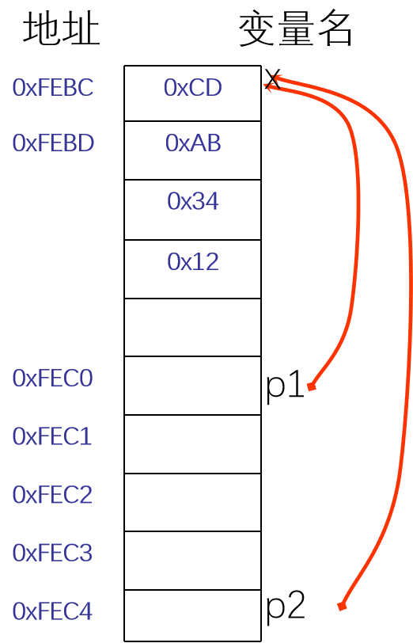

</div>

</div>

---

## 指针练习一

<style scoped>
  li {
    font-size: 27px;
  }
</style>

1. **检测机器的大小端模式**
   ```c
   int checkEndion(void);  // 返回1小端，0大端
   ```

2. **定义宏提取16位数据的高八位和低八位**
   ```c
   #define BYTE0(hdata) ________
   #define BYTE1(hdata) ________
   ```

3. **将int数的最高字节和最低字节交换**

4. **将32位整数IP转为点分十进制输出**

5. **32位本机字节序与网络字节序之间的转换**
   ```c
   unsigned long hton(unsigned long h);  // hton(0x1234)值为0x34120000
   ```

---

## 悬挂指针

下面程序段存在什么问题？

```c
int x, *p;     // p是一个整型指针变量，其值不确定
x = 25;
*p = x;        // 使用悬挂指针，错！
scanf("%d", p); // 使用悬挂指针，错！
```

**悬挂指针（野指针）**: 指针的声明只是创建了指针变量，但并没有指向具体的变量，此时指针的值是不确定的随机值。

野指针**可能导致程序访问非法内存地址**，造成程序崩溃或数据损坏等严重后果。

---

## 指针的移动操作

运算符：`+, -, ++, --, +=, -=`

**指针的移动**：指针在原有位置的基础上，通过加一个整数实现指针的**前移**（地址增大的方向）或者通过减一个整数实现指针的**后移**。

`p ± k` - 指针p前移/后移k个元素

↑_指针_ ↑_整数_

---

## 指针移动示例

<style scoped>
.columns {
  display: grid;
  grid-template-columns: 3fr 1fr;
  gap: 2rem;
}
</style>

```c
int x[5] = {1, 3, 5, 7, 9}, *px = &x[1];
```

<div class="columns">

<div>

| 表达式 | 值 |
|--------|----|
| `++*px` | 4 |
| `*++px` | 5 |
| `*(--px)` | 1 |
| `*(px--)` | 3 |
| `*px++` | 3 |
| `px += 2, *px` | 7 |

</div>

<div>

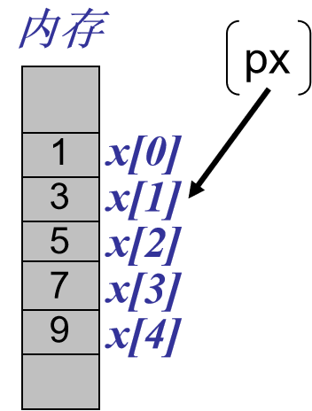

</div>

</div>

---

## 指针的移动和类型有关

<style scoped>
.columns {
  display: grid;
  grid-template-columns: 3fr 1fr;
  gap: 2rem;
}
</style>

<div class="columns">

<div>

```c
int x = 0x1234ABCD, a, b, *p1;
char *p2;
p1 = &x; p2 = (char *)&x;
a = *p1; b = *p2;
printf("%x,%x", a, b);  // 1234ABCD,CD
b = *(p2 + 1);
printf("%x", b);        // AB
```

</div>

<div>


</div>

</div>

---

## 指针的赋值运算

<style scoped>
  strong {
    color: red;
  }
</style>

**同类型**的指针可以直接赋值

```c
int a[3] = {1, 2, 3}, x, *p, *q;
p = a; q = &x;
```

**不同类型**的指针必须使用**类型强制转换**

```c
long x;
char *p;
p = (char *)&x;
```

---

## 指针的应用

例：一个长整型数占4个字节，从低字节开始依次取出每个字节的高4位和低4位并以十六进制字符形式显示。

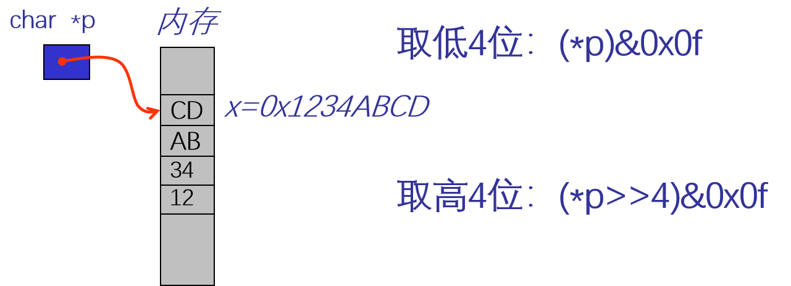

---

### 完整例程

```c
#include <stdio.h>
int main(void) {
    long x = 0x1234ABCD, k;
    char *p = (char *)&x; // 强制转换成char型指针
    char up_half, low_half;
    
    for(k = 0; k < 4; k++) {  // 循环4次，顺序访问每个字节
        low_half = (*p) & 0x0f;        // 取低4位
        if(low_half < 10) low_half += '0';  // 转换成字符0-9
        else low_half = (low_half - 10) + 'A';  // 转换成字符A-F
        
        up_half = (*p >> 4) & 0x0f;    // 取高4位
        if(up_half < 10) up_half |= '0';
        else up_half = (up_half - 10) + 'A';
        
        printf("%c %c\n", up_half, low_half);
        p++;  // 指向长整数4个字节中的下一个字节
    }
    return 0;
}
```

---

## 指针参数

<style scoped>
  h2 {
    font-size: 10px;
    opacity: 0;
  }
  strong {
    font-size: 60px;
  }
  p {
    text-align: center;
  }
</style>

[指针的概念](#指针的概念)
[**指针参数**](#指针参数)
[指针和一维数组](#指针和一维数组)
[指针和字符串](#指针和字符串)
[指针数组](#指针数组)
[带参数的main函数](#带参数的main函数)
[指针函数](#指针函数)
[函数的指针](#函数的指针)
[指针与二维数组](#指针与二维数组)
[用typedef定义类型](#用typedef定义类型)
[复杂声明](#复杂声明)

---

## 传值调用

形参的修改无法影响实参变量的值。

```c
#include <stdio.h>
void swap(int x, int y) {
    int t;
    t = x; x = y; y = t;
}
int main(void) {
    int a = 3, b = 5;
    swap(a, b);
    printf("a=%d,b=%d\n", a, b);  // a=3, b=5 保持原样
    return 0;
}
```

---

## 传址调用

以指针作为函数的参数实现变量值的交换。

<style scoped>
.columns {
  display: grid;
  grid-template-columns: 3fr 1fr;
  gap: 2rem;
}
</style>

<div class="columns">

<div>

```c
#include <stdio.h>
void swap(int *px, int *py) {
    int t;
    t = *px; *px = *py; *py = t;
}
int main(void) {
    int a = 10, b = 20, c = 30;
    swap(&a, &b);
    swap(&b, &c);
    printf("a=%d,b=%d,c=%d\n", a, b, c);
    return 0;
}
```

</div>

<div>


</div>

</div>

---

## 指针作函数参数

- 改变主调函数中变量的值
- 使函数送回多个值

```c
// implicit returned values:
void sum(int x, int y, int *p) {
    // x, y 入口，*p 出口
    *p = x + y;
}

// the caller
int sum;
sum(3, 4, &sum);
```

---

## 指针和一维数组

<style scoped>
  h2 {
    font-size: 10px;
    opacity: 0;
  }
  strong {
    font-size: 60px;
  }
  p {
    text-align: center;
  }
</style>

[指针的概念](#指针的概念)
[指针参数](#指针参数)
[**指针和一维数组**](#指针和一维数组)
[指针和字符串](#指针和字符串)
[指针数组](#指针数组)
[带参数的main函数](#带参数的main函数)
[指针函数](#指针函数)
[函数的指针](#函数的指针)
[指针与二维数组](#指针与二维数组)
[用typedef定义类型](#用typedef定义类型)
[复杂声明](#复杂声明)

---

## 数组元素的表示

<style scoped>
.columns {
  display: grid;
  grid-template-columns: 2fr 1fr;
  gap: 2rem;
}
</style>

数组元素既可以用下标表示，也可以用指针表示。

<div class="columns">

<div>

```c
int a[10], *p = a;
```

| 表示方法 | 元素值 | 地址 |
|----------|--------|------|
| 下标法 | `a[i]` | `&a[i]` |
| 指针法（数组名） | `*(a+i)` | `a+i` |
| 指针法（指针变量） | `*(p+i)` | `p+i` |

</div>

<div>

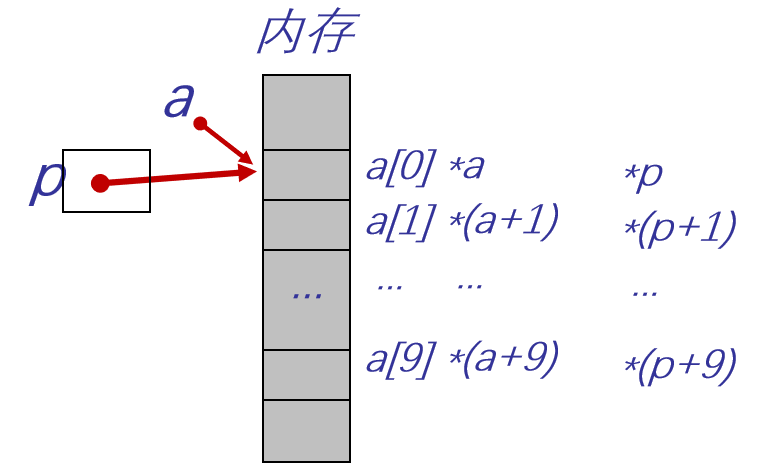

</div>

</div>

---

## 数组元素的输入

<style scoped>
.columns {
  display: grid;
  grid-template-columns: 3fr 1fr;
  gap: 2rem;
}
</style>

```c
#define N 10
int a[N], *p, i;
p = a;
```

<div class="columns">

<div>

**方法1:**

```c
for(i = 0; i < N; i++)
    scanf("%d", &a[i]);  // 或 a+i, p+i
```

**方法2:**

```c
for(; p < a + N; p++)
    scanf("%d", p);      // 或 p++
```

</div>

<div>

**候选项**

```c
&a[i]
a+i
p+i
p++
a++ // 注意！
```

</div>

</div>

---

## 数组元素的输出

```c
int a[10], *p, i;
p = a;
```

**方法1:**

```c
for(i = 0; i < 10; i++)
    printf("%d", a[i]);  // 或 *(a+i), *(p+i), *p++
```

**方法2:**

```c
for(; p < a + 10; p++)
    printf("%d", *p);
```

---

## 数组元素的输入和输出

<style scoped>
.columns {
  display: grid;
  grid-template-columns: 3fr 1fr;
  gap: 2rem;
}
</style>

<div class="columns">

<div>

```c
int a[10], *p, i;
for(p = a, i = 0; i < 10; i++)
    scanf("%d", p++);
while(p < a + 10)        // 错误！p已指向数组末尾
    printf("%d", *p++);
```

</div>

<div>

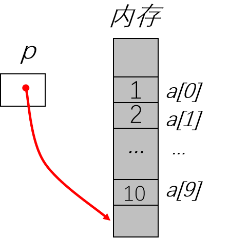

</div>

</div>

---

## 指针的关系运算

`<`, `<=`, `>`, `>=`, `==`, `!=`

- 只限于同类型指针
- 不同类型指针之间的关系运算被视为非法操作

**前例正确做法：**

```c
int a[10], *p = a;
while(p < a + 10) // 正序输出数组a的全部元素
    scanf("%d", p++);
while(p > a) // 逆序输出数组a的全部元素
    printf("%d", *--p);
```

---

### 两个指针相减

<style scoped>
.columns {
  display: grid;
  grid-template-columns: 3fr 1fr;
  gap: 2rem;
}
</style>

<div class="columns">

<div>

两个指针指向同一数组的元素，可以相减

`pa2 – pa1` 等于所指元素的下标相减

```c
int strlen(char s[]) {  // 等价于 int strlen(char *s)
    char *q = s;
    while(*s) s++;
    return (s - q);
}
```

</div> <div>

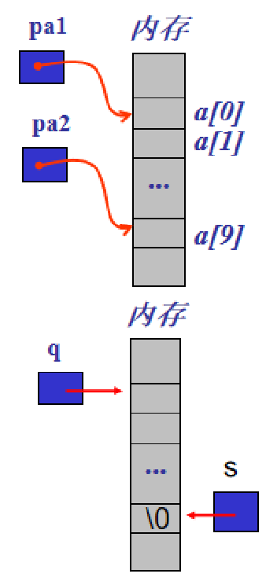

</div> </div>

---

## 常量指针

指向常量的指针

```c
int a = 5, b = 6;
const int *p;      // p是常量指针，可以不初始化
p = &a;            // 合法，可以修改指针本身的值
*p = 10;           // 非法，不能通过p修改所指变量a的值
a = 8;             // 合法，因为a不是常量
```

---

## 指针常量

类型是指针的常量

```c
int a = 5, b = 6;
int *const p = &a;  // p是指针常量，必须初始化
*p = 10;            // 合法，可以使用p修改所指对象的值
p = &b;             // 非法，它不能再指向别的变量

int x[10];          // x是指针常量
```

---

## 指向常量的指针常量

```c
int a = 5, b = 6;
const int *const p = &a;  // p是指向常量的指针常量，必须初始化
*p = 10;                  // 非法，不能通过p修改所指变量a的值
p = &b;                   // 非法，指针本身的值也不能修改
```

---

## 一维数组参数的指针表示

```c
void sort(int a[], int n) { ... }  // 等价于 void sort(int *a, int n)
```

- 形参
  - 不指定长度的数组
  - 即**指针变量**
- 实参
  - 数组名（指针常量）
  - 数组元素地址
  - 指向数组元素的指针变量

---

## 冒泡排序示例——数组

```c
#include<stdio.h>
#define N 10

void BubbleSort(int *a, int n) {  // 形参为指针
    int i, j, t;
    for(i = 1; i < n; i++)        // 共进行n-1轮"冒泡"
        for(j = 0; j < n - i; j++) // 对两两相邻的元素进行比较
            if(a[j] > a[j + 1]) {
                t = a[j]; a[j] = a[j + 1]; a[j + 1] = t;
            }
}

int main() {
    int x[N], i;
    printf("please input %d numbers:\n", N);
    for(i = 0; i < N; i++) scanf("%d", &x[i]);
    BubbleSort(x, N);  // 实参为数组名
    printf("the sorted numbers:\n");
    for(i = 0; i < N; i++) printf("%d ", x[i]);
    return 0;
}
```

---

## 冒泡排序示例——指针

```c
#include<stdio.h>
#define N 10

void BubbleSort(int *a, int n) { // 形参为指针
    int i, j, t;   
    for(i = 1; i < n; i++)    // 共进行n-1轮"冒泡"
      for(j = 0; j < n - i; j++)  // 对两两相邻的元素进行比较
          if(*(a+j) > *(a+j+1)) {  // 改为指针实现
              t = *(a+j); *(a+j) = *(a+j+1); *(a+j+1) = t; 
          }
}

int main() {
    int x[N], i, *p = x;
    printf("please input %d numbers:\n", N);
    for(i=0; i<N; i++) scanf("%d", &x[i]);
    BubbleSort(p, N);    // 实参为指针变量 
    printf("the sorted numbers:\n");
    for(i = 0; i < N; i++) printf("%d ", x[i]);
    return 0;
}
```

---

## 高精度计算 - 超大整数的加法

### 高精度运算概念

高精度运算：是指参与运算的数范围大大超出了标准数据类型能表示的范围的运算。

例如：求两个100位的数的和，计算100!。

<!-- Trae DEMO 大数求和 -->

---

### 高精度计算解决的问题

1. **大数据存储**
2. **运算过程**
3. **大数据的输入和输出**

**存储**：用数组存储，每个数组元素存储1位

- 个位在`x[0]`，十位在`x[1]`，...
- 优点：每一位都是数的形式，可以直接加减，方便处理

---

### 大数计算框架

```c
#define N 200 // 定义数位上限

int main(void) {
    int x[N+1], y[N+1], z[N+2];
    printf("输入被加数：");
    getBigNum(x, N);
    printf("输入加数：");
    getBigNum(y, N);
    addBigNum(x, y, z); // z=x+y
    putBigNum(z);
    putchar('\n');
    return 0;
}
```

---

### 输入函数getBigNum

- 函数功能：输入一个大整数，放于数组中
- 函数参数：存放大整数的数组`x`，能输入的最多位数`lim`
- 函数返回值：`void`

```c
void getBigNum(int *x, int lim);
```

- 输入用字符一位一位输入，先输入高位再输入低位
- 实际存储：低位在低地址（也可以低位在高地址）
- 反转数组元素：个位在`x[1]`，十位在`x[2]`，...，`x[0]`放总位数

---

```c
void getBigNum(int *x, int lim) {
    int i, t;
    int c;          // 存储读取的字符
    int *p1, *p2;   // 反转数组用的指针

    // 1. 清空数组（x[1]到x[lim-1]），避免残留垃圾值
    for (i = 1; i < lim; i++) {
        *(x + i) = 0;
    }

    // 2. 读取用户输入的数字字符，暂存为高位在前（x[1]存最高位，x[n]存个位）
    i = 1;
    while ((c = getchar()) != EOF && isdigit(c) && i < lim) {  // 限制不超过最大位数
        *(x + i) = c - '0';  // 字符转数字（'0'的ASCII码是48，减去后得到对应数字）
        i++;
    }
    *(x + 0) = i - 1;  // x[0]记录实际读取的位数

    // 3. 反转数组，转为低位在前（x[1]存个位，x[n]存最高位）
    p1 = x + 1;                // 指向第一个数字（原最高位）
    p2 = x + (i - 1);          // 指向最后一个数字（原个位）
    while (p1 < p2) {          // 双指针交换，直到相遇
        t = *p1;
        *p1 = *p2;
        *p2 = t;
        p1++;
        p2--;
    }
}
```

---

## 输出函数putBigNum

从高位按运算结果的实际位数输出每一位（数组元素）

```c
void putBigNum(int *x) {
    int *p;
    int n = *x;  // n = x[0]，即大整数的位数
    for(p = x + n; p > x; p--) {  // p从x[n]（最高位）开始，递减到x[1]（个位）
        printf("%d", *p);         // 依次输出每一位数字
    }
}
```

---

## 运算过程

模拟列竖式计算两数相加（如45+96）

1. **运算顺序**：从低位向高位运算；先低位后高位
2. **运算规则**：相同位的两个数相加再加上进位，成为该位的和；这个和去掉向高位的进位就成为该位的值（`5+6=11，11/10=1，11%10=1`）
3. **最后一位的进位**：如果完成两个数的相加后，进位位值不为0，则应添加一位（`14+9+1=14，14/10=1，14%10=4`）
4. **位数不同**：按位数多的一个进行计算

---

## 函数addBigNum

- 函数功能：两个大整数相加
- 函数参数：
  - 输入 x--被加数，y--加数
  - 输出 z--和
- 函数返回值：void

```c
void addBigNum(int *z, int *x, int *y);
```

---

<style scoped>
  .columns {
    display: grid;
    grid-template-columns: 2fr 1fr;
    gap: 2rem;
  }
</style>

<div class="columns">

<div>

```c
// 大整数加法：z = x + y（x、y、z均为“低位在前、x[0]存位数”的结构）
void addBigNum(int *z, int *x, int *y) {
    int i, carry, n;
    // 1. 和数组z先清零
    n = max(*x, *y); // n是x、y中较长的位数
    for (i = 1; i <= n + 1; i++) { // 预留一位进位空间
        *(z + i) = 0;
    }

    // 2. 带进位加法
    carry = 0;
    for (i = 1; i <= n; i++) {
        // 取x、y的第i位（低位），不足则补0
        int x_bit = (i <= *x) ? *(x + i) : 0;
        int y_bit = (i <= *y) ? *(y + i) : 0;
        
        *(z + i) = x_bit + y_bit + carry;
        carry = *(z + i) / 10;    // 计算进位
        *(z + i) = *(z + i) % 10; // 计算本位值
    }

    // 3. 处理最后的进位
    if (carry) {
        i++;
        *(z + i) = carry;
    }

    // 4. z[0]存储和的实际位数
    *z = i - 1;
}
```

</div>

<div>

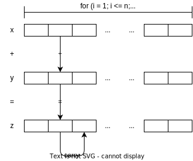

</div>

</div>

---

## 分治法高精度计算

**分治法**: "分而治之"就是把一个复杂的问题分成两个或更多的相同或相似的子问题，再把子问题分成更小的子问题，直到最后子问题可以简单的直接求解，原问题的解即子问题的解的合并。

**分治策略**: 将"一个大数分为多个1位整数（0~9）"

**存在问题**:

1. 浪费空间：整型数组的每个元素只存放一位
2. 浪费时间：一次加法只处理一位

---

## 优化策略

扩大**粒度**

1. 分治策略：将"一个大数分为多个4位整数（0~9999）"
2. 一个数组元素存放四位数；将标准数组改为紧缩数组
3. 运算时：逢万进位；将"十进制运算"改为"万进制运算"
4. 输出时：最高位直接输出，其余各位要判断是否足够4位，不足部分要补0

---

## 思考练习

编程计算n!（n可达100）

<!-- Trae DEMO 大数阶乘 -->

---

## 指针和字符串

<style scoped>
  h2 {
    font-size: 10px;
    opacity: 0;
  }
  strong {
    font-size: 60px;
  }
  p {
    text-align: center;
  }
</style>

[指针的概念](#指针的概念)
[指针参数](#指针参数)
[指针和一维数组](#指针和一维数组)
[**指针和字符串**](#指针和字符串)
[指针数组](#指针数组)
[带参数的main函数](#带参数的main函数)
[指针函数](#指针函数)
[函数的指针](#函数的指针)
[指针与二维数组](#指针与二维数组)
[用typedef定义类型](#用typedef定义类型)
[复杂声明](#复杂声明)

---

## 字符串的指针表示

字符串是一维字符数组，要访问和操纵字符串，可以用**字符数组**，也可用**字符指针**。

```c
// (1) 声明字符指针变量和字符数组
char s[80] = "This is a string.";
char *p = s;
puts(p);        // 输出：This is a string.
putchar(*p);    // 输出：T

s = "This is a book.";  // 错，数组名s是指针常量
strcpy(s, "This is a string.");  // √
```

<!-- 
用指针变量需注意：声明，初始化，移动指针访问字符

欲用指针变量访问字符串，需：

声明字符指针变量；
通过初始化或者赋值使字符指针变量指向字符串；
通过字符指针来访问字符串中对应的字符。
 -->

---

## 字符串的指针表示(续)

```c
// (2) 声明和初始化字符指针变量
char *p = "This is a string.";
/* 分配内存给字符指针p；
   分配内存给字符串常量（只读）；
   将字符串首地址赋值给字符指针； */
puts(p);        // 输出 This is a string.
putchar(p[1]);  // 输出 h

p = "This is a book.";  // √, p是指针变量, 不提倡
*p = 't';               // 运行错
```

---

## 字符串作函数参数

<style scoped>
.columns {
  display: grid;
  grid-template-columns: 1fr 1fr;
  gap: 2rem;
}
</style>

<div class="columns">

<div>

```c
void mystrcpy(char *t, const char *s) {
    while( (*t=*s) != ˊ\0ˊ )
        t++,s++;
}
```

```c
void mystrcpy(char *t, const char *s) {
    while((*t++ = *s++) != '\0');
} // 简化
```

```c
void mystrcpy(char *t, const char *s) {
    while(*t++=*s++);
} // 完全简化
```

</div>

<div>

使用注意

```c
char t[30], s[] = "world";
char *p;
mystrcpy(t, "hello");  // √
mystrcpy(t, s);        // √
mystrcpy(p, s);        // ×
p = t;
mystrcpy(p, s);        // √
```

</div>

</div>

---

## 指针数组

<style scoped>
  h2 {
    font-size: 10px;
    opacity: 0;
  }
  strong {
    font-size: 60px;
  }
  p {
    text-align: center;
  }
</style>

[指针的概念](#指针的概念)
[指针参数](#指针参数)
[指针和一维数组](#指针和一维数组)
[指针和字符串](#指针和字符串)
[**指针数组**](#指针数组)
[带参数的main函数](#带参数的main函数)
[指针函数](#指针函数)
[函数的指针](#函数的指针)
[指针与二维数组](#指针与二维数组)
[用typedef定义类型](#用typedef定义类型)
[复杂声明](#复杂声明)

---

## 指针数组定义

```c
int *p[3];  // p是一个有3个元素的整型指针数组
            // 即每个元素是指向整型变量的指针

char *ps[2] = {"red", "green"};  // ps是一个有2个元素的字符指针数组
                                 // ps[0]指向字符串"red"
                                 // ps[1]指向字符串"green"
const char *ps[2] = {"red", "green"}; // 只用不改
```

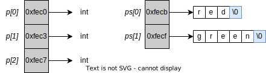

---

## 指针数组的应用

- 描述二维数组
  - 数值型二维数组
  - 字符型二维数组 (字符串数组)
- 尤其是
  - 每行元素个数不相同的二维数组，如:
    - 三角矩阵
    - 图结构数据 (邻接表)
    - 不同长度的字符串组成的字符串数组

---

### 杨辉三角形

<style scoped>
.columns {
  display: grid;
  grid-template-columns: 3fr 1fr;
  gap: 2rem;
}
</style>

<div class="columns">

<div>

```c
#define N    5
#define SIZE N*(N+1)/2

int main()
{
    int *p[N], a[SIZE];
    int sum = 0, i;
    for(i = 0; i < N; i++) {  // p[i]指向各行首元素
         p[i] = &a[sum];  // a[0], a[1], ..., a[i*(i+1)/2]
         sum += i + 1;
    }
    for(i = 0; i < N; i++) {  // 遍历各行
        *p[i] = 1;        // 初始化行首元素为1
        *(p[i] + i) = 1;  // 初始化行尾元素为1
    }
    for(i = 2; i < N; i++)    // 填充内部三角
        for(k = 1; k < i; k++)
            p[i][k] = p[i-1][k-1] + p[i-1][k]; // 引用上一行元素计算
    return 0;
}
```

</div>

<div>

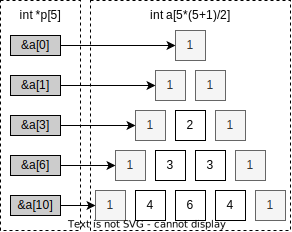
用指针运算快速定位数组元素首地址

```c
    int *a_ptr = a;
    for(i = 0; i < N; i++) {
         p[i] = a_ptr;
         a_ptr += (i + 1);
    }
```

</div>

</div>

---

<style scoped>
.columns {
  display: grid;
  grid-template-columns: 1fr 1fr;
  gap: 2rem;
}
</style>

#### 如果不是指针数组，而是二维数组？

元素数组等长，因此

<div class="columns">

<div>

**指针数组**

`sizeof(p) = sizeof(int)*N`

`sizeof(a) = sizeof(int)*SIZE`

`SIZE = N*(N+1)/2`

</div>

<div>

**二维数组**

数组元素必须是同类，因此

`sizeof(a) = sizeof(int)*N*N`

</div>

</div>

如果对所有二维数据结构都使用这个维数的数组会怎样？

<!-- 变长元素数组，省时省地 -->

---

## 字符指针数组 - 文本菜单

```c
int selectMenu(void)
{
    static const char *menu[] = {
        "1:Enter record",
        "2:Search record on name", 
        "3:Delete a record",
        "4:Add a record",
        "0:Quit",
        NULL
    };

    int i, ch;
    system("cls"); /* 清屏 */
    do {
        for(i = 0; menu[i] != NULL; i++)
            puts(menu[i]);
        printf("\n Enter your choice:");
        scanf("%d", &ch); /* 输入选择项 */
    } while(ch < 0 || ch > i); /* 选择项不在0-4之间重输 */
    return ch; /* 返回选择项，调用函数根据该数调用相应的函数 */
}
```

---

## 字符指针数组 - 使用文本菜单

```c
#include <stdio.h>
#include <stdlib.h>

int selectMenu(void);

int main(void)
{
    int choice;
    
    while((choice = selectMenu())) {
        switch(choice) {
            case 1:    // 功能1
                break;
            case 2:    // 功能2
                break;
            case 3:    // 功能3
                break;
            case 4:    // 功能4
                break;
            default:   // 错误选择项
                puts("Wrong choice!");
                break;
        }
    }
    
    return 0;
}
```

---

## 字符指针数组 - 查找关键字

```c
#include <string.h>

/* 若是关键字，函数返回1；否则，返回0 */
int iskey(char *s)
{
    static char *keyword[] = { /* 关键字表 */
        "auto", "_Bool", "break", "case", "char", "_Complex",
        "const", "continue", "default", "restrict", "do", "double", 
        "else", "enum", "extern", "float", "for", "goto",
        "if", "_Imaginary", "inline", "int", "long", "register",
        "return", "short", "signed", "sizeof", "static", "struct",
        "switch", "typedef", "union", "unsigned", "void", "volatile",
        "while", NULL
    }; // 关键字表，用末尾空指针控制循环
    
    int i;
    for(i = 0; keyword[i] != NULL; i++) { /* 将标识符s依次与每个关键字比较 */
        if(!strcmp(s, keyword[i]))
            return 1;
    }
    return 0; /* 不是关键字返回0 */
}
```

---

## 字符指针数组 - 错误示例

```c
#define N 3
#include<stdio.h>
int main() {
    int i;
    char *s[N];
    for(i = 0; i < N; i++)
        fgets(s[i], 80, stdin);  // 错误，使用了悬挂指针
    return 0;
}
```

怎么改？

---

## 动态分配存储字符串的空间

用 `malloc(size)` 分配`size`字节的存储区，返回所分配单元的起始地址。如不成功，返回`NULL`。

```c
#define N 3
#include<stdio.h>
#include<stdlib.h> // malloc()
int main() {
    int i;
    char *s[N];
    for(i = 0; i < N; i++) {
        char t[80]; // 缓冲区
        fgets(t, 80, stdin);
        s[i] = (char *)malloc(strlen(t) + 1); // 别忘记字符串尺寸计算
        strcpy(s[i], t);
    }
    // ...
}
```

---

## 无类型指针与空指针

类型为`void *`的指针称为无类型指针或`void指针`。

不能对`void指针`执行访问操作，即对`void`指针施行`"*"`操作属于非法操作。**引用前必须先给出类型**。

指针值为`0`的指针称为空指针，`0`在C中往往用符号常量`NULL`表示并被称为空值。

```c
scanf("%d", &n);
/* 建立大小为n的int型数组 */
p = (int *)malloc(n*sizeof(int));
if(p==NULL) exit(-1);
```

---

## 二级指针的应用

<style scoped>
  .columns {
    display: grid;
    grid-template-columns: 3fr 1fr;
    gap: 2rem;
  }
  strong {
    color: red;
  }
</style>

```c
char *s[4];
```

`s[0][0]`，`s[0]`，`s`**类型**分别是？

<div class="columns">

<div>

- `(s+i)` 指向 `s[i]`
- `*(s+i)` 等价于 …
- `*(s+i)+j` 指向 …
- `*(*(s+i)+j)` 等价于 …

</div>

<div>

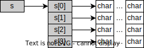

</div>

---

## 二级指针的应用…

<style scoped>
  .columns {
    display: grid;
    grid-template-columns: 3fr 1fr;
    gap: 2rem;
  }
  strong {
    color: red;
  }
</style>

```c
char *s[4];
```

`s[0][0]`，`s[0]`，`s`**类型**分别是`char`，`char *`，`char **`

<div class="columns">

<div>

- `(s+i)` 指向 `s[i]`
- `*(s+i)` 等价于 `s[i]`
- `*(s+i)+j` 指向 `s[i][j]`
- `*(*(s+i)+j)` 等价于 `s[i][j]`

</div>

<div>


二级指针作**函数形参** `char **s`

</div>

---

## 字符串排序函数 - strsort

```c
void strsort(char *s[], int n) { // char *s[] 即 char **s
    char *temp;
    int i, j;
    for(i = 0; i < n - 1; i++)
        for(j = 0; j < n - i - 1; j++)
            if(strcmp(s[j], s[j + 1]) > 0) { // 比较后交换s[j]与s[j + 1]
                temp = s[j];
                s[j] = s[j + 1];
                s[j + 1] = temp;
            }
}
```

---

## 字符串排序函数 - strsort 移动指针变量版本

```c
void strsort (char **s, int n)
{ 
    har *temp;
    int i, j;
    for(i = 0; i < n-1; i++)
        for(j = 0; j < n-i-1; j++)
            if(strcmp(*(s + j), *(s + j + 1)) > 0) {
                temp = *(s + j);
                *(s + j) = *(s + j + 1);
                *(s + j + 1) = temp; 
            }
}
```

---

## 应用例程：输入N字符串，排序后输出

<style scoped>
  .columns {
    display: grid;
    grid-template-columns: 3fr 1fr;
    gap: 2rem;
  }
</style>

<div class="columns">

<div>

```c
#define N 3
#include<stdio.h>
#include<stdlib.h>
int main() {
    int i;
    char *s[N], t[80];
    for(i = 0; i < N; i++) {
        fgets(t, 80, stdin);
        s[i] = (char *)malloc(strlen(t) + 1);
        strcpy(s[i], t);
    }
    strsort(s, N);
    for(i = 0; i < N; i++) puts(s[i]);
}
```

</div>

<div>

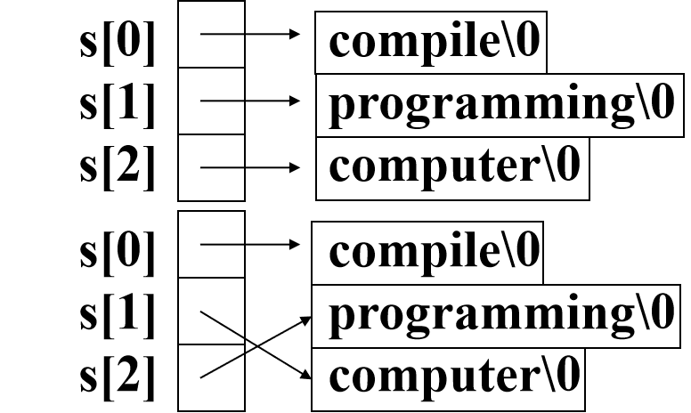

**注意**：

比的是元素
排的是指针

</div>

</div>

---

## 带参数的main函数

<style scoped>
  h2 {
    font-size: 10px;
    opacity: 0;
  }
  strong {
    font-size: 60px;
  }
  p {
    text-align: center;
  }
</style>

[指针的概念](#指针的概念)
[指针参数](#指针参数)
[指针和一维数组](#指针和一维数组)
[指针和字符串](#指针和字符串)
[指针数组](#指针数组)
[**带参数的main函数**](#带参数的main函数)
[指针函数](#指针函数)
[函数的指针](#函数的指针)
[指针与二维数组](#指针与二维数组)
[用typedef定义类型](#用typedef定义类型)
[复杂声明](#复杂声明)

---

## 命令行参数

<style scoped>
.columns {
  display: grid;
  grid-template-columns: 1fr 1fr;
  gap: 2rem;
}
</style>

<div class="columns">

<div>

求`1+2+...+n`，`n`值由用户指定

**方式1**：运行后输入
**方式2**：使用**命令行**参数输入

</div>

<div>

```c
// 方式2的main函数
int main(int argc, char *argv[]) {
    // ...
}
```

</div>

</div>

`argc`：命令行中参数的个数（包括文件名）
`argv`：长度为argc的字符指针数组

**命令行**：在控制台界面（如Windows的cmd.exe、Linux的bash）下，用户输入的用于运行程序的文本行。
**命令行参数**：在命令行中以空格隔开的字符串（例如：`C:\> sum 11`）。

---

### 如果采用方式1

```c
#include<stdio.h>

int main(void) {
    int n, sum, i;
    scanf("%d", &n); // 传统方式从 stdin 输入n
    for(sum = 0, i = 1; i <= n; i++) sum += i;
    printf("1+2+...+%d=%d\n", n, sum);
    getchar();
    return 0;
}
```

---

### 命令行参数的传递

<style scoped>
.columns {
  display: grid;
  grid-template-columns: 1fr 1fr;
  gap: 2rem;
}
</style>

<div class="columns">

<div>

```c
#include<stdio.h>
#include<stdlib.h>

int main(int argc, char *argv[])
{
    int n, sum, i;
    if(argc != 2) {
        printf("Command line error!\n");
        return -1;
    }
    n = atoi(argv[1]);
    for(sum = 0, i = 1; i <= n; i++)
        sum += i;
    printf("1+2+...+%d=%d\n", n, sum);
    return 0;
}
```

</div>

<div>

`argv`的类型实质为 `char **`

```c
#include<stdio.h>
#include<stdlib.h>

int main(int argc, char **argv) {
    int n, sum, i;
    if(argc != 2) {
        printf("Command line error!\n");
        return 1;
    }
    n = atoi(*++argv); // 所以可以写成这样
    // ...
}
```

</div>

</div>

---

### 命令行参数的内容

命令行：`C:\> sum 11`

```c
char *argv[] = {"sum", "11", NULL};
```

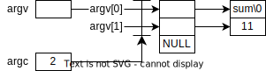

---

## 指针函数

<style scoped>
  h2 {
    font-size: 10px;
    opacity: 0;
  }
  strong {
    font-size: 60px;
  }
  p {
    text-align: center;
  }
</style>

[指针的概念](#指针的概念)
[指针参数](#指针参数)
[指针和一维数组](#指针和一维数组)
[指针和字符串](#指针和字符串)
[指针数组](#指针数组)
[带参数的main函数](#带参数的main函数)
[**指针函数**](#指针函数)
[函数的指针](#函数的指针)
[指针与二维数组](#指针与二维数组)
[用typedef定义类型](#用typedef定义类型)
[复杂声明](#复杂声明)

---

## 指针函数概念

在C语言中，函数返回的只能是值。这个值可以是一般的数值，也可以是某种类型的指针值。如果函数的**返回值是指针类型**的值，该函数称为**指针函数**。

```c
类型 *函数名(形参表);
```

如：

```c
char *strcpy(char *t, const char *s);
```

函数strcpy是一个字符指针函数。即：该函数的返回值是字符指针。

---

## 指针函数定义

<style scoped>
.columns {
  display: grid;
  grid-template-columns: 1fr 1fr;
  gap: 2rem;
}
</style>

<div class="columns">

<div>

```c
char *strcpy(char *t, const char *s) {
    char *p = t;
    while(*t++ = *s++);
    return(p);  // 返回第1个串的首地址
}

int main() {
    char st1[] = "abcd", st2[] = "hijklmn";
    printf("%s", strcpy(st1, st2));
    return 0;
}
```

有没有问题？

</div>

<div>

</div>

</div>

---

## 指针函数定义…

<style scoped>
.columns {
  display: grid;
  grid-template-columns: 1fr 1fr;
  gap: 2rem;
}
</style>

<div class="columns">

<div>

```c
char *strcpy(char *t, const char *s) {
    char *p = t;
    while(*t++ = *s++);
    return(p);  // 返回第1个串的首地址
}

int main() {
    char st1[] = "abcd", st2[] = "hijklmn";
    printf("%s", strcpy(st1, st2));
    return 0;
}
```

回顾空间分配

</div>

<div>

```c
char *strcpy(char *t, const char *s) {
    char *p = t;
    while(*t++ = *s++);
    return(p);  // 返回第1个串的首地址
}

int main() {
    char st1[40] = "abcd", st2[] = "hijklmn";
    printf("%s", strcpy(st1, st2));
    return 0;
}
```

</div>

</div>

---

## 查找子串的指针函数

```c
char *strstr(const char *s, const char *ms)
{
    char *ps=s, *pt, *pc;
    while(*ps! = '\0') {
        for(pt = ms, pc = ps; *pt! = '\0' && *pt == *pc; pt++, pc++);
        if(*pt == '\0') return ps;
            ps++;
    }
    return NULL; /*  NULL: 0 */
}
```

类似的，让函数返回的指针指向一个数组（甚至是后面提及的结构体），即可间接解决函数返回多值的问题。

---

## 函数的指针

<style scoped>
  h2 {
    font-size: 10px;
    opacity: 0;
  }
  strong {
    font-size: 60px;
  }
  p {
    text-align: center;
  }
</style>

[指针的概念](#指针的概念)
[指针参数](#指针参数)
[指针和一维数组](#指针和一维数组)
[指针和字符串](#指针和字符串)
[指针数组](#指针数组)
[带参数的main函数](#带参数的main函数)
[指针函数](#指针函数)
[**函数的指针**](#函数的指针)
[指针与二维数组](#指针与二维数组)
[用typedef定义类型](#用typedef定义类型)
[复杂声明](#复杂声明)

---

## 函数指针的声明

<style scoped>
  strong {
    color: red;
  }
</style>

每个函数都占用一段内存单元，有一个起始地址。

```c
int (*p)(int, int);  // p是指向有两个int参数的int函数的指针
```

前者指针指向返回值，这里是指针指向函数，**应该如何声明**？


---

**函数指针的声明**:

```c
类型 (*标识符)(形参表);
```

**类型**：函数返回值类型
**标识符**：函数指针名
**形参表**：函数参数列表

```c
int (*p) (int, int); // p 是指向有两个int参数的int函数的指针
```

函数指针的使用：
1) 通过初始化使其指向特定的函数: `函数指针名=函数名;`
2) 通过函数指针来调用它所指的函数

---

## 函数指针的使用

```c
void f1(int x) {
    printf("x=%d\n", x);
}

void f2(int x, int y) {
    printf("x=%d\n", x);
    printf("y=%d\n", y);
}

int main(void) {
    void (*pf1)(int x);
    void (*pf2)(int x, int y);
    pf1 = f1;
    pf2 = f2;
    pf1(5);         // 等价于(*pf1)(5);
    pf2(10, 20);    // 等价于(*pf2)(10, 20);
    return 0;
}
```

---

## 通用的整数排序函数

既能实现升序排序，也能实现降序排序

函数名称: `sort`

函数参数:

```text
v: 待排序数组的首地址
n: 数组中待排序元素数量
comp: 指向函数的指针，用于确定排序的规则，如升序或降序
```

函数返回值：无

---

## 通用的整数排序函数实现

```c
// 对指针v指向的n个整数按comp规则排序
void sort(int *v, int n, int (*comp)(int, int)) {
    int i, j;
    for(i = 1; i < n; i++)        // 冒泡法
        for(j = 0; j < n - i; j++)
            // 对v[j]和v[j+1]按照comp的规则进行比较
            if(comp(v[j], v[j + 1]))
                swap(v + j, v + j + 1);  // 交换
}
```

---

## 按升序排序的函数

**回调函数**，通过函数指针参数调用的函数

交给调用者随机应变，而非一开始的既定流程（所谓**预案**）

```c
int asc(int x, int y) {
    if(x > y) return 1; // x比y大，升序排序，返回1
    else return 0;
}

int a[6] = {4, 6, 3, 9, 7, 2};
sort(a, 6, asc); // 调用者 caller
```

**思考**：如果要降序，如何定义回调函数？

---

## 进阶：定义更通用的排序函数

能够对int、char、double、字符串、struct类型的数据排序。

既能实现升序排序，也能实现降序排序

**函数参数**:

- `void *v`: 待排序数组首地址
- `int n`: 数组中待排序元素数量
- `int size`: 每个元素的字节大小，可使用`sizeof`获取
- `int (*fcmp)(const void *, const void *)`: 指向函数的指针，用于确定排序的规则

---

### stdlib.h中的标准库函数qsort

```c
void qsort(void *base, int nelem, int width,
           int (*fcmp)(const void *, const void *));
```

使用

```c
int arr[] = {5, 2, 8, 1, 9};
int n = sizeof(arr) / sizeof(arr[0]);

qsort(arr, n, sizeof(int), compare_func);
```

**思考**：如何调用qsort对字符串数组排序。

---

## 指针与二维数组

<style scoped>
  h2 {
    font-size: 10px;
    opacity: 0;
  }
  strong {
    font-size: 60px;
  }
  p {
    text-align: center;
  }
</style>

[指针的概念](#指针的概念)
[指针参数](#指针参数)
[指针和一维数组](#指针和一维数组)
[指针和字符串](#指针和字符串)
[指针数组](#指针数组)
[带参数的main函数](#带参数的main函数)
[指针函数](#指针函数)
[函数的指针](#函数的指针)
[**指针与二维数组**](#指针与二维数组)
[用typedef定义类型](#用typedef定义类型)
[复杂声明](#复杂声明)

---

## 用指针表示二维数组元素

```c
#define M 3
#define N 2
int a[M][N] = {{1, 3}, {4, 6}, {7, 9}};
int *p;
```

**思考**：如何用指针`p`逐行输出数组`a`的所有元素？

- 数组`a`元素类型为`int`，则指针必为`int *`
- 此指针既可以指向一维数组元素，也可以指向二维数组的行首元素
- 通过指针运算，可以进一步遍历二维数组

**注意**：有别于指针数组，其外层元素类型是指针，并非内层元素类型。

---

## 用指向数组元素的指针表示二维数组

<style scoped>
  .columns {
    display: grid;
    grid-template-columns: 1fr 1fr;
    gap: 2rem;
  }
</style>

<div class="columns">

<div>

**方法1**：遍历一维数组元素
```c
for(p = a[0]; p < a[0] + M * N; p++) {
    if(!((p - a[0]) % N)) printf("\n");
    printf("%5d", *p);
}
```

</div>

<div>

**方法2**：遍历二维数组元素
```c
p = a[0];  // 等价于 p = &a[0][0]
for(i = 0; i < M; i++) {
    printf("\n");
    for(j = 0; j < N; j++)
        printf("%5d", *(p + i * N + j));
}
```

</div>

</div>

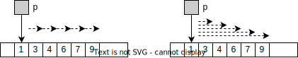

---

## 行地址与元素地址

二维数组被看成**以1维数组（行）为元素**的数组。

```c
int u[2][3] = {{1, 3, 5}, {2, 4, 6}};
```

- 第0行地址：`u[0] == &u[0][0]`
- 第1行地址：`u[1] == &u[1][0]`
- i行j列元素的地址：`&u[i][j]`、`u[i] + j`、`*(u + i) + j`
- i行j列元素的表示：`u[i][j]`、`*(u[i] + j)`、`*(*(u + i) + j)`
- `*u`：第0行首元素地址

---

## 指向数组的指针

<style scoped>
  table {
    font-size: 30px;
  }
  .columns {
    display: grid;
    grid-template-columns: 1fr 1fr;
    gap: 2rem;
  }
</style>

<div class="columns">

<div>

```c
类型名 (*标识符)[常量];
```

```c
int a[3][2] = {{1, 3}, {4, 6}, {7, 9}};
int (*p)[2];  // p是指向数组的指针，该数组有2个int型元素
p = a;        // p[i][j]: a[i][j]
```

</div>

<div>

| 表达式 | 等价表示 |
|--------|----------|
| `*(*p)` | `(*p)[0]` |
| `*(*p + 1)` | `(*p)[1]` |
| `*(*(p + 1))` | `(*(p + 1))[0]` |
| `*(*(p + 1) + 1)` | `(*(p + 1))[1]` |

</div>

</div>

使用指针`p`在二维数组`a`的第一维和第二维移动

---

## 二维数组元素的输入/输出

```c
#include <stdio.h>
#define I 2
#define J 3
int main(void) {
    int u[I][J], (*p)[J] = u;
    int j;
    
    for(j = 0; j < J; j++)      // 用指向数组元素的指针完成第0行元素的输入
        scanf("%d", (u[0] + j));
    
    for(p++, j = 0; j < J; j++) // 用指向数组的指针完成第1行元素的输入
        scanf("%d", (*p + j));
    
    for(j = 0; j < J; j++)      // 用指向数组的指针完成第0行元素的输出
        printf("%6d", *(*u + j));
    printf("\n");
    
    for(j = 0; j < J; j++)      // 用指向数组元素的指针完成第1行元素的输出
        printf("%6d", *(u[1] + j));
    return 0;
}
```

---

## 二维数组作函数参数

```c
// 形参说明为数组
void fun(int x[][4], int row) { ... }

// 形参说明为指针（指向下一级数组的指针）
void fun(int (*x)[4], int row) { ... }

// 指向数组元素的指针
void fun(int *x, int row, int col) { ... }

// 变长数组（C99）
void fun(int row, int col, int (*x)[col]) { ... }
```

---

## 三维数组的指针表示

<style scoped>
  table {
    font-size: 30px;
  }
  .columns {
    display: grid;
    grid-template-columns: 2fr 1fr;
    gap: 2rem;
  }
</style>

三维数组被看成以2维数组（页）为元素的一维数组。

```c
int x[2][3][4];
int (*p)[3][4] = x; // p是指向3行4列的二维整型数组的指针
```

<div class="columns">

<div>

| 表达式 | 等价表示 |
|--------|----------|
| `*(*(*(p + i) + j) + k)` | `x[i][j][k]` |
| `*(*(p[i] + j) + k)` | `x[i][j][k]` |
| `*(p[i][j] + k)` | `x[i][j][k]` |
| `p[i][j][k]` | `x[i][j][k]` |

</div>

<div>

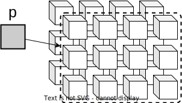

</div>

</div>

---

## 扩展思考

如果是用`malloc()`分配内存，则`int a[2][3]`和`int a[3][2]`的存储空间大小相同。

那么 `int a[2][3]` 与 `int a[3][2]` 的区别在哪里？请回顾前面用指针遍历的例子……

矩阵转置实际上做了什么？

<!-- 数组实际上是在一片内存空间上建立了一套简单的索引，转置和变形实际上是在调整这个索引的尺寸和顺序 -->

<!-- 可以尝试用两个指针指向同一片内存空间，指针指向不同数组类型，并观察指针的运算结果 -->

---

## 用typedef定义类型

<style scoped>
  h2 {
    font-size: 10px;
    opacity: 0;
  }
  strong {
    font-size: 60px;
  }
  p {
    text-align: center;
  }
</style>

[指针的概念](#指针的概念)
[指针参数](#指针参数)
[指针和一维数组](#指针和一维数组)
[指针和字符串](#指针和字符串)
[指针数组](#指针数组)
[带参数的main函数](#带参数的main函数)
[指针函数](#指针函数)
[函数的指针](#函数的指针)
[指针与二维数组](#指针与二维数组)
[**用typedef定义类型**](#用typedef定义类型)
[复杂声明](#复杂声明)

---

## typedef用法

typedef是关键字，为一个已有类型定义一个别名。

```c
// (1) 基本类型别名
typedef unsigned int size_t;
size_t x, y;  // unsigned int x, y;

// (2) 指针类型别名
typedef char *string;
string p, s[10];  // char *p, *s[10];

// (3) 函数指针类型别名
typedef int (*p_to_fun)(int, int);
p_to_fun pf;  // int (*pf)(int, int)
```

---

## typedef与#define的区别

```c
#define string char *  // string是宏名，简单的串替换
string p, s[10];       // char *p, s[10];
                       // p是字符指针
                       // s是含有10个元素的字符数组
```

---

```c
#include <stdio.h>

// 1. #define 定义指针类型（文本替换坑）
#define PTR_INT int*

// 2. typedef 定义指针类型（类型别名，安全）
typedef int* PtrInt;

int main() {
    int x = 10, y = 20;

    // 测试 #define：预期定义两个 int* 指针，实际出错
    PTR_INT p1, p2;  // 预编译后替换为：int* p1, p2; 
                     // 等价于 int *p1; int p2;（p2 是普通 int，不是指针！）
    p1 = &x;
    // p2 = &y;  // 编译报错：无法将 int* 赋值给 int

    // 测试 typedef：正确定义两个 int* 指针
    PtrInt q1, q2;  // 编译器识别 PtrInt 是 int*，等价于 int* q1; int* q2;
    q1 = &x;
    q2 = &y;        // 正常编译

    printf("*q1 = %d, *q2 = %d\n", *q1, *q2);  // 结果：*q1=10, *q2=20

    return 0;
}
```

---

## 复杂声明

<style scoped>
  h2 {
    font-size: 10px;
    opacity: 0;
  }
  strong {
    font-size: 60px;
  }
  p {
    text-align: center;
  }
</style>

[指针的概念](#指针的概念)
[指针参数](#指针参数)
[指针和一维数组](#指针和一维数组)
[指针和字符串](#指针和字符串)
[指针数组](#指针数组)
[带参数的main函数](#带参数的main函数)
[指针函数](#指针函数)
[函数的指针](#函数的指针)
[指针与二维数组](#指针与二维数组)
[用typedef定义类型](#用typedef定义类型)
[**复杂声明**](#复杂声明)

---

## 函数指针数组

```c
int (*p[2])(int);  // p是含有2个指针元素的数组
                   // 每个指针指向有一个整型参数，返回值为整型的函数
```

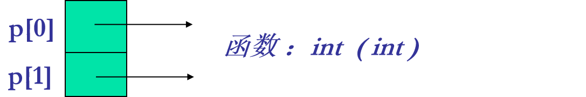

---

## 函数指针数组的使用

```c
int fun1(int x) { return 2 * x; }
int fun2(int y) { return 3 * y; }

int main(void) {
    int i, (*fp[2])(int);  // fp是有2个元素的函数指针数组
                           // 每个元素指向的函数有一个整型形参，返回整型值
    fp[0] = fun1;          // 0号元素指向fun1函数
    fp[1] = fun2;          // 1号元素指向fun2函数
    
    for(i = 0; i < 2; i++)
        printf("%d\n", fp[i]((i + 1) * 5));  // 依次调用fp[0]、fp[1]所指函数
    return 0;
}
```

---

## 函数指针的应用 - 多分支函数处理

函数指针数组可用于设计所谓的派遣（dispatch）表，以实现多分支函数处理问题，从而省去了大量的if或switch语句。

```c
// 设有10个函数f0(x),f1(x),...,f9(x)以及一个变量index
// 当index=i时，就调用fi(x)

double f0(int), f1(int), ..., f9(int);  // 函数原型
static double (*dispatch[])(int) = {f0, f1, ..., f9};  // 函数指针数组

// 调用变量index所指定的函数
dispatch[index](x);  // (*dispatch[index])(x);
```

---

## 用函数指针数组控制菜单的驱动

<style scoped>
  .columns {
    display: grid;
    grid-template-columns: 2fr 1fr;
    gap: 2rem;
  }
</style>

<div class="columns">

<div>

```c
void (*cmd[4])(void) = {f1, f2, f3, f4};
// cmd是有4个元素的函数指针数组，函数无返回值，无参数

int main(void) {
    // ...
    do {
        printf("menu1\n");
        printf("menu2\n");
        printf("menu3\n");
        printf("menu4\n");
        printf("exit(0)\n");
        printf("Enter your choice:\n");
        scanf("%d", &choice);
        if(choice >= 1 && choice <= 4)
            cmd[choice - 1]();
    } while(choice);
}
```

</div>

<div>

```c
// 菜单项函数具体实现
void f1() { ... }
void f2() { ... }
void f3() { ... }
void f4() { ... }
```

</div>

</div>

---

## 指向函数的指针函数

```c
int (*f(char *, char *))(int, int);
```

`f`是一个指针函数，该函数有2个`char *`类型的形参，其返回值是一个函数指针，指向有2个`int`参数且返回值为`int`的函数。


---

## 指针函数的指针

```c
char * (*(*v)(void))[10];
```

1. `(*v)`：v是指针变量
2. `(*v)(void)`：v是指向函数的指针，所指函数无参数
3. `(*(*v)(void))`：v所指函数的返回值是指针
4. `(*(*v)(void))[10]`：返回的指针指向有10个元素的数组
5. `char * (*(*v)(void))[10]`：数组元素的类型是char *

`v`是指向函数的指针，所指函数没有参数，返回值是指向有10个元素的字符指针数组的指针。

---

## 总结

- **指针基础概念** - 定义、声明、初始化、运算符使用
- **指针作为函数参数** - 传值调用与传址调用的区别，指针参数的作用
- **指针与一维数组** - 数组元素的指针表示法，指针运算与数组遍历
- **指针与字符串** - 字符指针与字符数组的区别，字符串处理函数的实现
- **指针数组与二级指针** - 指针数组的声明与使用，二级指针的应用场景
- **命令行参数** - 带参数的main函数，argc与argv的使用方法

---

- **指针函数与函数指针** - 函数返回指针，函数指针的声明与使用
- **指针与多维数组** - 二维数组的指针表示，行指针与元素指针的区别
- **复杂指针声明** - 函数指针数组，指向函数的指针函数等复杂声明
- **typedef使用** - 类型别名定义，与#define的区别
- **编程要点** - 指针初始化、内存管理、类型匹配、避免野指针
- **应用场景** - 动态内存分配、回调函数、数据结构实现、系统编程
