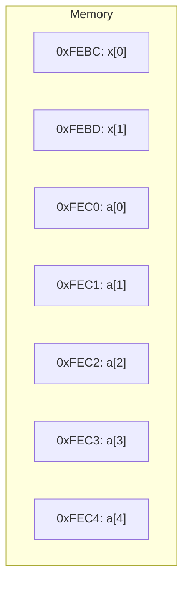
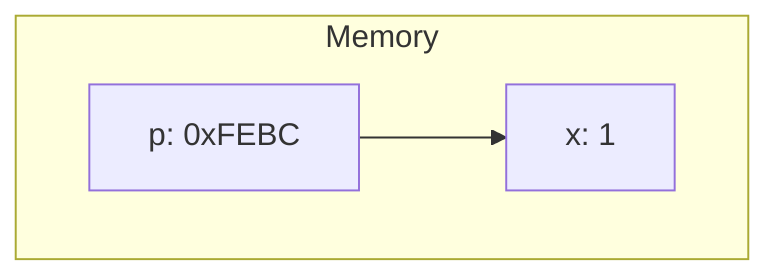
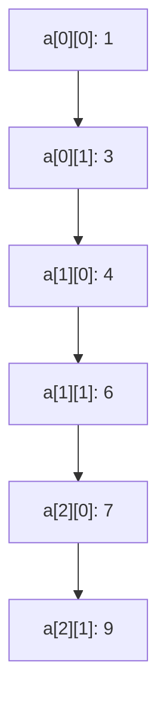

<!-- _class: lead -->

# 软件技术基础

## 指针

**施展**
武汉光电国家研究中心 & 计算机学院
华中科技大学

---

## 指针的概念

变量在内存中占用连续存储单元，其首地址称为地址。  
思考：**用什么类型的变量来保存地址数据？**

```c
short x;
char a[5];
// &x 表示变量x的地址
// a 等价于 &a[0]
```

---

### 内存示意图（Mermaid）



---

## 指针变量

指针变量用于存放地址数据：

```c
short x = 1;
short *p = &x;  // p指向x
```

---

### 指针变量的内存示意（Mermaid）



---

## 指针运算符 *

```c
short x = 1, y = 2, *p;
p = &x;
y = *p;      // y = 1
*p += 10;    // x = 11
```

---

## 悬挂指针

```c
int x, *p;
x = 25;
*p = x;   // 错！p未初始化，悬挂指针
```

---

## 指针的移动操作

```c
int x[5] = {1, 3, 5, 7, 9};
int *px = &x[1];

// 表达式结果：
// ++*px   -> 4
// *++px   -> 5
// *--px   -> 3
// *(px--) -> 3
// *px++   -> 3
// px+=2, *px -> 7
```

---

## 指针的类型与赋值

```c
int x = 0x1234ABCD;
int *p1 = &x;
char *p2 = (char *)&x;  // 类型强制转换
```

---

## 指针的应用：显示长整型数每字节

```c
#include <stdio.h>
int main() {
    long x = 0x1234ABCD;
    char *p = (char *)&x;
    for (int k = 0; k < 4; k++) {
        char low = (*p) & 0x0f;
        char high = (*p >> 4) & 0x0f;
        putchar(high < 10 ? high + '0' : high - 10 + 'A');
        putchar(low < 10 ? low + '0' : low - 10 + 'A');
        putchar(' ');
        p++;
    }
    return 0;
}
```

---

## 指针参数：传址调用

```c
void swap(int *px, int *py) {
    int t = *px;
    *px = *py;
    *py = t;
}
```

---

## 指针与一维数组

```c
int a[10], *p = a;
// a[i] 等价于 *(a+i) 等价于 *(p+i)
```

---

## 指针与二维数组

```c
int a[3][2] = {{1, 3}, {4, 6}, {7, 9}};
int *p = &a[0][0];
for (int i = 0; i < 3; i++) {
    for (int j = 0; j < 2; j++) {
        printf("%d ", *(p + i * 2 + j));
    }
    printf("\n");
}
```

---

### 二维数组的内存布局（Mermaid）



---

## 常量指针与指针常量

```c
const int *p;     // 常量指针：指向常量，不能通过p修改值
int *const p = &a; // 指针常量：指针本身不能变
const int *const p = &a; // 指向常量的指针常量
```

---

## 指针数组与指向指针的指针

```c
char *s[3] = {"red", "green", "blue"};
char **p = s;
```

---

## 动态分配字符串空间

```c
char *s[3];
for (int i = 0; i < 3; i++) {
    s[i] = malloc(80);
    fgets(s[i], 80, stdin);
}
```

---

## 带参数的 main 函数

```c
int main(int argc, char **argv) {
    if (argc != 2) {
        printf("Usage: ./sum <n>\n");
        return 1;
    }
    int n = atoi(argv[1]);
    int sum = 0;
    for (int i = 1; i <= n; i++) sum += i;
    printf("Sum = %d\n", sum);
    return 0;
}
```

---

## 指针函数

```c
char *strcpy(char *t, const char *s) {
    char *p = t;
    while (*t++ = *s++);
    return p;
}
```

---

## 函数指针

```c
int (*pf)(int, int);
int add(int a, int b) { return a + b; }
pf = add;
printf("%d\n", pf(3, 4));
```

---

## 函数指针数组

```c
int (*fp[2])(int);
int fun1(int x) { return 2 * x; }
int fun2(int y) { return 3 * y; }

fp[0] = fun1;
fp[1] = fun2;

for (int i = 0; i < 2; i++) {
    printf("%d\n", fp[i]((i + 1) * 5));
}
```

---

## 通用排序函数（qsort）

```c
int cmp(const void *a, const void *b) {
    return (*(int*)a - *(int*)b);
}
int arr[] = {4, 2, 5, 1};
qsort(arr, 4, sizeof(int), cmp);
```

---

## typedef 与复杂声明

```c
typedef char *string;
string p, s[10];  // char *p, *s[10];

typedef int (*func)(int, int);
func pf = add;
```

---

## 函数指针数组驱动菜单

```mermaid
graph TD
    A[用户输入 choice] --> B{choice=1?}
    B -->|是| C[f1()]
    B -->|否| D{choice=2?}
    D -->|是| E[f2()]
    D -->|否| F{choice=3?}
    F -->|是| G[f3()]
    F -->|否| H{choice=4?}
    H -->|是| I[f4()]
    H -->|否| J[退出]
```

---

## 复杂声明解析

```c
int (*p[2])(int);  // p 是函数指针数组，指向返回int的函数
char *(*(*v)(void))[10];  // v 是指向函数的指针，返回指向char*[10]的指针
```
