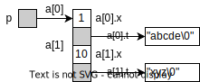
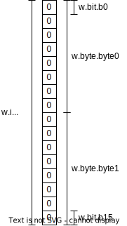
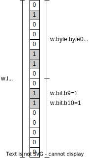
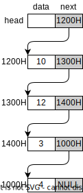
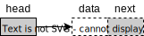
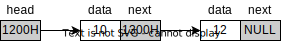

<!-- _class: lead -->

# 软件技术基础

## 结构与联合

**施展**
武汉光电国家研究中心 & 计算机学院
华中科技大学

---

## 主要内容

- 结构类型
  - 结构类型的声明和结构变量的定义
  - 结构成员的引用（`.` 和 `->` 运算符）
  - 结构数组和结构指针
  - 结构做函数参数与返回值
- 字段结构
- 联合类型
- 结构指针的应用：**链表**

---

## 结构

<style scoped>
  .columns {
    display: grid;
    grid-template-columns: 1fr 1fr;
    gap: 2rem;
  }
</style>

- 一些相关联的数据的集合
- 这些数据的类型可以相同，也**可以不同**
- 这些数据都称为结构的**成员**

<div class="columns">

<div>

**例如：学生信息结构**

```c
struct stu { // 结构类型声明: 学生信息
    char name[20];      // 姓名
    float score;        // 成绩
};
```

</div>

<div>

**例如：行星信息结构**

```c
struct planet { // 结构类型声明: 行星信息
    char name[16];      // 行星的名称
    double diameter;    // 行星直径的千米数
    int moons;          // 卫星数
};
```

</div>

</div>

---

## 结构类型示例：**求两点距离**

<style scoped>
  .columns {
    display: grid;
    grid-template-columns: 1fr 1fr;
    gap: 2rem;
  }
</style>

<div class="columns">

<div>

```c
#include <stdio.h>
#include <math.h>

struct point {  // 点结构类型的声明
    int x;     // x坐标
    int y;     // y坐标
};

int main(void) {
    struct point a, b;  // 声明点结构变量
    double dx, dy, d;
    
    printf("输入两点的坐标：\n");
    scanf("%d%d%d%d", &a.x, &a.y, &b.x, &b.y);
    
    dx = b.x - a.x;
    dy = b.y - a.y;
    d = sqrt(dx * dx + dy * dy);  // 计算欧式距离
    
    printf("the distance is %f\n", d);  // 输出
    return 0;
}
```

</div>

<div>

**结构成员**访问: `结构变量名.结构成员`

将求距离**定义为函数：**

```c
double distance(struct point a1, struct point a2) {
    double dx, dy, d;
    dx = a2.x - a1.x;
    dy = a2.y - a1.y;
    d = sqrt(dx * dx + dy * dy);  // 计算距离
    return d;
}
```

- 结构类型的变量**作为函数参数**
- 结构类型也可**作为函数返回值**

</div>

</div>

---

```c
#include<stdio.h>
#include<math.h>

struct point { // 点结构类型声明
    int	x;
    int y;
};

double distance(struct point, struct point); // 函数原型

int main(void) {	
    struct point a, b; // 声明点结构变量
    double dx, dy, d;
    printf("输入两点的坐标：\n");
    scanf("%d%d%d%d", &a.x, &a.y, &b.x, &b.y);
    d = distance(a, b);	                // 计算距离
    printf("the distance is %f\n", d);  // 输出
    return 0;
}
```

---

### 结构指针作为函数参数

```c
double distance(struct point *p1, struct point *p2) {
    double dx, dy, d;
    dx = (*p2).x - (*p1).x;  // 等价于 p2->x - p1->x
    dy = p2->y - p1->y;
    d = sqrt(dx * dx + dy * dy);  // 计算距离
    return d;
}
```

**结构成员访问**: `结构指针->结构成员`

- 结构类型的指针也可以作为
  - 函数的参数
  - 函数的返回值

---

```c
#include<stdio.h>
#include<math.h>

struct point{ // 点结构类型的声明
    int x；
    int y;	
};

double distance(struct point *, struct point *); // 函数原型

int main(void) {	
    struct point a, b; // 声明点结构变量
    double dx, dy, d;
    printf("输入两点的坐标：\n");
    scanf("%d%d%d%d", &a.x, &a.y, &b.x, &b.y);
    d = distance(&a, &b);                 // 计算距离
    printf("the distance is %f\n", d);	  // 输出
    return 0;
}
```

---

## 参数传递方式比较

<style scoped>
  table {
    font-size: 0.8rem;
    table-layout: fixed;
    width: 100%;
  }
  table td:nth-child(2),
  table td:nth-child(3),
  table th:nth-child(2),
  table th:nth-child(3) {
    width: 40%;
  }
</style>

| 比较项目 | 结构变量作为函数参数 | 结构指针作为函数参数 |
|---------|-------------------|-------------------|
| 传递方式 | 传值（将实参结构拷贝给形参） | 传地址（将实参指针的值拷贝给形参指针） |
| 内存占用 | 占用内存较多，耗费时间较长 | 占用内存少，传参时间短 |
| 适用场景 | 适用于较小的结构 | 适用于较大的结构 |
| 对原数据的影响 | 形参结构不影响实参结构的值 | 在函数内部对形参指针的访问操作会影响实参指针所指结构变量的值 |
| 特殊用途 | 无特殊用途 | 适合于要修改实参指针所指的结构变量值的情况 |

---

## 结构变量赋值

- **同类型**的结构变量可以相互赋值。例如:

```c
static struct point {
    int x;
    int y;
} a = {1, 2}, b;

b = a;                    // 合法，对应的各个成员赋值
b = {3, 5};               // 错误
b = (struct point){3, 5}; // 正确，C99复合文字：结构常量
```

- 若需要更强的可读性，则可以规范化封装 ……

---

## 结构变量初始化

<style scoped>
  .columns {
    display: grid;
    grid-template-columns: 1fr 1fr;
    gap: 2rem;
  }
</style>

<div class="columns">

<div>

- 结构成员作为函数的参数
- 结构变量作为函数的返回值

```c
struct point Point(int x, int y) {
    struct point temp;
    temp.x = x;
    temp.y = y;
    return temp;
}
```

</div>

<div>

```c
#include<stdio.h>
#include<math.h>

struct point { // 点结构类型的声明
    int x;
    int y;
};

struct point Point(int, int);
double distance(struct point *, struct point *);

int main(void) {	
    struct point a, b; // 声明点结构变量
    double d;
    a = Point(0，0);
    b = Point(2，3);
    d = distance(&a，&b);
    printf("the distance is %f\n",d);
    return 0;
}
```

</div>

</div>

---

## 结构数组

设计一个能够描述学生成绩的结构类型，然后声明对应的结构数组，描述以下成绩表。

| 学号 | 姓名 | 性别 | 入学时间</br>年 月 日 | 计算机原理 | 英语 | 数学 | 音乐 |
|-----:|------|------|----------|------------|------|------|------|
| 1    |      |      | … / … / … |            |      |      |      |
| 2    |      |      |          |            |      |      |      |
| 3    |      |      |          |            |      |      |      |

---

<style scoped>
  .columns {
    display: grid;
    grid-template-columns: 1fr 1fr;
    gap: 2rem;
  }
</style>

<div class="columns">

<div>

### 结构数组的定义

```c
struct date {
    int month;
    int day;
    int year;
};

struct STUDENT {
    int ID;
    char Name[10];
    char Sex[4];
    struct date timeOfEnter;
    int Computer;
    int English;
    int Math;
    int Music;
};

struct STUDENT stu[30];
```

</div>

<div>

### 结构数组的初始化

```c
struct STUDENT stu[30] = {
    {1, "Tom", 'M', {2006,12,20}, 90,83,72,82},
    {2, "Nick", 'M', {2007,05,01}, 78,92,88,78},
    {3, "Sue", 'F', {2007,07,10}, 89,72,98,66},
    {4, "Lay", 'M', {2007,08,06}, 78,95,87,90}
};
```

### 嵌套结构成员的访问

`结构变量名.结构成员名.成员名`

亦: `(结构变量名.结构成员名).成员名`

如: `stu[0].timeOfEnter.year`

</div>

</div>

---

### 计算结构数组元素的个数

设有数组`a`，其元素个数可通过下述表达式获取:

```c
sizeof(a) / sizeof(a[0])
```

---

## 计算表达式的值

<style scoped>
  li, table {
    font-size: 0.55rem;
  }
  .columns {
    display: grid;
    grid-template-columns: 2fr 1fr;
    gap: 2rem;
  }
</style>

<div class="columns">

<div>

```c
char u[] = "abcde";
char v[] = "xyz";
struct {
    int x;
    char *t;
} a[]={{1, u}, {10, v}}, *p = a;
```

| 表达式         | 值  | 表达式执行的操作                                   |
|----------------|-----|----------------------------------------------------|
| `++p->x`       | 2   | 访问x并使其增1                                     |
| `p->x++`       | 1   | 访问x,取其原值参与运算，再使x增1                   |
| `(++p)->x`     | 10  | p先自增,指向a[1],再访问x                           |
| `p++->x, *p->t`| 'x' | 逗号表达式，逗号右侧p指向a[1],访问t所指字符'x'     |
| `*p->t++`      | 'a' | 先访问t所指字符'a'后，t增1指向字符'b'              |
| `*++p->t`      | 'b' | 先访问t，然后t增1，再访问t所指字符'b'              |
| `*(++p)->t`    | 'x' | p先自增,指向a[1],再访问t所指字符'x'                |

</div>

<div>



- 注意
  - 此例中各表达式相互无关
  - `->` 优先级高于 `++`（前缀 / 后缀）和 `*`

</div>

</div>

---

## 结构数组做函数参数示例

**例**：输入商品信息（包括商品编码、名称、价格），分别按照价格和名称排序，并输出所有商品信息。

| 商品编码 | 名称 | 价格（元） |
|--------:|------|----------:|
| 1       | 笔   | 2.0       |
| 2       | 毛巾 | 10.5      |
| 3       |      |           |
| 4       |      |           |

---

### 结构类型声明和相关函数原型

```c
#include<stdio.h>
#define N 10

typedef struct {
    long code;           // 货物编码
    char name[20];       // 名称
    float price;         // 价格
} GOODS;

void input(GOODS *, int);        // 输入n件物品的信息
void display(GOODS *, int);      // 显示n件物品的信息
void sort(GOODS *, int, int (*)(const void *, const void *));  // 排序
int cmpbyName(const void *, const void *);     // 按名称比较
int cmpbyPrice(const void *, const void *);    // 按单价比较
```

---

### 结构数组函数实现

<style scoped>
  .columns {
    display: grid;
    grid-template-columns: 1fr 1fr;
    gap: 2rem;
  }
</style>

<div class="columns">

<div>

**input函数**: 输入n件物品的信息

```c
void input(GOODS *p, int n) {
    int i;
    for(i = 0; i < n; i++) {
        scanf("%ld", &p[i].code);
        scanf("%s", (p + i)->name);
        scanf("%f", &(p + i)->price);
    }
}
```

</div>

<div>

**display函数**: 显示n件物品的信息

```c
void display(GOODS *p, int n) {
    int i;
    for(i = 0; i < n; i++) {
        printf("%ld\t", (*(p + i)).code);
        printf("%s\t", (p + i)->name);
        printf("%f\n", p[i].price);
    }
}
```

</div>

</div>

---

### 使用回调函数排序

**sort函数**: 按函数指针fp指明的规则对n件物品排序

```c
void sort(GOODS *p, int n, int (*fp)(const void *, const void *)) {
    int i, j;
    GOODS t;
    for(i = 0; i < n - 1; i++) {       // 冒泡法
        for(j = i + 1; j < n; j++) {
            if(fp(p + i, p + j)) {
                t = *(p + i);          // *(p+i) 等价于 p[i]
                *(p + i) = *(p + j);   // *(p+j) 等价于 p[j]
                *(p + j) = t;
            }
        }
    }
}
```

---

### 回调函数实现

<style scoped>
  .columns {
    display: grid;
    grid-template-columns: 1fr 1fr;
    gap: 2rem;
  }
</style>

<div class="columns">

<div>

**按价格比较**

```c
int cmpbyPrice(const void *s, const void *t) {
    const GOODS *p1, *p2;
    p1 = (const GOODS *)s;
    p2 = (const GOODS *)t;
    if(p1->price < p2->price)   // 按价格降序
        return 1;
    else
        return 0;
}
```

</div>

<div>

**按名称比较**

```c
int cmpbyName(const void *s, const void *t) {
    const GOODS *p1, *p2;
    p1 = (const GOODS *)s;
    p2 = (const GOODS *)t;
    return (strcmp(p1->name, p2->name) > 0);  // 按名称升序
}
```

</div>

</div>

---

### 主程序

```c
int main() {
    GOODS g[N];    // 商品信息数组声明
    input(g, N);   // 输入商品信息
    display(g, N); // 显示商品信息
    sort(g, N, cmpbyName); // 按名称排序
    display(g,N);  // 显示排序后商品信息
    sort(g, N, cmpbyPrice); // 按价格排序
    display(g, N); // 显示排序后商品信息
    return 0;
}
```

---

## 联合类型

- 与结构类似，联合类型也是一种构造类型
- **结构变量**：占据**各自不同空间**的各成员变量的集合
- **联合变量**：占用**同一内存空间**的各成员变量的集合
- **联合特点**：各成员**共享存储**

---

### 和结构类型比较

<style scoped>
  .columns {
    display: grid;
    grid-template-columns: 1fr 3fr;
    gap: 2rem;
  }
</style>

<div class="columns">

<div>

```c
union chl {
    char c;
    short h;
    long l;
} v = {'9'};
```

```text
&u = &u.c
   = &u.h
   = &u.l
```

</div>

<div>

- 和`struct`相比，仅关键字改变为`union`
- 联合类型的定义、联合变量的声明、以及联合成员的引用在语法上与结构完全相同
- **注意**: 只能对联合的第1个成员进行初始化

|        | &u          | &u.c   | &u.h    | &u.l   |
|--------|-------------|--------|---------|--------|
|**类型**| union chl * | char * | short * | long * |

</div>

</div>

联合所有成员从同一存储空间的边界（低地址）开始存放，所以**联合各成员的地址和联合变量的地址是相同的**，只是类型不同。

---

## 联合应用：**分离高低字节**

```c
union {
    short n;     // 存放要进行分离的数据
    char a[2];   // n与数组a占的字节数相同
} test;

test.n = 0x1234;
low = test.a[0];   // 低字节数据, low = 0x34
high = test.a[1];  // 高字节数据, high = 0x12
```

---

## 联合应用：**判断大小端**

如何检查处理器是big-endian还是little-endian?

```c
int checkCPUendian() {
    union {
        unsigned int a;
        unsigned char b;
    } c;
    c.a = 1;
    return (c.b == 1);  // return 1: little-endian, return 0: big-endian
}
```

联合体`union`的所有成员都从低地址开始存放，利用该特性就可以轻松确认CPU对内存是采用`Little-endian`还是`Big-endian`模式读写。

---

## 字段结构：以**日期**为例

<style scoped>
  li {
    font-size: 0.8rem;
  }
  .columns {
    display: grid;
    grid-template-columns: 2fr 3fr;
    gap: 2rem;
  }
</style>

<div class="columns">

<div>

21世纪日期**紧凑表示**

- 日有31个值(**\<32**) → 5位
- 月有12个值(**\<16**) → 4位
- 年有100个值(**\<128**) → 7位
- 总计：16位整数

### 字段布局



</div>

<div>

### 字段结构的声明

```c
struct date {
    unsigned short year  : 7;  // 年
    unsigned short month : 4;  // 月
    unsigned short day   : 5;  // 日
    //             字段名 : 字段宽
};

struct date today;  // today是date字段结构变量
```

**字段的宽度**：组成字段的二进制位的数目，是非负的整型常量表达式

</div>

</div>

---

## 字段结构引用

- 与结构完全相同: `.` 或 `->`
- 字段就是一个**小**整数，可以出现在其它整数可以出现的任何地方
- 字段在参与运算时被自动转换为`int`或`unsigned int`类型的整数

```c
    today.year  = 25; // 2025
    today.month = 12;
    today.day   = 02;
```

---

## 无名字段

<style scoped>
  .columns {
    display: grid;
    grid-template-columns: 3fr 2fr;
    gap: 2rem;
  }
</style>

<div class="columns">

<div>

```c
struct {
    unsigned a: 4;
              : 2; // 无名字段"空穴"，用以填充
    unsigned b: 4;
} x;
```



</div>

<div>

**用途**:

- 字节对齐:   性能需求
- 寄存器映射: 硬件适配
- 协议格式:   规范遵循
- 保留标志位: 兼容性

</div>

</div>

---

## 字段结构与联合应用

如何访问16位字中的高低字节和各二进制位？

1) 定义**8位宽**的字段`byte0`, `byte1`
   - 表示一个16位字中的高/低字节
2) 定义**1位宽**的字段`[b0-b15]`
   - 表示一个16位字中的bit
3) 定义**联合**类型
   - 使1个`short`变量、2个`byte`字段与16个`bit`字段共享存储空间

---

```c
#include <stdio.h>

struct w16_bytes {
    unsigned short byte0 : 8;   // byte0：低字节
    unsigned short byte1 : 8;   // byte1：高字节
};

struct w16_bits {
    unsigned short b0:1, b1:1, b2:1, b3:1, b4:1, b5:1, b6:1, b7:1,
                   b8:1, b9:1, b10:1, b11:1, b12:1, b13:1, b14:1, b15:1;
};

union w16 {  // i、byte、bit共享存储
    short i;
    struct w16_bytes byte;
    struct w16_bits bit;
};
```

---

### 使用及运行结果

<style scoped>
  .columns {
    display: grid;
    grid-template-columns: 3fr 2fr;
    gap: 2rem;
  }
</style>

<div class="columns">

<div>

```c
int main(void) {
    union w16 w = {0};   // w.i为0
    
    w.bit.b9 = 1;        // 相当于byte1为2
    w.bit.b10 = 1;       // 相当于byte1为6
    w.byte.byte0 = 0x62;
    
    printf("w.i=0x%x\n", w.i);  // 按整型解释
    return 0;
}
```

</div>

<div>



</div>

</div>

---

### 使用及运行结果…

<style scoped>
  .columns {
    display: grid;
    grid-template-columns: 3fr 2fr;
    gap: 2rem;
  }
</style>

<div class="columns">

<div>

```c
int main(void) {
    union w16 w = {0};   // w.i为0
    
    w.bit.b9 = 1;        // 相当于byte1为2
    w.bit.b10 = 1;       // 相当于byte1为6
    w.byte.byte0 = 0x62;
    
    printf("w.i=0x%x\n", w.i);  // 按整型解释
    return 0;
}
```

**运行结果：**

```bash
w.i=0x662
```

</div>

<div>



</div>

</div>

---

## 结构指针应用：**链表**



- **建立**: 单链表、队列、栈
- **遍历**: 列举、统计、查找
- **插入**: 头、尾、指定位置
- **删除**: 定位、删除、释放
- **归并**: 定位链尾、更新指针
- **排序**: 交换数据、变更链接

---

### 顺序存储 vs 链式存储

| 特性 | 顺序存储（数组） | 链式存储（链表） |
|------|------------------|------------------|
| 存储分配 | 静态，声明时建立 | 动态，运行时申请 |
| 存储大小 | **固定**，不能改变 | **可变**，可调节 |
| 内存布局 | **连续** | **不连续** |

---

### C语言的**动态存储分配函数**

动态存储分配函数的原型声明在`<stdlib.h>`中

- `void *malloc(size_t size);`
- `void *calloc(size_t n, size_t size);`
- `void *realloc(void *p_block, size_t size);`
- `void free(void *p_block);`

`size_t`在`<stdio.h>`中定义

```c
typedef unsigned size_t;
```

<!-- 
malloc：从堆中分配指定字节数（size）的连续内存空间，内存内容未初始化，成功返回指向该内存的指针，失败返回NULL。
calloc：从堆中分配n个大小为size字节的连续内存块（总大小n*size），并将所有字节初始化为 0，成功返回指向该内存的指针，失败返回NULL。
realloc：调整已分配内存块（p_block指向的内存）的大小为size字节，可扩容 / 缩容，可能移动内存块，成功返回新内存指针（失败时原内存不变且返回NULL）。
 -->

---

### 基本概念


- 链表是一种常用的动态数据结构，由一系列包含**数据域**和**指针域**的**结点**组成。
- 如果结点的指针域中**只包含一个指针指向后一个结点**，这种链表称为**单向链表**。

---

### 单向链表


- **head**: 头指针，存放一个地址，指向第一个元素
- **data**: 结点，链表中的元素，包括
  - **数据域**，用户数据
  - **指针域**，下一结点的地址
- **tail**: 链尾，最后一个元素，指针域为`NULL`

---

### 链表结点的**结构类型定义**



```c
struct intNode {
    int data;
    struct intNode *next;  // 指向该结构类型的指针
};

struct intNode *head;  // 头指针声明
```

**自引用**：在定义内部引用自己定义的结构类型

---

### 动态创建结点



```c
head = (struct intNode *)malloc(sizeof(struct intNode));
head->data = 10;
head->next = (struct intNode *)malloc(sizeof(struct intNode));
head->next->data = 12;
head->next->next = NULL;
```

---

## 建立单向链表

- 经典链表类型:
  - **先进后出**链——用链表实现**栈(Stack)**
    - 结点的排列顺序和元素的输入顺序相反
  - **先进先出**链——用链表实现**队列(Queue)**
    - 结点的排列顺序和元素的输入顺序相同

---

## 建立先进先出链表

用循环方式建立先进先出链表的步骤：

1) 声明头指针、尾指针`struct intNode *head=NULL,*tail;` 

2) 创建第一个结点，包括:
   - 给第一个结点动态分配存储并使头指针指向它
     ```c
     head=(struct intNode *)malloc(sizeof(struct intNode));
     ```
   - 给第一个结点的数据域中成员赋值`head->data=x;`
   - 使尾指针也指向第一个结点`tail=head;`

---

## 建立先进先出链表…

3) 循环建立后续结点
   - 如果没遇到结束标志，进行下列操作：
     - 给后继结点动态分配存储并使前驱结点的指针指向它。
     ```c
     tail->next=(struct intNode *)malloc(sizeof(struct intNode));
     ```
     - 使尾指针指向新建立的后继结点`tail=tail->next;`
     - 给后继结点的数据域中成员赋值`tail->data=x;`
4) 给尾结点（最后一个结点）的指针赋NULL值`tail->next=NULL;`

---

```c
struct intNode *createList() {
    struct intNode *head = NULL, *tail = NULL;
    int x;
    
    scanf("%d", &x);  // 输入第1个整数
    if(x) {           // 输入非空，若为0，结束输入
        head = (struct intNode *)malloc(sizeof(struct intNode));
        head->data = x;        // 对数据域赋值
        tail = head;           // tail指向第一个结点
        
        scanf("%d", &x);       // 输入第2个整数
        while(x) {             // 输入非空，若为0，结束输入
            tail->next = (struct intNode *)malloc(sizeof(struct intNode));
            tail = tail->next;       // tail指向新创建的结点
            tail->data = x;          // 向新创建的结点的数据域赋值
            scanf("%d", &x);         // 继续输入整数
        }
        tail->next = NULL;     // 对最后一个结点的指针域赋NULL值
    }
    return head;
}
```

输入: `10 12 3 4`

---

## 调用函数建立链表

```c
struct intNode *createList(void);     // 声明创建链表的函数
void printList(struct intNode *head); // 声明输出链表结点内容的函数

int main() {
    struct intNode *head = createList(); // 调用createList函数创建链表
    printList(head); // 输出链表结点内容
    return 0;
}
```


---

## 调用函数遍历链表

```c
void printList(struct intNode *head) {
    struct intNode *p = head;  // 遍历指针p指向链头
    
    while(p != NULL) {         // p非空
        printf("%d\t", p->data);  // 输出结点数据域中成员的值(以制表符分隔)
        p = p->next;           // 遍历指针p指向下一结点
    }
}
```


---

## 递归建立链表

```c
struct intNode *createList() {
    struct intNode *head = NULL;
    int x;
    scanf("%d", &x);
    
    if(x == 0)  // 遇到结束标记，返回NULL
        return NULL;
    else {
        head = (struct intNode *)malloc(sizeof(struct intNode));                                 
        head->data = x;              // 对新创建结点的数据域赋值
        head->next = createList();   // 递归创建下一结点
        return head;                 // 返回链头地址
    }
}
```


---

## 统计链表结点数目

<style scoped>
  .columns {
    display: grid;
    grid-template-columns: 1fr 1fr;
    gap: 2rem;
  }
</style>

<div class="columns">

<div>

**循环遍历法：**

```c
int countNodes(struct intNode *head) {
    struct intNode *p = head;
    int num = 0;
    while(p != NULL) {
        num++;
        p = p->next;
    }
    return num;
}
```

</div>

<div>

**递归法：**

```c
int countNodes_recursive(struct intNode *head) {
    struct intNode *p = head;
    if(p)
        return (1 + countNodes_recursive(p->next));
    else
        return 0;
}
```


</div>

</div>

---

## 查找结点

用递归法查找链表中数据成员值与形参`n`相同的结点。找到，返回该结点的地址，否则，返回`NULL`。


---

## 查找结点…

```c
struct intNode *findNodes(struct intNode *head, int n) {
    struct intNode *p = head;
    
    if(p) {  // 链表非空，查找
        if(p->data == n)
            return p;  // 找到，返回该结点的地址
        else
            return (findNodes(p->next, n));  // 递归查找
    } else {
        return NULL;
    }
}
```

---

## 插入结点


**插入位置**

- 链头、链尾、链中

**插入方式**

- 作为插入点的新后继结点
- 作为插入点的新前驱结点

这里以前驱插入为例介绍

---

**插入操作**


- 链头:
  ```c
  head = new;
  new->next = p;
  ```
- 链尾:
  ```c
  new->next = NULL;
  p->next = new;
  ```
- 链中:
  ```c
  last->next = new;
  new->next = p;
  ```

<!--
需要两个遍历指针，一个是指向插入点的遍历指针p，另一个是指向插入点前驱结点的指针last。
设新结点由new指针所指，它将插入在p和last所指结点之间。
 -->

---

### 插入结点实现


```c
#define LEN sizeof(struct intNode)

struct intNode *insertNode(struct intNode **hp, int x) {
    struct intNode *p, *last, *new;
    new = (struct intNode *)malloc(LEN);  // 创建一个新节点
    new->data = x;
    p = *hp; // 用于寻找插入位置
    
    while(p != NULL && x > p->data) { // 在升序链表中寻找
        last = p;
        p = p->next;
    }
    
    if(p == *hp) {  // 插入点是链头
        *hp = new;  // 新节点为链头
        new->next = p;
    } else if(p == NULL) {  // 插入点是链尾
        new->next = NULL;   // 新节点为链尾
        last->next = new;
    } else {  // 插入点是链中
        new->next = p;      // 新节点为p的前驱结点
        last->next = new;
    }
    
    return new;
}
```

---

## 删除结点

<style scoped>
  ul {
    font-size: 0.8em;
  }
</style>


**删除步骤：**
1. 查找被删结点
2. 改变连接关系
3. 释放存储空间

**删除操作：**
- 链头: `head = p->next;`
- 非链头: `last->next = p->next;`
- 释放: `free(p);`

---

## 删除结点实现


```c
int deleteNodes(struct intNode **hp, int n) {
    struct intNode *p, *last; // 用于寻找被删结点及其前驱结点
    p = *hp;                  // 遍历指针p指向链头

    while(p != NULL && p->data != n) {  // 查找成员值与n相等的结点
        last = p;      // last指向当前结点
        p = p->next;   // p指向下一结点
    }

    if(p == NULL)      // 没有符合条件的结点
        return 0;

    if(p == *hp)       // 被删结点是链头
        *hp = p->next;
    else               // 被删结点不是链头
        last->next = p->next;
    
    free(p);           // 释放被删结点的存储
    return 1;
}
```

---

## 归并链表

---

### 归并过程

1. 遍历链表A找到其链尾
2. 将链表B的头指针值赋给链表A链尾的指针域

```c
void conLists(struct intNode *a, struct intNode *b) {
    struct intNode *p = a;
    
    while(p->next != NULL) {
        p = p->next;
    }
    p->next = b;
}
```

---

## 链表排序

链表排序是指将链表的结点按某个数据域从小到大（升序）或从大到小（降序）的**顺序连接**

---

## 链表排序方法1：交换数据域

```c
void sortList(struct intNode *head) {
    struct intNode *p1, *p2;
    int t;
    
    for(p1 = head; p1 != NULL; p1 = p1->next) {
        for(p2 = p1->next; p2 != NULL; p2 = p2->next) {
            if(p1->data > p2->data) {
                t = p1->data;           // 交换数据域
                p1->data = p2->data;
                p2->data = t;
            }
        }
    }
}
```

**适用情况：** 数据域较为简单的情况

---

## 链表排序方法2：改变连接关系

```c
if(p1->data > p2->data) {
    t = p2->next;
    prior1->next = p2;
    prior2->next = p1;
    p2->next = p1->next;
    p1->next = t;
    p2 = p1;
    p1 = prior1->next;
}
```

**适用情况：** 数据域较为复杂，成员较多的情况

---

## 高级链表类型

**双向链表：**
- 结点的指针域包含两个指针
- 一个指向前一个结点，另一个指向后一个结点

**十字交叉链表：**
- 结点的指针域包含两个指针
- 一个指向后一个结点，另一个指向另外一个链表

**应用：** 用十字交叉链表保存学生基本信息和成绩

---

## 双向链表

如果结点的指针域包含两个指针，且一个指向前一个结点，另一个指向后一个结点，这种链表称为双向链表。

---

## 十字交叉链表

---

## 用十字交叉链表保存学生基本信息和成绩

<style scoped>
  table {
    width: 100%;
    font-size: 0.5em;
  }
</style>

**学生基本信息表**

| 学号  | 姓名 | 性别 | 年龄 | 家庭住址       | 联系电话 | 备注     |
|-------|------|------|------|----------------|----------|----------|
| 0001  | aaa  | m    | 18   | hubei,wuhan    | 12345678 | Abc def  |
| 0001  | bbb  | f    | 18   | hunan,changsha | 76545678 | Aaaaa bbb|
| ...   | ...  | ...  | ...  | ...            | ...      | ...      |
| 00xx  | zzz  | m    | 19   | hubei,honghu   | 32145678 | Nnn kkk  |

**学生学习成绩表**

| 学号  | 高等数学 | 普通物理 | 电工基础 | 演讲与口才 | 欧洲文化 | 论语初探 |
|-------|----------|----------|----------|------------|----------|----------|
| 0001  | 86       | 85       | 73       | ×          | 80       | ×        |
| 0002  | 77       | 83       | 76       | 82         | 87       | 75       |
| 0003  | 87       | 82       | 81       | ×          | ×        | 86       |
| ...   | ...      | ...      | ...      | ...        | ...      | ...      |
| 00xx  | 89       | 87       | 85       | ×          | ×        | ×        |

---

### 十字交叉链表结构

**水平方向：** 学生基本信息链
**垂直方向：** 各学生课程成绩链

**学生课程成绩结点：**
```c
typedef struct score_tab {
    char num[5];           // 学号
    char course[20];       // 课程名称
    int score;             // 成绩
    struct score_tab *next; // 指向下一个课程成绩结点
} courses;
```

**学生基本信息结点：**
```c
typedef struct student_tab {
    char num[5];           // 学号
    char name[10];         // 姓名
    char sex;              // 性别
    int age;               // 年龄
    char addr[30];         // 家庭住址
    char phone[12];        // 联系电话
    char *memo;            // 备注字段
    courses *head_score;   // 指向成绩链的头指针
    struct student_tab *next; // 指向下一个结点
} studs;
```

---

## 总结

- 结构是C语言中组织相关数据的重要方式
- 联合提供了共享内存的机制
- 字段结构用于位级数据操作
- 链表是动态数据结构的核心
- 掌握这些概念对于编写高效的C程序至关重要
