<!-- _class: lead -->

# 数据中心技术简介

**施展**
武汉光电国家研究中心
光电信息存储研究部

<https://shizhan.github.io/>
<https://shi_zhan.gitee.io/>

---

## 内容大纲

<!-- paginate: true -->

- 课堂背景调查
- 数据中心技术
  - 定义、起源和历史
  - 经典案例
  - 主要问题
  - 发展趋势
- 学习目的
- 实践基础

---

## 课堂背景调查

扫码进群，参与[调查](https://docs.qq.com/form/page/DRFlyQ2xnaG9xY3Zk?_w_tencentdocx_form=1)，**合计25复选项**

|||
|:-|:-|
|**动手实践** - 在裸机上安装过系统 - 自己用零件装配台式机 - 实验室的机群是我配的|**系统环境** - 只用桌面(GNOME, KDE…) - 命令行(bash, zsh, fish…) - 5个以上GNU工具(grep, sed, awk…) - 远程操作(ssh, tmux, screen…) - 拥有VPS、云主机|
|**C/C++** - 作业程序 - 多模块工程(make, autoconf…) - 知名程序库(STL, Boost, MPI…)|**Java** - 课程作业 - 构建工具(Ant, Maven, SBT…) - 知名工程(Hadoop, Spark, Giraph…)|
|**Python** - 一般脚本 - 管理过系统、运行过网站 - 跑过大数据或ML任务(Tensorflow, torch…)|**还接触过** - 专业语言(Matlab, R) - 流行语言(Go, JS, Rust) - 特长语言(Scala, Julia)|
|**资料来源** - Stackoverflow - Github, Bitbucket, Gitee, GitLab - Linkedin - LeetCode - Release Mirrors, Vagrant, Docker…||

---

## 或者扫描问卷条码

---

## 刚刚发生的事情背后

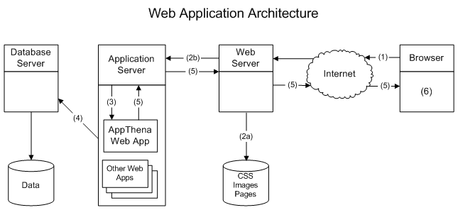

Source: <https://codecondo.com/web-application-architecture/>

---

## 在腾讯公司的平台上

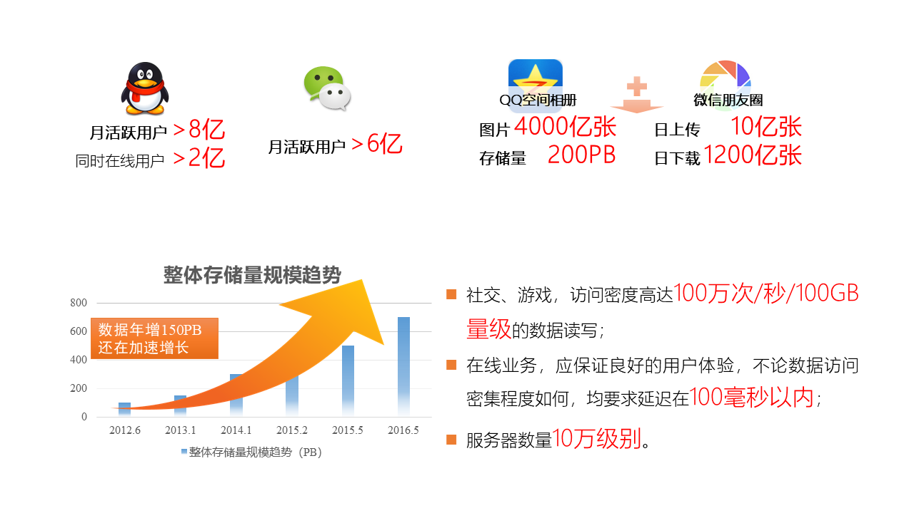

|全球服务器|数据存储规模|全球加速节点|带宽储备|云产品服务|
|:-:|:-:|:-:|:-:|:-:|
|100W+|EB级|2800+|200T|300+|

Source: <https://cloud.tencent.com/about>

---

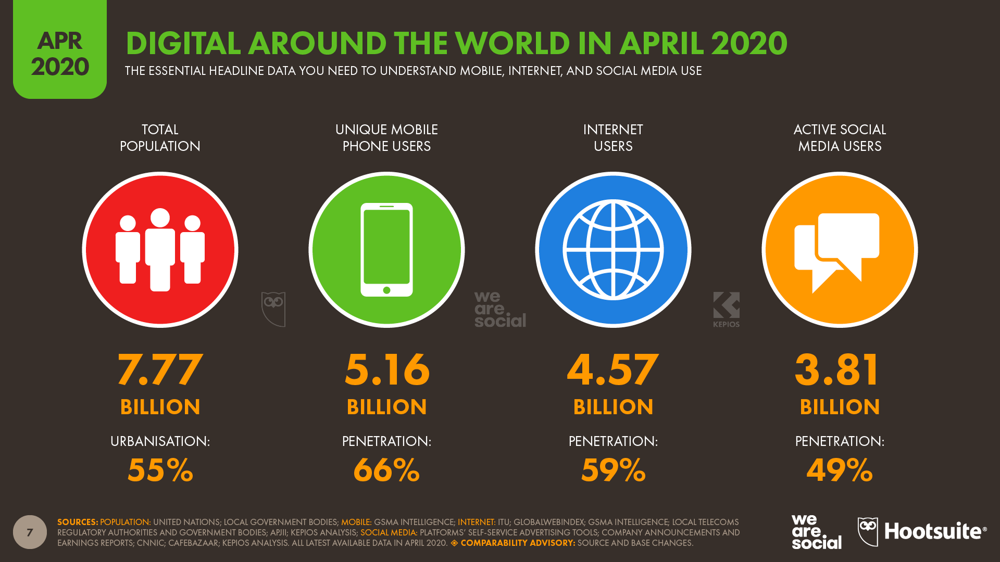

Source: <https://datareportal.com/reports/>

---

网络服务已渗透社会各个方面

---

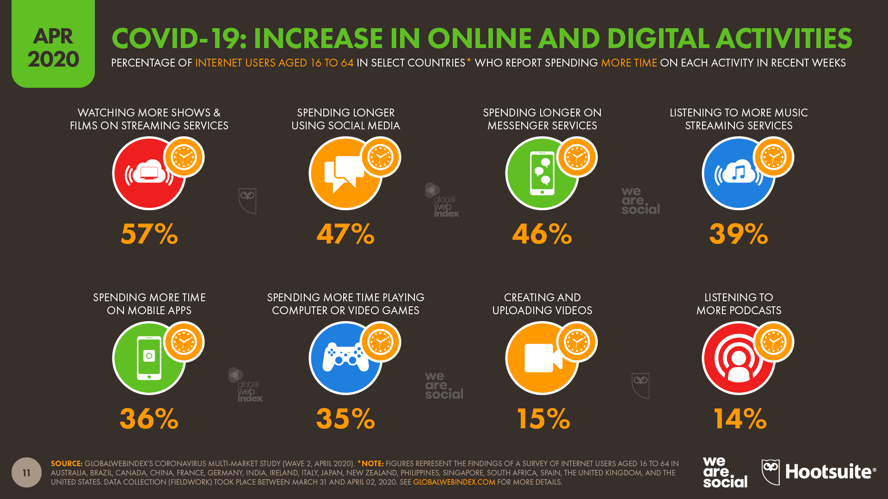

---

疫情甚至加快了这个过程

---

## 随之而来的数据洪流

Source: <https://www.datanami.com/2018/11/27/global-datasphere-to-hit-175-zettabytes-by-2025-idc-says/>

---

## 从侧面观察这股洪流

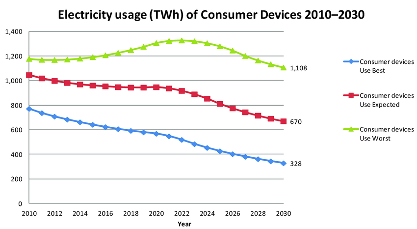 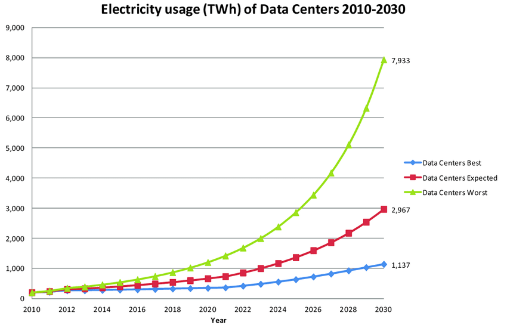

Source: [On Global Electricity Usage of Communication Technology: Trends to 2030](https://www.mdpi.com/2078-1547/6/1/117), Challenges, 2015

---

## 驱动力

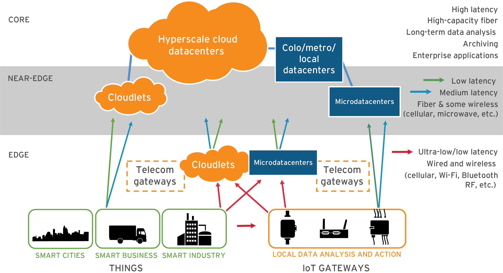

- **云计算**
  - Continued cloud adoption
- **物联网**
  - IoT will further data center demand
- **大数据**
  - Analytics workloads driving computing demands

Source: [Understanding the drivers behind data center demand](https://www.datacenterdynamics.com/en/opinions/understanding-the-drivers-behind-data-center-demand/), Data Centre Dynamics, 2018

---

## 仓储级计算机

- [路易斯·安德烈·巴罗索（Luiz André Barroso）](https://www.barroso.org/)，谷歌研究员、ACM会士、AAAS会士，领导着谷歌的工程基础设施工作。
- [Warehouse-scale Computing](https://dl.acm.org/doi/10.1145/1807167.1837133), SIGMOD '10
- [Warehouse-Scale Computing: Entering the Teenage Decade](https://dl.acm.org/doi/10.1145/2000064.2019527), ISCA '11
- [A Brief History of Warehouse-Scale Computing](https://barroso.org/publications/IEEEMicro2021.pdf), 2020 [Eckert-Mauchly Award](https://awards.acm.org/eckert-mauchly)

Before the onset of the current pandemic, some of us may have underappreciated how important computing technology and cloud-based services have become to our society. In this last year, these technologies have allowed many of us to continue to work, to connect with loved ones, and to support each other. I am grateful to all of those at Google and everywhere in our industry who have built such essential technologies, and I am inspired to be working in a field with still so much potential to improve people’s lives.

<!--
计算机体系结构最高奖Eckert-Mauchly奖，上一年奖项还是颁给那位提出强制、容量和冲突缺失，也就是3C缺失的科学家，就是计算机系统结构课本里面的内容，这次的，也要被写进课本里了，就是最新版的计算机系统结构课本

First awarded in 1979, it was named for John Presper Eckert and John William Mauchly, who between 1943 and 1946 collaborated on the design and construction of the first large scale electronic computing machine, known as ENIAC, the Electronic Numerical Integrator and Computer.
-->

---

## 新基建

- 国家发展改革委创新和高技术发展司2020年发布
  - 新型基础设施是以新发展理念为引领，以技术创新为驱动，以信息网络为基础，面向高质量发展需要，提供数字转型、智能升级、融合创新等服务的基础设施体系，主要包括信息基础设施、融合基础设施、创新基础设施等三方面内容。
- **信息基础设施**主要是指基于新一代信息技术演化生成的基础设施。
  - 以5G、物联网、工业互联网、卫星互联网为代表的通信网络基础设施
  - 以人工智能、云计算、区块链等为代表的新技术基础设施
  - 以**数据中心**、智能计算中心为代表的算力基础设施

Source: <http://www.xinhuanet.com/fortune/2020-04/21/c_1125883443.htm>

---

## 定义、起源和历史

- 数据中心的概念可以追溯到互联网时代的早期
- ARPANET (70s) 与 WWW (90s)
  - **应用**：EMail、SNS、IM、博客/微博、视频/短视频、地图 ...
  - **网络**：拨号、ADSL、宽带、光纤入户，2G至5G ...
- Server-side Computing -- **Cloud**

---

## 经典案例

Source: [Top 10 Data Centers in the World Today](https://www.analyticsinsight.net/top-10-data-centers-world-today/), Preetipadma, September 8, 2020

---

### ACC7

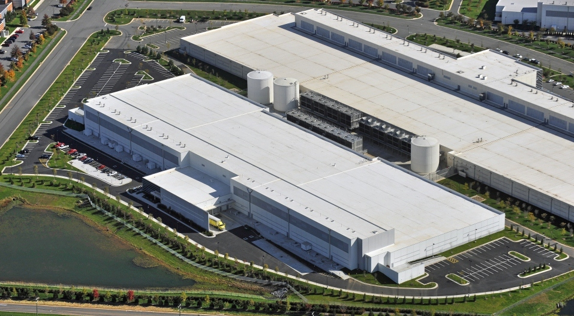

- Begin from 2014, DuPont Fabros Technology, whose business is building massive data centers and leasing wholesale space to companies on a long-term basis, brought online its biggest facility yet: ACC7 in Ashburn, Virginia.
- The ACC7 is 446,000 square feet in size and has a total power capacity of a whopping 41.6 megawatts. The building includes 28 large computer rooms, with a standard critical load of 1.486 megawatts each, and the ability to increase density to offer up to 2.1 megawatts each. Each data hall can accomodate approximately 378 standard cabinets.
- The company applies a new approach "**water side economization plant with chiller assist.**" This means that outside air will cool water for the cooling system, using a plate and frame heat exchanger, which is expected to be the primary cooling source for 75 percent of the calendar year.

Source: [New Data Center Design Drives Efficiency Gains for Dupont Fabros](https://www.datacenterknowledge.com/archives/2014/02/13/new-data-center-design-drives-efficiency-gains-dupont-fabros), 2014

---

### Tahoe Reno 1

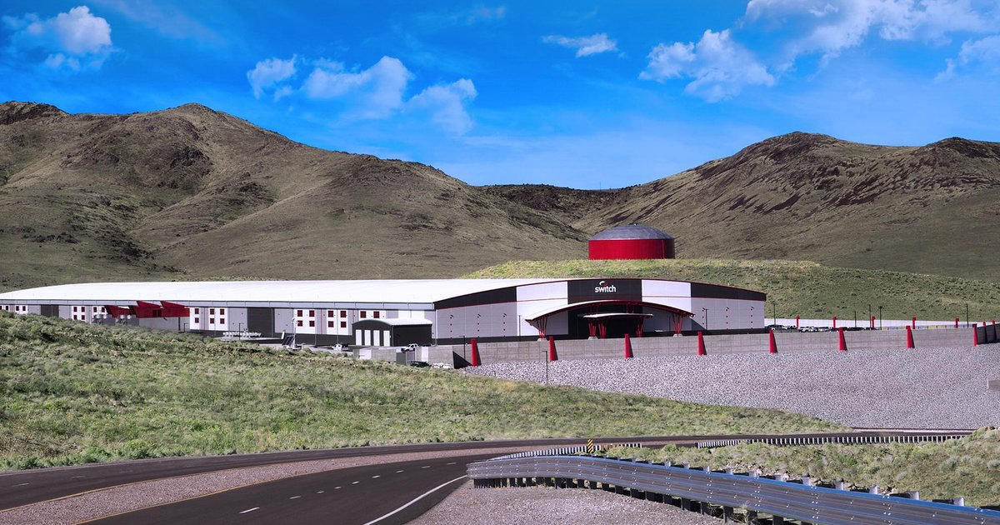

- Built and designed to Tier IV standards, Tahoe Reno 1 consists of 1.3 million square feet (120,000 sq m) of data center space, which Switch claims is the largest data center for colocation in the world. Switch plans to expand this to a total of 7.2 million sq ft (670,000 sq m). It has a power capacity of 130 MW, a fifth of its 650 MW goal.
- Switch highlighted the data center’s security, reliability and low latency, which is backed by the Superloop system, a 500-mile, multi-terabyte fiber optic network to San Francisco and Los Angeles, as well as the company’s 2.5 million sq ft of data center space located in Las Vegas with 10Gbps circuits at 4-millisecond latency. The facility has a tri-redundant UPS power system, and offers up to 42 kW of power per cabinet.
- **100 percent renewable energy**, which Switch currently purchases externally, but plans to produce itself in future using Switch I and Switch II, the company’s ongoing solar projects located near the Apex Industrial Park in Southern Nevada.

Source: [Switch opens Tahoe Reno 1, "world’s largest" colo data center](https://www.datacenterdynamics.com/en/news/switch-opens-tahoe-reno-1-worlds-largest-colo-data-center/), 2017

---

### Range International Information Group

- It was designed to help meet the skyrocketing needs of the Chinese economic and technological boom that has been running for about two decades. As with most large scale projects in China, this data center was built by a combined public and private investment and is overseen by IBM. It consumes 150 megawatts of power.
- Located in Langfang China, Range International Information Group is **the world’s largest data center** and occupies 6.3 million square feet of space.
  - It is equivalent to the area occupied by the Pentagon or a combination of 110 football fields. Construction of the Range International Information Group was completed in 2016.

Source: [And The Title of The Largest Data Center in the World and Largest Data Center in US Goes To...](https://www.datacenters.com/news/and-the-title-of-the-largest-data-center-in-the-world-and-largest-data-center-in), 2018

---

- **Lakeside Technology Center**
  - Location: Chicago, Illinois
  - 印刷厂改；大量备用发电机组(53)；大量冷却水(8.5 million gallons of cooling fluid per year)；客户有IBM, CenturyLink, Facebook, and TelX。
- **Kolos Data Centre**
  - Location: Ballengen, Norway
  - 北欧天然冷却；挪威丰富水电；北大西洋高速互联。
- **Tulip Data City**
  - Location: Bangalore, India
  - 一度非美国最大(Tulip Telecom Ltd.)；IBM帮助设计。
- **Bahnhof’s Pionen**
  - Location: Central Stockholm, Sweden
  - 斯德哥尔摩人防工程(in 1943 to protect essential government functions)；潜艇发动机做备电(Maybach MTU diesel engines)。
- **Next-Generation Data**
  - Location: Newport, UK
  - 服务于BT、IBM各路公有云；全英最高PUE；独占电网(has its own sub-station with a direct connection to the 400kV Super Grid)。

---

### Swiss Fort Knox 瑞士诺克斯地堡

- Location: Baar, Switzerland
- 号称世界最安全的数据中心，源自2010年的欧盟 [Planets (Preservation and Long-term Access through Networked Services)](https://planets-project.eu/) 项目
  - 爱因斯坦的纸质笔记现在我们仍能看到，但斯蒂芬·霍金的数字笔记在70年后我们很有可能看不到。项目旨在确保“我们的数字化文化和科学宝藏可被长期访问”。
- Built in 1994, by Christoph Oschwald, and his business partner Hanspeter Baumann, who converted the former headquarters of the Swiss Air Force into a top-notch data center by installing emergency diesel engines, a ventilation system, a filter, and an air-pressure system to prevent the entry of any poisonous gases.
- Water from an underground lake keeps the center’s cooling system at 8 degrees Celsius.

---

### 瑞士诺克斯地堡

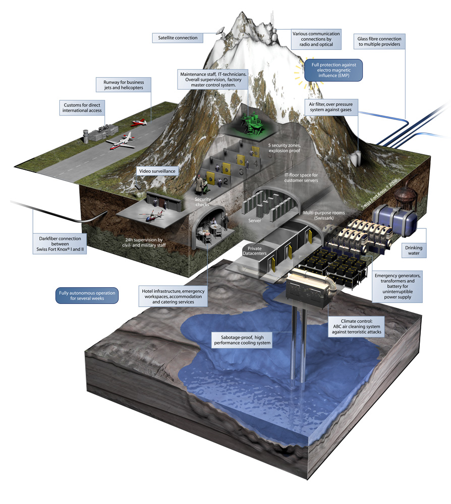

Source: [SWISS FORT KNOX I + II is an underground datacenter concept with various locations, deep inside the Swiss Alps.](https://www.mount10.ch/en/mount10/swiss-fort-knox/)

---

### 瑞士诺克斯地堡…

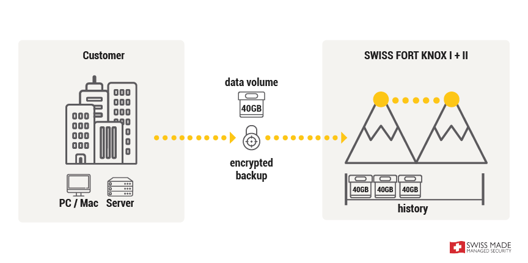

- 客户专属密钥备份

Source: [Encrypted, daily monitored and fully automatic](https://www.mount10.ch/en/products/backup/combo.html)

---

### 瑞士诺克斯地堡……

Ideal protection against NSA and PRISM!

- Data storage inside of Switzerland (www.swissfortknox.com)
- Encryption of the data with 256-bit AES (wikipedia)
- Personal encryption key which is NOT known to us (no backdoors)
- Redundant data storage and contractual availability of 99.7% (GTC)
- Compliance with the legal requirements for a backup in accordance with Swiss law ( Certificate (German) und Report (German) )

---

### NSA在用什么？

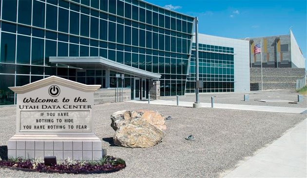

- Location: Bluffdale, Utah
- 也称情报体系综合性国家计算机安全计划数据中心 (Intelligence Community Comprehensive National Cybersecurity Initiative Data Center)
  - <https://nsa.gov1.info/utah-data-center/>

---

### Utah Data Center 犹他数据中心

- 拥有**尧字节级存储能力**。
- 能储存100年有价值的通讯信息(全世界2011年整个互联网的容量总和也不过52艾$2^{60}$字节)，目的是支持综合性国家计算机安全计划 (Comprehensive National Cybersecurity Initiative, CNCI)，也是国家情报总监 (DNI) 的执行机构，具体职责保密。
- $Y_{otta}Byte=2^{80}B=10^{24}B=2^{10}*Z_{etta}B=2^{20}*E_{xa}B$

---

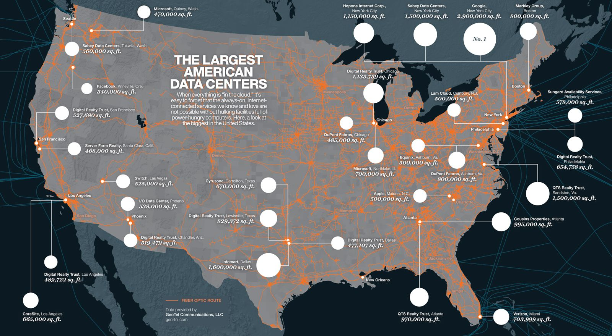

Source: <http://www.iiclouds.org/20141114/maps-of-data-center-localization/>

---

### 谷歌

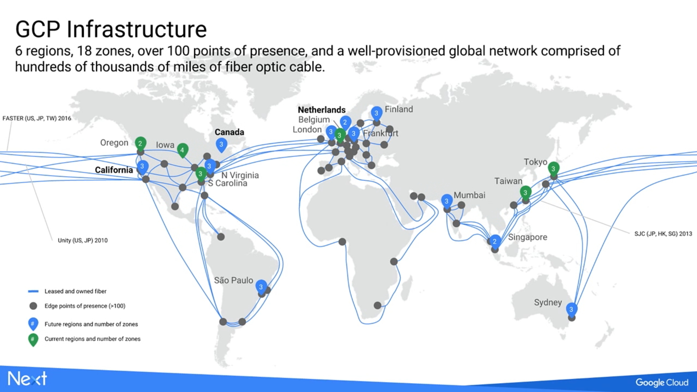

Source: <https://www.google.cn/about/datacenters/locations/>

---

### 亚马逊

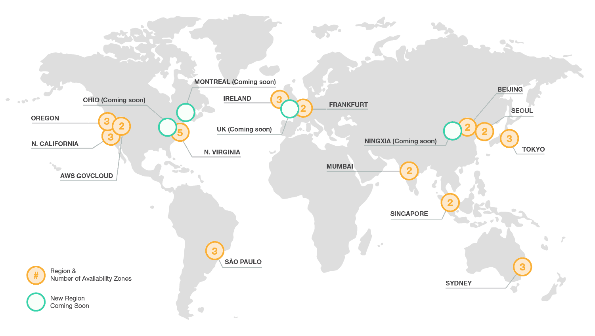

Source: <https://www.cloudwards.net/news/amazon-announces-new-aws-paris-region-opening-in-2017-14326/>

---

### 亚马逊…

Source: <https://aws.amazon.com/cn/cloudfront/features/>

---

### 微软

Source: <https://www.urtech.ca/2019/01/solved-where-are-microsofts-data-centers-located/>

---

### AWS, Azure and Google Cloud

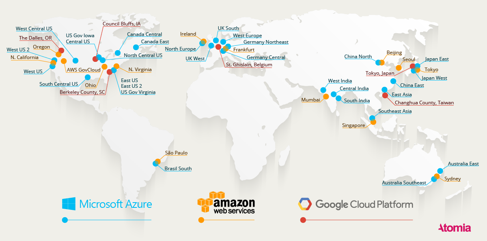

Source: <https://www.atomia.com/2016/11/24/comparing-the-geographical-coverage-of-aws-azure-and-google-cloud/>

---

### AWS, Azure and Google Cloud …

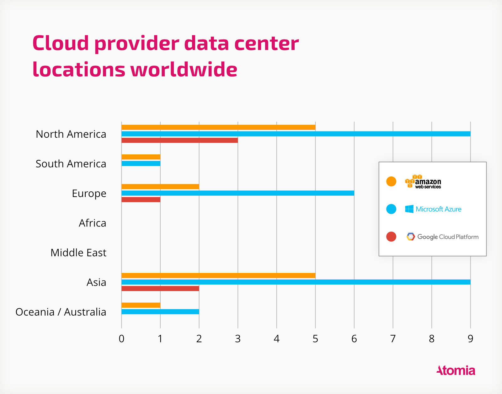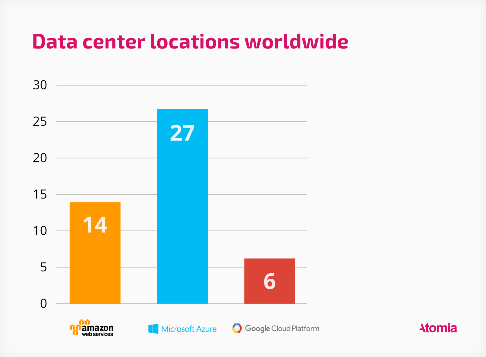

Source: <https://www.atomia.com/2016/11/24/comparing-the-geographical-coverage-of-aws-azure-and-google-cloud/>

---

## 国内情况

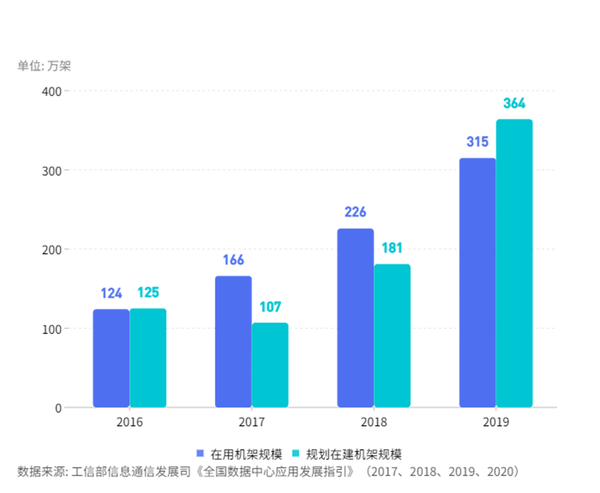

Source: [中国信息通信研究院 开放数据中心委员会](http://dcp.odcc.org.cn/idc)

---

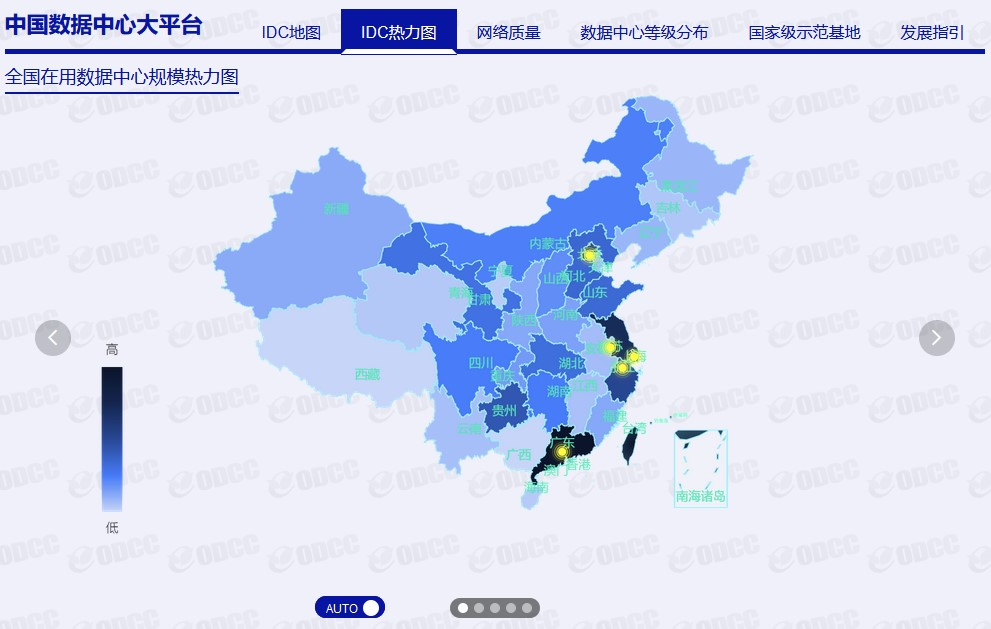

Source: <http://dcp.odcc.org.cn/idc/idcMap>

---

### 阿里

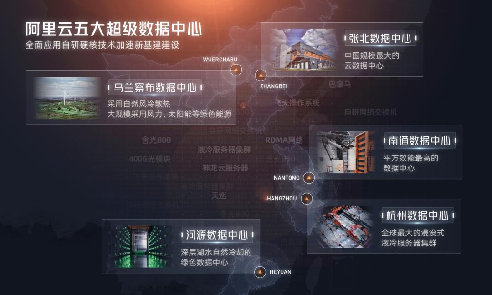

Source: [阿里云宣布五大超级数据中心落成 未来还将再添十座](http://it.people.com.cn/n1/2020/0731/c1009-31805645.html), 2020年07月31日

---

### 阿里…

超级数据中心广泛使用**液冷、水冷、风能**等节能技术，此次新建成的杭州数据中心就部署了全球最大的液冷服务器集群，通过将服务器“泡在水里”（实际使用的是特殊的冷却液）的方式散热，可为数据中心节能70%以上；在五大超级数据中心内，还采用了**自动运维机器人**进行智能运维，24小时保障数据中心安全运行。

---

### 腾讯

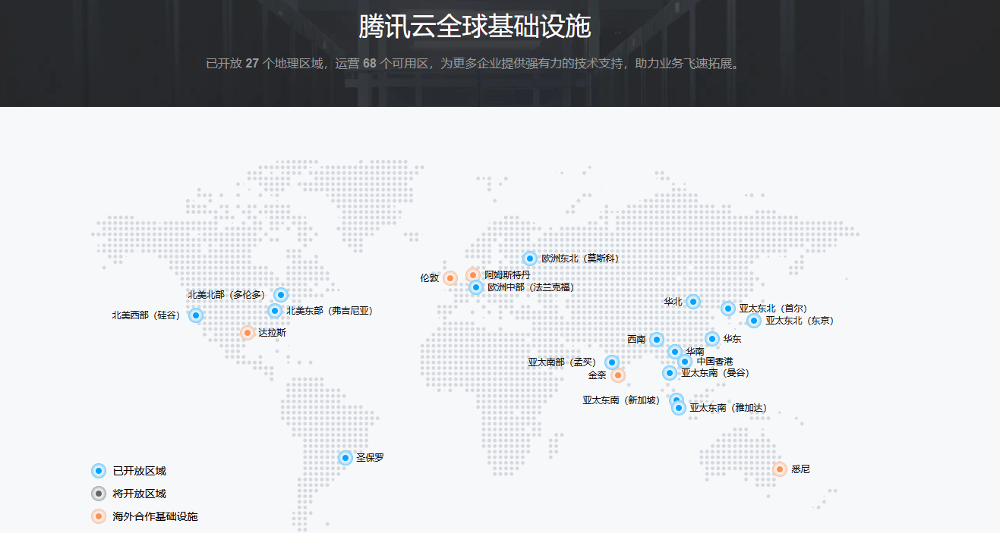

Source: [腾讯云全球基础设施](https://cloud.tencent.com/act/event/global-base), [腾讯云印尼数据中心开服 未来将打造双可用区格局](https://www.sohu.com/a/460330019_120873246)

---

### 腾讯…

2021年4月，腾讯云宣布其在印尼的首个云计算数据中心正式开服。该数据中心位于 印尼首都雅加达未来一年内将在印尼开放第二个数据中心，打造印尼双可用区格局。此次印尼数据中心开服后，腾讯云已经在全球27个地理区域，运营61个可用区。其中，腾讯云海外数据中心已经落地韩国、日本、印度、新加坡、美国、德国、俄罗斯、加拿大、泰国等国家。

---

### T-Block

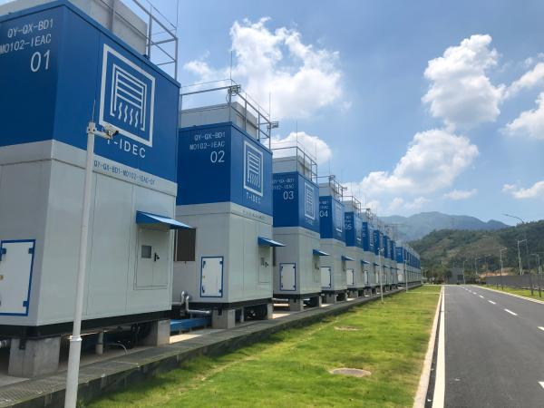

腾讯位于清远市的云计算数据中心于2020年7月开服，8栋机房，容纳的服务器将超过100万台。

T-Block使机房、空调、电力等等部件全部模块化，高度简化数据中心的建设，现场施工周期减少了80%以上。

Source: [探访腾讯国内最大数据中心，百万台服务器啥概念](http://dc.idcquan.com/jfjs/183618.shtml)

---

## 巨无霸背后的巨无霸

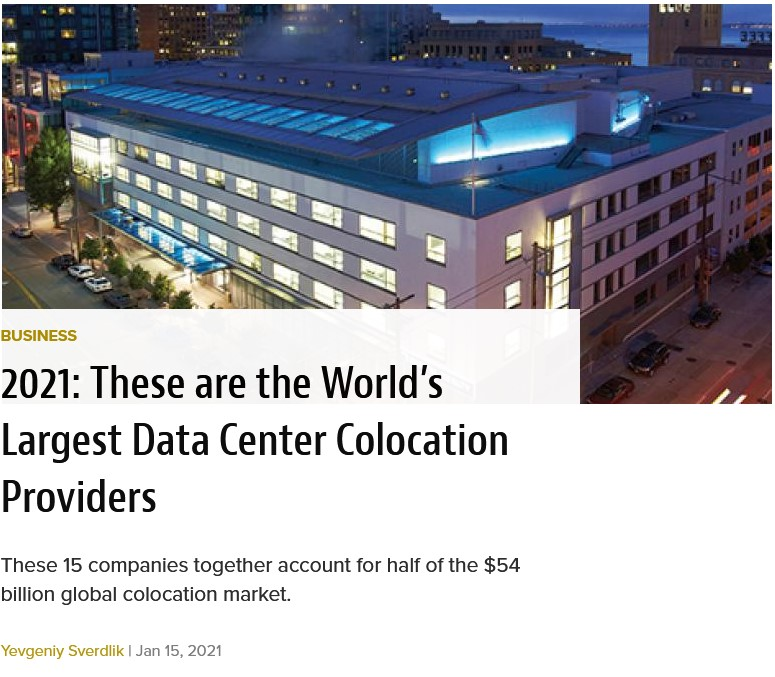

数据中心的建造者

[2021: These are the World’s Largest Data Center Colocation Providers](https://www.datacenterknowledge.com/archives/2017/01/20/here-are-the-10-largest-data-center-providers-in-the-world), Yevgeniy Sverdlik, Jan 15, 2021

---

|    | Company             | Market share|Headquarters           |
| :- | :-                  | -:     | :-                         |
|  1 | Equinix             | 11.1 % | Redwood City, California   |
|  2 | Digital Realty Trust|  7.6 % | Austin, Texas              |
|  3 | **China Telecom**   |  6.1 % | Beijing, China             |
|  4 | NTT GDC             |  4.3 % | Tokyo, Japan               |
|  5 | **China Unicom**    |  4.2 % | Beijing, China             |
|  6 | **China Mobile**    |  2.1 % | Beijing, China             |
|  7 | CyrusOne            |  1.9 % | Dallas, Texas              |
|  8 | KDDI Telehouse      |  1.9 % | Tokyo, Japan               |
|  9 | **GDS**             |  1.6 % | Shanghai, China            |
| 10 | Global Switch       |  1.4 % | London, UK                 |
| 11 | **21Vianet**        |  1.4 % | Beijing, China             |
| 12 | CoreSite            |  1.3 % | Denver, Colorado           |
| 13 | Cyxtera             |  1.2 % | Coral Gables, Florida      |
| 14 | Lumen (CenturyLink) |  1.1 % | Monroe, Louisiana          |
| 15 | Flexential          |  1.1 % | Charlotte, North Carolina  |

---

It’s important to note that China Telecom is one of five Chinese companies on the leaderboard (also China Unicom, China Mobile, GDS 万国数据, and 21Vianet 世纪互联), all of whom do business primarily in China. **China’s market is so vast that these providers can stay mostly domestic (with some international presence) and still have huge share of the global market.**

China’s protectionist regulatory policy makes it extremely difficult for foreign companies to compete in the country’s vast data center market, and international players’ interest in China has waned. **As a result, Chinese hyperscalers’ explosive growth in recent years has driven huge growth for Chinese companies that build and operate data centers for the likes of Alibaba and Tencent.**

---

## 仓储规模的计算机系统，就是数据中心？

---

### 一项经典的比较：HPC vs Cloud

---

### 超算和云

- 是 **集中力量办大事**
- …
- …

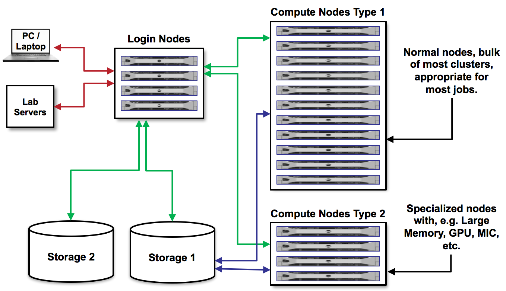

Source: <https://jgbarbosa.github.io/vis/docs/intro_to_hpc/intro_to_hpc_01.html>

---

### 超算和云…

- 是 **集中力量办大事**
- 或 **人民群众无小事**
- …

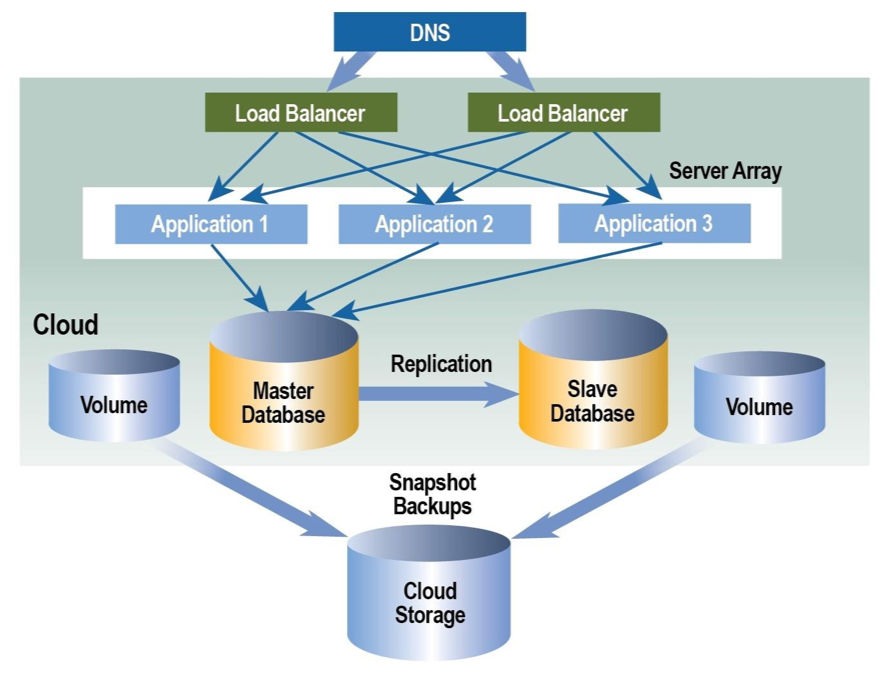

Source: <https://www.networkcomputing.com/cloud-infrastructure/guide-cloud-computing-architectures>

---

### 超算上云

- 是 **集中力量办大事**
- 或 **人民群众无小事**
- 又或者 **动员广大人民办大事**

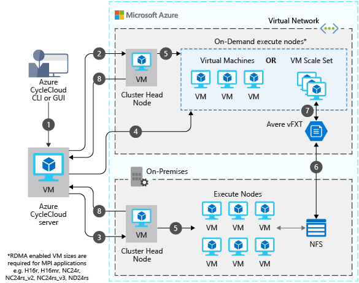

Source: <https://docs.microsoft.com/en-us/azure/architecture/example-scenario/infrastructure/hpc-cfd>

Discussions:
2013 [A comparative study of high-performance computing on the cloud, HPDC'13](https://dl.acm.org/doi/10.1145/2462902.2462919)
2017 [Understanding the Performance and Potential of Cloud Computing for Scientific Applications, ToCC'17](https://ieeexplore.ieee.org/document/7045591)
2018 [HPC Cloud for Scientific and Business Applications: Taxonomy, Vision, and Research Challenges, CSUR'18](https://dl.acm.org/doi/10.1145/3150224)
2019 [Use Cases for HPC in the Cloud](https://insidehpc.com/2019/10/use-cases-for-hpc-in-the-cloud/)
2020 [HPC in the Cloud? Yes, No and In Between](https://www.arm.com/blogs/blueprint/hpc-cloud)
2020 [High Performance Computing Vs Cloud Computing: Which is Better?](https://www.1plus1tech.com/high-performance-computing-vs-cloud-computing/)
2021 [HPC and the Cloud](https://www.cioreview.com/cxoinsight/hpc-and-the-cloud-nid-12863-cid-84.html)

---

### 众包、边缘、雾计算

- **从群众中来，到群众中去**

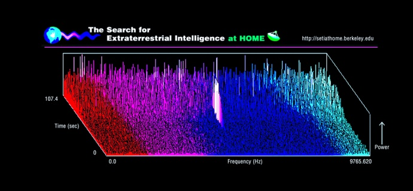 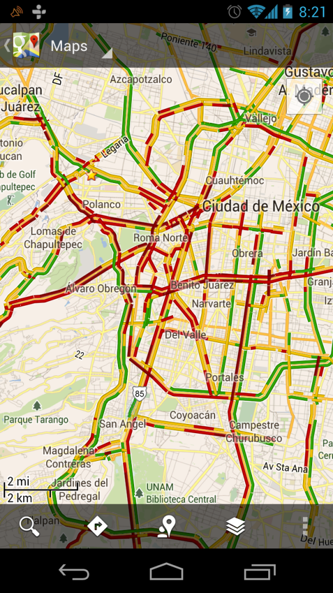

Source: [The Power of the Community – Crowd Sourcing, Open Source and Social Networking](https://www.omniasecuritas.com/archives/116)

---

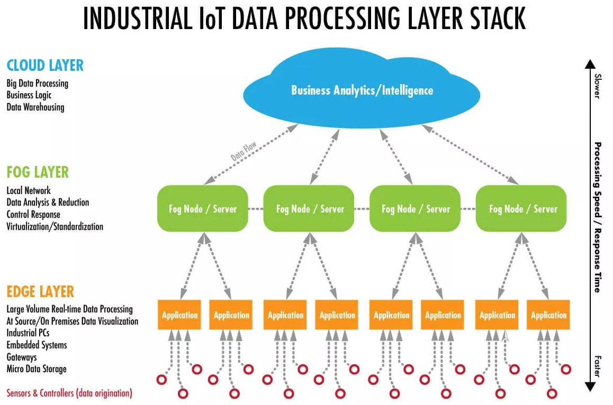

Source: <https://www.winsystems.com/cloud-fog-and-edge-computing-whats-the-difference/>

---

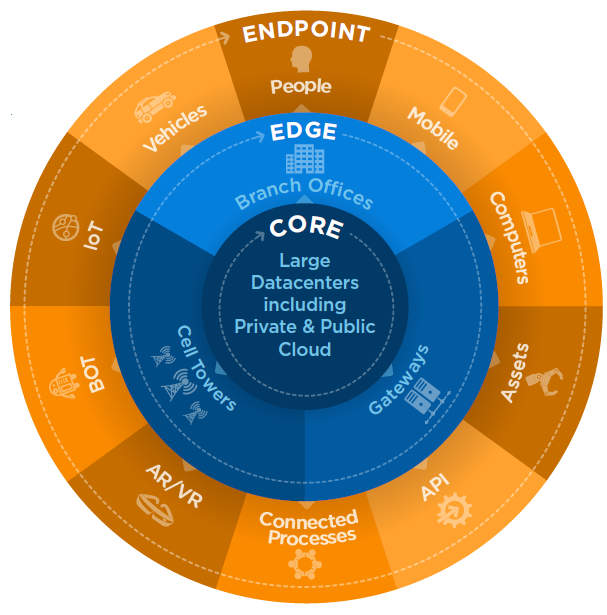

---

## 在规模化的背后

### Latency Comparison Numbers

||||||
|:-|-:|-:|-:|:-|
| L1 cache reference                 |          0.5 ns |            |        |                             |
| Branch mispredict                  |          5   ns |            |        |                             |
| L2 cache reference                 |          7   ns |            |        | 14x L1 cache                |
| Mutex lock/unlock                  |         25   ns |            |        |                             |
| Main memory reference              |        100   ns |            |        | 20x L2 cache, 200x L1 cache |
| Compress 1K bytes with Zippy       |      3,000   ns |       3 us |        |                             |
| Send 1K bytes over 1 Gbps network  |     10,000   ns |      10 us |        |                             |
| Read 4K randomly from SSD*         |    150,000   ns |     150 us |        | ~1GB/sec SSD                |
| Read 1 MB sequentially from memory |    250,000   ns |     250 us |        |                             |
| Round trip within same datacenter  |    500,000   ns |     500 us |        |                             |
| Read 1 MB sequentially from SSD*   |  1,000,000   ns |   1,000 us |   1 ms | ~1GB/sec SSD, 4X memory     |
| Disk seek                          | 10,000,000   ns |  10,000 us |  10 ms | 20x datacenter roundtrip    |
| Read 1 MB sequentially from disk   | 20,000,000   ns |  20,000 us |  20 ms | 80x memory, 20X SSD         |
| Send packet CA->Netherlands->CA    |150,000,000   ns | 150,000 us | 150 ms |                             |

### Notes

1 ns = 10^-9 seconds
1 us = 10^-6 seconds = 1,000 ns
1 ms = 10^-3 seconds = 1,000 us = 1,000,000 ns

### Credit

By Jeff Dean: <http://research.google.com/people/jeff/>
Originally by Peter Norvig: <http://norvig.com/21-days.html#answers>

---

Source: <https://colin-scott.github.io/personal_website/research/interactive_latency.html>

---

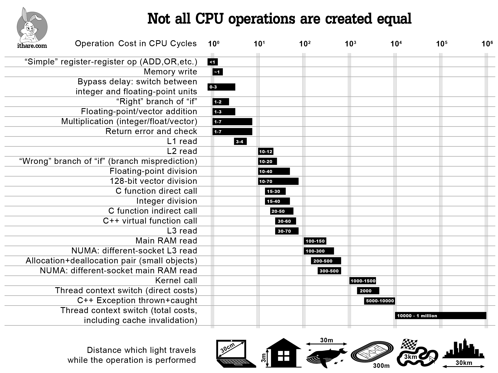

Source: <http://stereobooster.github.io/latency-numbers-every-programmer-should-know>

---

## 主要问题

- 可靠性
- 一致性
- 波动性
- 可用性
- 尾延迟

---

### 可靠性

---

### 一致性

---

### 波动性

---

### 可用性

---

### 尾延迟

---

## 惊人的能耗

---

### 数据中心能源效率

- PUE (Power Usage Effectiveness) 指标：几成能源用在实际业务中？

$PUE=\frac{Total\ Facility\ Power}{IT\ Equipment\ Power}$

- 理想 PUE=1.0 (无冷却能耗)
- 早期一般在2.0左右，即设施整体耗能倍增于信息系统
- 迄今为止 1.07 (Facebook)、1.12 (Google)
- 工信部、国家机关事务管理局、国家能源局联合印发《[关于加强绿色数据中心建设的指导意见](http://www.gov.cn/xinwen/2019-02/14/content_5365516.htm)》，提出到2022年全国新建大型、超大型数据中心PUE需达到1.4以下。
- [阿里国内自营平均 1.3 以内](http://dc.idcquan.com/mkh/164245.shtml)，[腾讯清远用间接蒸发冷却做到约 1.25](http://tech.idcquan.com/179786.shtml)。

---

### 在PUE背后

Source: [How much energy do data centers use?](https://davidmytton.blog/how-much-energy-do-data-centers-use/) October 8, 2021

---

## 学习目的

- 数据中心技术的**基础知识**
- 大规模计算机系统**响应能力问题**
- 经典的**应对方法**

---

## 实践基础

- 建立一套数据中心实验平台
  1. Linux系统
  2. 虚拟机、容器、存储
  3. 监控管理工具
- 还有**亿点点**细节

---

### 选择合适的系统

怎么给自己准备一套便利的Linux学习环境？

- **Linux** 直接安装，多重引导
- **Mac/Win** 虚拟机、容器、编排工具
- **Win**
  - 虚拟机、容器、编排工具
  - Windows Subsystem Linux (WSL, WSL2)
  - Cygwin, MSYS (MinGW)

---

### 准备和熟悉环境

- **目标**：
  - 远程连接主机、远程执行命令
  - 检查服务器状态:
    - 发行版、内核版本、时间、网络、进程、设备、磁盘、文件系统
    - *uname, date, ifconfig, ps, /proc, /dev, df, du, mount*
  - 代码、脚本、配置管理初步
    - 版本管理 *git, github, bitbucket, gitee*
    - 文本操作 *cat, head, tail, grep, sed, awk, cut, paste, join*
  - 一两套批量部署工具 *ansible, puppet, cfengine*
    - 添加和更新软件安装源
    - 想一想，怎样提高效率？学校源 <http://mirrors.hust.edu.cn/>、本地源
  - 集群时间同步 *ntp, chrony*

---

### 命令行操作入门

- 系统状态
  - 有哪些关键目录
  - 系统信息的跟踪和采集
- 信息处理
  - 控制台文本的读写、查找、提取、统计、排序、去重、合并
- 数据处理
  - 压缩与解压缩、二进制转换
  - 特殊设备(/dev/null, /dev/zero, /dev/random)
- 工具之间的联动与**KISS原则**

---

### 初步尝试管理

- 编制bash脚本
  - 循环、参数、管道与重定向
- 远程管理方法
  - 网络管道、文件同步、终端会话保持
- 任务执行
  - 后台执行、控制台管理
  - 定时重复、计划任务
- 配置和脚本管理
  - git与github

---

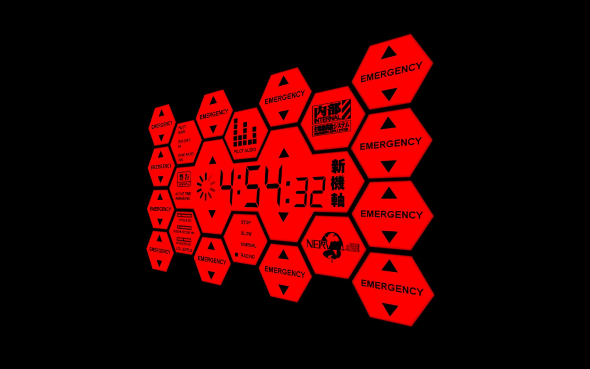

---

---

### 更进一步

- Dashboard仪表盘
  - Grafana
    - <https://grafana.com>
    - <https://github.com/grafana/grafana>
  - Prometheus
    - <https://prometheus.io/>
    - <https://github.com/prometheus/prometheus>
  - InfluxDB & Telegraf
    - <https://www.influxdata.com>

---

---

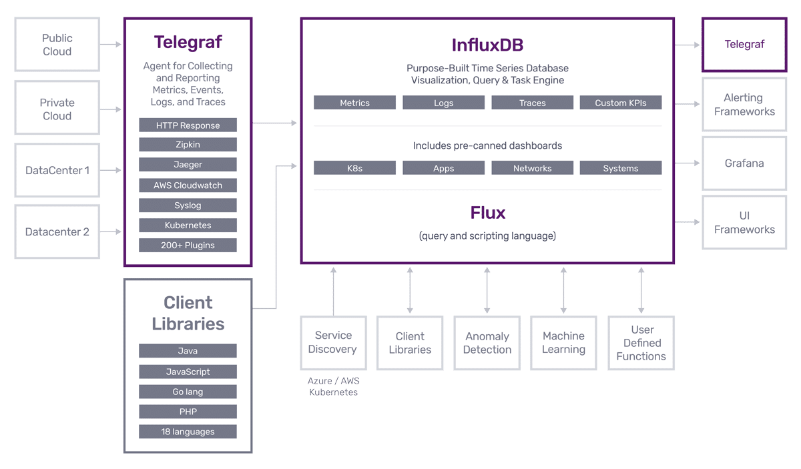

---

## 经典问题

|微观|宏观|环境|
|:-|:-|:-|
|*Understanding Disk Failure Rates: What Does an MTTF of 1,000,000 Hours Mean to You?*|*Failure Trends in a Large Disk Drive Population*|*Datacenter Scale Evaluation of the Impact of Temperature on Hard Disk Drive Failures*|
|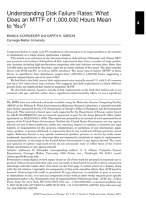|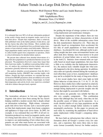|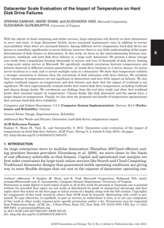|

---

## 后续内容

- 熟悉环境
  - *Linux, Git, SSH, Python, OpenStack, K8S, Docker* …
- 数据中心专题讲座与实践
  - 键值存储
  - 对象存储
    - [尾延迟问题](data-center-2021-obs)
    - [服务质量保障问题](data-center-2021-qos)
- 着手综述
  - 跟随讲座内容，检索和阅读论文，准备下个月汇报
