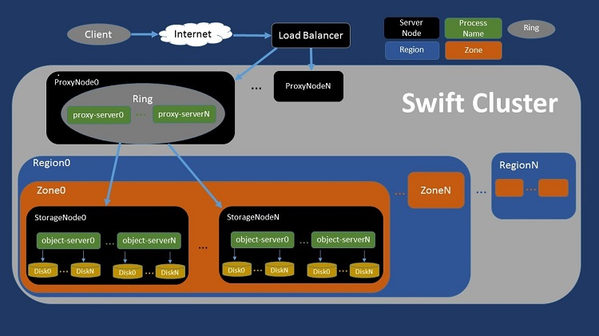

# 对象存储系统尾延迟问题

**施展**
武汉光电国家研究中心
光电信息存储研究部

---

## 内容大纲

- 对象存储背景
- 尾延迟问题
- 经典方法和实践
- 尾延迟预测

---

## 数据洪流

<https://www.datanami.com/2018/11/27/global-datasphere-to-hit-175-zettabytes-by-2025-idc-says/>

---

## 扩展，还是扩展

- 规模
- 种类

---

{配图}

---

## 对象存储系统

---

## SNIA标准化

……

---

## 典型对象存储系统

---

## Ceph

- Ceph uniquely delivers **object, block, and file storage in one unified system**.
- Ceph is highly reliable, easy to manage, and free.
- Ceph delivers extraordinary scalability–thousands of clients accessing petabytes to exabytes of data.
- A Ceph Node leverages **commodity hardware** and intelligent daemons, and a Ceph Storage Cluster accommodates large numbers of nodes, which communicate with each other to **replicate and redistribute data dynamically**.

---

- <https://ceph.io/>
- <https://github.com/ceph/ceph>

*<https://icicimov.github.io/blog/images/CEPH-graphic.png>*

---

## OpenStack Swift

- OpenStack Object Storage (swift) is used for **redundant, scalable data storage using clusters of standardized servers** to store petabytes of accessible data.
- Swift uses a distributed architecture with **no central point of control**, providing greater scalability, redundancy, and performance.
- Storage clusters **scale horizontally** by adding new nodes, uses software logic to ensure data replication and distribution across different devices, inexpensive **commodity hard drives and servers**.

---

- <https://docs.openstack.org/swift/>
- <https://github.com/openstack/swift>

*<https://software.intel.com/content/dam/develop/external/us/en/images/optimizing-openstack-swift-performance-pypy-fig2-755234.jpg>*

---

## Minio

- MinIO is a High Performance Object Storage released under GNU Affero General Public License v3.0.
- It is **API compatible with Amazon S3** cloud storage service.
- **Standalone MinIO servers** are best suited for early development and evaluation.
- Certain features such as versioning, object locking, and bucket replication require distributed deploying MinIO with **Erasure Coding**.

---

- <https://min.io/>, <http://www.minio.org.cn/>
- <https://github.com/minio/minio>

*<http://www.minio.org.cn/static/picture/architecture_diagram.svg>*

---

## 尾延迟问题

扩展的系统必然受到组件工作状态的影响

- 设备故障
- 性能波动

---

## 尾延迟问题…

扩展的系统必然受到组件工作状态的影响

- 设备故障——需要 **Fault-Tolerant** 容错！
- 性能波动——需要 **Tail-Tolerant** 容滞？

---

## 经典方法

- 对冲请求 Hedged Request
- 关联请求 Tied Request

---

### 对冲请求

- HDFS (2.4+)
  - If a read from a block is slow, start up another parallel, **‘hedged’ read** against a different block replica.
  - We then **take the result of which ever read returns first** (the outstanding read is cancelled).
  - This ‘hedged’ read feature will help rein in the outliers, the odd read that takes a long time because it hit a bad patch on the disc, etc.

<https://hadoop.apache.org/docs/stable/hadoop-project-dist/hadoop-common/release/2.4.0/RELEASENOTES.2.4.0.html>

---

### 关联请求

- mongodb (4.4+)
  - With hedged reads, the mongos instances can **route read operations to two replica set members per each queried shard** and **return results from the first respondent** per shard.

<https://docs.mongodb.com/manual/core/read-preference-hedge-option/>

---

## 实践环境

- 大数据存储实验课 <https://github.com/cs-course/iot-storage-experiment>
- 对象存储入门实验 <https://github.com/cs-course/obs-tutorial>

---

### 测试工具

- s3bench
- cosbench

---

### 测试指标

百分位延迟

---

## 如何准确预测？

给系统建立性能模型

- 分析
- 统计

---

## 建模面临的挑战

给系统建立性能模型

- 分析——**系统内部复杂性？**
- 统计——**历史数据全面性？**

---

### 我们的工作

- Understanding the latency distribution of cloud object storage systems, JPDC 2019.
- Predicting Response Latency Percentiles for Cloud Object Storage Systems, ICPP 2017.

---

## 实验要求

---

## 参考文献

1. Tail Latency in Datacenter Networks, MASCOTS 2020.
2. A Black-Box Fork-Join Latency Prediction Model for Data-Intensive Applications, TPDS 2020.
3. The Fast and The Frugal: Tail Latency Aware Provisioning for Coping with Load Variations, WWW 2020.
4. Managing Tail Latency in Datacenter-Scale File Systems Under Production Constraints, EuroSys 2019.
5. Amdahl's Law for Tail Latency, CACM 2018.
6. The Tail at Scale: How to Predict It?, HotCloud 16.
7. The Tail at Scale, CACM 2013.
