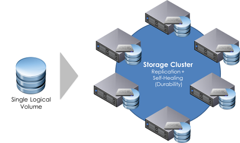

# 对象存储系统尾延迟问题

<!-- _class: lead -->

**施展**
武汉光电国家研究中心
光电信息存储研究部

<https://shizhan.github.io/>
<https://shi_zhan.gitee.io/>

---

## 内容大纲

<!-- paginate: true -->

- 对象存储背景
- 尾延迟问题
- 经典方法和实践

---

## 数据洪流

<style scoped>
  p {
    font-size: 20px;
    text-align: right;
  }
</style>


Source: <https://www.datanami.com/2018/11/27/global-datasphere-to-hit-175-zettabytes-by-2025-idc-says/>

---


---

<style scoped>
  p {
    font-size: 20px;
    text-align: center;
  }
</style>


Source: <https://www.smartinsights.com/internet-marketing-statistics/happens-online-60-seconds/>

---

## 迫切需要扩展

<style scoped>
  a {
    font-size: 18px;
  }
  tr {
    vertical-align: bottom;
  }
</style>

|规模|种类|
|:-:|:-:|
|||
| <http://sancluster.com/scale-out-file-system/>|<http://storagegaga.com/the-future-is-intelligent-objects/>|

---

### 元数据

<style scoped>
  a {
    font-size: 18px;
  }
  tr {
    vertical-align: bottom;
  }
</style>

|规模|种类|
|:-:|:-:|
|||
|元数据形态|元数据内容|

---

## 对象存储系统的提出

<style scoped>
  p {
    font-size: 25px;
    text-align: right;
  }
</style>

- Object storage originated in the late 1990s:
- Seagate specifications from 1999
  - [Object Based Storage: A Vision](https://www.t10.org/ftp/t10/document.99/99-341r0.pdf)
  - [Object based storage devices: a command set proposal](https://pdfs.semanticscholar.org/bcd1/97cb0f8544b651289dfdb95efd0b1fd70753.pdf)
- [Dr. Garth Gibson](http://www.cs.cmu.edu/~garth/), CMU & [NASD project](https://www.pdl.cmu.edu/NASD/index.shtml)
  - High-bandwidth, Low-latency, Scalable Storage Systems
  - File Server Scaling with Network-Attached Secure Disks (NASD), 1997


Source: <https://www.snia.org/educational-library/object-storage-what-how-and-why-2020>

---

## 和传统存储系统的比较

<style scoped>
  p {
    text-align: center;
  }
</style>


Source: <https://usdc.vn/object-storage-vs-traditional-storage/>

---

### 传统存储系统

<style scoped>
  p {
    text-align: center;
  }
</style>


Source: <https://www.ibm.com/cloud/learn/object-storage>

---

### 对象、文件、块和归档存储

<style scoped>
  p {
    text-align: center;
  }
  tr {
    font-size: 25px;
  }
</style>

| Object | File | Block | Archive |
|:-|:-|:-|:-|
| Object Storage | NAS | SAN | Tape |
| Videos, photos serving streaming | All kinds of file | Attach to server | The file needs to be saved permanently |
| Read (download) data regularly | Read data regularly, install as a network drive | Run data directly on Storage | Rarely to download |
| High upload / download speed | High upload / download speed | Very High upload / download speed | High upload speed, slow download |
| Use with CDN | Many usage scenarios | Use with server (VM) | Use independently |

Source: <https://usdc.vn/object-storage-vs-traditional-storage/>

---

## 定义

- [What is Object Storage?](https://www.snia.org/education/what-is-object-storage)
  - Object Storage is a method of storing and subsequently retrieving sets of data as collections of single, uniquely identifiable indivisible items or objects. **It applies to any forms of data that can be wrapped up and managed as an object.**
  - Objects are treated as an atomic unit. **There is no structure corresponding to a hierarchy of directories in a file system**; each object is uniquely identified in the system by a unique object identifier.

---

## 特性

- [What is Object Storage?](https://www.snia.org/education/what-is-object-storage)
  - When you create an object on this type of storage, the entire set of data is handled and processed without regard to what sub-parts it may have.
  - When reading from object storage, you can read either the whole object, or ask to read parts of it.
  - There is often no capability to update to the object or parts of the object; the entire object is usually required to be re-written.
  - Most object storage allows for objects to be deleted.

---

## 特性…

- [What is Object Storage?](https://www.snia.org/education/what-is-object-storage)
  - Object storage often supports meta-data.
    - This is data that is part of the object, but that is in addition to the object ID and the data.
    - It is often expressed as an attribute-value pair; for instance, an attribute of COLOR in our collection of objects may have the value RED for some objects and BLUE for others.
    - These permit collections of objects, individually addressable by their object ID, to be searched, filtered and read in groups without needing to know the specific object IDs.

---

## 标准化

- **Storage Networking Industry Association** - SNIA
  - [Object Storage: What, How and Why, 2020](https://www.snia.org/educational-library/object-storage-what-how-and-why-2020)
    - Object storage, as a definition, can be: A storage system that manages and manipulates data storage as **distinct units**, called objects
  - [CDMI Cloud Storage Standard, 2.0a, 2020](https://www.snia.org/cloud/cdmi)
    - The Cloud Data Management Interface (CDMI) defines the **functional interface** that applications will use to create, retrieve, update and delete data elements from the Cloud.

---

<style scoped>
  p {
    font-size: 18px;
    text-align: left;
  }
</style>


Source: <https://www.snia.org/educational-library/object-based-storage-device-osd-architecture-and-systems-2007>

---


---


---


---

<style scoped>
  p {
    font-size: 18px;
    text-align: left;
  }
</style>


Source: [What are Restful Web Services](https://gocoding.org/what-are-restful-web-services/)

---

### Amazon S3 REST API

<style scoped>
  p {
    font-size: 18px;
    text-align: center;
  }
  li {
    font-size: 25px;
    text-align: left;
  }
</style>

- **GET** on the API's root resource to list all of the Amazon S3 buckets of a caller.
- **GET** on a Folder resource to view a list of all of the objects in an Amazon S3 bucket.
- **PUT** on a Folder resource to add a bucket to Amazon S3.
- **DELETE** on a Folder resource to remove a bucket from Amazon S3.
- **GET** on a Folder/Item resource to view or download an object from an Amazon S3 bucket.
- **PUT** on a Folder/Item resource to upload an object to an Amazon S3 bucket.
- **HEAD** on a Folder/Item resource to get object metadata in an Amazon S3 bucket.
- **DELETE** on a Folder/Item resource to remove an object from an Amazon S3 bucket.

Source: <https://docs.aws.amazon.com/apigateway/latest/developerguide/integrating-api-with-aws-services-s3.html>

---

<style scoped>
  li, p {
    font-size: 18px;
  }
</style>

To access the object-based storage system:

- **secret-access-key** and **access-key-id** – private/public pair of keys that you can generate using different tools or sometimes directly on the provider dashboard
- **endpoint** – the web address of the space

```java
const AWS = require("aws-sdk");

const s3 = new AWS.S3({
  endpoint: "provider-space-endpoint",
  secretAccessKey: "my-secret-key",
  accessKeyId: "my-access-key",
});
```


- <https://lakefs.io/object-storage/>
- <https://docs.aws.amazon.com/apigateway/latest/developerguide/integrating-api-with-aws-services-s3.html>

---

<style scoped>
  p {
    font-size: 20px;
    text-align: right;
  }
</style>


Source: <https://aws.amazon.com/cn/s3/storage-classes/>

---

<style scoped>
  p {
    font-size: 18px;
    text-align: center;
  }
</style>


Source: <https://www.cloudhealthtech.com/blog/aws-cost-optimization-s3-storage-class>

---

## 更进一步的扩展

<style scoped>
  h2 {
    text-align: center;
  }
</style>


---

### 相关成果

<style scoped>
  h2, p {
    text-align: center;
  }
</style>


**主动对象海量存储系统及关键技术**

---

### 算存一体化

<style scoped>
  p {
    font-size: 18px;
    text-align: right;
    padding: 60px;
  }
</style>


<https://www.snia.org/computationaltwg>, <https://www.snia.org/education/what-is-computational-storage>

---

### 算存一体化…


- Computational Storage is defined as architectures that provide **Computational Storage Functions (CSF) coupled to storage**, **offloading host processing** or **reducing data movement**.
- These architectures enable improvements in application performance and/or infrastructure efficiency through the integration of compute resources (outside of the traditional compute & memory architecture) either **directly with storage** or **between the host and the storage**.

---

## 典型对象存储系统

- **Amazon S3**: Amazon S3 stores data as objects within resources called “buckets.” AWS S3 offers features like 99.999999999% durability, cross-region replication, event notifications, versioning, encryption, and flexible storage options (redundant and standard).
- **Rackspace Cloud Files**: Cloud Files provides online object storage for files and media. Cloud Files writes each file to three storage disks on separate nodes that have dual power supplies. All traffic between your application and Cloud Files uses SSL to establish a secure, encrypted channel. You can host static websites (for example: blogs, brochure sites, small company sites) entirely from Cloud Files with a global CDN.

---

- **Azure Blob Storage**: For users with large amounts of unstructured data to store in the cloud, Blob storage offers a cost-effective and scalable solution. Every blob is organized into a container with up to a 500 TB storage account capacity limit.
- **Google cloud storage**: Cloud Storage allows you to store data in Google’s cloud. Google Cloud Storage supports individual objects that are terabytes in size. It also supports a large number of buckets per account. Google Cloud Storage provides strong read-after-write consistency for all upload and delete operations. Two types of storage class are available: Standard Storage class and Storage Near line class (with Near Line being MUCH cheaper).

<https://cloudacademy.com/blog/object-storage-block-storage/>

---

- [**阿里云对象存储OSS（Object Storage Service）**](https://www.aliyun.com/product/oss/)是一款海量、安全、低成本、高可靠的云存储服务，提供99.9999999999%(12个9)的数据持久性，99.995%的数据可用性。多种存储类型供选择，全面优化存储成本。
- [**腾讯对象存储（Cloud Object Storage，COS）**](https://cloud.tencent.com/document/product/436)是腾讯云提供的一种存储海量文件的分布式存储服务，具有高扩展性、低成本、可靠安全等优点。通过控制台、API、SDK 和工具等多样化方式，用户可简单、快速地接入 COS，进行多格式文件的上传、下载和管理，实现海量数据存储和管理。
- [**华为对象存储服务（Object Storage Service）**](https://www.huaweicloud.com/product/obs.html)是一款稳定、安全、高效、易用的云存储服务，具备标准Restful API接口，可存储任意数量和形式的非结构化数据。

---

### OpenStack

<style scoped>
  p {
    font-size: 16px;
    text-align: right;
  }
</style>

- OpenStack was created during the first months of 2010. Rackspace wanted to rewrite the infrastructure code running its Cloud servers offering, and considered open sourcing the existing Cloud files code. At the same time, Anso Labs (contracting for NASA) had published beta code for Nova, a Python-based “cloud computing fabric controller”.
- Both efforts converged and formed the base for OpenStack. The first Design Summit was held in Austin, TX on July 13-14, 2010, and the project was officially announced at OSCON in Portland, OR, on July 21st, 2010.

<https://docs.openstack.org/project-team-guide/introduction.html>

---

### OpenStack Swift

- OpenStack Object Storage (swift) is used for **redundant, scalable data storage using clusters of standardized servers** to store petabytes of accessible data.
- Swift uses a distributed architecture with **no central point of control**, providing greater scalability, redundancy, and performance.
- Storage clusters **scale horizontally** by adding new nodes, uses software logic to ensure data replication and distribution across different devices, inexpensive **commodity hard drives and servers**.

---

<style scoped>
  p {
    font-size: 20px;
    text-align: right;
  }
</style>

<https://docs.openstack.org/swift/>
<https://github.com/openstack/swift>
Source: <https://docs.openstack.org/security-guide/object-storage.html>


---

### Ceph as a research project

<style scoped>
  li {
    font-size: 30px
  }
  p {
    font-size: 20px;
    text-align: right;
  }
</style>

- Ceph was developed at University of California, Santa Cruz, by Sage Weil in 2003 as a part of his PhD project.
  - The initial project prototype was the Ceph filesystem, written in approximately 40,000 lines of C++ code, which was made open source in 2006 under LGPL to serve as a reference implementation and research platform.
  - LLNL supported Sage's initial research work.
  - The period from 2003 to 2007 was the research period of Ceph. By this time, its core components were emerging, and the community contribution to the project had begun at pace.

[Learning Ceph, Packt, 2015](https://subscription.packtpub.com/book/virtualization-and-cloud/9781783985623/1)

---

### Ceph

- Ceph uniquely delivers **object, block, and file storage in one unified system**.
- Ceph is highly reliable, easy to manage, and free.
- Ceph delivers extraordinary scalability–thousands of clients accessing petabytes to exabytes of data.
- A Ceph Node leverages **commodity hardware** and intelligent daemons, and a Ceph Storage Cluster accommodates large numbers of nodes, which communicate with each other to **replicate and redistribute data dynamically**.

---

<style scoped>
  p {
    font-size: 20px;
    text-align: right;
  }
</style>

<https://ceph.io/>
<https://github.com/ceph/ceph>
Source: <https://icicimov.github.io/blog/images/CEPH-graphic.png>


---


<!-- https://docs.ceph.com/en/pacific/architecture/ -->

---


<!-- https://www.sandisk.com/business/datacenter/resources/solution-briefs/red-hat-ceph-storage-on-the-infiniflash-all-flash-storage-platform -->

---


---

### Minio

- MinIO is a High Performance Object Storage released under GNU Affero General Public License v3.0.
- It is **API compatible with Amazon S3** cloud storage service.
- **Standalone MinIO servers** are best suited for early development and evaluation.
- Certain features such as versioning, object locking, and bucket replication require distributed deploying MinIO with **Erasure Coding**.

---

<style scoped>
  p {
    font-size: 20px;
    text-align: right;
  }
</style>

<https://min.io/>
<http://www.minio.org.cn/>
<https://github.com/minio/minio>

Source: <http://www.minio.org.cn/static/picture/architecture_diagram.svg>


---

<style scoped>
  p {
    padding-top: 200px;
    text-align: center;
    font-size: 72px;
    color: 0040FF;
  }
</style>



系统扩展固然可以应对应用扩展

---

<style scoped>
  p {
    padding-top: 200px;
    text-align: center;
    font-size: 72px;
    color: 0040FF;
  }
</style>


可是又会带来什么问题？

<!-- https://www.pdl.cmu.edu/Workload/index.shtml -->

---


<!-- https://github.com/kanripo/KR1a0140/ -->


---


---

<style scoped>
  p {
    padding-top: 200px;
    text-align: center;
    font-size: 72px;
    color: 0040FF;
  }
</style>


唯一不变的是变化本身

---

## 毫末之变

- 大系统由小组件汇聚而成
- 汇聚改变的不仅仅是规模
- 还有伴随组件而来的变化

---

## 毫末之变…

- 还有伴随组件而来的变化


---

## 毫末之变……

- 还有伴随组件而来的变化


---

## 扩展之鉴

<style scoped>
  p {
    font-size: 20px;
    text-align: left;
  }
</style>


- 必受各组件状态的影响
  - 设备故障
  - 性能波动

<https://nutrien-ekonomics.com/latest-fertilizer-research/liebigs-law-of-the-minimum/>

---

## 需求浮现-容错

<style scoped>
  p {
    font-size: 20px;
    text-align: center;
  }
</style>

- 必受各组件状态的影响
  - 设备故障——需要 **Fault-Tolerant** 容错！


<https://www.researchgate.net/publication/319283505_Cloud_Storage_Reliability_for_Big_Data_Applications_A_State_of_the_Art_Survey>

---

## 需求浮现-容滞

- 必受各组件状态的影响
  - 设备故障——需要 **Fault-Tolerant** 容错！
  - 性能波动——需要 **Tail-Tolerant** 容滞？

---


---

<style scoped>
  p {
    font-size: 16px;
    text-align: left;
  }
</style>


Source: <https://bravenewgeek.com/everything-you-know-about-latency-is-wrong/>

---

## 为何要谈尾延迟

- [Everything You Know About Latency Is Wrong](https://bravenewgeek.com/everything-you-know-about-latency-is-wrong/)
- [中译版](https://blog.csdn.net/u012802702/article/details/86421171)
  - **小概率事件**不能忽视


---

## 为何要谈尾延迟…

- [Everything You Know About Latency Is Wrong](https://bravenewgeek.com/everything-you-know-about-latency-is-wrong/)
- [中译版](https://blog.csdn.net/u012802702/article/details/86421171)
  - **小概率事件**不能忽视
  - 延迟可能"**被平均**"


---

## 量化描述尾延迟

<style scoped>
  p {
    font-size: 16px;
    text-align: center;
  }
</style>


<https://blog.bramp.net/post/2018/01/16/measuring-percentile-latency/>

---

## 经典应对策略

- [SNIA: Avoiding tail latency by failing IO operations on purpose](https://faststorage.eu/snia-avoiding-tail-latency-by-failing-io-operations-on-purpose/)
  - One of these initiatives is adding a per I/O tag that indicates whether a drive **can fail fast** and return an error if it takes too long to retrieve the data.
  - If there’s a replica of the data somewhere else, it might just be faster to retrieve the data from there, instead of waiting for the slow drive to respond.
  - The other side of the coin is a “**try really hard**” I/O tag, that indicates you’ve exhausted all other options and really need the data from this drive.

---

## 主要方法分类

<style scoped>
  li {
    font-size: 25px;
  }
  p {
    font-size: 16px;
    text-align: right;
  }
</style>

- **对冲请求** Hedged Request
  - Issue the same request to multiple replicas and use the results from whichever replica responds first.
  - "hedged" - a client first sends one request to the replica believed to be the most appropriate, but then falls back on sending a secondary request after some brief delay.
  - The client cancels remaining outstanding requests once the first result is received.
- **关联请求** Tied Request
  - The hedged-requests technique also has a window of vulnerability in which multiple servers can execute the same request unnecessarily.
    - Can be capped by waiting for the P95 expected latency before issuing the hedged request, but limits the benefits to only a small fraction of requests.
  - Permitting more aggressive use of hedged requests with moderate resource consumption requires faster cancellation of requests.

[The Tail at Scale](https://dl.acm.org/doi/10.1145/2408776.2408794), CACM 2013.

---

### 案例1：HDFS

<style scoped>
  p {
    font-size: 16px;
    text-align: right;
  }
</style>

- HDFS (2.4+)
  - If a read from a block is slow, start up another parallel, **'hedged' read** against a different block replica.
  - We then **take the result of which ever read returns first** (*the outstanding read is cancelled*).
  - This 'hedged' read feature will help rein in the outliers, the odd read that takes a long time because it hit a bad patch on the disc, etc.

<https://hadoop.apache.org/docs/stable/hadoop-project-dist/hadoop-common/release/2.4.0/RELEASENOTES.2.4.0.html>

---

### 案例2：MongoDB

<style scoped>
  p {
    font-size: 16px;
    text-align: right;
  }
</style>

- mongodb (4.4+)
  - With hedged reads, the mongos instances can route read operations to **two replica set members per each queried shard** and **return results from the first respondent** per shard.
  - The additional read sent to hedge the read operation uses the **maxTimeMS** value of **maxTimeMSForHedgedReads**.

<https://docs.mongodb.com/manual/core/read-preference-hedge-option/>

---

## 实践环境

- 大数据存储实验课 <https://github.com/cs-course/iot-storage-experiment>
- 对象存储入门实验 <https://github.com/cs-course/obs-tutorial>

---

### 测试工具

- 详情参考 <https://github.com/cs-course/obs-tutorial>
  - s3bench
  - cosbench

---

## 进一步思考：如何准确预测？

给系统建立性能模型

- 分析
- 统计

---

### 建模面临的挑战

给系统建立性能模型

- 分析——**系统内部复杂性？**
- 统计——**历史数据全面性？**

---

### 我们的工作

<style scoped>
  li {
    font-size: 25px;
  }
</style>

- [Understanding the latency distribution of cloud object storage systems](http://www.sciencedirect.com/science/article/pii/S0743731518301175), JPDC 2019.
- [Predicting Response Latency Percentiles for Cloud Object Storage Systems](https://ieeexplore.ieee.org/document/8025298), ICPP 2017.


---

## 参考文献

<style scoped>
  li {
    font-size: 20px;
  }
</style>

1. [Tail Latency in Datacenter Networks](https://link.springer.com/chapter/10.1007%2F978-3-030-68110-4_17), MASCOTS 2020.
2. [A Black-Box Fork-Join Latency Prediction Model for Data-Intensive Applications](https://ieeexplore.ieee.org/document/9043685), TPDS 2020.
3. [The Fast and The Frugal: Tail Latency Aware Provisioning for Coping with Load Variations](https://dl.acm.org/doi/10.1145/3366423.3380117), WWW 2020.
4. [Managing Tail Latency in Datacenter-Scale File Systems Under Production Constraints](https://dl.acm.org/doi/10.1145/3302424.3303973), EuroSys 2019.
5. [Amdahl's Law for Tail Latency](https://dl.acm.org/doi/10.1145/3232559), CACM 2018.
6. [The Tail at Scale: How to Predict It?](https://www.usenix.org/conference/hotcloud16/workshop-program/presentation/nguyen), HotCloud 16.
7. [The Tail at Scale](https://dl.acm.org/doi/10.1145/2408776.2408794), CACM 2013.
