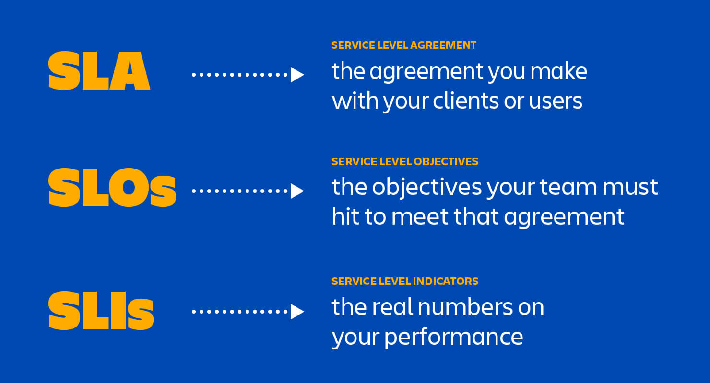

<!-- _class: lead -->

# 存储服务质量保障问题

**施展**
武汉光电国家研究中心
光电信息存储研究部

<https://shizhan.github.io/>
<https://shi_zhan.gitee.io/>

---

## 内容大纲

<!-- paginate: true -->

- 存储服务质量保障背景
- 资源决策问题
- 经典方法和实践

---

## 广泛应用的云

---

Source: <https://www.kiwiqa.com/top-6-cloud-computing-trends-impacting-cloud-adoption-in-2020/>

---

Source: <https://www.canalys.com/newsroom/worldwide-cloud-market-q320>

---

Pandemic boosts cloud consumption by a third in Q3 2020

---

Source: <https://www.srgresearch.com/articles/cloud-market-growth-rate-nudges-amazon-and-microsoft-solidify-leadership>

<!-- New data from Synergy Research Group shows that Q3 enterprise spending on cloud infrastructure services were almost $33 billion, up 33% from the third quarter of 2019. -->

<!-- Amazon and Microsoft continue to account for over half of the worldwide market, with Amazon market share remaining at its long-standing mark of around 33%, while Microsoft’s share was over 18%. Google, Alibaba and Tencent are all growing more rapidly than the overall market and are gaining market share. -->

---

## 服务器整合

Source: [Virtual hierarchies to support server consolidation, ISCA '07](https://dl.acm.org/doi/10.1145/1250662.1250670)

---

### 机遇

<!-- 
- SaaS 软件即服务，云应用
- PaaS 平台即服务，云数据库
- IaaS 基础架构即服务，云主机
 -->

---

### 意义

---

### 更丰富意义

1) 规模化应用部署
2) 扩展、可靠和安全
3) 使能服务质量保障

Source: [Beyond Server Consolidation: Server consolidation helps companies improve resource utilization, but virtualization can help in other ways, too. Queue 2008](https://dl.acm.org/doi/10.1145/1348583.1348590)

---

### 案例

Source: [Update on Virtualizing SQL](https://blogs.vmware.com/apps/2012/11/update-on-virtualizing-sql.html)

---

Source: [Update on Virtualizing SQL](https://blogs.vmware.com/apps/2012/11/update-on-virtualizing-sql.html)

---

## 多租户存储

Source:
[What is a multi-tenant system?](https://www.prudentdevs.club/mts/)
<https://tech.asimio.net/2017/01/17/Multitenant-applications-using-Spring-Boot-JPA-Hibernate-and-Postgres.html>

<!-- Software architects have borrowed lot of concepts from civil engineering. Multi-tenancy is one such concept. -->

---

Source: <https://www.getfilecloud.com/blog/2014/06/launching-tonido-filecloud-6-0-multi-tenant-amazon-s3-storage-ntfs-permissions-support-and-more/>

---

## 服务等级协议、服务等级目标、服务等级指标

- **服务等级协议**(SLA)：协议双方(服务提供者和用户)签订的一个合约或协议，这个合约**规范了双方的商务关系或部分商务关系**。
  - SLA是服务提供者与用户之间协商并签订的一个具有**法律约束力**的合同，合同规定了在服务提供过程中双方所承担的商务条款。
- **服务等级目标**(SLO)：指定服务所提供功能的一种**期望状态**。
- **服务等级指标**(SLI)：经过仔细定义的**测量指标**，它根据不同系统特点确定要测量什么。

Source: [SLO（服务等级目标）与 SLA（服务等级协议）](https://xie.infoq.cn/article/eda3b32806bc800173793118e)

---

Source: [SLA vs. SLO vs. SLI: What’s the difference?](https://www.atlassian.com/incident-management/kpis/sla-vs-slo-vs-sli)

---

Source: [The Key Differences Between SLI, SLO, and SLA in SRE](https://dzone.com/articles/the-key-differences-between-sli-slo-and-sla-in-sre)

---

### 归纳一下

- SLA是法律文书而非技术文档，重在严格约束而非技术实现
- SLO是细分后的具体目标承诺，重在明确量化而非如何测量
- SLI是监控采集的实际观测值，需要精辟选择合适指标

---

### 范例 —— Web 服务器可用性和延迟

- 考察Web服务器**可用性**。指标为收到的HTTP请求数和成功响应的HTTP请求数。若要了解Web服务器是否胜任用户需求，可以分析成功请求数与请求总数的比率。
  - 用成功请求数除以请求总数，可得一个比率。乘以100得到百分比。例如，Web服务器收到100个请求，成功响应了80个，则比率为0.8，即可用性为80%。
- 另例，考察Web**服务延迟**相关的度量值。需观测不到10毫秒内完成的操作与操作总数的比率。
  - 若阈值时间内返回80个请求，请求总数100，则延迟满足率80%。

Source: [服务级别指标(SLI)和服务级别目标(SLO)示例](https://docs.microsoft.com/zh-cn/learn/modules/improve-reliability-monitoring/7-sli-slo)

---

### 一般评价标准

---

## 问题：过度供应

Source: [A View of Cloud Computing. CACM 2010](https://dl.acm.org/doi/10.1145/1721654.1721672)

---

## 问题：性能干扰

 

Source: [Enforcing performance isolation across virtual machines in Xen, Middleware '06](https://dl.acm.org/doi/10.5555/1515984.1516011)

---

## 经典机制

- **操作系统**：I/O管理器
- **虚拟化环境**：虚拟机管理器
- **存储系统**：I/O调度模块

---

### 案例1：cgroup (Linux内核)

- [Block IO Controller](https://www.kernel.org/doc/html/latest/admin-guide/cgroup-v1/blkio-controller.html)
  - [BFQ (Budget Fair Queueing)](https://www.kernel.org/doc/html/latest/block/bfq-iosched.html), [BFQ I/O Scheduler](https://lwn.net/Articles/306641/), [Comparison among 6 schedulers](http://algo.ing.unimo.it/people/paolo/disk_sched/comparison.php)

Source: [Variations on fair I/O schedulers](https://lwn.net/Articles/309400/), 2008

<!-- 

1. Algorithms that allocate throughput or bandwidth in proportion to the specified weights of the clients.

  Provide proportional allocation of IO resources, such as Stonehenge SFQ(D), Argon, and Aqua. Many of these algorithms are variants of weighted fair queuing mechanisms (Virtual Clock, WFQ, PGPS, WF2Q, SCFQ, Leap Forward, SFQ and Latency-rate scheduling) proposed in the networking literature, adapted to handle various storage-specific concerns such as concurrency, minimizing seek delays and improving throughput.

2. Algorithms that provide support for latency-sensitive applications along with proportional sharing.

  These algorithms include SMART, BVT, pClock, Avatar and service curve based techniques.

3. Algorithms that support reservation along with proportional allocation.
  
  Such as Rialto, ESX memory management and other reservation based CPU scheduling methods.

 -->

---

### 案例2：libvirt (KVM, Xen, VMware, QEMU)

- [virsh blkiotune](https://www.libvirt.org/manpages/virsh.html#blkiotune)
- [Quality of Service (QoS) in OpenStack](https://wiki.openstack.org/wiki/QoS)

 

Source: [IO Throttling in QEMU](https://www.linux-kvm.org/images/7/72/2011-forum-keep-a-limit-on-it-io-throttling-in-qemu.pdf), [KVM Forum 2011](https://www.linux-kvm.org/page/KVM_Forum_2011); [OpenStack - Basic volume quality of service](https://docs.openstack.org/cinder/latest/admin/blockstorage-basic-volume-qos.html);

---

### 案例3：Object Storage (Ceph)

- [QoS Study with mClock and WPQ Schedulers](https://ceph.com/en/news/blog/2021/qos-study-with-mclock-and-wpq-schedulers/)
- [The dmclock distributed quality of service algorithm](https://github.com/ceph/dmclock)

 

Source: [mClock: handling throughput variability for hypervisor IO scheduling](https://dl.acm.org/doi/10.5555/1924943.1924974), [OSDI'10](https://www.usenix.org/legacy/events/osdi10/tech/); [Using Ceph RBD as a QEMU Storage](https://insujang.github.io/2021-03-04/using-ceph-rbd-as-a-qemu-storage/);

---

## 决策过程

- **MAPE**-loop steps
  - Monitoring QoS metrics
  - Analyzing divergence of current performance from goals and updating a performance model
  - Planning decisions about actions needed to achieve performance goals
  - Executing those actions

Source: [Decision-Making Approaches for Performance QoS in Distributed Storage Systems: A Survey, TPDS 2019](https://ieeexplore.ieee.org/document/8618414)

---

## 问题描述

$(r_i, l^{r}_i, l^{w}_i)$

${Average\ latency\ over\ time}\ w \leq f_r\cdot l^{r}_i + (1 - f_r)\cdot l^{w}_i$

---

### 方法1：控制论

---

### 方法2：多目标优化

---

### 方法3：机器学习

---

## 实践环境

- 大数据存储实验课 <https://github.com/cs-course/iot-storage-experiment>
- 对象存储入门实验 <https://github.com/cs-course/obs-tutorial>

---

### 实验方法

---

## 进一步思考：如何精确控制？

- 波动性与突发性问题

---

### 我们的工作

- [Storage Sharing Optimization Under Constraints of SLO Compliance and Performance Variability](https://ieeexplore.ieee.org/document/7498602), ToSC 2019.
- [Customizable SLO and Its Near-Precise Enforcement for Storage Bandwidth](https://dl.acm.org/doi/10.1145/2998454), ToS 2017.
- [PSLO: enforcing the Xth percentile latency and throughput SLOs for consolidated VM storage](https://dl.acm.org/doi/10.1145/2901318.2901330), EuroSys 2016.

Source: [PID Controllers Explained](https://blog.opticontrols.com/archives/344)

---

## 参考文献

1. [Decision-Making Approaches for Performance QoS in Distributed Storage Systems: A Survey](https://ieeexplore.ieee.org/document/8618414), TPDS 2019.
2. [Server consolidation techniques in virtualized data centers of cloud environments: A systematic literature review](https://onlinelibrary.wiley.com/doi/abs/10.1002/spe.2582), SPE 2018.
3. [MittOS: Supporting Millisecond Tail Tolerance with Fast Rejecting SLO-Aware OS Interface](https://dl.acm.org/doi/10.1145/3132747.3132774), SOSP 2017
4. [Crystal: software-defined storage for multi-tenant object stores](https://www.usenix.org/conference/fast17/technical-sessions/presentation/gracia-tinedo), FAST 2017
5. [Argon: Performance Insulation for Shared Storage Servers](https://www.usenix.org/legacy/events/fast07/tech/wachs.html), FAST 2007.
6. [Façade: Virtual Storage Devices with Performance Guarantees](https://www.usenix.org/legacy/events/fast03/tech/lumb.html), FAST 2003.
