<!-- _class: lead -->

# 数据中心技术简介

**施展**
武汉光电国家研究中心
光电信息存储研究部

<https://shizhan.github.io/>
<https://shi_zhan.gitee.io/>

---

## 内容大纲

<!-- paginate: true -->

- 背景现状和驱动力
- 历史起源和定义
- 经典案例
- 超算和数据中心
- 主要问题和挑战

---

## 背景现状

---

### 刚刚发生的事情背后

Source: <https://codecondo.com/web-application-architecture/>

---

### 在腾讯公司的平台上

|全球服务器|数据存储规模|全球加速节点|带宽储备|云产品服务|
|:-:|:-:|:-:|:-:|:-:|
|100W+|EB级|2800+|200T|300+|

Source: <https://cloud.tencent.com/about>

---

Source: <https://datareportal.com/reports/>

---

网络服务已渗透社会各个方面

---

---

疫情加快了这个过程

---

AI在进一步给这个过程提速

---

### 随之而来的数据洪流

Source: <https://www.datanami.com/2018/11/27/global-datasphere-to-hit-175-zettabytes-by-2025-idc-says/>

---

### 从侧面观察这股洪流

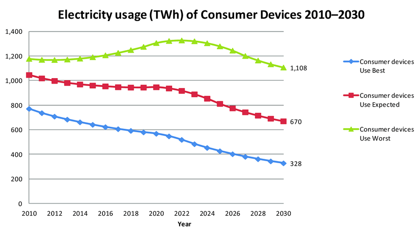 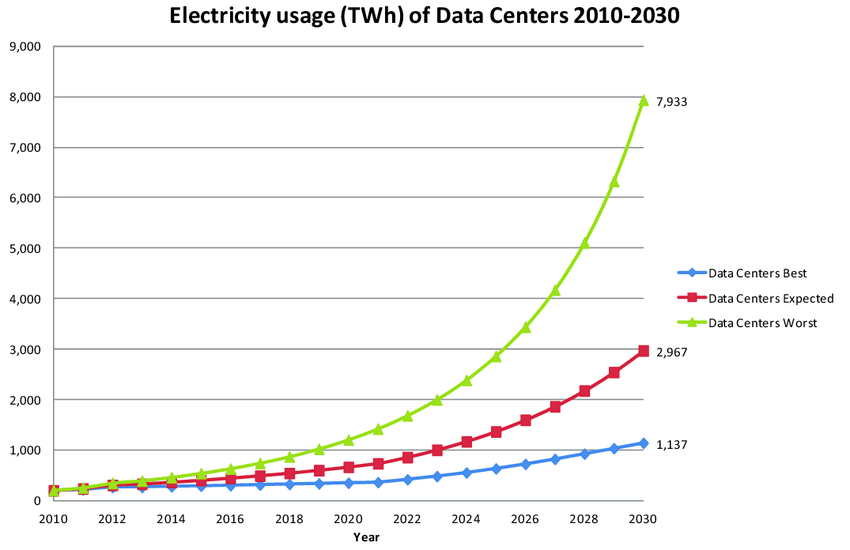

Source: [On Global Electricity Usage of Communication Technology: Trends to 2030](https://www.mdpi.com/2078-1547/6/1/117), Challenges, 2015

---

百度指数

---

## 核心业务驱动

---

### 来自多方的发展需求

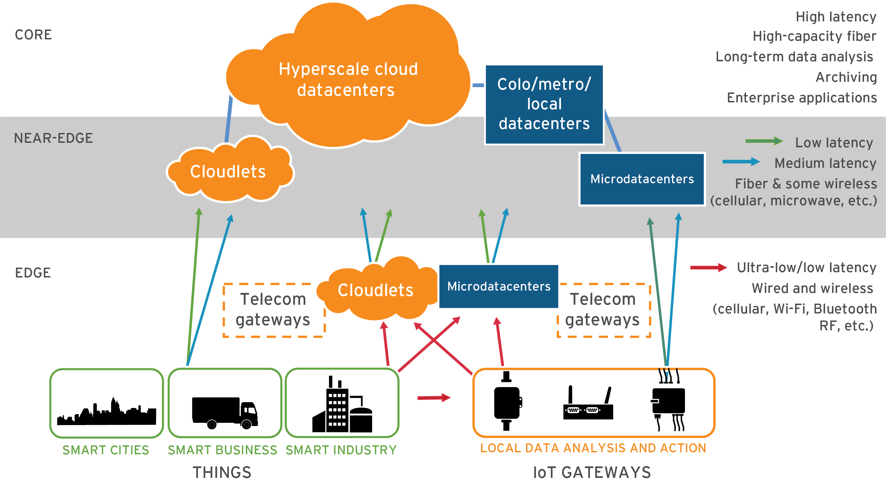

- **云计算**
  - Continued cloud adoption
- **物联网**
  - IoT will further data center demand
- **大数据**
  - Analytics workloads driving computing demands

Source: [Understanding the drivers behind data center demand](https://www.datacenterdynamics.com/en/opinions/understanding-the-drivers-behind-data-center-demand/), Data Centre Dynamics, 2018

---

### AI大势所趋

- The extraordinary growth in the use of **Artificial Intelligence (AI)** in various sectors of activity is posing challenges and requiring changes in the design and operation of datacenters so that they can meet ever-increasing demand.

|GPU|TDP (W)|TFLOPS (Training)|Over V100|TOPS (Inference)|Over V100|
|:-|:-|:-|:-|:-|:-|
|V100 SXM2 32GB|300|15.7|1X   |62   |1X   |
|A100 SXM 80GB |400|156 |9.9X |624  |10.1X|
|H100 SXM 80GB |700|500 |31.8X|2,000|32.3X|

Source: [Schneider Electric – Energy Management Research Center White Paper 110 Version 1.1](https://www.se.com/ww/en/download/document/SPD_WP110_EN/?=1)

---

### 飙升的能源消耗

- An estimate by Schneider Electric, a company that operates inthe field of energy systems management and automation, points out that AI currently represents 4.3 GW of energy demand, a figure that is expected to grow at a **compound annual rate of 26% to36%**, resulting in a total of between 13.5 GW and 20 GW by 2028.

|Schneider Electric estimate|2023|2028|
|:-|-:|-:|
|Total data center workload|54 GW|90 GW|
|AI workload|4.3 GW|13.5-20 GW|
|AI workload (% of total)|8%|15-20%|
|AI workload (Training vs Inference)|20% Training, 80% Inference|15% Training, 85% Inference|
|AI workload (Central vs Edge)|95% Central, 5% Edge|50% Central, 50% Edge|

Source:
[Challenges for datacenters in the face of advancing AI](https://network-king.net/challenges-for-datacenters-in-the-face-of-advancing-ai/), The IT Monitoring Magazine, 2023
[AI and the Data Center: Challenges and Investment Strategies](https://www.informationweek.com/it-infrastructure/ai-and-the-data-center-challenges-and-investment-strategies-), Information Week, 2023

---

### 新基建倡议

- 国家发展改革委创新和高技术发展司2020年发布
  - 新型基础设施是以新发展理念为引领，以技术创新为驱动，以信息网络为基础，面向高质量发展需要，提供数字转型、智能升级、融合创新等服务的基础设施体系，主要包括信息基础设施、融合基础设施、创新基础设施等三方面内容。
- **信息基础设施**主要是指基于新一代信息技术演化生成的基础设施。
  - 以5G、物联网、工业互联网、卫星互联网为代表的通信网络基础设施
  - 以人工智能、云计算、区块链等为代表的新技术基础设施
  - 以**数据中心**、**智能计算中心**为代表的算力基础设施

Source: <http://www.xinhuanet.com/fortune/2020-04/21/c_1125883443.htm>

---

## 历史起源和定义

---

### 历史起源

- 数据中心的概念可以追溯到互联网时代的早期 (60s)
- ARPANET (70s) 与 WWW (90s)
  - **应用日渐丰富**
    - EMail、SNS、IM、博客/微博、视频/短视频、地图 ...
  - **网络能力增长**
    - 拨号、ADSL、宽带、光纤入户，2G至5G ...
- Server-side Computing -- **Cloud**
  - 2006年，亚马逊开创性发布了Amazon Web Services云计算平台

---

### 标准规范

- 数据中心设备及系统可靠性规范 [ANSI/TIA-942](https://tiaonline.org/products-and-services/tia942certification/ansi-tia-942-standard/)，2005年发表，2010、2014年修订
  - 一个**集中存储、处理和分发大量数据的设施**，用于支持各种信息技术服务和业务运营。
  - 通常包括服务器、网络设备、存储设备、电力供应系统、冷却系统等基础设施，并**提供安全性、稳定性和可靠性保障**。
  - 为企业和组织提供高效的数据管理和处理能力，支持**云计算、大数据分析、在线服务等应用场景**。

---

### 分级

|Tier|Feature|
|:-|:-|
|**Tier 1** –– basic data center|no redundancy|
|**Tier 2** –– redundant components|Single distribution path with redundant components |
|**Tier 3** –– concurrently maintainable|Multiple distribution paths with only one active|
|**Tier 4** –– fault tolerant|Multiple active distribution paths|

Source: [ANSI/TIA-942 Standard](https://tiaonline.org/products-and-services/tia942certification/ansi-tia-942-standard/)

---

### 发展阶段

---

### 发展阶段…

1. 计算中心阶段（2001-2006 年）
    - 基础资源和设施**托管、维护**
2. 信息中心阶段（2006-2012 年）
    - 大型化、**虚拟化**、综合化
3. 云中心阶段（2012-2019 年）
    - **云计算**技术成熟，指标监控和度量
4. 算力中心阶段（2019 年至今）
    - **绿色化、智能化**，敏捷运营和精细管理

---

## 数据中心经典案例

---

### “十大”

Source: [Top 10 Data Centers in the World Today](https://www.analyticsinsight.net/top-10-data-centers-world-today/), Preetipadma, September 8, 2020

---

#### ACC7

- Begin from 2014, DuPont Fabros Technology, whose business is building massive data centers and leasing wholesale space to companies on a long-term basis, brought online its biggest facility yet: ACC7 in Ashburn, Virginia.
- The ACC7 is 446,000 square feet in size and has a total power capacity of a whopping 41.6 megawatts. The building includes 28 large computer rooms, with a standard critical load of 1.486 megawatts each, and the ability to increase density to offer up to 2.1 megawatts each. Each data hall can accomodate approximately 378 standard cabinets.
- The company applies a new approach "**water side economization plant with chiller assist.**" This means that outside air will cool water for the cooling system, using a plate and frame heat exchanger, which is expected to be the primary cooling source for 75 percent of the calendar year.

Source: [New Data Center Design Drives Efficiency Gains for Dupont Fabros](https://www.datacenterknowledge.com/archives/2014/02/13/new-data-center-design-drives-efficiency-gains-dupont-fabros), 2014

---

#### Tahoe Reno 1

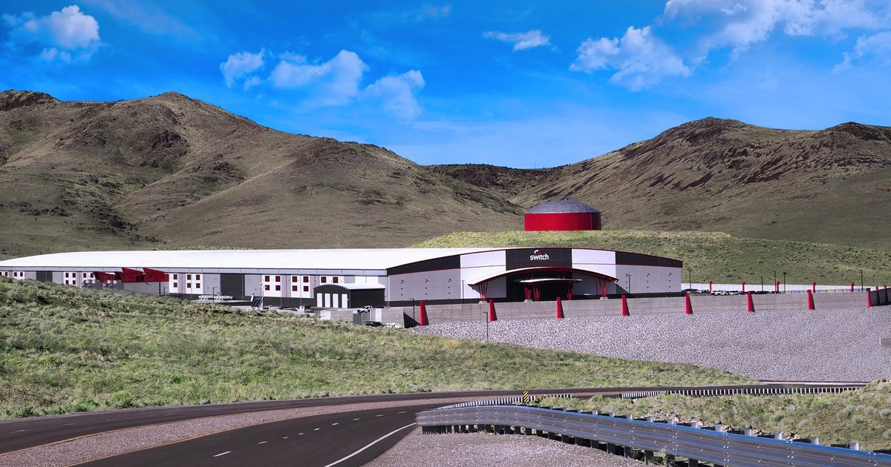

- Built and designed to Tier IV standards, Tahoe Reno 1 consists of 1.3 million square feet (120,000 sq m) of data center space, which Switch claims is the largest data center for colocation in the world. Switch plans to expand this to a total of 7.2 million sq ft (670,000 sq m). It has a power capacity of 130 MW, a fifth of its 650 MW goal.
- Switch highlighted the data center’s security, reliability and low latency, which is backed by the Superloop system, a 500-mile, multi-terabyte fiber optic network to San Francisco and Los Angeles, as well as the company’s 2.5 million sq ft of data center space located in Las Vegas with 10Gbps circuits at 4-millisecond latency. The facility has a tri-redundant UPS power system, and offers up to 42 kW of power per cabinet.
- **100 percent renewable energy**, which Switch currently purchases externally, but plans to produce itself in future using Switch I and Switch II, the company’s ongoing solar projects located near the Apex Industrial Park in Southern Nevada.

Source: [Switch opens Tahoe Reno 1, "world’s largest" colo data center](https://www.datacenterdynamics.com/en/news/switch-opens-tahoe-reno-1-worlds-largest-colo-data-center/), 2017

---

#### Range International Information Group

- It was designed to help meet the skyrocketing needs of the Chinese economic and technological boom that has been running for about two decades. As with most large scale projects in China, this data center was built by a combined public and private investment and is overseen by IBM. It consumes 150 megawatts of power.
- Located in Langfang China, Range International Information Group is **the world’s largest data center** and occupies 6.3 million square feet of space.
  - It is equivalent to the area occupied by the Pentagon or a combination of 110 football fields. Construction of the Range International Information Group was completed in 2016.

Source: [And The Title of The Largest Data Center in the World and Largest Data Center in US Goes To...](https://www.datacenters.com/news/and-the-title-of-the-largest-data-center-in-the-world-and-largest-data-center-in), 2018

---

- **Lakeside Technology Center**
  - Location: Chicago, Illinois
  - 印刷厂改；大量备用发电机组(53)；大量冷却水(8.5 million gallons of cooling fluid per year)；客户有IBM, CenturyLink, Facebook, and TelX。
- **Kolos Data Centre**
  - Location: Ballengen, Norway
  - 北欧天然冷却；挪威丰富水电；北大西洋高速互联。
- **Tulip Data City**
  - Location: Bangalore, India
  - 一度非美国最大(Tulip Telecom Ltd.)；IBM帮助设计。
- **Bahnhof’s Pionen**
  - Location: Central Stockholm, Sweden
  - 斯德哥尔摩人防工程(in 1943 to protect essential government functions)；潜艇发动机做备电(Maybach MTU diesel engines)。
- **Next-Generation Data**
  - Location: Newport, UK
  - 服务于BT、IBM各路公有云；全英最高PUE；独占电网(has its own sub-station with a direct connection to the 400kV Super Grid)。

---

### Swiss Fort Knox 瑞士诺克斯地堡

- Location: Baar, Switzerland
- 号称世界最安全的数据中心，源自2010年的欧盟 [Planets (Preservation and Long-term Access through Networked Services)](https://planets-project.eu/) 项目
  - 爱因斯坦的纸质笔记现在我们仍能看到，但斯蒂芬·霍金的数字笔记在70年后我们很有可能看不到。项目旨在确保“我们的数字化文化和科学宝藏可被长期访问”。
- Built in 1994, by Christoph Oschwald, and his business partner Hanspeter Baumann, who converted the former headquarters of the Swiss Air Force into a top-notch data center by installing emergency diesel engines, a ventilation system, a filter, and an air-pressure system to prevent the entry of any poisonous gases.
- Water from an underground lake keeps the center’s cooling system at 8 degrees Celsius.

---

### 瑞士诺克斯地堡

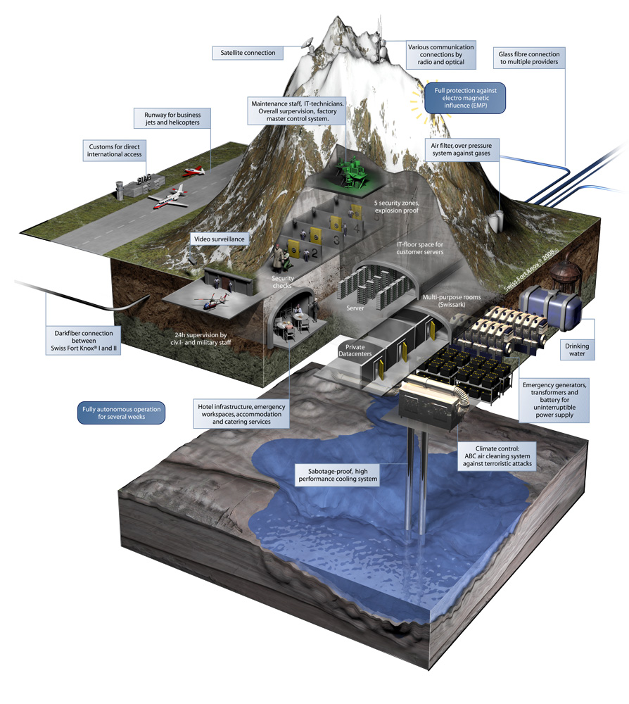

Source: [SWISS FORT KNOX I + II is an underground datacenter concept with various locations, deep inside the Swiss Alps.](https://www.mount10.ch/en/mount10/swiss-fort-knox/)

---

### 瑞士诺克斯地堡…

- 客户专属密钥备份

Source: [Encrypted, daily monitored and fully automatic](https://www.mount10.ch/en/products/backup/combo.html)

---

### 瑞士诺克斯地堡……

Ideal protection against NSA and PRISM!

- Data storage inside of Switzerland (<www.swissfortknox.com>)
- Encryption of the data with 256-bit AES (wikipedia)
- Personal encryption key which is NOT known to us (no backdoors)
- Redundant data storage and contractual availability of 99.7% (GTC)
- Compliance with the legal requirements for a backup in accordance with Swiss law ( Certificate (German) und Report (German) )

---

### NSA在用什么？

- Location: Bluffdale, Utah
- The $1.2billion project included 100,000-square-feet of Tier III data center space and 1,350,000-square-feet of technical support and administrative space. Support facilities include water treatment facilities, vehicle inspection facility, interim visitor control center, perimeter site security measures, fuel storage, water storage, chiller plant, fire suppression systems and 100% electrical generator and UPS back up capacity.
- The facility showcases numerous innovative technology and energy efficiency features and was designed and constructed to achieve LEED Silver certification.

Source: [FLAGSHIP UTAH DATA CENTER](https://www.novva.com/utah-data-center)

---

### Utah Data Center 犹他数据中心

- 拥有尧字节 (yottabyte) 级的设计存储能力 ... *此处尚缺可信数据*
  - [百度百科](https://baike.baidu.com/item/犹他数据中心/6759396)，[犹他州大数据中心——美国国家安全的核心资产](http://www.xinhuanet.com/mil/2017-05/09/c_129596267.htm)
- $Y_{otta}Byte=2^{10}*Z_{etta}B=2^{20}*E_{xa}B=2^{30}*P_{etta}B=2^{80}B$
- 能储存100年有价值的通讯信息(全世界2011年整个互联网的容量总和也不过52艾$2^{60}$字节)，目的是支持综合性国家计算机安全计划 (Comprehensive National Cybersecurity Initiative, CNCI)，也是国家情报总监 (DNI) 的执行机构，具体职责保密。
- 位于犹他州小城布拉夫代尔的犹他州大数据中心，是继马里兰州米德堡国家安全局总部、得克萨斯州圣安东尼奥备份中心之后，美国安全局建立的第三个数据中心。其目的，是在全面共享国家安全情报的基础上，存储、处理、分析网络空间大数据，支撑新时期美国国家安全。

---

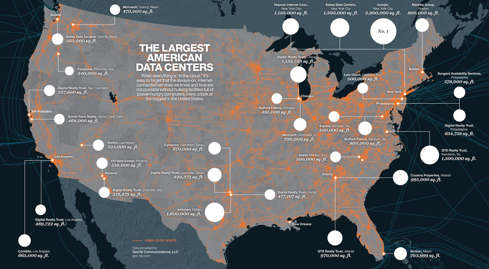

Source: <http://www.iiclouds.org/20141114/maps-of-data-center-localization/>

---

### 谷歌

Source: <https://www.google.cn/about/datacenters/locations/>

---

### 亚马逊

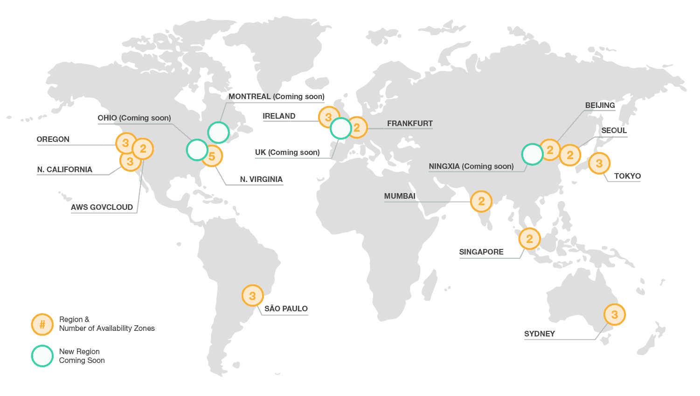

Source: <https://www.cloudwards.net/news/amazon-announces-new-aws-paris-region-opening-in-2017-14326/>

---

### 亚马逊…

Source: <https://aws.amazon.com/cn/cloudfront/features/>

---

### 微软

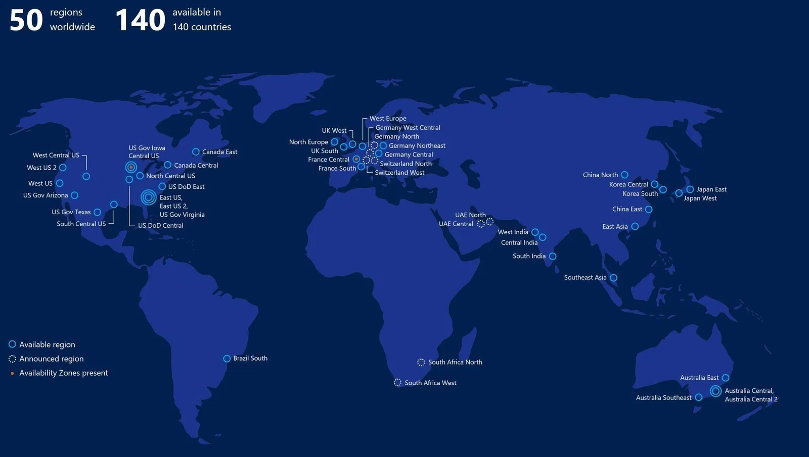

Source: <https://www.urtech.ca/2019/01/solved-where-are-microsofts-data-centers-located/>

---

### AWS, Azure and Google Cloud

Source: <https://www.atomia.com/2016/11/24/comparing-the-geographical-coverage-of-aws-azure-and-google-cloud/>

---

### AWS, Azure and Google Cloud …

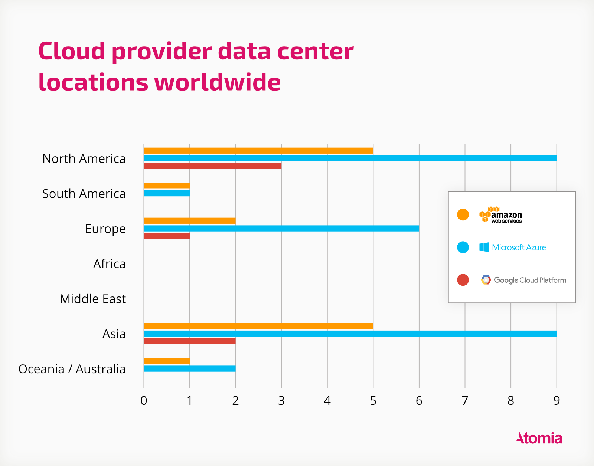

Source: <https://www.atomia.com/2016/11/24/comparing-the-geographical-coverage-of-aws-azure-and-google-cloud/>

---

智算中心的范例？

---

### 国内情况

Source: 中国数据中心产业发展白皮书，中国通服数字基建产业研究院，2023

---

### 细分类型

Source: [中国信息通信研究院 开放数据中心委员会](https://www.odcc.org.cn/)

---

### 地域分布

Source: <https://www.newdc.org.cn/datacenter.html>

---

### 阿里

Source: [阿里云宣布五大超级数据中心落成 未来还将再添十座](http://it.people.com.cn/n1/2020/0731/c1009-31805645.html), 2020年07月31日

---

### 阿里…

超级数据中心广泛使用**液冷、水冷、风能**等节能技术，此次新建成的杭州数据中心就部署了全球最大的液冷服务器集群，通过将服务器“泡在水里”（实际使用的是特殊的冷却液）的方式散热，可为数据中心节能70%以上；在五大超级数据中心内，还采用了**自动运维机器人**进行智能运维，24小时保障数据中心安全运行。

---

### 腾讯

Source: [腾讯云全球基础设施](https://cloud.tencent.com/act/event/global-base), [腾讯云印尼数据中心开服 未来将打造双可用区格局](https://www.sohu.com/a/460330019_120873246)

---

### 腾讯…

2021年4月，腾讯云宣布其在印尼的首个云计算数据中心正式开服。该数据中心位于 印尼首都雅加达未来一年内将在印尼开放第二个数据中心，打造印尼双可用区格局。此次印尼数据中心开服后，腾讯云已经在全球27个地理区域，运营61个可用区。其中，腾讯云海外数据中心已经落地韩国、日本、印度、新加坡、美国、德国、俄罗斯、加拿大、泰国等国家。

---

### T-Block

腾讯位于清远市的云计算数据中心于2020年7月开服，8栋机房，容纳的服务器将超过100万台。

T-Block使机房、空调、电力等等部件全部模块化，高度简化数据中心的建设，现场施工周期减少了80%以上。

Source: [探访腾讯国内最大数据中心，百万台服务器啥概念](http://dc.idcquan.com/jfjs/183618.shtml)

---

## 巨无霸背后的巨无霸

数据中心的建造者

[2021: These are the World’s Largest Data Center Colocation Providers](https://www.datacenterknowledge.com/archives/2017/01/20/here-are-the-10-largest-data-center-providers-in-the-world), Yevgeniy Sverdlik, Jan 15, 2021

---

|    | Company             | Market share|Headquarters           |
| :- | :-                  | -:     | :-                         |
|  1 | Equinix             | 11.1 % | Redwood City, California   |
|  2 | Digital Realty Trust|  7.6 % | Austin, Texas              |
|  3 | **China Telecom**   |  6.1 % | Beijing, China             |
|  4 | NTT GDC             |  4.3 % | Tokyo, Japan               |
|  5 | **China Unicom**    |  4.2 % | Beijing, China             |
|  6 | **China Mobile**    |  2.1 % | Beijing, China             |
|  7 | CyrusOne            |  1.9 % | Dallas, Texas              |
|  8 | KDDI Telehouse      |  1.9 % | Tokyo, Japan               |
|  9 | **GDS**             |  1.6 % | Shanghai, China            |
| 10 | Global Switch       |  1.4 % | London, UK                 |
| 11 | **21Vianet**        |  1.4 % | Beijing, China             |
| 12 | CoreSite            |  1.3 % | Denver, Colorado           |
| 13 | Cyxtera             |  1.2 % | Coral Gables, Florida      |
| 14 | Lumen (CenturyLink) |  1.1 % | Monroe, Louisiana          |
| 15 | Flexential          |  1.1 % | Charlotte, North Carolina  |

---

It’s important to note that China Telecom is one of five Chinese companies on the leaderboard (also China Unicom, China Mobile, GDS 万国数据, and 21Vianet 世纪互联), all of whom do business primarily in China. **China’s market is so vast that these providers can stay mostly domestic (with some international presence) and still have huge share of the global market.**

China’s protectionist regulatory policy makes it extremely difficult for foreign companies to compete in the country’s vast data center market, and international players’ interest in China has waned. **As a result, Chinese hyperscalers’ explosive growth in recent years has driven huge growth for Chinese companies that build and operate data centers for the likes of Alibaba and Tencent.**

---

国内的智算中心建设情况

---

## 仓储规模的计算机系统，就是数据中心？

---

### 一项经典的比较：HPC vs Cloud

---

### 超算和云

- 是 **集中力量办大事**
- …
- …

Source: <https://jgbarbosa.github.io/vis/docs/intro_to_hpc/intro_to_hpc_01.html>

---

### 超算和云…

- 是 **集中力量办大事**
- 或 **人民群众无小事**
- …

Source: <https://www.networkcomputing.com/cloud-infrastructure/guide-cloud-computing-architectures>

---

### 超算上云

- 是 **集中力量办大事**
- 或 **人民群众无小事**
- 又或者 **动员广大人民办大事**

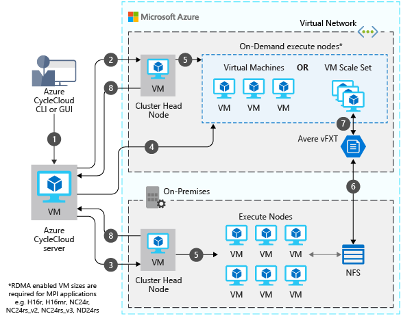

Source: <https://docs.microsoft.com/en-us/azure/architecture/example-scenario/infrastructure/hpc-cfd>

Discussions:
2013 [A comparative study of high-performance computing on the cloud, HPDC'13](https://dl.acm.org/doi/10.1145/2462902.2462919)
2017 [Understanding the Performance and Potential of Cloud Computing for Scientific Applications, ToCC'17](https://ieeexplore.ieee.org/document/7045591)
2018 [HPC Cloud for Scientific and Business Applications: Taxonomy, Vision, and Research Challenges, CSUR'18](https://dl.acm.org/doi/10.1145/3150224)
2019 [Use Cases for HPC in the Cloud](https://insidehpc.com/2019/10/use-cases-for-hpc-in-the-cloud/)
2020 [HPC in the Cloud? Yes, No and In Between](https://www.arm.com/blogs/blueprint/hpc-cloud)
2020 [High Performance Computing Vs Cloud Computing: Which is Better?](https://www.1plus1tech.com/high-performance-computing-vs-cloud-computing/)
2021 [HPC and the Cloud](https://www.cioreview.com/cxoinsight/hpc-and-the-cloud-nid-12863-cid-84.html)

---

### 众包、边缘、雾计算

- **从群众中来，到群众中去**

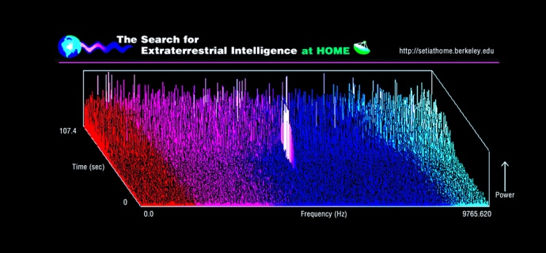 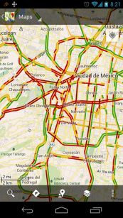

Source: [The Power of the Community – Crowd Sourcing, Open Source and Social Networking](https://www.omniasecuritas.com/archives/116)

---

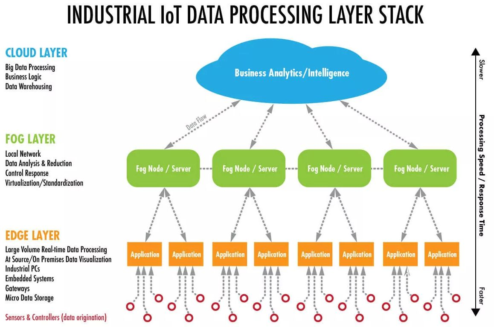

Source: <https://www.winsystems.com/cloud-fog-and-edge-computing-whats-the-difference/>

---

---

## 国家的愿景？

---

### 数据中心集群

- 多云
  - BAT新增机柜主要用于**云承载**，占比达60%-80%
  - 从小规模单中心向**行业/区域大规模多中心、跨行业/区域中心**演进
- 东数西算
  - 呈现由**中心向周边**转移趋势，未来也将由**东部向西部**迁移

---

### 国家算力网

Datacenters as a Computer

……

**Nation as a Computer?**

---

### 服务算力化

<!-- 算力 2.0 时代到来，算力由基础算力向智能算力发展，异构算力需求崛起。

数字经济高质量发展诉求推动算力由 1.0 向 2.0 演进，单纯数据中心转向数算一体服务，并由基础算力向智算等高阶算力演化。算力 1.0 主要提供数据存储、分发服务，传统数据中心相当于一个算力“仓库”，对数据大规模处理和提供高性能计算（智算/超算）能力有限。算力 2.0 由新型数据中心提供大规模数据处理和高性能计算能力，具有互通性、智能性、融合性、绿色性、安全中立性等五大特征，自 2020 年“新基建”概念提出以后，国家着重开始规划新型算力中心，例如在 2020 年 4 月，国家发改委明确提出要推进新型算力设施规划。 -->

---

### 算力规模情况

算力规模持续扩大，缩小与世界先进国家差距。

<!-- 据 IDC、Gartner、中国通服数字基建产业研究院等多方机构测算，2020 年我国算力总规模达到 135EFlops，全球占比约为 31%，同比增长 55%，进一步缩小与美国等发达国家差距。其中，基础算力规模（FP32）达到 77EFlops，全球同类占比约为 26%，美国占比 43%；智能算力规模（换算为 FP32）达到 20EFlops，全球同类占比约为 19%，美国占比 52%，中美差距较大；超算算力规模（换算为 FP32）约为 2EFlops，全球同类占比约为 20%，美国占比 31%。 -->

---

## 主要问题和挑战

隐藏在规模化的背后的是？

---

### Typical first year for a new cluster

~0.5 **overheating** (power down most machines in <5 mins, ~1-2 days to recover)
~1 **PDU failure** (~500-1000 machines suddenly disappear, ~6 hours to come back)
~1 **rack-move** (plenty of warning, ~500-1000 machines powered down, ~6 hours)
~1 **network rewiring** (rolling ~5% of machines down over 2-day span)
~20 **rack failures** (40-80 machines instantly disappear, 1-6 hours to get back)
~5 **racks go wonky** (40-80 machines see 50% packetloss)
~8 **network maintenances** (4 might cause ~30-minute random connectivity losses)
~12 **router reloads** (takes out DNS and external vips for a couple minutes)
~3 **router failures** (have to immediately pull traffic for an hour)
~dozens of minor 30-second **blips for dns**
~1000 **individual machine failures**
~thousands of **hard drive failures**
**slow disks, bad memory, misconfigured machines, flaky machines**, etc.

Source: [Software Engineering Advice from Building Large-Scale Distributed Systems](http://research.google.com/people/jeff/stanford-295-talk.pdf)
Source: [Designs, Lessons and Advice from Building Large Distributed Systems](http://www.cs.cornell.edu/projects/ladis2009/), LADIS 2009

---

### 常见问题

- 可靠性
  - Failover to other replicas/datacenters.
- 扩展性
  - Ensure your design works if scale changes by 10X or 20X, but the right solution for X often not optimal for 100X.
- 一致性
  - Multiple data centers implies dealing with consistency issues.
- 可用性
  - Worry about variance! Redundancy or timeouts can help bring in latency tail.

---

### 严峻的延迟难题

|操作|用时||||
|:-|-:|-:|-:|:-|
| L1 cache reference                 |          0.5 ns |            |        |                             |
| Branch mispredict                  |          5   ns |            |        |                             |
| L2 cache reference                 |          7   ns |            |        | 14x L1 cache                |
| Mutex lock/unlock                  |         25   ns |            |        |                             |
| Main memory reference              |        100   ns |            |        | 20x L2 cache, 200x L1 cache |
| Compress 1K bytes with Zippy       |      3,000   ns |       3 us |        |                             |
| Send 1K bytes over 1 Gbps network  |     10,000   ns |      10 us |        |                             |
| Read 4K randomly from SSD*         |    150,000   ns |     150 us |        | ~1GB/sec SSD                |
| Read 1 MB sequentially from memory |    250,000   ns |     250 us |        |                             |
| Round trip within same datacenter  |    500,000   ns |     500 us |        |                             |
| Read 1 MB sequentially from SSD*   |  1,000,000   ns |   1,000 us |   1 ms | ~1GB/sec SSD, 4X memory     |
| Disk seek                          | 10,000,000   ns |  10,000 us |  10 ms | 20x datacenter roundtrip    |
| Read 1 MB sequentially from disk   | 20,000,000   ns |  20,000 us |  20 ms | 80x memory, 20X SSD         |
| Send packet CA->Netherlands->CA    |150,000,000   ns | 150,000 us | 150 ms |                             |

Notes

$1 ns = 10^{-9} seconds$
$1 us = 10^{-6} seconds = 1,000 ns$
$1 ms = 10^{-3} seconds = 1,000 us = 1,000,000 ns$

Credit

By Jeff Dean: <http://research.google.com/people/jeff/>, Originally by Peter Norvig: <http://norvig.com/21-days.html#answers>

<!-- 延迟和可靠性问题还将在随后的讲座中详谈 -->

---

Source: <https://colin-scott.github.io/personal_website/research/interactive_latency.html>

---

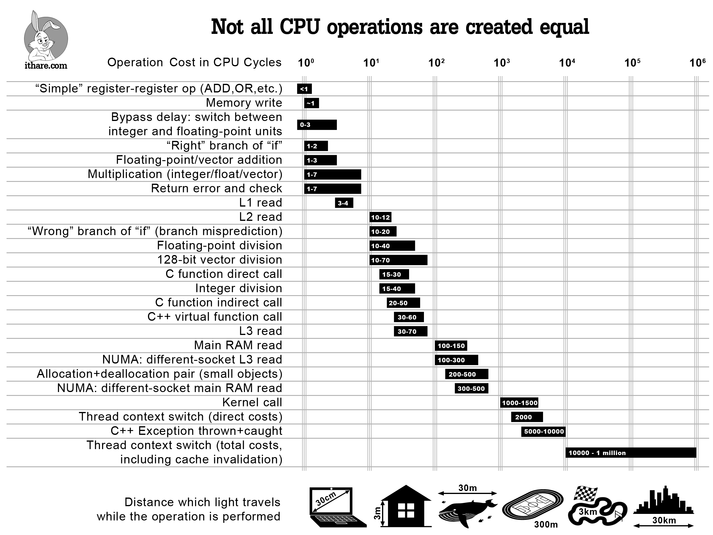

Source: <http://stereobooster.github.io/latency-numbers-every-programmer-should-know>

---

<https://www.servethehome.com/compute-express-link-cxl-latency-how-much-is-added-at-hc34/>

---

### 惊人的能耗

Globally, data centers were estimated to use between 196 terawatt hours (TWh) ([Masanet et al, 2020](https://doi.org/10.1126/science.aba3758)) and 400 TWh ([Hintemann, 2020](https://dx.doi.org/10.13140/RG.2.2.26033.40800)) in 2020. This would mean data centers consume between 1-2% of global electricity demand.

Source: [Recalibrating global data center energy-use estimates](https://www.science.org/doi/10.1126/science.aba3758), Science, 28 Feb 2020

<!-- 报告显示，2018年数据中心的总用电量约为205太瓦时，约占全球用电总量的1%（该领域通常引用的统计值为2%，可以看出数据中心实际耗能远低于此）。205太瓦时的功耗相较于2010年的数值增长了6%，但是同一时期全球数据处理中心计算量却增加了550%。更确切地说，在计算量大幅增加的同时，能耗基本保持了稳定。

文中列举了许多原因。首先，硬件电源效率得到了极大的提高。数据处理向虚拟服务器端迁移，这使得在仅6%的能耗增长下，计算量增加了6倍。得益于更快、更节能的端口技术，虽然数据中心的IP流量增长了10倍，但是网络设备的能耗增长却十分有限。

该报告还指出，超大规模数据中心技术的兴起和使用也帮助减少了能耗。超大型数据中心和云数据中心通常比企业数据中心具有更高的能源效率，因为高效的能源利用对于它们更为重要。像亚马逊、微软、谷歌这样的公司，在处理数据方面需要的电能越少，利润空间就会越大。超大规模数据中心非常注重使用更为便宜的大量可再生能源，如水电和风能。

因此，如果某个公司将本身效率低下的老旧数据中心换成AWS（亚马逊网络服务）或者Google Cloud（谷歌云），那么整个数据中心的总功耗将会下降。

https://www.fx361.com/page/2020/0503/6626362.shtml -->

---

### 数据中心能源效率

- PUE (Power Usage Effectiveness) 指标：几成能源用在实际业务中？

$$PUE=\frac{Total\ Facility\ Power}{IT\ Equipment\ Power}$$

- 由 [Green Grid](https://www.thegreengrid.org/) 倡导和维护
- 理想 $PUE=1.0$
  - IT设备以外基本没有能耗，包括冷却
  - 现实中不可能，哪台电脑不散热？
- 早期一般在2.0左右，即整体耗能倍增。

---

Source: [How Much Energy Do Data Centers Really Use?](https://energyinnovation.org/2020/03/17/how-much-energy-do-data-centers-really-use/), March 17, 2020

---

[Google: Our PUE is Lower, and It's Scrupulous](https://www.datacenterknowledge.com/archives/2012/03/26/google-our-pue-is-lower-and-its-scrupulous), Mar 26, 2012

---

### 数据中心能源效率…

- 科技巨头 Amazon、Google 和 Microsoft 可以控制在 1.2 以内
  - 迄今最优 1.07 (Facebook)、1.12 (Google)
- 其余可不好说
  - According to the [Uptime Institute research](https://www.colocationamerica.com/blog/what-is-pue), an average US data center has a PUE of 2.5. However, servers with a PUE of 3.3 and higher are common to find as well...
- 工信部、国家机关事务管理局、国家能源局联合印发《[关于加强绿色数据中心建设的指导意见](http://www.gov.cn/xinwen/2019-02/14/content_5365516.htm)》，提出到2022年全国新建大型、超大型数据中心PUE需达到1.4以下。
  - [阿里国内自营平均 1.3 以内](http://dc.idcquan.com/mkh/164245.shtml)，[腾讯清远用间接蒸发冷却约 1.25](http://tech.idcquan.com/179786.shtml)。

---

<https://natick.research.microsoft.com/>

---

<https://www.demilked.com/facebook-server-farm-arctic-lule-sweden/>

---

<https://www.sohu.com/a/233201201_398039>

---

<https://alibabagroup.com/cn/news/article?news=p150908>

---

### 国内统计数据

<!-- 全国数据中心能效水平不断提升。根据 CDCC 统计分析，2021 年度全国数据中心平均 PUE 为 1.49，相较于 2019 年全国平均 PUE 近 1.6，全国数据中心 PUE 已有所提升。其中华北、华东的数据中心平均 PUE 接近 1.40，处于相对较优水平。华中、华南地区受地理位置、上架率及其他多种因素的影响，数据中心平均 PUE 值接近 1.6，存在较大的提升空间。 -->

---

### 国内统计数据…

<!-- 随着多个省市实际要求设计 PUE 不高于 1.2，液冷等新技术嵌入加速普及。“东数西算”政策明确要求到 2025 年，东部枢纽节点数据中心 PUE＜1.25，西部枢纽节点数据中心 PUE＜1.2，实际上目前很多省份数据中心项目可研审批均要求在设计 PUE 在1.2以下。同时在各大节点绿色节能示范工程实施推动下，数据中心建设低碳化进程有望进一步加快。按照赛迪顾问相关数据测算，液冷渗透率预计在 2025 年达到 20%。同时，在氟泵变频技术、热管多联技术、间接蒸发却机组（AHU 一体化机组）、智慧机房运维（AI 调优等）等其他新技术也在快速推广开来，数据中心能效优化空间有望进一步扩大。 -->

---

### 当下

数据中心可再生能源利用率在未来几年有望快速改善。根据国际环保组织绿色和平研究，2018 年中国数据中心火电用电量占其总用电量的 73%，而中国数据中心可再生能源使用比例仅为 23%，低于我国市电中可再生能源使用比例 26.5%。

到 2020 年，我国数据中心可再生能源利用率达到 30%左右，相较于 2018 年已有所提升。

未来几年，随着国家及各省市加大对数据中心化石能源使用的约束，新型储能、分布式光伏等技术及应用的规模化发展，数据中心可再生能源利用率将大幅提升，绿电占比或将大于 50%。

---

### 愿景

打造“零碳数据中心”成为数据中心低碳化发展的终极目标。随着国家对数据中心能耗管控趋严，以及 PUE 优化、源网荷储一体化技术发展，打造 100%可再生能源的“零碳数据中心”或“低碳数据中心”成为主流服务商的重要发展方向。

如中国电信创新推动数字经济与青海清洁能源深度融合发展，打造中国电信数字青海绿色大数据中心，成为全国首个 100%清洁能源可溯源绿色大数据中心，也是首个数据中心源网荷储绿电智慧供应系统示范样板，重新定义了绿色大数据中心新标准和绿色能源消费新模式。

---

### 在PUE背后

- 问题依然复杂
- PUE作为评估数据中心总用电量的衡量指标
  - 主要考察资源运转效率
  - 只考虑数据中心的内部操作，未揭露电力来源与实际用电量
  - 数据中心占全球用电量的1~2%，但是来源呢？

---

Source: [How much energy do data centers use?](https://davidmytton.blog/how-much-energy-do-data-centers-use/) October 8, 2021

<!-- 做研究要多思考背后因素 -->

---

PUE优化中的猫腻

<!-- 服务器更新换代之后，能耗得以控制，PUE反而更差，如果用PUE做指标，或许压抑换代愿望 -->

---

## 学习目的

- 数据中心技术的**基础知识**
- 大规模计算机系统**性能、可用性、可靠性**问题
- 经典的**应对方法**

---

## 后续内容

- 数据中心专题讲座与实践
  - **对象存储**技术：[尾延迟问题](object-storage)、[服务质量保障问题](qos-guarantee)
  - 数据中心**先进存储**技术：OC-SSD、ZNS-SSD……
  - 数据中心**可靠编码**技术：纠删码、再生码、大条带……
  - 数据中心**故障预测**技术：磁盘故障预测……

---

## 后续内容…

- 选读论文，准备下个月**研讨**
  - 读前提示，请务必落实主要引用文献，精辟阐述研究背景
- 熟悉实验内容，准备以日常赛促**实践**
  - 日常赛作为入门学习，学有余力可以遍寻各大竞赛平台PVP
  - [构建多模态模型，生成主机观测指标学习赛](https://tianchi.aliyun.com/competition/entrance/532270/introduction)
