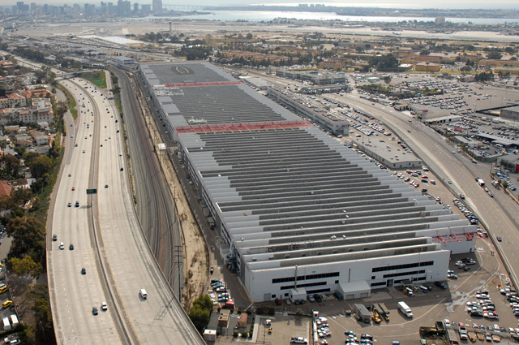
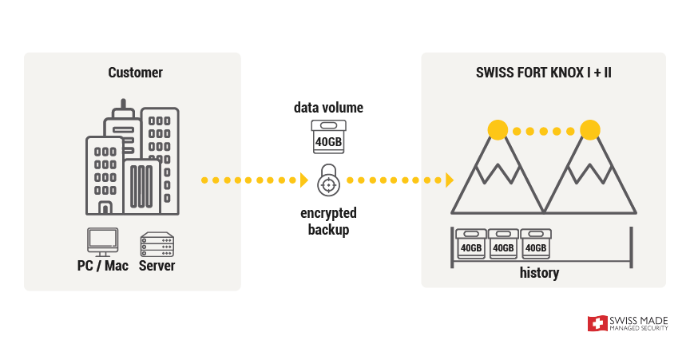
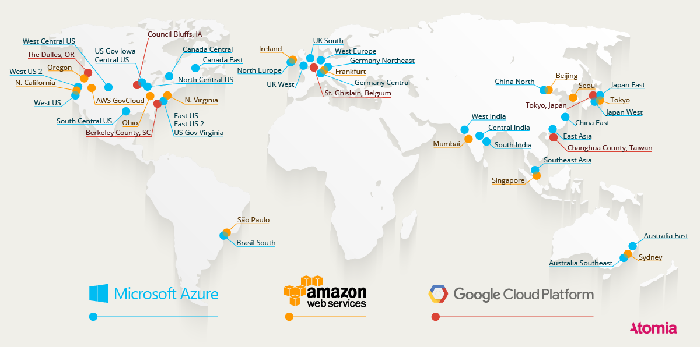
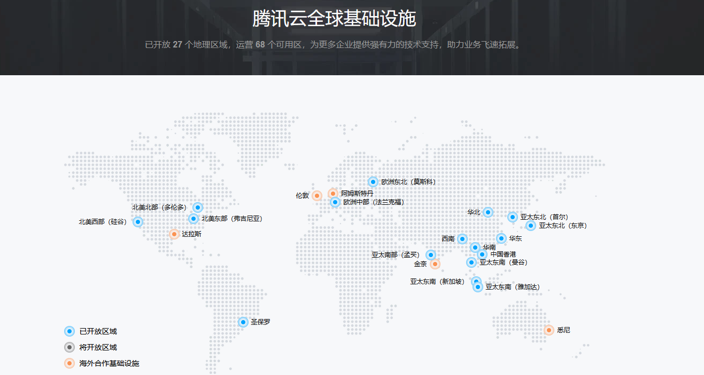
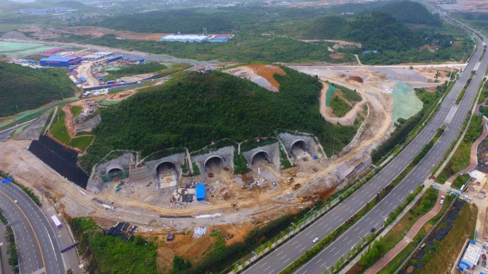

<!-- _class: lead -->

# 数据中心技术简介

**施展**
武汉光电国家研究中心
光电信息存储研究部

<https://shizhan.github.io/>

---

## 历史和现状

[**历史和现状**](#历史和现状)
[平台软件与负载特性](data-center-intro.md#平台软件与负载特性)
[基础硬件与设计取舍](data-center-intro.md#基础硬件与设计取舍)
[供电和冷却](data-center-intro.md#供电和冷却)
[集中供能和效率优势](data-center-intro.md#集中供能和效率优势)
[集中使用和成本优势](data-center-intro.md#集中使用和成本优势)
[集中运维挑战](data-center-intro.md#集中运维挑战)

---

### 历史起源

- 数据中心的概念可以追溯到互联网时代的早期 (60s)
- ARPANET (70s) 与 WWW (90s)
  - **应用日渐丰富**
    - EMail、SNS、IM、博客/微博、视频/短视频、地图 ...
  - **网络能力增长**
    - 拨号、ADSL、宽带、光纤入户，2G至5G ...
- Server-side Computing -- **Cloud**
  - 2006年，亚马逊开创性发布了Amazon Web Services云计算平台

---

### 标准规范

- 数据中心设备及系统可靠性规范 [ANSI/TIA-942](https://tiaonline.org/products-and-services/tia942certification/ansi-tia-942-standard/)，2005年发表，2010、2014年修订
  - 一个**集中存储、处理和分发大量数据的设施**，用于支持各种信息技术服务和业务运营。
  - 通常包括服务器、网络设备、存储设备、电力供应系统、冷却系统等基础设施，并**提供安全性、稳定性和可靠性保障**。
  - 为企业和组织提供高效的数据管理和处理能力，支持**云计算、大数据分析、在线服务等应用场景**。

---

### 发展阶段

---

### 发展阶段…

1. 计算中心阶段（2001-2006 年）
    - 基础资源和设施**托管、维护**
2. 信息中心阶段（2006-2012 年）
    - 大型化、**虚拟化**、综合化
3. 云中心阶段（2012-2019 年）
    - **云计算**技术成熟，指标监控和度量
4. 算力中心阶段（2019 年至今）
    - **绿色化、智能化**，敏捷运营和精细管理

---

### 现实业务需求

- **云计算**
  - Continued cloud adoption
- **物联网**
  - IoT will further data center demand
- **大数据**
  - Analytics workloads driving computing demands

Source: [Understanding the drivers behind data center demand](https://www.datacenterdynamics.com/en/opinions/understanding-the-drivers-behind-data-center-demand/), Data Centre Dynamics, 2018

---

Source: <https://datareportal.com/reports/>

---

网络服务已渗透社会各个方面

---

---

疫情加快了这个过程

---

### 随之而来的数据洪流

Source: <https://www.datanami.com/2018/11/27/global-datasphere-to-hit-175-zettabytes-by-2025-idc-says/>

---

### 从侧面观察这股洪流

 

Source: [On Global Electricity Usage of Communication Technology: Trends to 2030](https://www.mdpi.com/2078-1547/6/1/117), Challenges, 2015

---

百度指数

---

### 新基建倡议

- 国家发展改革委创新和高技术发展司2020年4月发布
  - 新型基础设施是以新发展理念为引领，以技术创新为驱动，以信息网络为基础，面向高质量发展需要，提供数字转型、智能升级、融合创新等服务的基础设施体系，主要包括信息基础设施、融合基础设施、创新基础设施等三方面内容。
- **信息基础设施**主要是指基于新一代信息技术演化生成的基础设施。
  - 以5G、物联网、工业互联网、卫星互联网为代表的通信网络基础设施
  - 以人工智能、云计算、区块链等为代表的新技术基础设施
  - 以**数据中心**、**智能计算中心**为代表的算力基础设施
- 中国智能算力占全国总算力的比重也由2016年的3%提升至2020年41%，预计到2023年智能算力的占比将提升至70%。

Source: <http://www.xinhuanet.com/fortune/2020-04/21/c_1125883443.htm>

<!-- 认识到这些挑战，国家层面也行动起来，还前瞻性考虑到智能算力的战略性建设 -->

---

### AI产业的强劲发展

数据中心加速向算力中心演变，AI算力成为算力中心关键承载要素。人工智能应用、大模型训练、推理新需求、新业务快速崛起，带动人工智能市场规模高速增长，预计2022年到2032年全球人工智能市场规模的复合增长率高达42%，2032年达1.3万亿美元。

---

### AI进一步给数据中心的发展演化提速

人们依托脑力开展思维活动，而人工智能则依赖算力进行“思考”。

#### 算力规模全球领先

- “十四五”期间，中国算力规模已居**全球第二**，近5年年增速达**30%**
- 2025年智能算力预计增长**43%**，达1037.3EFlops
- 支撑7000+无人车运行的算力相当于**2500台电脑**并发计算

#### 国家枢纽工程

- **八大算力枢纽**覆盖京津冀/长三角/粤港澳等
- **十大集群布局**从大城市周边，正在加速向西部地区拓展
- "东数西算"实现**东西部资源协同**

来源：[央视财经《经济半小时》栏目](https://mp.weixin.qq.com/s?__biz=MjM5OTUwMTc2OA==&mid=2650934305&idx=1&sn=21f771308dbdd908fa473ac0d23ea6b2&chksm=bd0f940729cc7a150fa08cf474b65a952e8192329b71679d8a7c7495a819848c58cbc240ba7e)

---

---

### 绿色革命与产业赋能

#### 西部绿色实践

- **宁夏中卫**
  - 绿电使用率**85%以上**（2.4GW光伏+1.8GW风电）
  - 自然冷却年省电费**2亿元**
  - 2025年新增算力=**过去8年总和2倍**

#### 产业深度应用

| 领域       | 应用案例                     | 效益               |
|------------|------------------------------|--------------------|
| **智能制造** | 无人车/云电脑                | 出货量年增40%      |
| **智慧农业** | 无人机作物监测               | 产量精准预测       |
| **AI+监管**  | 考场违规行为实时识别         | 保障考试公平       |
| **算力超市** | 上海AI企业算力按需采购       | 成本降低**50%**    |

---

### 创新业态与未来趋势

#### 算力驱动新经济

- **云电脑爆发**：2024年出货**421万台**（同比+40%）
- **上海AI生态**
  - 产业规模**4500亿**（8年翻3倍）
  - 在建**10万张智算卡**超级中心

#### 未来发展趋势

- **绿色集约化**：西部集群PUE<**1.25**，自然冷却成标配
- **智能泛在化**："超级智能体"APP将整合行业模型
- **经济倍增效应**：每投入1元算力，带动**3-4元GDP增长**

---

## 数据中心经典案例

---

### “十大”

Source: [Top 10 Data Centers in the World Today](https://www.analyticsinsight.net/top-10-data-centers-world-today/), Preetipadma, September 8, 2020

---

#### ACC7

- Begin from 2014, DuPont Fabros Technology, whose business is building massive data centers and leasing wholesale space to companies on a long-term basis, brought online its biggest facility yet: ACC7 in Ashburn, Virginia.
- The ACC7 is 446,000 square feet in size and has a total power capacity of a whopping 41.6 megawatts. The building includes 28 large computer rooms, with a standard critical load of 1.486 megawatts each, and the ability to increase density to offer up to 2.1 megawatts each. Each data hall can accomodate approximately 378 standard cabinets.
- The company applies a new approach "**water side economization plant with chiller assist.**" This means that outside air will cool water for the cooling system, using a plate and frame heat exchanger, which is expected to be the primary cooling source for 75 percent of the calendar year.

Source: [New Data Center Design Drives Efficiency Gains for Dupont Fabros](https://www.datacenterknowledge.com/archives/2014/02/13/new-data-center-design-drives-efficiency-gains-dupont-fabros), 2014

---

#### Tahoe Reno 1

- Built and designed to Tier IV standards, Tahoe Reno 1 consists of 1.3 million square feet (120,000 sq m) of data center space, which Switch claims is the largest data center for colocation in the world. Switch plans to expand this to a total of 7.2 million sq ft (670,000 sq m). It has a power capacity of 130 MW, a fifth of its 650 MW goal.
- Switch highlighted the data center’s security, reliability and low latency, which is backed by the Superloop system, a 500-mile, multi-terabyte fiber optic network to San Francisco and Los Angeles, as well as the company’s 2.5 million sq ft of data center space located in Las Vegas with 10Gbps circuits at 4-millisecond latency. The facility has a tri-redundant UPS power system, and offers up to 42 kW of power per cabinet.
- **100 percent renewable energy**, which Switch currently purchases externally, but plans to produce itself in future using Switch I and Switch II, the company’s ongoing solar projects located near the Apex Industrial Park in Southern Nevada.

Source: [Switch opens Tahoe Reno 1, "world’s largest" colo data center](https://www.datacenterdynamics.com/en/news/switch-opens-tahoe-reno-1-worlds-largest-colo-data-center/), 2017

---

#### Range International Information Group

- It was designed to help meet the skyrocketing needs of the Chinese economic and technological boom that has been running for about two decades. As with most large scale projects in China, this data center was built by a combined public and private investment and is overseen by IBM. It consumes 150 megawatts of power.
- Located in Langfang China, Range International Information Group is **the world’s largest data center** and occupies 6.3 million square feet of space.
  - It is equivalent to the area occupied by the Pentagon or a combination of 110 football fields. Construction of the Range International Information Group was completed in 2016.

Source: [And The Title of The Largest Data Center in the World and Largest Data Center in US Goes To...](https://www.datacenters.com/news/and-the-title-of-the-largest-data-center-in-the-world-and-largest-data-center-in), 2018

---

- **Lakeside Technology Center**
  - Location: Chicago, Illinois
  - 印刷厂改；大量备用发电机组(53)；大量冷却水(8.5 million gallons of cooling fluid per year)；客户有IBM, CenturyLink, Facebook, and TelX。
- **Kolos Data Centre**
  - Location: Ballengen, Norway
  - 北欧天然冷却；挪威丰富水电；北大西洋高速互联。
- **Tulip Data City**
  - Location: Bangalore, India
  - 一度非美国最大(Tulip Telecom Ltd.)；IBM帮助设计。
- **Bahnhof’s Pionen**
  - Location: Central Stockholm, Sweden
  - 斯德哥尔摩人防工程(in 1943 to protect essential government functions)；潜艇发动机做备电(Maybach MTU diesel engines)。
- **Next-Generation Data**
  - Location: Newport, UK
  - 服务于BT、IBM各路公有云；全英最高PUE；独占电网(has its own sub-station with a direct connection to the 400kV Super Grid)。

---

#### 瑞士诺克斯地堡 (Swiss Fort Knox)

- Location: Baar, Switzerland
- 号称世界最安全的数据中心，源自2010年的欧盟 [Planets (Preservation and Long-term Access through Networked Services)](https://planets-project.eu/) 项目
  - 爱因斯坦的纸质笔记现在我们仍能看到，但斯蒂芬·霍金的数字笔记在70年后我们很有可能看不到。项目旨在确保“我们的数字化文化和科学宝藏可被长期访问”。
- Built in 1994, by Christoph Oschwald, and his business partner Hanspeter Baumann, who converted the former headquarters of the Swiss Air Force into a top-notch data center by installing emergency diesel engines, a ventilation system, a filter, and an air-pressure system to prevent the entry of any poisonous gases.
- Water from an underground lake keeps the center’s cooling system at 8 degrees Celsius.

---

Source: [SWISS FORT KNOX I + II is an underground datacenter concept with various locations, deep inside the Swiss Alps.](https://www.mount10.ch/en/mount10/swiss-fort-knox/)

---

- 客户专属密钥备份

Source: [Encrypted, daily monitored and fully automatic](https://www.mount10.ch/en/products/backup/combo.html)

---

Ideal protection against NSA and PRISM!

- Data storage inside of Switzerland (<www.swissfortknox.com>)
- Encryption of the data with 256-bit AES (wikipedia)
- Personal encryption key which is NOT known to us (no backdoors)
- Redundant data storage and contractual availability of 99.7% (GTC)
- Compliance with the legal requirements for a backup in accordance with Swiss law ( Certificate (German) und Report (German) )

---

#### NSA在用什么？

- Location: Bluffdale, Utah
- The $1.2billion project included 100,000-square-feet of Tier III data center space and 1,350,000-square-feet of technical support and administrative space. Support facilities include water treatment facilities, vehicle inspection facility, interim visitor control center, perimeter site security measures, fuel storage, water storage, chiller plant, fire suppression systems and 100% electrical generator and UPS back up capacity.
- The facility showcases numerous innovative technology and energy efficiency features and was designed and constructed to achieve LEED Silver certification.

Source: [FLAGSHIP UTAH DATA CENTER](https://www.novva.com/utah-data-center)

---

#### Utah Data Center 犹他数据中心

- 拥有尧字节 (yottabyte) 级的设计存储能力 ... *此处尚缺可信数据*
  - [百度百科](https://baike.baidu.com/item/犹他数据中心/6759396)，[犹他州大数据中心——美国国家安全的核心资产](http://www.xinhuanet.com/mil/2017-05/09/c_129596267.htm)
- $Y_{otta}Byte=2^{10}*Z_{etta}B=2^{20}*E_{xa}B=2^{30}*P_{etta}B=2^{80}B$
- 能储存100年有价值的通讯信息(全世界2011年整个互联网的容量总和也不过52艾$2^{60}$字节)，目的是支持综合性国家计算机安全计划 (Comprehensive National Cybersecurity Initiative, CNCI)，也是国家情报总监 (DNI) 的执行机构，具体职责保密。
- 位于犹他州小城布拉夫代尔的犹他州大数据中心，是继马里兰州米德堡国家安全局总部、得克萨斯州圣安东尼奥备份中心之后，美国安全局建立的第三个数据中心。其目的，是在全面共享国家安全情报的基础上，存储、处理、分析网络空间大数据，支撑新时期美国国家安全。

---

Source: <http://www.iiclouds.org/20141114/maps-of-data-center-localization/>

---

#### 谷歌

Source: <https://www.google.cn/about/datacenters/locations/>

---

#### 亚马逊

Source: <https://www.cloudwards.net/news/amazon-announces-new-aws-paris-region-opening-in-2017-14326/>

---

Source: <https://aws.amazon.com/cn/cloudfront/features/>

---

#### 微软

Source: <https://www.urtech.ca/2019/01/solved-where-are-microsofts-data-centers-located/>

---

#### AWS, Azure and Google Cloud

Source: <https://www.atomia.com/2016/11/24/comparing-the-geographical-coverage-of-aws-azure-and-google-cloud/>

---

#### AWS, Azure and Google Cloud …

Source: <https://www.atomia.com/2016/11/24/comparing-the-geographical-coverage-of-aws-azure-and-google-cloud/>

---

### 国内情况

Source: 中国数据中心产业发展白皮书，中国通服数字基建产业研究院，2023

---

#### 细分类型

Source: [中国信息通信研究院 开放数据中心委员会](https://www.odcc.org.cn/)

---

#### 地域分布

Source: <https://www.newdc.org.cn/datacenter.html>

---

#### 阿里

Source: [阿里云宣布五大超级数据中心落成 未来还将再添十座](http://it.people.com.cn/n1/2020/0731/c1009-31805645.html), 2020年07月31日

---

超级数据中心广泛使用**液冷、水冷、风能**等节能技术，此次新建成的杭州数据中心就部署了全球最大的液冷服务器集群，通过将服务器“泡在水里”（实际使用的是特殊的冷却液）的方式散热，可为数据中心节能70%以上；在五大超级数据中心内，还采用了**自动运维机器人**进行智能运维，24小时保障数据中心安全运行。

---

#### 腾讯

Source: [腾讯云全球基础设施](https://cloud.tencent.com/act/event/global-base), [腾讯云印尼数据中心开服 未来将打造双可用区格局](https://www.sohu.com/a/460330019_120873246)

---

2021年4月，腾讯云宣布其在印尼的首个云计算数据中心正式开服。该数据中心位于 印尼首都雅加达未来一年内将在印尼开放第二个数据中心，打造印尼双可用区格局。此次印尼数据中心开服后，腾讯云已经在全球27个地理区域，运营61个可用区。其中，腾讯云海外数据中心已经落地韩国、日本、印度、新加坡、美国、德国、俄罗斯、加拿大、泰国等国家。

---

#### T-Block

腾讯位于清远市的云计算数据中心于2020年7月开服，8栋机房，容纳的服务器将超过100万台。

T-Block使机房、空调、电力等等部件全部模块化，高度简化数据中心的建设，现场施工周期减少了80%以上。

Source: [探访腾讯国内最大数据中心，百万台服务器啥概念](http://dc.idcquan.com/jfjs/183618.shtml)

---

#### 身旁的范例

- 中金武汉数据中心
- 光谷八路运营商数据中心
- 中国电信在建临空港中部数据中心
- 中国电信光谷八路数据中心
- 汉口银行武汉光谷主数据中心
- 建设银行武汉南湖数据中心
- 楚天云花山数据中心

[群模乱舞时代，数据中心、超算中心、智算中心三板斧（一）](https://mp.weixin.qq.com/s?__biz=MzkzNTQ5NDY2MA==&mid=2247483767&idx=1&sn=de2b1239953a08376be9f6cf7fe878b2)

---

### 巨无霸背后的巨无霸

数据中心的建造者

[2021: These are the World’s Largest Data Center Colocation Providers](https://www.datacenterknowledge.com/archives/2017/01/20/here-are-the-10-largest-data-center-providers-in-the-world), Yevgeniy Sverdlik, Jan 15, 2021

---

|    | Company             | Market share|Headquarters           |
| :- | :-                  | -:     | :-                         |
|  1 | Equinix             | 11.1 % | Redwood City, California   |
|  2 | Digital Realty Trust|  7.6 % | Austin, Texas              |
|  3 | **China Telecom**   |  6.1 % | Beijing, China             |
|  4 | NTT GDC             |  4.3 % | Tokyo, Japan               |
|  5 | **China Unicom**    |  4.2 % | Beijing, China             |
|  6 | **China Mobile**    |  2.1 % | Beijing, China             |
|  7 | CyrusOne            |  1.9 % | Dallas, Texas              |
|  8 | KDDI Telehouse      |  1.9 % | Tokyo, Japan               |
|  9 | **GDS**             |  1.6 % | Shanghai, China            |
| 10 | Global Switch       |  1.4 % | London, UK                 |
| 11 | **21Vianet**        |  1.4 % | Beijing, China             |
| 12 | CoreSite            |  1.3 % | Denver, Colorado           |
| 13 | Cyxtera             |  1.2 % | Coral Gables, Florida      |
| 14 | Lumen (CenturyLink) |  1.1 % | Monroe, Louisiana          |
| 15 | Flexential          |  1.1 % | Charlotte, North Carolina  |

---

It’s important to note that China Telecom is one of five Chinese companies on the leaderboard (also China Unicom, China Mobile, GDS 万国数据, and 21Vianet 世纪互联), all of whom do business primarily in China. **China’s market is so vast that these providers can stay mostly domestic (with some international presence) and still have huge share of the global market.**

China’s protectionist regulatory policy makes it extremely difficult for foreign companies to compete in the country’s vast data center market, and international players’ interest in China has waned. **As a result, Chinese hyperscalers’ explosive growth in recent years has driven huge growth for Chinese companies that build and operate data centers for the likes of Alibaba and Tencent.**

---

### 智算中心

---

#### 南京智算中心

南京智算中心采用浪潮AI服务器算力机组，搭载寒武纪思元270 和思元290 智能芯片及加速卡。目前已运营系统的AI计算能力达每秒80亿亿次（AI 算力远超传统数据中心提供的基础算力供给），1小时可完成100亿张图像识别、300万小时语音翻译或1万公里的自动驾驶AI数据处理任务。

<!-- 80亿亿=80*10^8*10^8=800*10^15=800*2^50=800P -->

---

#### 上海“新一代人工智能计算与赋能平台”

在WAIC2020大会期间，商汤科技宣布，上海“新一代人工智能计算与赋能平台”临港超算中心启动动工。该算力中心占地面积近80亩，总投资金额超过50亿元人民币，一期将安置5000个等效8000W的机柜。算力中心建成并投入使用后，总算力规模将超过3700PFLOPS，可同时接入850万路视频，1天即可完成23600年时长的视频处理工作。

---

#### 张北超级智算中心

2022年8月30日，阿里云宣布正式启动张北超级智算中心。该智算中心总建设规模为12EFLOPS（每秒1200亿亿次浮点运算）AI算力，将超过谷歌的9EFLOPS和特斯拉的1.8EFLOPS，成为全球最大的智算中心，可为AI大模型训练、自动驾驶、空间地理等人工智能探索应用提供强大的智能算力服务。

- Source: [阿里云启动超级智算中心，总算力达12 EFLOPS](https://tech.chinadaily.com.cn/a/202208/30/WS630dec22a3101c3ee7ae65cf.html)

---

#### xAI Colossus

对于那些听说过埃隆·马斯克的xAI在孟菲斯建造巨型AI超级计算机Colossus。这个价值数十亿美元的AI集群拥有100,000个 NVIDIA H100 GPU (正在通过增加另50,000个H100和50,000个H200 GPU，使其规模翻倍)，不仅规模大，而且建造速度快。仅用122天，团队就建造了这个巨型集群。

- 

<!--
https://www.bilibili.com/video/BV1bbSvYyEXX/
https://www.youtube.com/watch?v=Jf8EPSBZU7Y
-->

---

Colossus 的基本构建模块是 Supermicro 液冷机架。它由 8 台 4U 服务器组成，每台服务器配备 8 个 NVIDIA H100，每台机架总共有 64 个 GPU。8 台这样的 GPU 服务器加上一台Supermicro 冷却液分配单元 (CDU)和相关硬件构成了一个 GPU 计算机架。这些机架以八个为一组排列，共计 512 个 GPU，再加上网络，又构成了一个子集群系统。

<!-- A100：A100拥有6912个CUDA核心和432个Tensor核心，理论最大半精度（FP16）算力为19.5 TFLOPS（每秒浮点运算次数），理论最大AI计算性能为624 TFLOPS（结合FP16、FP32和INT8等计算精度）。

H100：H100的CUDA核心数减少到5120个，但Tensor核心数增加到640个。在算力方面，H100的FP64算力为60 TFLOPS，FP16算力为2000 TFLOPS，TF32算力为1000 TFLOPS，而针对AI任务优化的FP8精度算力更是高达4000 TFLOPS，是A100的六倍。 -->

---

其网络中，每路光纤连接的速度是 400GbE，比我们在其他地方看到的常见 1GbE 网络快 400 倍。每台服务器有 9 个这样的链接，这意味着单 GPU 计算服务器的带宽约为 3.6Tbps。

---

## 平台软件与负载特性

[历史和现状](data-center-intro.md#历史和现状)
[**平台软件与负载特性**](data-center-intro.md#平台软件与负载特性)
[基础硬件与设计取舍](data-center-intro.md#基础硬件与设计取舍)
[供电和冷却](data-center-intro.md#供电和冷却)
[集中供能和效率优势](data-center-intro.md#集中供能和效率优势)
[集中使用和成本优势](data-center-intro.md#集中使用和成本优势)
[集中运维挑战](data-center-intro.md#集中运维挑战)

---

### Google WSC 软件架构概览

- **核心理念**：将数据中心视为一台巨型计算机
- **软件分层**：
  - 平台层（OS、驱动、虚拟化）
  - 集群层（资源调度、分布式存储）
  - 应用层（搜索、广告、Gmail等）
- **特点**：高并发、高可用、强容错、快速迭代

---

### 平台层与集群层基础设施

- **平台层**：
  - 标准化OS、容器化（如Borg/Kubernetes）
  - 网络优化（低延迟RPC、本地通信优先）
- **集群层**：
  - 分布式文件系统（GFS/Colossus）
  - 调度系统（Borg）
  - 监控与调试工具（Dapper、Stackdriver）

---

### 应用层与典型工作负载

- **搜索服务**：
  - 高并发请求、只读索引、分布式倒排
- **视频处理（YouTube）**：
  - 离线转码与CDN分发结合
- **学术文章相似度计算**：
  - 离线MapReduce任务，周期性更新

---

### 新兴工作负载：大模型推理（以KIMI为例）

- **KIMI特点**：
  - 支持200万字上下文（2024年）
  - 月访问量超300万，增速100%+

- **推理挑战**：
  - 长序列内存占用高
  - 实时响应要求低延迟

- **架构需求**：
  - 高带宽内存（HBM）
  - **模型并行**与**流水线并行**
  - 以KVCache为中心的分布式架构

---

### KIMI的WSC适配策略

- **模型压缩与量化**：降低显存占用
- **请求调度优化**：
  - 动态批处理（Continuous Batching）
  - 请求优先级与缓存策略
- **资源调度**：
  - GPU/TPU池化，支持弹性伸缩
  - 与CPU任务混合部署提升利用率

---

### 新兴工作负载：短视频UGC（以抖音为例）

- **业务特点**：
  - 高UGC上传频率（亿级/日）
  - 实时审核、转码、推荐
- **技术挑战**：
  - 高并发写入与处理
  - 多分辨率适配与CDN分发
  - 内容安全与AI审核

---

### 抖音的WSC适配策略

- **边缘计算与CDN**：
  - 上传就近处理，降低延迟
- **视频处理流水线**：
  - 异步转码、AI审核、特征提取
- **冷热数据分层**：
  - 热视频缓存于SSD/内存
  - 冷视频归档于对象存储

---

### 对比分析（1）——工作负载特征

| 特征 | Google搜索 | KIMI推理 | 抖音短视频 |
|------|-------------|------------|----------------|
| 类型 | 只读、低延迟 | 高内存、低延迟 | 高写入、高吞吐 |
| 并行性 | 请求级并行 | 模型并行 | 数据并行 |
| 容错性 | 副本冗余 | 模型重启成本高 | 任务可重试 |

---

### 对比分析（2）——系统优化策略
| 维度 | Google | KIMI | 抖音 |
|------|--------|--------|--------|
| 调度 | Borg | 弹性GPU调度 | 边缘+中心协同 |
| 存储 | GFS/Colossus | 模型分层存储 | 视频冷热分层 |
| 网络 | 数据中心内高速网络 | 高带宽低延迟 | CDN+边缘节点 |

---

### 架构启示

- **软件定义基础设施（SDI）** 是趋势：
  - 调度、网络、存储均可编程
- **异构计算成为主流**：
  - CPU+GPU+TPU协同
- **工作负载驱动架构演进**：
  - 搜索 → AI推理 → 视频UGC
- **容错与弹性是核心能力**

---

### 本章小结

- Google WSC 提供了现代数据中心的原型架构
- 通过KIMI与抖音认识AI与UGC时代的新挑战
- 架构设计需兼顾性能、成本、弹性与可扩展性
- 软件基础设施的灵活性和可观测性愈发重要

---

## 基础硬件与设计取舍

[历史和现状](data-center-intro.md#历史和现状)
[平台软件与负载特性](data-center-intro.md#平台软件与负载特性)
[**基础硬件与设计取舍**](data-center-intro.md#基础硬件与设计取舍)
[供电和冷却](data-center-intro.md#供电和冷却)
[集中供能和效率优势](data-center-intro.md#集中供能和效率优势)
[集中使用和成本优势](data-center-intro.md#集中使用和成本优势)
[集中运维挑战](data-center-intro.md#集中运维挑战)

---

### Google WSC 硬件架构概览

- **核心理念**：标准化、模块化、性价比优先
- **三大模块**：
  - 服务器（CPU、内存、本地存储）
  - 网络（Clos/Fat-tree、SDN）
  - 存储（分布式文件系统、冷热分层）
- **特点**：
  - 中低端服务器为主
  - 强调系统级容错与横向扩展
  - 自研TPU用于AI加速

---

### 服务器设计对比概览

| 维度 | Google | 华为鲲鹏 |
|------|--------|----------|
| 架构 | x86为主 | ARM架构 |
| CPU | 自研/Intel | 鲲鹏920 |
| 特点 | 成本优化、标准化 | 多核高并发、自主可控 |
| 应用 | 搜索、广告、AI | 云原生、政企、金融 |

---

### 华为鲲鹏服务器

- **鲲鹏920处理器**：
  - ARM架构，7nm工艺
  - 支持32/48/64核，主频2.6GHz
  - 支持8通道DDR4、PCIe 4.0、100G RoCE
- **架构优势**：
  - 高并发、低功耗
  - 与华为云深度集成，支持虚拟化热迁移
  - 某金融客户案例：双十一20万次/秒交易，50ms响应

---

### AI加速器对比概览

| 维度 | Google TPU | 寒武纪MLU |
|------|-------------|-------------|
| 架构 | 专用ASIC | 深度学习处理器DLP |
| 场景 | 训练+推理 | 训练+推理+边缘 |
| 特点 | 高吞吐、低延迟 | 多精度支持、Chiplet设计 |
| 互联 | TPU-Link | MLU-Link |

---

### 寒武纪MLU架构

- **思元系列**：
  - 思元290：7nm，460亿晶体管，1024 TOPS（INT4）
  - 思元370：Chiplet架构，支持推理与训练
  - 思元590：对标A100，性价比优化
- **软件栈**：
  - NeuWare：编译器、运行库、框架支持
  - 支持FP8、混合精度训练

---

### AI加速器系统级设计

- **玄思1000加速器**：
  - 4颗思元290芯片
  - 支持MLU-Link多芯互联
  - 实现POD级纵向扩展
- **应用场景**：
  - 大模型训练、金融风控、智慧城市
  - 与华为Atlas、百度飞桨等生态对接

---

### 存储系统对比概览

| 维度 | Google GFS/Colossus | 阿里盘古 |
|------|----------------------|-------------|
| 类型 | 分布式文件系统 | 分布式存储系统 |
| 特点 | 大文件、顺序读写 | 小文件优化、冷热分层 |
| 一致性 | 弱一致性 | 最终一致性 |
| 应用 | 搜索索引、日志 | 淘宝、天猫、菜鸟 |

---

### 阿里盘古存储系统详解

- **架构特点**：
  - 支持EB级数据存储
  - 冷热数据智能分层
  - 高可用、自动容错
- **优化方向**：
  - 小文件合并与索引优化
  - 面向电商场景的高并发读写
  - 与飞天操作系统深度集成

---

### 系统级优化趋势

- **异构计算融合**：
  - CPU+GPU+TPU/MLU协同
- **软件定义硬件**：
  - 编译器与架构协同优化（如NeuWare）
- **绿色计算**：
  - 低功耗设计、动态功耗管理
- **国产化替代**：
  - 自主指令集、IP核、工具链

---

### 本章小结

- **Google WSC** 提供了标准化、模块化的硬件设计范式
- **国产硬件** 在ARM服务器、AI加速器、存储系统等方面已形成实力
- **系统级创新** 成为国产硬件差异化竞争的关键
- **软硬协同** 是未来数据中心设计的核心方向

---

## 供电和冷却

[历史和现状](data-center-intro.md#历史和现状)
[平台软件与负载特性](data-center-intro.md#平台软件与负载特性)
[基础硬件与设计取舍](data-center-intro.md#基础硬件与设计取舍)
[**供电和冷却**](data-center-intro.md#供电和冷却)
[集中供能和效率优势](data-center-intro.md#集中供能和效率优势)
[集中使用和成本优势](data-center-intro.md#集中使用和成本优势)
[集中运维挑战](data-center-intro.md#集中运维挑战)

---

### 数据中心分级（Tier I–IV）

| 等级 | 可用性 | 冗余 | 维护能力 |
|------|--------|------|----------|
| I    | 99.67% | 无   | 需停机   |
| II   | 99.75% | N+1  | 部分可维护 |
| III  | 99.98% | N+1  | 可并发维护 |
| IV   | 99.995%| 2N   | 容错+可维护 |

> **启示**：等级越高，成本指数级上升，需权衡可用性与经济性。

Source: [ANSI/TIA-942 Standard](https://tiaonline.org/products-and-services/tia942certification/ansi-tia-942-standard/)

---

### 供电系统架构

- **供电路径**：
  - 市电 → 变电站 → UPS → PDU → 服务器
- **关键组件**：
  - UPS：不间断电源（电池/飞轮）
  - PDU：配电单元（分路、断路器）
  - 发电机：柴油/燃气备用
- **设计目标**：
  - 高可用、低损耗、可扩展

---

### AC vs DC 供电对比

| 项目 | AC供电 | DC供电 |
|------|--------|--------|
| 效率 | 85–94% | 94–99% |
| 组件 | 多（逆变器、变压器） | 少（省略逆变） |
| 成本 | 低（成熟） | 高（设备贵） |
| 应用 | 主流 | Google、Facebook试点 |

> Google采用**48V DC**机架级供电，减少能量损耗。

<!-- 其实早期UPS和备用电池的使用已经埋下伏笔 -->

---

### 冷却系统原理

- **热力学基础**：
  - 所有电能最终转化为热能
  - 需通过**热交换**将热量排出建筑
- **冷却路径**：
  - 服务器 → 热空气 → 冷却设备 → 外部环境
- **冷却方式**：
  - 风冷（CRAC、风墙）
  - 液冷（冷板、液-液交换）
  - 自然冷却（free cooling）

---

### 冷却系统设计类型

| 类型 | 特点 | 适用场景 |
|------|------|----------|
| 风冷（CRAC） | 成本低、易维护 | 中低密度 |
| 行间冷却 | 散热效率高 | 高密度机架 |
| 液冷（冷板） | 散热强、节能 | AI/超算 |
| 自然冷却 | 利用外部低温 | 寒冷地区 |

<!-- 想想看还有什么特别的冷却方法？北欧的壁炉式"数据中心" -->

---

### Google案例——天花板冷却系统

- **设计特点**：
  - 热空气上升至天花板
  - 通过**风扇盘管**冷却
  - 冷空气垂直回流至冷通道
- **优势**：
  - 无地板、无冷热混合
  - PUE < 1.2
- **图示**（可插图）：
  - 热通道封闭 + 顶部冷却单元

---

### 系统级优化与趋势

- **能效优化**：
  - 提高冷通道温度（25–30°C）
  - 使用自然冷却（free cooling）
- **功率与冷却协同**：
  - 功率密度 ↑ → 液冷必要性 ↑
- **绿色数据中心**：
  - 使用可再生能源
  - 热能回收（如供暖）

<!-- 后面将配合PUE能效指标进一步讨论 -->

---

### 小结与启示

- **基础设施是WSC的“地基”**，决定上限
- **供电与冷却占TCO大头**，需精细化设计
- **Google的实践表明**：创新冷却与供电可显著降低PUE
- **未来方向**：
  - 液冷普及
  - 自然冷却与AI调控结合

---

## 集中供能和效率优势

[历史和现状](data-center-intro.md#历史和现状)
[平台软件与负载特性](data-center-intro.md#平台软件与负载特性)
[基础硬件与设计取舍](data-center-intro.md#基础硬件与设计取舍)
[供电和冷却](data-center-intro.md#供电和冷却)
[**集中供能和效率优势**](data-center-intro.md#集中供能和效率优势)
[集中使用和成本优势](data-center-intro.md#集中使用和成本优势)
[集中运维挑战](data-center-intro.md#集中运维挑战)

---

### 惊人的能耗

Globally, data centers were estimated to use between 196 terawatt hours (TWh) ([Masanet et al, 2020](https://doi.org/10.1126/science.aba3758)) and 400 TWh ([Hintemann, 2020](https://dx.doi.org/10.13140/RG.2.2.26033.40800)) in 2020. This would mean data centers consume between 1-2% of global electricity demand.

Source: [Recalibrating global data center energy-use estimates](https://www.science.org/doi/10.1126/science.aba3758), Science, 28 Feb 2020

<!-- 报告显示，2018年数据中心的总用电量约为205太瓦时，约占全球用电总量的1%（该领域通常引用的统计值为2%，可以看出数据中心实际耗能远低于此）。205太瓦时的功耗相较于2010年的数值增长了6%，但是同一时期全球数据处理中心计算量却增加了550%。更确切地说，在计算量大幅增加的同时，能耗基本保持了稳定。

文中列举了许多原因。首先，硬件电源效率得到了极大的提高。数据处理向虚拟服务器端迁移，这使得在仅6%的能耗增长下，计算量增加了6倍。得益于更快、更节能的端口技术，虽然数据中心的IP流量增长了10倍，但是网络设备的能耗增长却十分有限。

该报告还指出，超大规模数据中心技术的兴起和使用也帮助减少了能耗。超大型数据中心和云数据中心通常比企业数据中心具有更高的能源效率，因为高效的能源利用对于它们更为重要。像亚马逊、微软、谷歌这样的公司，在处理数据方面需要的电能越少，利润空间就会越大。超大规模数据中心非常注重使用更为便宜的大量可再生能源，如水电和风能。

因此，如果某个公司将本身效率低下的老旧数据中心换成AWS（亚马逊网络服务）或者Google Cloud（谷歌云），那么整个数据中心的总功耗将会下降。

https://www.fx361.com/page/2020/0503/6626362.shtml -->

---

### 能源效率——PUE

- **PUE** (Power Usage Effectiveness) 指标：几成能源用在信息业务中？

$$PUE=\frac{全设施总功耗}{IT设备功耗}$$

- 由 [Green Grid](https://www.thegreengrid.org/) 倡导和维护
- 理想 $PUE=1.0$
  - IT设备以外基本没有能耗，包括冷却
  - 现实中不可能，哪台电脑不散热？计算、网络、存储……

---

### 数据中心能效标尺

- **历史数据**：
  - 2006：平均 PUE = 2.0+
  - Google 2023：平均 PUE = 1.10
- **PUE 局限**：
  - 不含服务器内部损耗
  - 不反映利用率或碳排

---

Source: [How Much Energy Do Data Centers Really Use?](https://energyinnovation.org/2020/03/17/how-much-energy-do-data-centers-really-use/), March 17, 2020

---

[Google: Our PUE is Lower, and It's Scrupulous](https://www.datacenterknowledge.com/archives/2012/03/26/google-our-pue-is-lower-and-its-scrupulous), Mar 26, 2012

---

### 能效损失来源

| 环节 | 典型损失 | 优化方向 |
|------|----------|----------|
| UPS | 6–15 % | 高效/旁路/48V DC |
| PDU & 线缆 | 1–3 % | 缩短路径、提高电压 |
| 制冷 | 10–30 % | 自然冷却、液冷 |
| 服务器电源 | 10–20 % | 80Plus Titanium |

> **结论**：制冷是最大“敌人”，其次是服务器电源转换。

---

### 服务器能效曲线

- **SPECpower 示例**：
  - 100 % 负载：效率 100 %（基准）
  - 50 % 负载：效率 ↓ 15 %
  - 10 % 负载：效率 ↓ 50 %
- **结论**：
  - 低利用率 = 极低能效
  - 需**能耗比例性**设计

---

### 能耗比例性（Energy Proportionality）

- **定义**：功耗 ∝ 负载（理想线性）
- **现状**：
  - 早期服务器：idle ≈ 50 % 峰值功耗
  - 现代服务器：idle ≈ 10–20 % 峰值
- **目标**：
  - idle → 接近 0 W（active idle）
  - 线性或亚线性功耗曲线

---

### 改善能耗比例性的技术

| 组件 | 低负载优化 | 示例 |
|------|-------------|------|
| CPU | 深睡眠状态 (C-states) | Intel C1E, AMD CC6 |
| 内存 | 频率/电压缩放 | DDR5 LPDDR |
| 磁盘 | 多速盘/磁盘休眠 | MAID 架构 |
| 网络 | 能效以太网 (EEE) | 802.3az |

> **软件角色**：负载聚合、功耗封顶、动态迁移

---

### Google 实践速览

- **数据中心级**：
  - 自然冷却 + 机器学习调控 → PUE 1.10
- **服务器级**：
  - 48 V 机架供电：转换损耗 ↓ 30 %
  - 自研主板：去除不必要组件
- **集群级**：
  - Borg 动态功耗封顶（Dynamo）
  - 利用 UPS 电池“削峰”→ 提高功率利用率

---

### 前沿趋势

- **AI 驱动冷却**：
  - DeepMind + Google：AI 控制制冷，节能 40 %
- **液冷普及**：
  - TPUv3 已采用冷板液冷
- **可再生能源**：
  - 24/7 无碳能源匹配（Carbon-free Energy）
- **能效新指标**：
  - CUE（碳使用效率）
  - WUE（水使用效率）

---

### 小结与启示

- **能效是TCO与可持续性的关键杠杆**
- **PUE 仅冰山一角**，需关注服务器利用率与能耗比例性
- **软硬件协同**：
  - 硬件：高能效电源、深睡眠状态
  - 软件：负载整合、功耗感知调度
- **未来方向**：
  - 零 idle 功耗
  - AI 实时优化
  - 液冷 + 可再生能源标配

### 数据中心能源效率…

- 科技巨头 Amazon、Google 和 Microsoft 可以控制在 1.2 以内
  - 迄今最优 1.07 (Facebook)、1.12 (Google)
- 其余可不好说
  - According to the [Uptime Institute research](https://www.colocationamerica.com/blog/what-is-pue), an average US data center has a PUE of 2.5. However, servers with a PUE of 3.3 and higher are common to find as well...
- 工信部、国家机关事务管理局、国家能源局联合印发《[关于加强绿色数据中心建设的指导意见](http://www.gov.cn/xinwen/2019-02/14/content_5365516.htm)》，提出到2022年全国新建大型、超大型数据中心PUE需达到1.4以下。
  - [阿里国内自营平均 1.3 以内](http://dc.idcquan.com/mkh/164245.shtml)，[腾讯清远用间接蒸发冷却约 1.25](http://tech.idcquan.com/179786.shtml)。

---

### 延伸：[新型数据中心发展三年行动计划(2021-2023年)](https://www.gov.cn/zhengce/2021-07/16/content_5625389.htm)

《行动计划》以2021年和2023年两个时间节点提出了分阶段发展量化指标，引导传统数据中心向新型数据中心演进。为科学衡量数据中心产业发展水平，加快把体量优势变为质量优势，《行动计划》强化了新型数据中心**利用率、算力规模、能效水平、网络时延**等反映数据中心高质量发展的指标，弱化了反映体量的数据中心规模指标。

计划到2023年底，利用率方面，全国数据中心**平均利用率力争提升到60%以上**；算力规模方面，**总算力规模超过200 EFLOPS，高性能算力占比达到10%**；能效水平方面，新建大型及以上数据中心**PUE降低到1.3以下**，严寒和寒冷地区力争降低到1.25以下；网络时延方面，国家枢纽节点内数据中心端到端网络单向时延原则上**小于20毫秒**。

<!-- 具体可以怎么实现？下面有几个范例参考 -->

---

<https://natick.research.microsoft.com/>

---

<https://www.demilked.com/facebook-server-farm-arctic-lule-sweden/>

---

<https://www.sohu.com/a/233201201_398039>

---

<https://alibabagroup.com/cn/news/article?news=p150908>

---

### 国内统计数据

<!-- 全国数据中心能效水平不断提升。根据 CDCC 统计分析，2021 年度全国数据中心平均 PUE 为 1.49，相较于 2019 年全国平均 PUE 近 1.6，全国数据中心 PUE 已有所提升。其中华北、华东的数据中心平均 PUE 接近 1.40，处于相对较优水平。华中、华南地区受地理位置、上架率及其他多种因素的影响，数据中心平均 PUE 值接近 1.6，存在较大的提升空间。 -->

---

### 国内统计数据…

<!-- 随着多个省市实际要求设计 PUE 不高于 1.2，液冷等新技术嵌入加速普及。“东数西算”政策明确要求到 2025 年，东部枢纽节点数据中心 PUE＜1.25，西部枢纽节点数据中心 PUE＜1.2，实际上目前很多省份数据中心项目可研审批均要求在设计 PUE 在1.2以下。同时在各大节点绿色节能示范工程实施推动下，数据中心建设低碳化进程有望进一步加快。按照赛迪顾问相关数据测算，液冷渗透率预计在 2025 年达到 20%。同时，在氟泵变频技术、热管多联技术、间接蒸发却机组（AHU 一体化机组）、智慧机房运维（AI 调优等）等其他新技术也在快速推广开来，数据中心能效优化空间有望进一步扩大。 -->

---

### 当下

数据中心可再生能源利用率在未来几年有望快速改善。根据国际环保组织绿色和平研究，2018 年中国数据中心火电用电量占其总用电量的 73%，而中国数据中心可再生能源使用比例仅为 23%，低于我国市电中可再生能源使用比例 26.5%。

到 2020 年，我国数据中心可再生能源利用率达到 30%左右，相较于 2018 年已有所提升。

未来几年，随着国家及各省市加大对数据中心化石能源使用的约束，新型储能、分布式光伏等技术及应用的规模化发展，数据中心可再生能源利用率将大幅提升，绿电占比或将大于 50%。

---

### 愿景

打造“零碳数据中心”成为数据中心低碳化发展的终极目标。随着国家对数据中心能耗管控趋严，以及 PUE 优化、源网荷储一体化技术发展，打造 100%可再生能源的“零碳数据中心”或“低碳数据中心”成为主流服务商的重要发展方向。

如中国电信创新推动数字经济与青海清洁能源深度融合发展，打造中国电信数字青海绿色大数据中心，成为全国首个 100%清洁能源可溯源绿色大数据中心，也是首个数据中心源网荷储绿电智慧供应系统示范样板，重新定义了绿色大数据中心新标准和绿色能源消费新模式。

---

### 在PUE背后

- 问题依然复杂
- PUE作为评估数据中心总用电量的衡量指标
  - 主要考察资源运转效率
  - 只考虑数据中心的内部操作，未揭露电力来源与实际用电量
  - 数据中心占全球用电量的1~2%，但是电力来源呢？

---

Source: [How much energy do data centers use?](https://davidmytton.blog/how-much-energy-do-data-centers-use/) October 8, 2021

<!-- 做研究要多思考背后因素 -->

---

### PUE测算中的问题

- 测算标准
  - 不同的测算方法和标准可能会导致PUE值的差异
- 环境因素
  - 在炎热或寒冷的地区，数据中心的制冷或加热能耗可能会增加
- 负载情况
  - 如果数据中心的负载较低，其能耗可能会与满载时有所不同，导致PUE值的变化

---

#### 思考：一个"小"问题

服务器升级 --> 算力更高的同时更节能

温控设备，供电系统没有更换 --> 非计算能耗保持不变

---

#### 思考：一个"小"问题…

服务器升级 --> 算力更高的同时更节能

温控设备，供电系统没有更换 --> 非计算能耗保持不变

于是PUE……反而更差？

可是PUE已成为政策依据，或许因此影响设备选择

---

#### 思考：一个"大"问题

---

#### AI趋势之下

- The extraordinary growth in the use of **Artificial Intelligence (AI)** in various sectors of activity is posing challenges and requiring changes in the design and operation of datacenters so that they can meet ever-increasing demand.

|GPU|TDP (W)|TFLOPS (Training)|Over V100|TOPS (Inference)|Over V100|
|:-|:-|:-|:-|:-|:-|
|V100 SXM2 32GB|300|15.7|1X   |62   |1X   |
|A100 SXM 80GB |400|156 |9.9X |624  |10.1X|
|H100 SXM 80GB |700|500 |31.8X|2,000|32.3X|

Source: [Schneider Electric – Energy Management Research Center White Paper 110 Version 1.1](https://www.se.com/ww/en/download/document/SPD_WP110_EN/?=1)

---

#### 飙升的能源消耗

- An estimate by Schneider Electric, a company that operates inthe field of energy systems management and automation, points out that AI currently represents 4.3 GW of energy demand, a figure that is expected to grow at a **compound annual rate of 26% to36%**, resulting in a total of between 13.5 GW and 20 GW by 2028.

|Schneider Electric estimate|2023|2028|
|:-|-:|-:|
|Total data center workload|54 GW|90 GW|
|AI workload|4.3 GW|13.5-20 GW|
|AI workload (% of total)|8%|15-20%|
|AI workload (Training vs Inference)|20% Training, 80% Inference|15% Training, 85% Inference|
|AI workload (Central vs Edge)|95% Central, 5% Edge|50% Central, 50% Edge|

Source:
[Challenges for datacenters in the face of advancing AI](https://network-king.net/challenges-for-datacenters-in-the-face-of-advancing-ai/), The IT Monitoring Magazine, 2023
[AI and the Data Center: Challenges and Investment Strategies](https://www.informationweek.com/it-infrastructure/ai-and-the-data-center-challenges-and-investment-strategies-), Information Week, 2023

---

#### 智算中心时代的新麻烦

- 千亿级模型训练集群，涉及万卡以上规模，千万级以上器件
  - …
- 单器件故障会触发集群训练中断
  - …
- 分布式训练交互复杂，跨域故障定界技术难度与流程难度高
  - …
  - …

---

#### 智算中心时代的新麻烦…

- 千亿级模型训练集群，涉及万卡以上规模，千万级以上器件
  - **日均电费十余万**
- 单器件故障会触发集群训练中断
  - **意味着每天十余万的损失**
- 分布式训练交互复杂，跨域故障定界技术难度与流程难度高
  - 业界大模型平均稳定的集群**训练时长在天级别**
  - 分布式训练故障处理时间在**1至30**天

---

#### 智算中心时代的新麻烦……

- 千亿级模型训练集群，涉及万卡以上规模，千万级以上器件
  - **日均电费十余万**
- 单器件故障会触发集群训练中断
  - **意味着每天十余万的损失**
- 分布式训练交互复杂，跨域故障定界技术难度与流程难度高
  - 业界大模型平均稳定的集群**训练时长在天级别**
  - 分布式训练故障处理时间在**1至30**天

热门研究方向，如何在大模型训练过程中**减少重训练代价**？

<!-- checkpointing -->

---

## 集中使用和成本优势

[历史和现状](data-center-intro.md#历史和现状)
[平台软件与负载特性](data-center-intro.md#平台软件与负载特性)
[基础硬件与设计取舍](data-center-intro.md#基础硬件与设计取舍)
[供电和冷却](data-center-intro.md#供电和冷却)
[集中供能和效率优势](data-center-intro.md#集中供能和效率优势)
[**集中使用和成本优势**](data-center-intro.md#集中使用和成本优势)
[集中运维挑战](data-center-intro.md#集中运维挑战)

---

### TCO框架总览

**TCO = CapEx + OpEx**
- **CapEx**：
  - 数据中心建设（$7–13/W）
  - 服务器/网络/存储采购
- **OpEx**：
  - 电费（PUE > 1 部分）
  - 运维、维修、人力
- **折旧周期**：
  - 数据中心：12–15年
  - 服务器：3–4年

---

### CapEx 建模要点

| 项目 | 单位成本 | 备注 |
|------|----------|------|
| 数据中心 | $9 / W | 含电力、冷却、建筑 |
| 服务器 | $8 / W | $4000 / 500 W 服务器 |
| 网络 & 其他 | $1–2 / W | 交换机、布线等 |
| 加速器 | +$0.05/W/月 | 含NRE摊销（例：TPU） |

> **提示**：成本按**临界功率（Critical Power）**归一化，便于横向对比。

---

### OpEx 建模要点

| 项目 | 单位成本 | 备注 |
|------|----------|------|
| 电费 | $0.05 / W /月 | 6¢/kWh × PUE1.5 × 75% 利用率 |
| 运维 & 维修 | $0.04 / W /月 | 安保、巡检、备件 |
| 人力 | 隐性 | 1人/千台（Google SRE模式） |
| 贷款利息 | 8% 年利率 | 按CapEx比例折算 |

---

### 案例A – 传统企业DC

- **配置**：
  - 标准服务器 $5000, 340 W
  - PUE = 1.5, 电价 6.7¢/kWh
- **TCO 占比**：
  - 服务器采购：62%
  - 数据中心折旧：17%
  - 电费：7%
- **结论**：**服务器贵、利用率低** → 云迁移潜力大

---

### 案例B – 高功耗低成本服务器

- **配置**：
  - 高密服务器 $2000, 600 W
  - 电价 10¢/kWh
- **TCO 占比**：
  - 电费：19%
  - 数据中心：44%
  - 服务器：36%
- **结论**：**基础设施成本反超硬件**，需极致PUE

---

### 案例C – 半满载数据中心

- **现实场景**：
  - 预留成长空间 → 50% 功率利用率
- **影响**：
  - CapEx & OpEx 按 1/利用率 放大
  - **DC成本占比 75%**
- **启示**：
  - **功率封顶 + 动态调度**可显著提升实际利用率

---

### 云成本模型对比

| 模式 | 3年总成本 | 备注 |
|------|-----------|------|
| 自建（案例A） | $7.8k | 100% 利用率 |
| 公有云 On-Demand | $20k | 仅30% 时间运行 |
| 公有云 3年预留 | $9k | 与自建接近，免运维 |

- **结论**：**云的经济性 = 利用率 × 规模效应**

---

### 小结与启示

- **TCO 是 WSC 设计核心指标**；硬件≠唯一焦点
- **利用率是隐藏杠杆**：
  - 50% → 成本翻倍
- **PUE & 电价** 在高功耗场景下占主导
- **云模式** 通过**分时复用**与**规模经济**实现成本优势
- **未来方向**：
  - 动态功率封顶
  - 碳价纳入TCO（CUE）
  - 加速器NRE成本模型优化

---

### 延伸思考

- 多云
  - BAT新增机柜主要用于**云承载**，占比达60%-80%
  - 从小规模单中心向**行业/区域大规模多中心、跨行业/区域中心**演进
- 东数西算
  - 呈现由**中心向周边**转移趋势，未来也将由**东部向西部**迁移

---

### 国家算力网

从 Datacenters as a Computer

到 **Nation as a Computer?**

[“东数西算”八大国家枢纽节点直接投资超过435亿元](https://www.gov.cn/lianbo/bumen/202408/content_6971147.htm), 2024-08-29 14:02 来源：新华社

---

### 算力服务化

<!-- 算力 2.0 时代到来，算力由基础算力向智能算力发展，异构算力需求崛起。

数字经济高质量发展诉求推动算力由 1.0 向 2.0 演进，单纯数据中心转向数算一体服务，并由基础算力向智算等高阶算力演化。算力 1.0 主要提供数据存储、分发服务，传统数据中心相当于一个算力“仓库”，对数据大规模处理和提供高性能计算（智算/超算）能力有限。算力 2.0 由新型数据中心提供大规模数据处理和高性能计算能力，具有互通性、智能性、融合性、绿色性、安全中立性等五大特征，自 2020 年“新基建”概念提出以后，国家着重开始规划新型算力中心，例如在 2020 年 4 月，国家发改委明确提出要推进新型算力设施规划。 -->

---

### 算力规模情况

算力规模持续扩大，缩小与世界先进国家差距。

<!-- 据 IDC、Gartner、中国通服数字基建产业研究院等多方机构测算，2020 年我国算力总规模达到 135EFlops，全球占比约为 31%，同比增长 55%，进一步缩小与美国等发达国家差距。其中，基础算力规模（FP32）达到 77EFlops，全球同类占比约为 26%，美国占比 43%；智能算力规模（换算为 FP32）达到 20EFlops，全球同类占比约为 19%，美国占比 52%，中美差距较大；超算算力规模（换算为 FP32）约为 2EFlops，全球同类占比约为 20%，美国占比 31%。 -->

---

Source: <https://www.36kr.com/p/1964095815756041>

<!--
算力对数字经济乃至经济社会数字化转型发展具有明显带动作用，是新发展格局下衡量经济状况的“晴雨表”和“助推器”。统计分析显示，计算力指数的水平，与国家GDP的发展水平，与数字经济的发展水平呈现出明显的正相关的关系。

根据分析结果，在15个国家里，算力指数每提高1%，数字经济和GDP将分别增长3.5‰和1.8‰。
 -->

---

## 集中运维挑战

[历史和现状](data-center-intro.md#历史和现状)
[平台软件与负载特性](data-center-intro.md#平台软件与负载特性)
[基础硬件与设计取舍](data-center-intro.md#基础硬件与设计取舍)
[供电和冷却](data-center-intro.md#供电和冷却)
[集中供能和效率优势](data-center-intro.md#集中供能和效率优势)
[集中使用和成本优势](data-center-intro.md#集中使用和成本优势)
[**集中运维挑战**](data-center-intro.md#集中运维挑战)

---

### 新建机房的第一年

~0.5 **overheating** (power down most machines in <5 mins, ~1-2 days to recover)
~1 **PDU failure** (~500-1000 machines suddenly disappear, ~6 hours to come back)
~1 **rack-move** (plenty of warning, ~500-1000 machines powered down, ~6 hours)
~1 **network rewiring** (rolling ~5% of machines down over 2-day span)
~20 **rack failures** (40-80 machines instantly disappear, 1-6 hours to get back)
~5 **racks go wonky** (40-80 machines see 50% packetloss)
~8 **network maintenances** (4 might cause ~30-minute random connectivity losses)
~12 **router reloads** (takes out DNS and external vips for a couple minutes)
~3 **router failures** (have to immediately pull traffic for an hour)
~dozens of minor 30-second **blips for dns**
~1000 **individual machine failures**
~thousands of **hard drive failures**
**slow disks, bad memory, misconfigured machines, flaky machines**, etc.

Source: [Software Engineering Advice from Building Large-Scale Distributed Systems](http://research.google.com/people/jeff/stanford-295-talk.pdf)
Source: [Designs, Lessons and Advice from Building Large Distributed Systems](http://www.cs.cornell.edu/projects/ladis2009/), LADIS 2009

---

### 为什么硬件容错不够？

- **规模效应**：
  - 10,000台MTBF=30年的机器 → 每天1台故障
- **软件容错必要性**：
  - 低成本硬件 + 软件冗余 → 更高性价比
  - 快速迭代、在线升级、无需停机维护
- **结论**：**“硬件故障不可避免，软件必须兜底”**

---

### 故障严重性分级
| 级别 | 描述 | 举例 | 用户感知 |
|------|------|------|----------|
| 损坏 | 数据丢失或损坏 | 磁盘坏块、内存位翻转 | 是 |
| 不可达 | 服务完全不可用 | 服务器宕机、网络断 | 是 |
| 降级 | 服务性能下降 | 搜索少一个分片 | 部分 |
| 屏蔽 | 故障被完全隐藏 | 副本切换成功 | 无 |

> **目标**：将故障尽可能屏蔽或降级

---

### 故障来源分布（Google实例）

- **软件错误**：~30%
- **配置错误**：~30%
- **人为操作**：~20%
- **硬件故障**：~15%
- **其他**：~5%

> **启示**：**“硬件不是主要敌人，人和软件才是”**

---

### 机器级故障统计（Google）

- **重启频率**：
  - 平均：每月1次（含计划重启）
  - 非计划：每2年1次（成熟机器）
- **宕机时间**：
  - 中位数：3分钟
  - 99%：＜2天
- **可用性**：99.93%（含计划维护）

---

### 故障根因举例

| 组件 | 年故障率 | 备注 |
|------|----------|------|
| 磁盘 | 2–4% | 比厂商标称高3× |
| 内存 | 1/3机器/年（可纠正） | ECC有效 |
| 电源 | 1–2% | 通常伴随宕机 |
| 网络端口 | 0.1–0.5% | 多路径可屏蔽 |

> **结论**：**“故障是随机且常态的，必须假设它会发生”**

---

### 故障预测的挑战

- **磁盘SMART**：
  - 可预测**群体**寿命，**个体**准确率不足
- **内存CECC**：
  - 可纠正错误 → 提前退役页
- **权衡**：
  - 误报成本（更换、下线） vs 漏报风险（宕机）
- **Google策略**：
  - **“让故障发生，快速恢复”** 优于 **“提前过度干预”**

---

### 修复流程概览

- **检测**：健康监控代理 + 时序数据库
- **诊断**：机器学习模型推荐故障部件
- **调度**：批量维修，每日巡检
- **执行**：现场技师更换部件或整机
- **验证**：自动 burn-in 测试后上线

---

### Google修复系统示例

- **System Health Infrastructure**：
  - 每台机器 >100 传感器指标
  - 故障预测准确率 >90%
- **维修优化**：
  - 批量维修 → 降低单次成本
  - 年维修成本 ≈ **0.75% 硬件成本**
- **对比**：
  - 传统企业 4小时响应：年费 10–15%
  - Google 24–48小时：年费 <1%

---

### 故障容忍 vs 隐藏

- **N+1 到 2N 冗余**：
  - 容量冗余也提供容错
- **风险**：
  - 外部看不到内部冗余耗尽
  - **“从健康到崩溃只隔一次故障”**
- **解决**：
  - **实时冗余度监控**
  - **故障预算（Error Budget）** 与 SRE 结合

---

### 故障域与调度

- **故障域粒度**：
  - 机器 → 机架 → 电源 → 网络 → 楼宇
- **调度策略**：
  - Borg 跨域分散副本
  - 降低**相关故障**概率
- **示例**：
  - 同一电源域不超过 2/3 副本
  - 网络升级时保留至少 1 副本可用

---

### 跨域延迟挑战

|操作|用时||||
|:-|-:|-:|-:|:-|
| L1 cache reference                 |          0.5 ns |            |        |                             |
| Branch mispredict                  |          5   ns |            |        |                             |
| L2 cache reference                 |          7   ns |            |        | 14x L1 cache                |
| Mutex lock/unlock                  |         25   ns |            |        |                             |
| Main memory reference              |        100   ns |            |        | 20x L2 cache, 200x L1 cache |
| Compress 1K bytes with Zippy       |      3,000   ns |       3 us |        |                             |
| Send 1K bytes over 1 Gbps network  |     10,000   ns |      10 us |        |                             |
| Read 4K randomly from SSD*         |    150,000   ns |     150 us |        | ~1GB/sec SSD                |
| Read 1 MB sequentially from memory |    250,000   ns |     250 us |        |                             |
| Round trip within same datacenter  |    500,000   ns |     500 us |        |                             |
| Read 1 MB sequentially from SSD*   |  1,000,000   ns |   1,000 us |   1 ms | ~1GB/sec SSD, 4X memory     |
| Disk seek                          | 10,000,000   ns |  10,000 us |  10 ms | 20x datacenter roundtrip    |
| Read 1 MB sequentially from disk   | 20,000,000   ns |  20,000 us |  20 ms | 80x memory, 20X SSD         |
| Send packet CA->Netherlands->CA    |150,000,000   ns | 150,000 us | 150 ms |                             |

Notes

$1 ns = 10^{-9} seconds$
$1 us = 10^{-6} seconds = 1,000 ns$
$1 ms = 10^{-3} seconds = 1,000 us = 1,000,000 ns$

Credit

By Jeff Dean: <http://research.google.com/people/jeff/>, Originally by Peter Norvig: <http://norvig.com/21-days.html#answers>

<!-- 延迟和可靠性问题还将在随后的讲座中详谈 -->

---

Source: <https://colin-scott.github.io/personal_website/research/interactive_latency.html>

---

Source: <http://stereobooster.github.io/latency-numbers-every-programmer-should-know>

---

<https://www.servethehome.com/compute-express-link-cxl-latency-how-much-is-added-at-hc34/>

---

### 前沿趋势
- **AI 辅助诊断**：
  - 日志 + 指标 → 故障根因定位
- **自愈系统**：
  - 自动隔离 + 重启 + 数据重建
- **硬件即插即用**：
  - 零配置上线、自动 burn-in
- **碳感知容错**：
  - 优先在绿色能源充足区域重建副本

---

### 小结
- **故障是WSC的“常态变量”**，不是异常
- **软件容错 > 硬件容错**：成本、灵活性双赢
- **预测有用，但快速恢复更关键**
- **规模使批量维修成为可能**，大幅降低单位成本
- **可见性 + 自动化** 是容错体系核心

---

### 讨论与展望
- **讨论题**：
  - 如何在自主硬件上构建类似Google的故障预测系统？
    - 天池云原生比赛
  - 故障预算如何与SRE SLA结合？
- **展望**：
  - **“零人工干预”自愈数据中心**
  - **故障注入即服务（FiaaS）** 成为标配
  - **碳感知调度** 与容错策略融合

---

## 主要内容回顾

- 数据中心技术的**基础知识**：[起源、定义、趋势](data-center-intro.md#历史和现状)
- 数据中心系统的**组成要素**：[软件](data-center-intro.md#平台软件与负载特性)、[硬件](data-center-intro.md#基础硬件与设计取舍)、[基建](data-center-intro.md#供电和冷却)
- 数据中心运营的**关键问题**：[能效](data-center-intro.md#集中供能和效率优势)、[成本](data-center-intro.md#集中使用和成本优势)、[运维](data-center-intro.md#集中运维挑战)

---

## 后续讲座内容

- 数据中心专题讲座与实践
  - [**对象存储**技术](object-storage)：扩展性、尾延迟、预测性、负载特征……
  - 数据中心**先进存储**技术：OC-SSD、ZNS-SSD……
  - 数据中心**故障预测**技术：磁盘故障预测……
  - 数据中心**可靠编码**技术：纠删码、再生码、大条带……

---

## 研讨与实践

- 选读论文，准备下个月**研讨**
  - 读前提示，请务必落实主要引用文献，精辟阐述研究背景
- 熟悉实验内容，准备以日常赛促**实践**
  - 日常赛作为入门学习，学有余力可以遍寻各大竞赛平台PVP
  - [数据科学挑战赛：内存故障预测](https://tianchi.aliyun.com/competition/entrance/532055)
