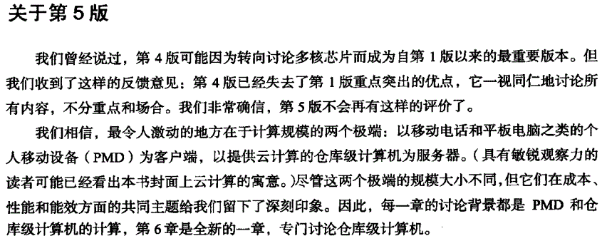

<!-- _class: lead -->

# 数据中心技术

**施展，童薇，胡燏翀，谭支鹏**
武汉光电国家研究中心，计算机学院
2025-11-12 至 2026-01-02

---

## 授课教师

- **施展** 武汉光电国家研究中心，C523，<zshi@hust.edu.cn>
- **童薇** 武汉光电国家研究中心，C522，<tongwei@hust.edu.cn>
- **胡燏翀** 计算机科学与技术学院，B518，<yuchonghu@hust.edu.cn>
- **谭支鹏** 武汉光电国家研究中心，C525，<tanzhipeng@hust.edu.cn>

---

## 基本信息

<!-- paginate: true -->

- 课程资料 <https://shi_zhan.gitlab.io/cs-courses/data-center-pre>  
- 课程平台 <https://smartcourse.hust.edu.cn/mooc-ans/course/17310000017334.html>
- 参考书
  - [John Hennessy](https://hennessy.stanford.edu/), [David Patterson](https://www2.eecs.berkeley.edu/Faculty/Homepages/patterson.html), [**Computer Architecture: A Quantitative Approach**, 6th Edition.](https://www.elsevier.com/books/computer-architecture/hennessy/978-0-12-811905-1), 2017
  - [Luiz André Barroso](https://www.barroso.org/), Urs Hölzle, and Parthasarathy Ranganathan, [**The Datacenter as a Computer: Designing Warehouse-Scale Machines**, Third Edition.](https://www.morganclaypool.com/doi/10.2200/S00874ED3V01Y201809CAC046), 2019, ([开放获取](https://link.springer.com/book/10.1007/978-3-031-01761-2))
  - [**数据中心一体化最佳实践：设计仓储级计算机**（原书第3版）](https://book.douban.com/subject/34950732/), [美] [路易斯·安德烈·巴罗索](https://www.barroso.org/) 著，徐凌杰 译, 2020
  - [计算机系统结构教程（第3版）](http://www.tup.tsinghua.edu.cn/booksCenter/book_09019101.html)， 清华大学出版社，2021

---

## 计算机系统结构拓展

- [**计算机体系结构：量化研究方法**（第6版）](https://item.jd.com/13427803.html), 人民邮电出版社, 2022

---

<!-- 同学们刚刚重温过的计算机系统结构课，其自然延伸，自第五版起纳入数据中心一章，第六版引入的是DSA领域专属结构，即加速器 -->

---

<!-- 从指令集并行、数据级并行、线程级并行到请求级并行 -->

---

<!-- 对于越大规模的系统来说，其内生复杂性的重要性就越高 -->

---

## 仓储级计算机

- [路易斯·安德烈·巴罗索（Luiz André Barroso）](https://www.barroso.org/)，谷歌研究员、ACM会士、AAAS会士，领导着谷歌的工程基础设施工作。
- [Warehouse-scale Computing](https://dl.acm.org/doi/10.1145/1807167.1837133), SIGMOD '10
- [Warehouse-Scale Computing: Entering the Teenage Decade](https://dl.acm.org/doi/10.1145/2000064.2019527), ISCA '11
- [A Brief History of Warehouse-Scale Computing](https://barroso.org/publications/IEEEMicro2021.pdf), 2020 [Eckert-Mauchly Award](https://awards.acm.org/eckert-mauchly)

Before the onset of the current pandemic, some of us may have underappreciated how important computing technology and cloud-based services have become to our society. In this last year, these technologies have allowed many of us to continue to work, to connect with loved ones, and to support each other. I am grateful to all of those at Google and everywhere in our industry who have built such essential technologies, and I am inspired to be working in a field with still so much potential to improve people’s lives.

<!--
计算机体系结构最高奖Eckert-Mauchly奖，上一年奖项还是颁给那位提出强制、容量和冲突缺失，也就是3C缺失的科学家，就是计算机系统结构课本里面的内容，这次的，也要被写进课本里了，就是最新版的计算机系统结构课本

First awarded in 1979, it was named for John Presper Eckert and John William Mauchly, who between 1943 and 1946 collaborated on the design and construction of the first large scale electronic computing machine, known as ENIAC, the Electronic Numerical Integrator and Computer.
-->

---

## 一些关于先驱的故事

Barroso was born in Brazil and had a bachelor’s and master’s degree in electrical engineering from the Pontifical Catholic University of Rio de Janeiro.

In the United States, he did a doctorate in **computer engineering** at the University of Southern California and worked with processors at Compaq and **Digital Equipment Corporation**. In 2001, he joined Google as a **software engineer**.

---

According to an article in Wired, Barroso had never designed a datacenter until he received this request from Google. He came up with the concept of **"datacenter as a computer"**, building data centres with low-cost components, as we know them today.

He comments that **the lack of experience in datacenter design may have been an advantage**, as we questioned almost every aspect of how these facilities were designed. Perhaps the most important thing was having **the opportunity to look at the entire design**, from the cooling towers to the compilers, and this quickly revealed important opportunities for improvement. Barroso’s idea quickly spread throughout Silicon Valley, among the datacenters of other Internet giants.

---

  Barroso shared three lessons he learnt in the first half of his career:

  1. **Consider the winding road**: Although there are always risks when embarking on somethingnew, the upside of being adventurous in your professional career can be incredibly rewarding.

  2. **Develop respect for the obvious**: Big problems and important issues have one characteristic incommon: they tend to be simple to understand but difficult to solve. They are obvious and deserveattention.

  3. **Even success has an expiry date**: Some of the most intellectual moments in Barrosa’s careercame when he was forced to abandon his original position, in which he had invested significanttime and effort and achieved some success.

---

## 授课目标

- **工程实践**方面
  - 跟踪一线应用**思考方向**
    - 华为（黄大年茶思屋）、腾讯（犀牛鸟）、阿里（AIR）、浪潮……
  - 积累工程基础**动手实践**
    - [Kaggle](https://www.kaggle.com/competitions), [Codalab](https://codalab.lisn.upsaclay.fr/)
    - 阿里[天池](https://tianchi.aliyun.com/), 腾讯[DataFountain](https://www.datafountain.cn/), [和鲸](https://www.heywhale.com/home/competition), 百度[飞桨AI Studio](https://aistudio.baidu.com/competition), [讯飞开放平台](https://challenge.xfyun.cn/)……
- **学术探索**方面
  - 相关领域**研讨前沿**技术与进展
    - 数据中心扩展性、性能、服务质量、可靠性……
  - 建立独立研究技能**解决问题**
    - 选题汇报与研讨、应用实践与检验……

---

## 评分构成

- **论文研讨** *30%*
  - 制作胶片汇报一篇相关论文
    - 第一周确认计划安排，40位同学每人选择1篇Paper准备汇报（具体要求见后）
    - 每位同学有**10分钟汇报和2~3分钟问答**
      - 请严格守时（开PPT排练计时，超时扣分）
  - 在课程平台讨论里**模拟Rebuttal**
- **实验作业** *30%*
  - [数据科学挑战赛：内存故障预测](https://tianchi.aliyun.com/competition/entrance/532055)
    - 以完成提交为准，不追求PVP，重在以日常赛促**实践**
    - 日常赛作为入门学习，学有余力可以遍寻各大竞赛平台PVP收获成就
- **开卷考试** 40%
  - TBA
  <!-- - 综合应用题x4(**2024-01-10**晚**18:30-21:00**，**西五楼220**) -->

---

### 说在选读论文之前

- **传统教育模式的颠覆**：自2022年11月ChatGPT发布以来，基于LLM的AI工具在各种考试中表现出色，能够即时生成与学术研究人员撰写的论文相媲美的内容，学生可以轻松完成作业。
- **作弊启示录**：ChatGPT的出现使得传统的评估模式变得过时，因为学生的成绩可能不再反映他们的真实能力。
- **作弊的本质**：当任务被视为外在的、与个人身份无关时，使用工具完成任务并不被视为作弊。
- **前进之路**：为了适应人工智能时代，大学教育需要从以教学为中心转变为以学习为中心，利用人工智能作为实时、自适应的导师、辅导员和助手。
- **个性化辅导**：ChatGPT可以作为个性化辅导工具，帮助学生提高（非母语）写作和其他学术技能。

**人工智能时代的大学教学变革**，[中国教育网络](https://cqvip.com/journal/37548/37548) 2024年8月刊
来源：美国高等教育信息化协会 [EDUCAUSE](https://www.educause.edu/)
作者：丹·萨罗菲安-布廷
编译：李想
责编：项阳

<!-- 所以，今年开始的论文研讨学习，我们不再要求提交综述，实验部分也不再要求复刻代码，前者要聚焦研讨，后者要面向实际问题，聚焦实验设计与数据分析 -->

---

### 个人推荐

玻尔 | 全球科学家的 AI for Science 空间站  https://www.bohrium.com/

SciMaster ｜ Towards General-Purpose Scientific AI Agents https://scimaster.bohrium.com/chat

学术码: 3ixmffnr

---

**要学会站在AI的肩膀上**
而不是靠着TA

---

## 研讨论文列表

扫码在线填表

- 每人选择1篇拟汇报论文
- 选择范围：CCF-A相关论文
  - [FAST](https://www.usenix.org/conference/fast25/technical-sessions), [ATC](https://www.usenix.org/conference/atc25/technical-sessions), [OSDI](https://www.usenix.org/conference/osdi25/technical-sessions), [SOSP](https://sigops.org/s/conferences/sosp/2024/schedule.html), [ISCA](https://www.iscaconf.org/isca2025/program/), [HPCA](https://hpca-conf.org/2025/main-program/) (2024~25)

- [【腾讯文档】数据中心技术课程论文研讨2025](https://docs.qq.com/sheet/DUG1YRWJkTU51endC?tab=BB08J2)

---

### 补充说明

本次课堂在限定上述6个计算机系统结构方向主要会议之后，不再进行麻烦的列表选择，同学们也可以自选在前面课堂中讨论过的，自己已经比较熟悉的论文进行汇报，**学习重点在于研讨过程**

**举例**：[FAST24](https://www.usenix.org/conference/fast24/technical-sessions)

- **Distributed Storage**（这个分论坛就属于课堂主题相关，其中论文优先挑选）
- Session Chair: Raju Rangaswami, Florida International University
  - TeRM: Extending RDMA-Attached Memory with SSD
  - Combining Buffered I/O and Direct I/O in Distributed File Systems
  - OmniCache: Collaborative Caching for Near-storage Accelerators

---

## 课程计划

|   | 讲座主题 | 日期 | 地点 |
|:-:|:--------|:---| :--- |
| 1 | [数据中心技术概述](data-center-intro) | 11-12(**周三5-6**) 11-14(**周五5-6**) | C12-S204 |
| 2 | [对象存储系统与尾延迟问题](object-storage) | 11-19, 11-21 | C12-S204 |
| 3 | 数据中心固态存储技术 (童老师) | 11-26, 11-28 | C12-S204 |
| 4 | 数据中心磁盘故障预测技术 (谭老师) | 12-03, 12-05 | C12-S204 |
| 5 | 数据中心可靠性保障技术 (胡老师) | 12-10, 12-12 | C12-S204 |
| 6 | 论文研讨* | 12-17, 12-19 | C12-S204 |
| 7 | 论文研讨 | 12-24, 12-26 | C12-S204 |
| 8 | 论文研讨 | 12-31, 01-02 | C12-S204 |

\* 每周14名同学

---

[数据中心技术总体介绍](data-center-intro)
