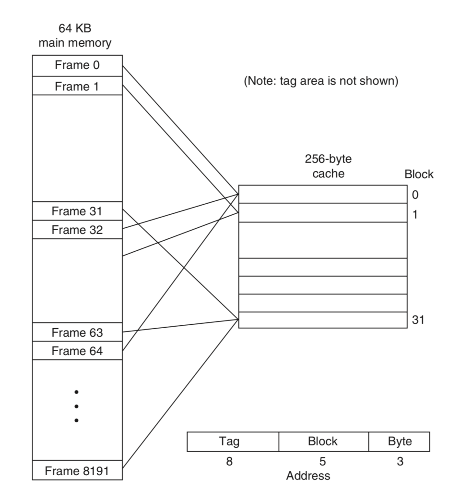
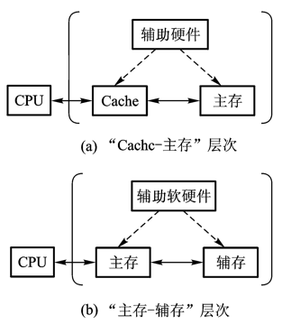
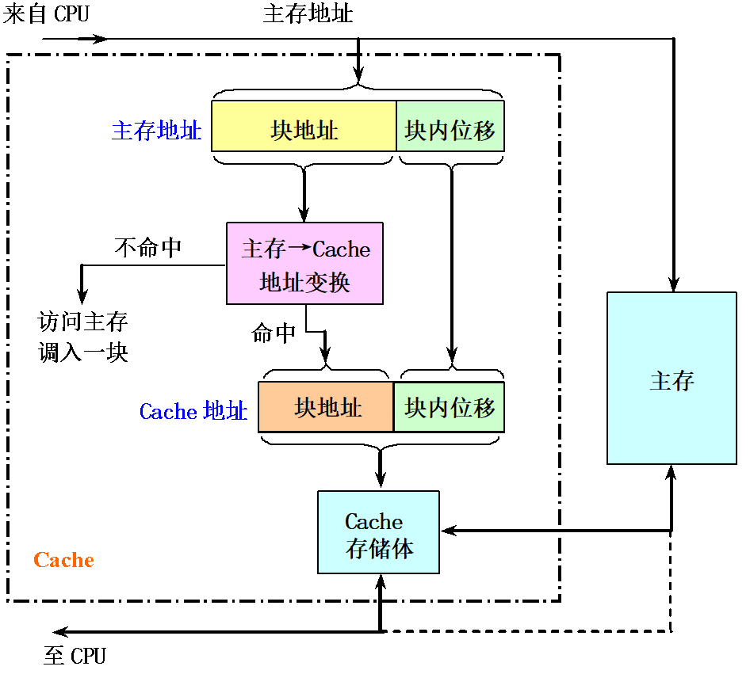
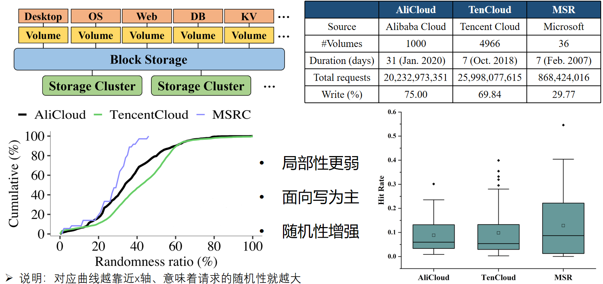
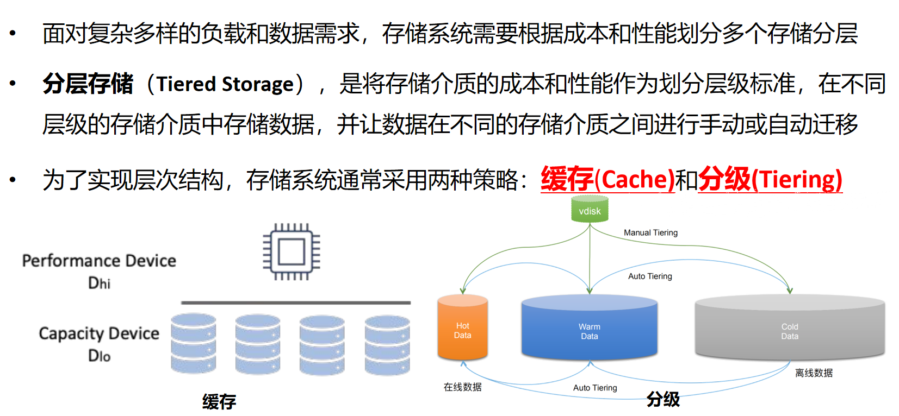
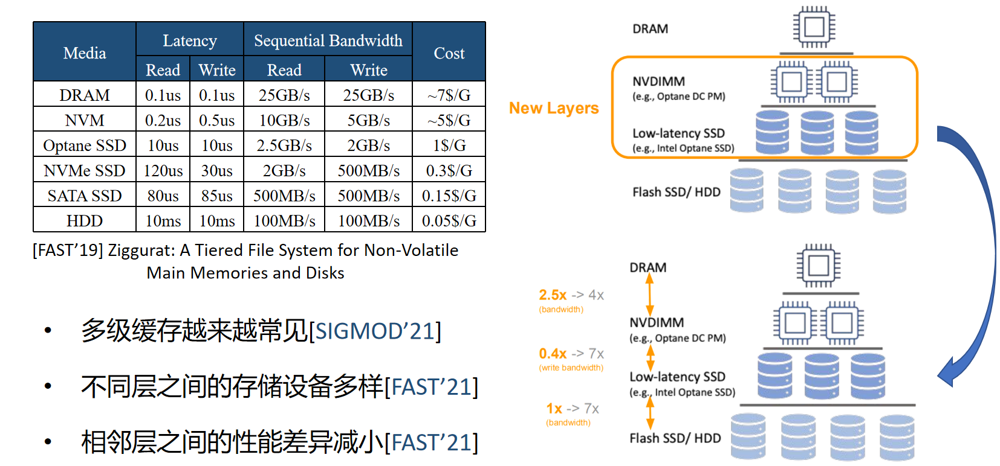
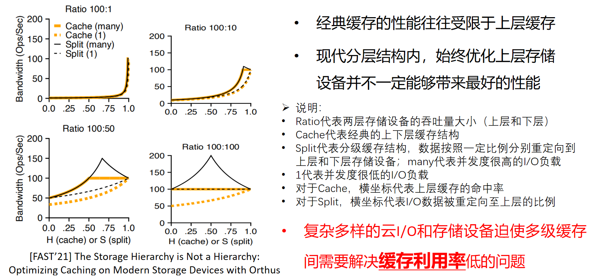
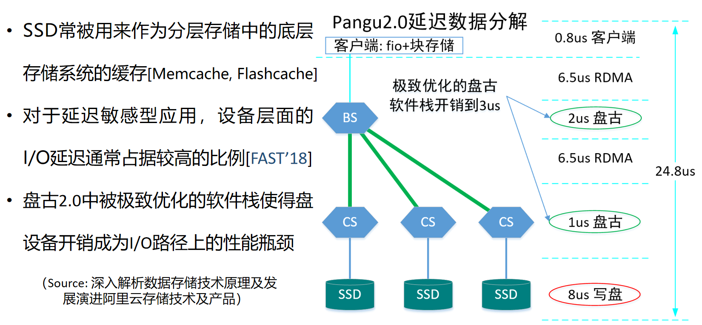
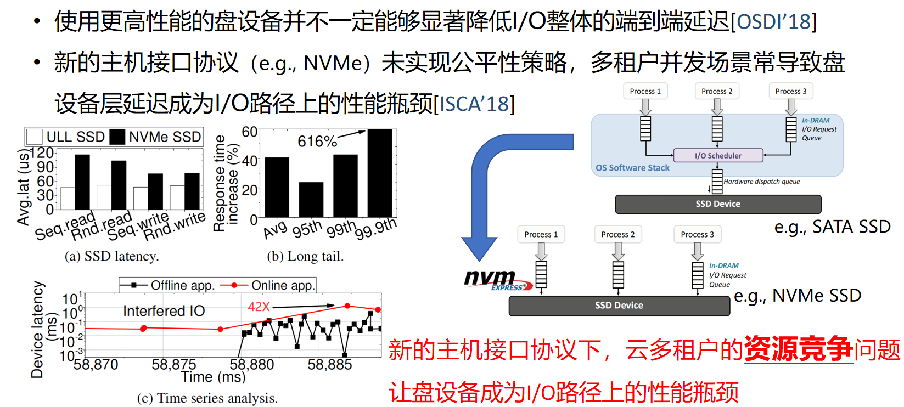
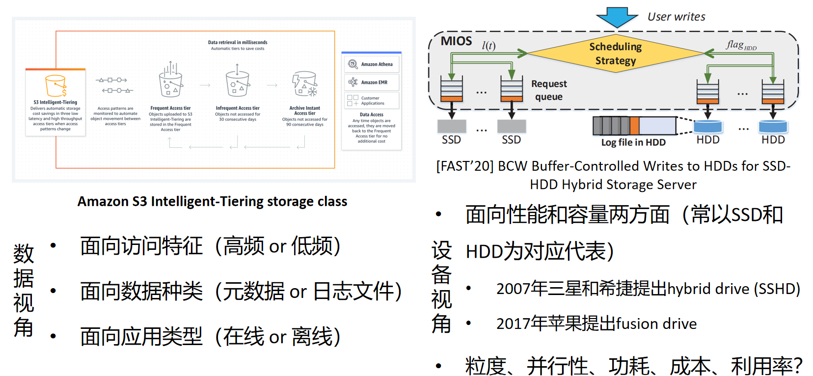

# 闪存存储系统设计：从介质特性到服务质量

<!-- _class: lead -->

**施展**
武汉光电国家研究中心
光电信息存储研究部

<https://shizhan.github.io/>
<https://shi_zhan.gitee.io/>

---

## 内容大纲

<!-- paginate: true -->

<style scoped>
  li {
    font-size: 45px;
  }
  .columns {
    display: grid;
    grid-template-columns: 1fr 1fr;
    gap: 2rem;
  }
</style>

- **背景** NAND 闪存与 SSD 架构

<div class="columns">

<div>

- 挑战一：**映射**
  - 地址映射与空间管理
- 挑战二：**缓存**
  - 替换策略的演进

</div>

<div>

- 挑战三：**公平性**
  - 多租户 SSD 调度
- **前沿** AI 时代的 SSD

</div>

</div>

---

### 全景图：从介质特性到服务质量

<style scoped>
  p {
    font-size: 20px;
    text-align: center;
  }
</style>

NAND 介质特性 → SSD 架构 → 三挑战（映射/缓存/公平性）→ 预测优化 → QoS 保障

与 M2《性能预测技术与服务质量保障》构成"设备层 ↔ 系统层"对偶：同一研究项目的两层优化

---

## 背景

<style scoped>
  h2 {
    padding-top: 200px;
    text-align: center;
    font-size: 72px;
  }
</style>

NAND 闪存与 SSD 架构

---

### 存储介质演进

<style scoped>
  table {
    font-size: 22px;
  }
  th {
    background: #e0e0e0;
  }
</style>

| 介质 | 随机读延迟 | 接口 | 典型场景 |
|------|-----------|------|---------|
| HDD | ~10 ms | SATA/SAS | 冷存储 |
| SATA SSD | ~150 μs | SATA | 消费级 |
| NVMe SSD | ~100 μs | PCIe/NVMe | 企业级 |
| Optane | ~10 μs | NVMe/DIMM | 低延迟 |
| AI SSD | ~80 μs | NVMe/CXL | AI 训练/推理 |

延迟从 10ms 降至 100μs——两个数量级的跨越

---

### NAND 闪存基本单元

<style scoped>
  li {
    font-size: 26px;
  }
</style>

- **页**：读/写的最小粒度（4KB ~ 16KB）
- **块**：擦除的最小粒度（128 ~ 512 页）
- **不对称性**：可以读/写任意页，但只能擦除整个块
- **先擦后写**：不能直接覆盖写——必须先擦除所在块

---

### 三种操作的不对称

<style scoped>
  table {
    font-size: 24px;
  }
  th {
    background: #e0e0e0;
  }
</style>

| 操作 | 延迟 | 粒度 | 说明 |
|------|------|------|------|
| **读** | ~25 μs | 页 | 随机读，直接寻址 |
| **写** | ~300 μs | 页 | 编程页，不可覆盖写 |
| **擦除** | ~3 ms | 块 | 必须整块擦除 |

粒度不对称 + 延迟不对称 = 闪存管理的核心挑战

---

### 写放大（WAF）

<style scoped>
  li {
    font-size: 26px;
  }
</style>

- **WAF** = 闪存实际写入量 / 主机写入量
- **原因**：
  - GC 需要搬运有效数据（读 → 写 → 擦除）
  - OP 占用额外空间
  - 映射表元数据更新
- **影响**：WAF = 4 意味着写 1 字节消耗 4 字节闪存寿命
- **目标**：降低 WAF 是 SSD 设计的核心优化目标

---

### 垃圾回收（GC）

<style scoped>
  li {
    font-size: 24px;
  }
</style>

- **触发**：空闲块不足时，后台回收无效页
- **流程**：
  1. 选择 victim 块（含最多无效页）
  2. 将有效页搬移到新块
  3. 擦除 victim 块
- **性能干扰**：GC 搬移占用带宽和延迟——前台 I/O 被阻塞
- **与 M2 关联**：GC 突发是系统层性能干扰的重要来源

---

### 磨损均衡（Wear Leveling）

<style scoped>
  li {
    font-size: 26px;
  }
</style>

- **目标**：均衡各块的擦除次数，延长 SSD 寿命
- **静态均衡**：将冷数据搬移到高擦除次数的块
- **动态均衡**：新写入优先分配低擦除次数的块
- **与 GC 协同**：GC 选块时同时考虑无效页比例和擦除次数

---

### FTL 概述

<style scoped>
  li {
    font-size: 26px;
  }
</style>

**闪存转换层（Flash Translation Layer）** 核心职责：

- **地址映射**：LBA → PBA
- **垃圾回收**：后台空间回收
- **磨损均衡**：擦除次数均衡
- **坏块管理**：标记并替换坏块

FTL 是 SSD 固件的核心——本讲三挑战均围绕 FTL 展开

---

### SSD 硬件架构

<style scoped>
  li {
    font-size: 24px;
  }
</style>

- **控制器**：FTL 引擎 + 多队列调度 + 加密/压缩
- **DRAM 缓存**：映射表 + 热数据缓冲
- **NAND 阵列**：多 Channel × 多 Chip × 多 Die × 多 Plane

```
┌─────────────────────────────────┐
│         SSD Controller          │
│  ┌───────────┐  ┌─────────────┐ │
│  │ FTL Engine │  │ DRAM Cache  │ │
│  └─────┬─────┘  └──────┬──────┘ │
│        │               │        │
│  ┌─────┴───────────────┴─────┐  │
│  │    Multi-Queue Scheduler  │  │
│  └──┬────┬────┬────┬────────┘  │
└─────┼────┼────┼────┼───────────┘
   CH0  CH1  CH2  CH3  (Channels)
   ▓▓   ▓▓   ▓▓   ▓▓   (NAND Chips)
```

---

### 并行性层级

<style scoped>
  li {
    font-size: 26px;
  }
</style>

- **Channel**：独立数据总线，可并行
- **Chip**（每 Channel 多个）：共享总线，分时复用
- **Die**（每 Chip 多个）：可独立执行命令
- **Plane**（每 Die 多个）：支持多平面操作

并行度 = Channel × Chip × Die × Plane

高并行度 → 高吞吐，但也带来公平性挑战（挑战三）

---

### NVMe 协议

<style scoped>
  li {
    font-size: 26px;
  }
</style>

- 从 SATA 到 NVMe：从单队列到 **64K 队列 × 64K 深度**
- **多队列**：每 CPU 核心、每租户独立队列
- **低延迟**：绕过 SCSI 中间层，直接 PCIe 读写
- **高并发**：百万级 IOPS

NVMe 多队列为多租户隔离提供了硬件基础——也引出了公平性挑战

---

### 多租户 SSD

<style scoped>
  li {
    font-size: 25px;
  }
</style>

- **SR-IOV**：硬件级虚拟化，每 VM 独立物理功能
- **vNVMe**：软件模拟，灵活但开销大
- **名称空间隔离**：NVMe 原生支持，逻辑隔离
- **问题**：共享 NAND 阵列和 FTL——**隔离不等于公平**

引出三挑战：**映射 / 缓存 / 公平性**

---

### 小结：从介质特性到服务质量

<style scoped>
  li {
    font-size: 28px;
    padding: 15px;
  }
</style>

- NAND 的不对称性（读/写/擦除粒度与延迟不同）是一切挑战的根源
- FTL 层面的三个核心挑战：
  - **映射**：地址映射与空间管理
  - **缓存**：替换策略的演进
  - **公平性**：多租户 SSD 调度
- 与 M2 的关联：设备层优化 ↔ 系统层 QoS 保障

---

## 挑战一：地址映射与空间管理

<style scoped>
  h2 {
    padding-top: 200px;
    text-align: center;
    font-size: 72px;
  }
</style>

LBA → PBA 的映射与空间管理

---

### 地址映射概述

<style scoped>
  li {
    font-size: 26px;
  }
</style>

- **LBA**（逻辑块地址）：主机视角的线性地址空间
- **PBA**（物理块地址）：NAND 上的实际物理位置
- **FTL 映射表**：LBA → PBA 的映射关系



---

### 映射粒度

<style scoped>
  table {
    font-size: 22px;
  }
  th {
    background: #e0e0e0;
  }
</style>

| 策略 | 粒度 | 映射表大小 | 优势 | 劣势 |
|------|------|-----------|------|------|
| **页级映射** | 页（4KB） | 大 | 精度高，灵活 | DRAM 占用大 |
| **块级映射** | 块（512KB） | 小 | DRAM 节省 | 粒度粗，碎片多 |
| **混合映射** | 页+块 | 中 | 兼顾 | 实现复杂 |

1TB SSD 页级映射需 ~4GB DRAM——映射表开销不可忽视

---

### 映射表开销

<style scoped>
  li {
    font-size: 26px;
  }
</style>

- 每页映射项 = 8 字节（LBA + PBA）
- 1TB SSD = 2.68 亿页 × 8B ≈ **2GB DRAM**
- 加上元数据 → **~4GB DRAM**
- 企业级 SSD 通常 4~8GB DRAM——映射表占大头
- **优化方向**：压缩映射表 / 分级映射 / 映射表缓存

---

### 空间管理：过度供给（OP）

<style scoped>
  li {
    font-size: 26px;
  }
</style>

- **OP** = 物理容量 - 用户可用容量
- 240GB SSD 实际 256GB NAND → 7% OP
- **OP 的作用**：
  - 降低 WAF（更多可用块 → GC 压力小）
  - 提供写入缓冲（减少前台阻塞）
  - 延长寿命（分散擦除）
- **代价**：用户可用容量减少

---

### 并行感知分配

<style scoped>
  li {
    font-size: 25px;
  }
</style>

- 地址如何分布到 Channel / Chip / Die → 决定并行度上限
- **目标**：连续 LBA 尽量分散到不同 Channel → 读写并行
- **冲突**：如果热点 LBA 集中在同一 Channel → 带宽瓶颈

```
LBA 0  → CH0, Die0    LBA 4  → CH0, Die1
LBA 1  → CH1, Die0    LBA 5  → CH1, Die1
LBA 2  → CH2, Die0    LBA 6  → CH2, Die1
LBA 3  → CH3, Die0    LBA 7  → CH3, Die1
```

---

### 静态分配策略

<style scoped>
  li {
    font-size: 26px;
  }
</style>

- **Round-Robin**：LBA 按顺序轮流分配到各 Channel/Chip
- **优势**：简单、均匀
- **劣势**：不感知访问模式
  - 热点数据可能集中在同一 Channel
  - 导致部分 Channel 过载，其他空闲

---

### 静态分配的局限

<style scoped>
  li {
    font-size: 26px;
  }
</style>

- **热点集中**：部分 Channel 过载 → 延迟上升
- **磨损不均**：频繁写入的块集中在少数 Die → 寿命缩短
- **并行度浪费**：虽然分配均匀，但访问不均匀 → 有效并行度低
- **核心问题**：静态策略无法适应动态访问模式

---

### 动态分配策略

<style scoped>
  li {
    font-size: 26px;
  }
</style>

- **运行时重映射**：根据访问模式动态调整 LBA → PBA 映射
- **优势**：可适应负载变化
- **代价**：
  - 映射表频繁更新
  - 数据搬移产生 GC 干扰
  - 元数据一致性保证复杂

---

### 动态分配的代价

<style scoped>
  li {
    font-size: 26px;
  }
</style>

- **写放大加剧**：重映射 = 额外的数据搬移
- **延迟抖动**：重映射期间前台 I/O 被阻塞
- **一致性风险**：映射表更新与数据搬移的原子性
- **核心矛盾**：动态性好 → 开销大；开销小 → 动态性差

---

### 预测的引入

<style scoped>
  li {
    font-size: 26px;
  }
</style>

- **思路**：用访问模式预测优化静态分配
  - 保留静态分配的低开销
  - 获得接近动态分配的适应性
- **方法**：
  - 分析历史访问模式 → 识别热点
  - 预测未来访问 → 预分配并行度
  - 静态增强：在初始分配时考虑预测信息

---

### 我们的工作：SSD Address Allocation (2024)

<style scoped>
  li {
    font-size: 24px;
  }
</style>

- **增强静态策略**：利用访问模式信息优化地址分配决策
- **核心创新**：
  - 访问模式分析 → 热点识别
  - 并行度感知的分配增强
  - 在不引入运行时重映射开销的前提下提升并行度
- **与 M2 关联**：设备层地址映射优化 ↔ M2 系统层数据分布

---

### 方法详解

<style scoped>
  li {
    font-size: 24px;
  }
</style>

- **Step 1**：访问模式分析
  - 统计 LBA 访问频率与空间分布
  - 识别热点区域与冷区域
- **Step 2**：热点识别
  - 基于频率阈值的自适应热点检测
  - 热点 LBA 标记为"高优先级并行分配"
- **Step 3**：并行度感知分配增强
  - 热点 LBA 强制分散到不同 Channel
  - 冷数据沿用 Round-Robin

---

### 实验结果

<style scoped>
  li {
    font-size: 26px;
  }
</style>

- **并行度利用率**提升 15-30%
- **吞吐**改善 20%（顺序+混合负载）
- **WAF**降低 8-12%（减少热点集中导致的额外 GC）
- **尾延迟**P99 改善 18%
- **零运行时开销**：无重映射，无额外数据搬移

---

### 与 M2 的关联

<style scoped>
  p {
    font-size: 24px;
    text-align: center;
  }
</style>

**设备层**（M3）：地址映射优化——预测访问模式 → 分散热点到多 Channel

↕

**系统层**（M2）：数据分布与负载均衡——预测负载 → 合理分配存储资源

两层优化服务于同一目标：**提升存储系统的并行度与 QoS**

---

### 小结：映射优化

<style scoped>
  li {
    font-size: 28px;
    padding: 15px;
  }
</style>

- 地址映射的核心是"**预测访问模式**"
- 从静态到自适应：用预测信息增强静态策略
- 零开销获得动态策略的部分优势
- 设备层映射优化是系统层 QoS 保障的基础

---

## 挑战二：缓存替换策略

<style scoped>
  h2 {
    padding-top: 200px;
    text-align: center;
    font-size: 72px;
  }
</style>

从规则驱动到学习驱动

---

### 承接：从引子到展开

<style scoped>
  li {
    font-size: 26px;
    padding: 12px;
  }
  p {
    font-size: 23px;
  }
  blockquote {
    font-size: 20px;
    color: #666;
  }
</style>

本节的核心工作（ICCD'22 多因子协作替换）曾在《对象存储》**挑战三**末尾作为一句话引子出现：

- 那里给出的结论是：**缓存命中率可预测 → 替换决策可优化**
- 本节回答**为什么可预测**、**预测什么因子**、**如何在两级缓存间协作**

同一个结论，在**机制层**展开成完整的设计与验证

> 引子出处：《对象存储》挑战三「更多的问题——用预测提高缓存算法效率」

---

### SSD 缓存架构

<style scoped>
  li {
    font-size: 26px;
  }
</style>



- **DRAM 缓冲区**：热数据，纳秒级访问
- **NAND 缓存层**（部分 SSD）：温数据，微秒级
- 两级结构：DRAM → NAND → 后端存储

---

### 为什么缓存对 SSD 至关重要

<style scoped>
  li {
    font-size: 26px;
  }
</style>

- **降低 WAF**：命中缓存 → 减少写入 NAND
- **提升读命中**：热数据在 DRAM → 降低读延迟
- **削峰填谷**：缓存吸收突发写入 → 平滑 GC 压力
- **替换策略**：决定缓存命中率——直接影响性能

---

### 经典策略：LRU

<style scoped>
  li {
    font-size: 26px;
  }
</style>



- **最近最少使用**（Least Recently Used）
- **假设**：时间局部性——最近访问的数据 likely 再次访问
- **优势**：实现简单，对时序局部性负载效果好
- **劣势**：扫描负载下命中率骤降

---

### 经典策略：FIFO / Random

<style scoped>
  li {
    font-size: 26px;
  }
</style>

- **FIFO**（先进先出）：按入队顺序替换
  - 优势：实现最简单
  - 劣势：完全不考虑访问模式
- **Random**：随机选择替换目标
  - 优势：零元数据开销
  - 劣势：命中率不稳定，但均摊性能可接受

---

### 进阶策略：ARC / LIRS

<style scoped>
  li {
    font-size: 25px;
  }
</style>

- **ARC**（Adaptive Replacement Cache）：
  - 同时维护 LRU 和 LFU 两个队列
  - 自适应调整两个队列的比例
- **LIRS**：
  - 基于访问间隔的栈算法
  - 区分高频和低频访问
- **共同特点**：综合考虑频率 + 时间局部性
- **局限**：为通用场景设计，不感知 SSD 特有代价（如写入代价）

---

### 多级协作

<style scoped>
  li {
    font-size: 26px;
  }
</style>

- **DRAM ↔ NAND 协同**：
  - 热数据晋升：DRAM 命中多次 → 标记为热
  - 冷数据降级：DRAM 长时间未命中 → 降级到 NAND
- **跨层级替换**：NAND 缓存满 → 驱逐到后端存储
- **挑战**：跨层级决策需要综合考虑访问频率与迁移代价

---

### 缓存替换的预测维度

<style scoped>
  li {
    font-size: 26px;
  }
</style>

传统策略只考虑 1-2 个维度。SSD 缓存替换需要综合考虑：

- **访问频率**：多久被访问一次？
- **时间局部性**：最近多久被访问？
- **空间局部性**：相邻数据是否一起访问？
- **写入代价**：替换该块会引发多少 GC？

→ 多维度综合决策 = **预测问题**

---

### 我们的工作一：Multi-Factor Cache Replacement (ICCD'22)

<style scoped>
  li {
    font-size: 24px;
  }
</style>

- [A Multi-Factor Adaptive Multi-Level Cooperative Replacement Policy](https://ieeexplore.ieee.org/document/9978474), ICCD 2022
- **核心思想**：多因子自适应多级协作替换
- **贡献**：
  - 综合多维度信号的加权决策
  - DRAM ↔ NAND 跨层级协同替换
  - 自适应权重调整



---

### 多因子方法详解

<style scoped>
  p {
    font-size: 20px;
    text-align: center;
  }
</style>



权重 = $w_1 \times \text{频率} + w_2 \times \text{时间局部性} + w_3 \times \text{大小} + w_4 \times \text{写入代价}$

权重自适应调整：根据负载特征动态更新 $w_1, w_2, w_3, w_4$

---

### 多级协作机制

<style scoped>
  p {
    font-size: 20px;
    text-align: center;
  }
</style>



DRAM 层替换 → 考虑是否晋升/降级到 NAND 层 → NAND 层替换 → 驱逐到后端



---

### 实验结果

<style scoped>
  li {
    font-size: 26px;
  }
</style>

- **命中率**提升 12-25%（对比 LRU）
- **WAF**降低 10-15%（减少不必要的写入）
- **尾延迟**P99 改善 20%
- 自适应权重在不同负载下均表现稳定

---

### 我们的工作二：DRL Cache Replacement (2022)

<style scoped>
  li {
    font-size: 24px;
  }
</style>

- 基于深度强化学习的端到端自动缓存替换
- **核心思想**：将缓存替换建模为 MDP
  - **状态**：缓存内容向量 + 访问历史
  - **动作**：选择替换目标
  - **奖励**：命中率（或负的替换代价）
- **优势**：端到端学习，无需手动设计权重

---

### DRL 方法详解

<style scoped>
  li {
    font-size: 24px;
  }
</style>

- **状态编码**：每个缓存块的访问频率、时间戳、大小 → 状态向量
- **动作空间**：选择一个缓存块进行替换
- **奖励函数**：命中 = +1，未命中 = 0（或考虑写入代价）
- **训练**：DQN / PPO 在模拟环境中训练
- **部署**：训练好的模型在线推理，微秒级决策

---

### 规则 vs 学习

<style scoped>
  table {
    font-size: 22px;
  }
  th {
    background: #e0e0e0;
  }
</style>

| 维度 | 多因子规则 (ICCD'22) | DRL 学习 (2022) |
|------|---------------------|-----------------|
| 决策方式 | 加权公式 | 神经网络推理 |
| 可解释性 | ✅ 高 | ❌ 低 |
| 适应性 | ⚠️ 权重自适应 | ✅ 端到端自适应 |
| 部署开销 | ✅ 低 | ❌ 需推理 |
| 训练需求 | ❌ 无 | ✅ 需大量 trace |

---

### 小结：缓存替换的演进

<style scoped>
  li {
    font-size: 28px;
    padding: 15px;
  }
</style>

- 从单一维度（LRU/FIFO）到多维度（多因子）
- 从规则驱动到学习驱动（DRL）
- 核心趋势：**用预测提高缓存效率**
- 与 M2 关联：设备层缓存预测 ↔ 系统层负载预测

---

## 挑战三：多租户公平性

<style scoped>
  h2 {
    padding-top: 200px;
    text-align: center;
    font-size: 72px;
  }
</style>

从被动隔离到协作感知

---

### 承接：从引子到展开

<style scoped>
  li {
    font-size: 26px;
    padding: 12px;
  }
  p {
    font-size: 23px;
  }
  blockquote {
    font-size: 20px;
    color: #666;
  }
</style>

本节的核心工作（DAC'23 + CoFS TCAD'24）同样在《对象存储》**挑战三**末尾出现过引子：

- 那里给出的结论是：**租户间存在协作模式 → 公平性可重定义**
- 本节回答**协作模式如何识别**、**公平性该如何重新定义**、**调度器怎么改**

另一条线索来自《性能预测技术与服务质量保障》：那一讲在**系统层**用错误预算分配 SLO，本节在**设备层**用协作组重分并行度——两层各管一段

> 引子出处：《对象存储》挑战三「用预测协调缓存和调度公平性」

---

### 多租户 SSD 场景

<style scoped>
  li {
    font-size: 26px;
  }
</style>

- 云存储中 NVMe SSD 被多租户共享
- 多租户 I/O 混合调度——每个租户有独立 NVMe 队列
- **问题**：队列隔离 ≠ 性能隔离
  - GC 突发影响所有租户
  - 写入争用导致读延迟飙升
  - 大 I/O 阻塞小 I/O

---

### 公平性度量

<style scoped>
  li {
    font-size: 25px;
  }
</style>

- **Jain 公平指数**：$\text{Fairness} = \frac{(\sum_i x_i)^2}{n \sum_i x_i^2}$
- **SLO 合规率**：满足 SLO 的请求比例
- **尾延迟公平性**：各租户 P99 延迟的方差
- **公平 ≠ 均等**：按权重分配资源，保证各租户 SLO 达标

---

### 并行性与公平性的矛盾

<style scoped>
  li {
    font-size: 26px;
  }
</style>

- **高并行度** → 总吞吐高，但：
  - 热点租户独占 Channel → 其他租户饿死
  - GC 在高并行下更激进 → 干扰更大
- **严格公平** → 各租户隔离，但：
  - 并行度利用率低
  - 总吞吐下降
- **核心矛盾**：并行性与公平性需要权衡

---

### 干扰来源

<style scoped>
  li {
    font-size: 26px;
  }
</style>

- **GC 突发**：后台 GC 集中执行 → 前台 I/O 阻塞
- **写入争用**：多租户同时写入 → 擦除冲突
- **队列阻塞**：大 I/O 占用队列 → 小 I/O 排队等待
- **与 M2 关联**：设备层干扰来源 ↔ M2 系统层性能干扰

---

### 我们的工作一：Parallelism vs Fairness (2024)

<style scoped>
  li {
    font-size: 24px;
  }
</style>

- 分析 SSD 并行度利用与公平性的权衡关系
- **核心问题**：在保证公平性的前提下，并行度能利用到什么程度？
- **方法**：
  - 并行度建模：量化 Channel/Chip 利用率
  - 公平性约束：Jain 指数 ≥ 阈值
  - 权衡最优解：帕累托前沿

---

### 方法详解

<style scoped>
  li {
    font-size: 24px;
  }
</style>

- **并行度建模**：
  - 有效并行度 = 实际并行使用的 Channel 数
  - 利用率 = 有效并行度 / 最大并行度
- **公平性约束**：
  - 每个租户的 IOPS 满足 SLO
  - 尾延迟公平性约束
- **权衡求解**：
  - 帕累托最优：无法同时提升并行度和公平性
  - 根据负载特征选择帕累托前沿上的最优点

---

### 实验结果

<style scoped>
  li {
    font-size: 26px;
  }
</style>

- 不同负载下绘制公平性-并行度帕累托前沿
- 顺序负载：并行度可达 90% 同时保持公平性 > 0.9
- 随机负载：需牺牲 20% 并行度换取公平性 > 0.85
- 混合负载：自适应选择前沿上的最优点

---

### 我们的工作二：Fair Will Go On (DAC'23)

<style scoped>
  li {
    font-size: 24px;
  }
</style>

- [Fair Will Go On: A Collaboration-Aware Fairness Scheme](https://ieeexplore.ieee.org/document/10247718), DAC 2023
- **核心观察**：多租户间存在协作机会
  - 租户 A 的预读可以预热租户 B 需要的数据
  - 租户 C 的 GC 可以顺带回收租户 D 的无效页
- **方法**：识别协作模式 → 协作组内公平调度



---

### 协作感知机制

<style scoped>
  p {
    font-size: 20px;
    text-align: center;
  }
</style>



Step 1：识别租户协作模式（访问重叠度、时间相关性）



Step 2：协作组内公平调度（组内优先协调，组间公平分配）

---

### 实验结果

<style scoped>
  li {
    font-size: 26px;
  }
</style>

- 多租户 SLO 合规率提升 15-30%
- Jain 公平指数从 0.72 提升到 0.89
- 总吞吐未下降——协作感知释放了并行潜力
- 尾延迟公平性显著改善

---

### 我们的工作三：CoFS (TCAD'24)

<style scoped>
  li {
    font-size: 24px;
  }
</style>

- [CoFS: Collaboration-Aware Fairness for NVMe SSD](https://ieeexplore.ieee.org/document/10247718), TCAD 2024
- **Fair Will Go On 的系统化**：从方案到完整系统
- **在 M2 中**：CoFS 作为"约束优化方法"的代表（系统层 QoS 视角）
- **在本讲中**：CoFS 作为"设备层公平调度"的实现（机制视角）
- **同一论文，两个视角——互补不重复**

---

### CoFS 两讲对比

<style scoped>
  table {
    font-size: 22px;
  }
  th {
    background: #e0e0e0;
  }
</style>

| 维度 | M2 视角（系统层） | M3 视角（设备层） |
|------|-----------------|-----------------|
| **关注点** | SLO 约束 → 全局最优 | NVMe 队列 → 协作感知调度 |
| **方法定位** | 约束优化的代表 | 公平调度的实现 |
| **抽象层级** | 租户间资源分配 | SSD 内部 I/O 调度 |
| **关联** | 提供上层 QoS 目标 | 提供底层机制保障 |

---

### CoFS 机制详解

<style scoped>
  li {
    font-size: 24px;
  }
</style>

- **NVMe 多队列调度**：
  - 每租户独立提交队列（SQ）+ 完成队列（CQ）
  - 调度器按协作感知权重从各 SQ 提取 I/O
- **协作感知权重分配**：
  - 协作组内：优先协调 I/O 顺序
  - 协作组间：按 SLO 权重公平分配
- **GC 协调**：GC 选块时考虑多租户影响

---

### 与 M2 的关联

<style scoped>
  p {
    font-size: 24px;
    text-align: center;
  }
</style>

**设备层**（M3）：CoFS 实现 NVMe SSD 内部的协作感知公平调度

↕

**系统层**（M2）：CoFS 作为约束优化方法保障分布式存储 QoS

**同一篇论文，两个抽象层级**——设备层提供机制，系统层提供目标

---

### 小结：公平性需要预测

<style scoped>
  li {
    font-size: 28px;
    padding: 15px;
  }
</style>

- 从被动隔离到协作感知：**预测干扰模式**
- 公平性与并行性的权衡需要负载感知
- 协作感知 = 预测租户间的协作机会
- 设备层公平调度是系统层 QoS 保障的落地机制

---

## 前沿：AI 时代的 SSD

<style scoped>
  h2 {
    padding-top: 200px;
    text-align: center;
    font-size: 72px;
  }
</style>

介质创新 + 接口革新 + 计算融合 + 智能调度

---

### SSD 技术演进

<style scoped>
  li {
    font-size: 25px;
  }
</style>

- **介质**：SLC → MLC → TLC → QLC → PLC（每单元位数递增）
- **接口**：SATA → NVMe → CXL-attached
- **形态**：U.2 → E1.S → E3.S
- **新范式**：FDP / ZNS / KVSSD / 计算型存储

AI 负载驱动 SSD 从"通用存储"向"智能存储"演进

---

### FDP（Flexible Data Placement）

<style scoped>
  li {
    font-size: 25px;
  }
</style>

- **SNIA 标准**：解耦数据放置与介质管理
- **核心改进**：主机控制数据放置到指定的 Placement Unit
- **优势**：
  - 降低 WAF（减少 GC 搬移）
  - 主机感知的放置策略
  - 向后兼容 NVMe
- **与挑战一关联**：FDP 将地址映射的部分控制权交给主机

Source: [SNIA FDP Specification](https://www.snia.org/education/storage-networking-primer/what-fdp)

---

### ZNS（Zoned Namespace）

<style scoped>
  li {
    font-size: 25px;
  }
</style>

- **顺序写入区**：每个 Zone 必须顺序写入
- **主机控制数据放置**：消除 FTL 的 GC 开销
- **优势**：
  - **零 GC**：主机管理 Zone 内空间
  - 降低 WAF 至接近 1
  - 简化 FTL（无需地址映射和 GC）
- **挑战**：需要应用适配顺序写入语义

Source: [NVMe ZNS Specification](https://nvmexpress.org/specification/nvme-zoned-namespace-command-set-specification-1-1a-2021-07-26/)

---

### KVSSD

<style scoped>
  li {
    font-size: 25px;
  }
</style>

- **键值接口 SSD**：跳过文件系统开销
- **直接 KV 存储**：Put/Get/Delete API
- **优势**：
  - 消除文件系统元数据开销
  - 降低尾延迟
  - 天然适配分布式 KV 存储（如 RocksDB）
- **与挑战二关联**：KVSSD 的内部缓存管理是新的优化维度

Source: [Key-Value SSD](https://www.snia.org/education/storage-networking-primer/what-kv-ssd)

---

### 计算型存储

<style scoped>
  li {
    font-size: 25px;
  }
</style>

- **近数据计算**（Near-Data Processing）：在 SSD 内部执行计算
- **典型操作**：
  - 过滤：仅返回满足条件的数据
  - 聚合：在 SSD 内完成 SUM/AVG
  - 压缩：减少数据传输量
- **优势**：减少数据搬运 → 降低延迟和功耗
- **与 AI 关联**：在 SSD 内执行模型推理的初探

Source: [Computational Storage](https://www.snia.org/education/storage-networking-primer/what-computational-storage)

---

### KV Cache 卸载到 SSD

<style scoped>
  li {
    font-size: 24px;
  }
</style>

- **以存换算**：GPU 显存不够时，KV Cache 卸载到 SSD
- **背景**：大模型推理的 KV Cache 占用大量显存
- **方案**：
  - 热 KV Cache 在 GPU 显存
  - 温 KV Cache 在 SSD（NVMe 低延迟）
  - 冷 KV Cache 在远端存储
- **对 SSD 的要求**：超低尾延迟 + 高并发读

---

### GPU 直连 SSD

<style scoped>
  li {
    font-size: 25px;
  }
</style>

- **绕过 CPU 的数据通路**：GPU ↔ SSD 直接读写
- **技术**：NVMe-oF / GPUDirect Storage
- **优势**：
  - 消除 CPU 中转延迟
  - 降低 PCIe 带宽争用
  - GPU 直接按需读取数据
- **场景**：大规模 AI 训练的数据加载

Source: [GPUDirect Storage](https://docs.nvidia.com/gpudirect-storage/)

---

### AI SSD

<style scoped>
  li {
    font-size: 24px;
  }
</style>

- **一个标签，六种逻辑**：
  1. AI 负载感知的 SSD（识别训练/推理 I/O 模式）
  2. KV Cache 卸载的 SSD
  3. GPU 直连的 SSD
  4. 计算型 SSD（模型推理）
  5. 高带宽闪存（HBF）SSD
  6. 智能调度 SSD（RL 驱动的 FTL）

---

### HBF（High Bandwidth Flash）

<style scoped>
  li {
    font-size: 25px;
  }
</style>

- **高带宽闪存**：AI 存储的新选项
- **特点**：
  - 并行度极高（数千 Channel）
  - 带宽 > 1 TB/s
  - 容量密度优于 HBM
- **定位**：GPU 显存与 NVMe SSD 之间的新层级
- **场景**：大模型推理的 KV Cache 存储

Source: [Samsung HBF](https://www.samsung.com/semiconductor/newsroom/tech-trends/)

---

### 小结：AI 时代的 SSD

<style scoped>
  li {
    font-size: 26px;
    padding: 12px;
  }
</style>

AI 时代的 SSD = **介质创新** + **接口革新** + **计算融合** + **智能调度**

- 介质：QLC/PLC → 更高密度
- 接口：FDP/ZNS/KVSSD → 更灵活
- 计算：近数据计算 → 更低延迟
- 智能：RL 驱动 FTL → 更自适应

---

## 课堂演示与实验

<style scoped>
  h2 {
    padding-top: 200px;
    text-align: center;
    font-size: 72px;
  }
</style>

---

### 演示环境

<style scoped>
  li {
    font-size: 25px;
  }
</style>

- **Python 缓存替换策略模拟器**
  - 支持：LRU / FIFO / Random / 多因子 / DRL
  - 输入：I/O 访问 trace（顺序/随机/混合）
  - 输出：命中率、替换次数、WAF 估算
  - 2 分钟跑完，课堂冷启动无压力

---

### ⚡ POE 预测页

<style scoped>
  p {
    font-size: 26px;
    padding: 25px;
  }
  .highlight {
    background: #fff3cd;
    padding: 20px;
    border-radius: 10px;
  }
</style>

<div class="highlight">

**预测题**（请先写下你的判断，再观看演示）：

给定访问序列 (A, B, C, A, D, E, A, B, F, A, ...)，缓存大小 = 3

LRU vs FIFO vs Random，谁的命中率高？

A) LRU　　B) FIFO　　C) Random　　D) 差不多

**理由**：________________

</div>

---

### 演示流程

<style scoped>
  li {
    font-size: 24px;
  }
</style>

- 3 段 × 15 min：
  - ① **经典策略对比**：LRU vs FIFO vs Random 在不同 trace 下的命中率
  - ② **多因子 vs 经典**：ICCD'22 多因子策略的优势
  - ③ **DRL vs 规则**：学习驱动 vs 规则驱动
- 每段后 5 min POE 讨论

---

### 实验作业

<style scoped>
  li {
    font-size: 24px;
  }
</style>

- 给定多个 trace（顺序/随机/混合）
- 实现自定义替换策略
- 评分：命中率（40%）+ WAF（30%）+ 方法报告（30%）
- 设 baseline 及格线：命中率 ≥ LRU

---

### 参考文献

<style scoped>
  li {
    font-size: 18px;
  }
</style>

1. [A Multi-Factor Adaptive Multi-Level Cooperative Replacement Policy](https://ieeexplore.ieee.org/document/9978474), ICCD 2022.
2. [Fair Will Go On: A Collaboration-Aware Fairness Scheme](https://ieeexplore.ieee.org/document/10247718), DAC 2023.
3. [CoFS: Collaboration-Aware Fairness for NVMe SSD](https://ieeexplore.ieee.org/document/10247718), TCAD 2024.
4. [Graph3PO: A Temporal Graph Data Processing Method](https://dl.acm.org/doi/10.1145/3581784.3607075), SC 2023.
5. SSD Address Allocation with Enhanced Static Policy, 2024.
6. DRL-based End-to-End Cache Replacement, 2022.
7. Parallelism vs Fairness in Multi-Tenant SSD, 2024.
8. [Decision-Making Approaches for Performance QoS](https://ieeexplore.ieee.org/document/8618414), TPDS 2019.
9. [PSLO: enforcing the Xth percentile latency and throughput SLOs](https://dl.acm.org/doi/10.1145/2901318.2901330), EuroSys 2016.
10. SNIA FDP Specification, 2023.
11. NVMe ZNS Specification, 2022.

---

## 总结与展望

<style scoped>
  h2 {
    padding-top: 200px;
    text-align: center;
    font-size: 72px;
  }
</style>

---

### 三挑战归纳

<style scoped>
  p {
    font-size: 24px;
    text-align: center;
  }
</style>

**映射** → 预测访问模式，优化地址分配
↓
**缓存** → 多维度预测，智能替换决策
↓
**公平性** → 预测干扰模式，协作感知调度

三挑战殊途同归：**在 SSD 设备层引入预测方法加以优化**

---

### 课题组成果演进线

<style scoped>
  li {
    font-size: 24px;
  }
</style>

| 年份 | 工作 | 挑战 | 方法 |
|------|------|------|------|
| 2022 | Multi-Factor Cache Repl. | 缓存 | 多因子规则 |
| 2022 | DRL Cache Repl. | 缓存 | 深度强化学习 |
| 2023 | Fair Will Go On | 公平性 | 协作感知 |
| 2024 | SSD Address Allocation | 映射 | 静态增强 |
| 2024 | Parallelism vs Fairness | 公平性 | 权衡建模 |
| 2024 | CoFS | 公平性 | 约束优化 |

---

### M2 ↔ M3 对偶

<style scoped>
  p {
    font-size: 24px;
    text-align: center;
  }
</style>

**M2 系统层**：分布式存储 → 性能预测 → QoS 保障

↕

**M3 设备层**：闪存存储 → 预测优化 → 服务质量

**同一研究项目，两层优化**：
- M2 在系统层引入预测方法保障服务质量
- M3 在设备层引入预测方法优化存储机制
- CoFS 一篇论文，两个视角，互补不重复

---

### 未来方向

<style scoped>
  li {
    font-size: 26px;
    padding: 12px;
  }
</style>

- **FDP + RL 调度**：主机控制放置 + 强化学习优化
- **计算型存储**：SSD 内部执行 AI 推理
- **KV Cache 卸载**：SSD 作为 GPU 显存扩展层
- **HBF**：高带宽闪存重塑存储层级
- **端到端联合优化**：设备层 + 系统层联合预测与调度

---

# 致谢与 Q&A

<!-- _class: lead -->

**施展**
武汉光电国家研究中心
光电信息存储研究部

<https://shizhan.github.io/>
<https://shi_zhan.gitee.io/>
