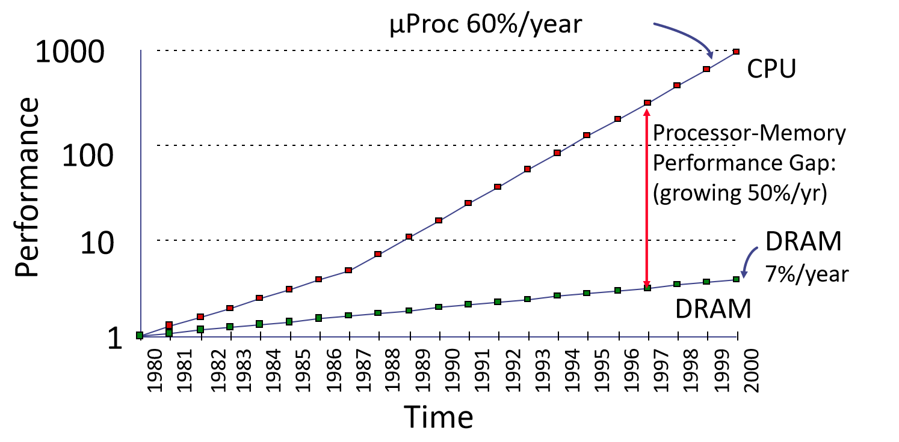

<!-- _class: lead -->

# 存储系统

**施展**
武汉光电国家研究中心
光电信息存储研究部

<https://shizhan.github.io/>
<https://shi_zhan.gitee.io/>

---

## 内容大纲

<!-- paginate: true -->

- 存储系统基础
- 存储系统量化分析
- 缓存基础
- 缓存优化方法
- 虚拟存储器

---

## 存储系统基础

### 何谓存储？

- 信息的传递
  - 跨越**空间**，是为**通讯**
    - 通讯介质，是为**网络**
    - 物理状态：声、光、电、量子……
  - 跨越**时间**，是为**记忆**
    - 记忆介质，是为**存储**
    - 物理状态：形、影、磁、相……

<!-- 存储的本质是跨越时间传递信息，从这个角度上来说和网络只是职责不同，其实都依赖于形形色色的物理原理，于是也在漫长的发展过程中形成了林林总总的技术形态 -->

---

### 处理器和内存的性能差越来越大

Four-issue 3GHz superscalar accessing 100ns DRAM could execute 1,200 instructions during time for one memory access!

<!-- 可是最近这半个世纪的发展，有一个问题越来越突出 -->

---

<https://seekingalpha.com/article/4179561-waiting-for-world-to-change-memory-industry-confronts-long-traverse-to-memory-centric>

<!-- 即便处理器上的摩尔定律受阻，不得不走向多核，这个问题依然没有缓解 -->

---

### 处理器物理尺寸影响延迟时间

---

### 访问数据的代价

|操作|用时||||
|:-|-:|-:|-:|:-|
| L1 cache reference                 |          0.5 ns |            |        |                             |
| Branch mispredict                  |          5   ns |            |        |                             |
| L2 cache reference                 |          7   ns |            |        | 14x L1 cache                |
| Mutex lock/unlock                  |         25   ns |            |        |                             |
| Main memory reference              |        100   ns |            |        | 20x L2 cache, 200x L1 cache |
| Compress 1K bytes with Zippy       |      3,000   ns |       3 us |        |                             |
| Send 1K bytes over 1 Gbps network  |     10,000   ns |      10 us |        |                             |
| Read 4K randomly from SSD*         |    150,000   ns |     150 us |        | ~1GB/sec SSD                |
| Read 1 MB sequentially from memory |    250,000   ns |     250 us |        |                             |
| Round trip within same datacenter  |    500,000   ns |     500 us |        |                             |
| Read 1 MB sequentially from SSD*   |  1,000,000   ns |   1,000 us |   1 ms | ~1GB/sec SSD, 4X memory     |
| Disk seek                          | 10,000,000   ns |  10,000 us |  10 ms | 20x datacenter roundtrip    |
| Read 1 MB sequentially from disk   | 20,000,000   ns |  20,000 us |  20 ms | 80x memory, 20X SSD         |
| Send packet CA->Netherlands->CA    |150,000,000   ns | 150,000 us | 150 ms |                             |

Notes

$1 ns = 10^{-9} seconds$
$1 us = 10^{-6} seconds = 1,000 ns$
$1 ms = 10^{-3} seconds = 1,000 us = 1,000,000 ns$

Credit

By Jeff Dean: <http://research.google.com/people/jeff/>
Originally by Peter Norvig: <http://norvig.com/21-days.html#answers>

---

Source: <https://colin-scott.github.io/personal_website/research/interactive_latency.html>

---

## 存储系统的基础知识

<!-- _class: lead -->

---

### 存储系统层次结构

- 1. 计算机系统结构设计关键问题之一
  - **如何以合理的价格，设计容量和速度都满足计算机系统要求的存储器系统？**
- 2. 人们对三个指标的要求
  - 容量**大**、速度**快**、成本**低**
- 3. 三个要求之间的矛盾
  - 速度越快，每位价格越高；
  - 容量越大，每位价格越低；
  - 容量越大，速度越慢。

---

### 矛盾如何应对？

- 4. 解决方法：**采用多种存储器技术，构成多级存储层次结构**。
  - 程序访问的**局部性原理**：对于绝大多数程序来说，程序所访问的指令和数据在地址上不是均匀分布的，而是相对**簇聚**的。
  - 程序访问的局部性包含两个方面
    - **时间局部性**：程序马上将要用到的信息很可能就是现在正在使用的信息。
    - **空间局部性**：程序马上将要用到的信息很可能与现在正在使用的信息在存储空间上是相邻的。

---

### 典型内存存取模式

---

---

### 多级层次结构

- 5. 存储系统的多级层次结构

---

<https://zhuanlan.zhihu.com/p/146094598>

---

- 假设第$i$个存储器Mi的访问时间为$T_i$，容量为$S_i$，平均每位价格为$C_i$
  - 访问时间: $T_1 < T_2 < \dots < T_n$
  - 容量: $S_1 < S_2 < \dots < S_n$
  - 平均每位价格: $C_1 > C_2 > \dots > C_n$
- 整个存储系统要达到的目标
  - 从CPU来看，速度接近于$M_1$，而容量和每位价格都接近于$M_n$。
  - 存储器越靠近CPU，则CPU对它的访问频度越高，而且最好大多数的访问都能在$M_1$完成。

---

### 存储层次的性能参数

- 这里仅考虑由M1和M2构成的两级存储层次
  - $M_1$的参数: $S_1, T_1, C_1$
  - $M_2$的参数: $S_2, T_2, C_2$

---

- 1. 存储容量 **S**
  - 一般来说，整个存储系统的容量即是第二级存储器$M_2$的容量，即$S=S_2$。
- 2. 每位价格 **C**

$$
C=\frac{C_1 S_1 + C_2 S_2}{S_1 + S_2}
$$

当$S1 \ll S2$时，$C \approx C_2$。

---

- 3. 命中率 **H** 和不命中率 **F**

命中率：CPU访问存储系统时，在$M_1$中找到所需信息的概率。

$$
H = \frac{N_1}{N_1 + N_2}
$$

- $N_1$: 访问 $M_1$ 的次数
- $N_2$: 访问 $M_2$ 的次数

不命中率: $F=1-H$

---

- 4. 平均访问时间 $T_A$

$$
\begin{align*}
T_A &= HT_1 + (1 - H)(T_1 + T_M)
\\
&= T_1 + (1 - H)T_M
\\
或 \quad T_A &= T_1 + FT_M
\end{align*}
$$

---

- 分两种情况来考虑CPU的一次访存:
  - 若命中，则访问时间即为 $T_1$ (**命中时间**)
  - 若不命中，则访问时间为:

$$
\begin{align*}
T_2 + T_B + T_1 &= T_M + T_1  
\\
T_M &= T_2 + T_B
\end{align*}
$$

- **不命中开销** $T_M$: 从向 $M_2$ 发出访问请求到把整个数据块调入 $M_1$ 中所需的时间。
- 传送一个信息块所需的时间为 $T_B$。

---

### 三级存储系统

- 构成
  - Cache（高速缓冲存储器）
  - 主存储器
  - 磁盘存储器（辅存）
- 可以看成是由"**Cache—主存**"层次和"**主存—辅存**"层次构成的系统。

---

- 从主存的角度来看
  - 弥补主存速度的不足
    - **Cache－主存**层次
  - 弥补主存容量的不足
    - **主存－辅存**层次

---

"**Cache－主存**"与"**主存－辅存**"层次的区别

||Cache－主存|主存－辅存|
|:-|:-|:-|
|目的|弥补主存速度的不足|弥补主存容量的不足|
|存储管理实现|主要由专用硬件实现|主要由软件实现|
|访问速度的比值|几比一|几万比一|
|典型的块(页)大小|几十个字节|几百到几千个字节|
|CPU对次级的访问方式|可直接访问|均通过第一级|
|不命中时CPU是否切换|不切换|切换到其他进程|

---

### 存储层次的四个问题

- 当把一个块调入高一层(靠近CPU)存储器时，可以放在哪些位置上?
  - **映象规则**
- 当所要访问的块在高一层存储器中时，如何找到该块?
  - **查找算法**
- 当发生不命中时，应替换哪一块？
  - **替换算法**
- 当进行写访问时，应进行哪些操作?
  - **写策略**

---

## Cache基本知识

<!-- _class: lead -->

---

### 基本结构和原理

- 存储空间分割与地址计算
- Cache和主存分块
  - Cache是按块进行管理的。Cache和主存均被分割成大小相同的块。信息以块为单位调入Cache。
    - **主存块地址 (块号)** 用于查找该块在Cache中的位置。
    - **块内位移**用于确定所访问的数据在该块中的位置。

---

- Cache的基本工作原理示意图

---

### 映像规则

- 全相联
  - 主存中的任一块可以被放置到Cache中的**任意一个位置**
- 直接相联
  - 主存中的每一块只能被放置到Cache中**唯一的一个位置**
- 组相联
  - 主存中的每一块可以被放置到Cache中**唯一的一个组**中的任何一个位置

---

- Word Size $1B$
- Cache Size $C = 256B$
- Number of Blocks in Cache $B = 32$
- Bits to reference a block $b = log_{2}B = 5$
- Size of one Block/Frame = $\frac{256B}{32} = 8B$
- Words per Block/Frame $W = \frac{8B}{1B} = 8$
- Bits to reference Word within a block
  - $w = log_{2}W = 3$
- Primary Memory $P = 64KB$
- Bits to reference Primary Memory
  - $p = log_{2}(\frac{P}{w}) = 16$
- Number of Frames in Primary Memory
  - $F = 64KB/8B = 8192$
- Tag length $p - w - b = 8$.

<http://thebeardsage.com/cache-organization-and-address-mapping/>

---

- Word Size $1B$
- Bits to reference Word within a block $w = 3$
- Words per Block/Frame $W = 2^3 = 8$
- Size of one Block/Frame = $8 \times 1B = 8B$
- Number of slots in a set $N = 4$
- Size of one set = $4 * 8B = 32B$
- Number of Sets in Cache = 32
- Bits to reference a set
  - $b - n = log_{2}32 = 5$
- Cache Size $C = 32 \times 32B = 1KB$
- Primary Memory P = 64KB
- Bits to reference Primary Memory
  - $p = log_{2}(\frac{P}{W}) = 16$
- Number of Frames in Primary Memory
  - $F = 64KB/8B = 8192$
- Tag length $p - w - (b - n) = 8$.

---

- n路组相联

|| n (路数) | G (组数) |
|:-|:-|:-|
|全相联|M|1|
|直接映象|1|M|
|组相联|$1<n<M$|$1<G<M$|

---

### 映像规则…

- 全相联
  - 无冲突，很麻烦
- 直接相联
  - 最简单，高冲突
- 组相联
  - 全相联、直接相联的折衷

---

## 小结

- 存储的本质：跨越时间传递信息
  - 从历史逐步过渡到冯诺依曼机，存储程序式计算机
  - 存储性能指标：容量、速度、成本
- 主要存储器类型
  - 与现实世界对应的存储器速度差
  - 当前一众存储器的种种极限(最久、最大、最快、最便宜)
- 存储分层体系
  - 自然规律，偏斜性，局部性
  - 提出两个位置的主要工作，缓存与虚存，速度与容量

---

## 习题

- 7.9
- 7.10
- 7.11
- 7.14
