# 对象存储系统专题

<!-- _class: lead -->

**施展**
武汉光电国家研究中心
光电信息存储研究部

<https://shizhan.github.io/>

---

## 内容大纲

<style scoped>
  li {
    font-size: 45px;
  }
  .columns {
    display: grid;
    grid-template-columns: 1fr 1fr;
    gap: 2rem;
  }
</style>

- **背景** 对象存储系统的诞生、发展和现状

<div class="columns">

<div>

- 挑战一：**扩展**
  - 规模化的诉求
- 挑战二：**长尾**
  - 规模化的代价

</div>

<div>

- 挑战三：**预测**
  - 怎样管控代价
- **负载特征分析**
  - 知己也要知彼

</div>

</div>

<!-- 
做研究首要任务是提出问题，问题不是空穴来风，要基于自己对于现实世界的观察和思考，并非空想或纸上谈兵，下面我们结合实验室20年来一条主线方向来谈谈我们经历过的几个关键的问题和主要的工作。
 -->

---

## 对象存储背景

<!-- paginate: true -->

<style scoped>
  h2 {
    padding-top: 200px;
    text-align: center;
    font-size: 72px;
  }
  p {
    text-align: right;
  }
</style>

对象存储系统的诞生、发展和现状

---

### 总量日益增长

<style scoped>
  p {
    font-size: 20px;
    text-align: right;
  }
</style>


Source: <https://www.datanami.com/2018/11/27/global-datasphere-to-hit-175-zettabytes-by-2025-idc-says/>

---


---

### 类型日益丰富

<style scoped>
  p {
    font-size: 20px;
    text-align: center;
  }
</style>


Source: <https://www.smartinsights.com/internet-marketing-statistics/happens-online-60-seconds/>

---

### AI加速驱动

<style scoped>
  p {
    font-size: 30px;
    color: white;
    background-color: rgba(0, 64, 255, 0.5);
  }
</style>


因为AI的原因，存储市场迎来了新一轮的繁荣期。有预测数据显示，全球AI驱动存储市场在2024年的规模大约是287.1亿美元。预计2025年将增长到359.5亿美元，并在2034年达到大约2552.4亿美元，年均复合增长率大约是24.42%。

---

## 挑战一：扩展

<style scoped>
  h2 {
    padding-top: 200px;
    text-align: center;
    font-size: 60px;
  }
  p {
    text-align: right;
  }
</style>

规模化的诉求

---

### 存储的两种形式

<style scoped>
  table {
    width: 100%;
    table-layout: fixed;
  }
  th, td {
    width: 50%;
    word-wrap: break-word;
  }
  tr {
    font-size: 25px;
  }
</style>

| 文件存储 (File Storage) | 块存储 (Block Storage) |
|------------------------|----------------------|
| **组织结构**：层次化：目录和文件名，形成树状文件系统 | **组织结构**：扁平化：数据以固定大小的块存放，直接通过块地址访问 |
| **访问方式**：通过文件路径和文件名进行访问，使用标准文件操作（打开、读取、写入、关闭） | **访问方式**：通过块编号直接访问，使用底层块设备操作（读块、写块） |
| **管理层级**：由文件系统管理层处理，提供命名、权限控制和目录管理功能 | **管理层级**：在更接近硬件的层级操作，通常由设备驱动程序管理 |
| **抽象级别**：提供高级抽象，用户通过文件名与数据交互，隐藏底层存储细节 | **抽象级别**：提供原始存储访问，不包含文件系统语义，呈现为原始磁盘卷 |
| **典型应用**：传统硬盘文件系统（如NTFS、ext4）、网络附加存储(NAS) | **典型应用**：直接连接存储、存储区域网络(SAN)卷，表现为服务器本地磁盘 |
| **适用场景**：适合通用应用程序，提供易于理解的文件管理方式 | **适用场景**：适用于对性能要求高的应用，如数据库和虚拟机磁盘 |

<!-- 首先请同学们结合过去所学，从操作系统到组成原理还有系统结构，主要介绍了哪几种主要的存储访问模式？ -->

---

<style scoped>
  p {
    font-size: 25px;
    text-align: center;
  }
</style>


Source: <https://www.snia.org/sites/default/files/2025-03/The_Storage_Evolution.pdf>

---

### 扩展的两个方面

<style scoped>
  th {
    font-size: 36px;
  }
  tr {
    font-size: 16px;
    vertical-align: bottom;
  }
</style>

|规模|种类|
|:-:|:-:|
|||
| Source: <http://sancluster.com/scale-out-file-system/>| Source: <http://storagegaga.com/the-future-is-intelligent-objects/>|

---

### 元数据的职责

<style scoped>
  th {
    font-size: 36px;
  }
  tr {
    font-size: 30px;
    vertical-align: bottom;
  }
</style>

|规模|种类|
|:-:|:-:|
|||
|**找位置**|**找内容**|

---

### 对象存储系统的提出

<style scoped>
  p {
    font-size: 25px;
    text-align: right;
  }
</style>

- Object storage originated in the late 1990s:
- Seagate specifications from 1999
  - [Object Based Storage: A Vision](https://www.t10.org/ftp/t10/document.99/99-341r0.pdf)
  - [Object based storage devices: a command set proposal](https://pdfs.semanticscholar.org/bcd1/97cb0f8544b651289dfdb95efd0b1fd70753.pdf)
- [Dr. Garth Gibson](http://www.cs.cmu.edu/~garth/), CMU & [NASD project](https://www.pdl.cmu.edu/NASD/index.shtml)
  - High-bandwidth, Low-latency, Scalable Storage Systems
  - File Server Scaling with Network-Attached Secure Disks (NASD), 1997

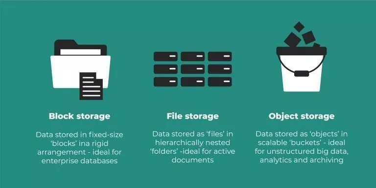

Source: <https://www.snia.org/educational-library/object-storage-what-how-and-why-2020>

---

### 和传统存储系统的比较

<style scoped>
  p {
    text-align: center;
  }
</style>


Source: <https://usdc.vn/object-storage-vs-traditional-storage/>

---

### 传统存储系统

<style scoped>
  p {
    text-align: center;
  }
</style>

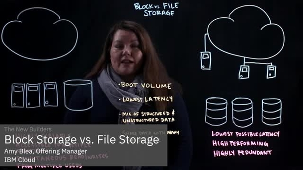
Source: <https://www.ibm.com/cloud/learn/object-storage>

---

### 对象、文件、块和归档存储

<style scoped>
  p {
    text-align: center;
  }
  tr {
    font-size: 25px;
  }
</style>

| Object | File | Block | Archive |
|:-|:-|:-|:-|
| Object Storage | NAS | SAN | Tape |
| Videos, photos serving streaming | All kinds of file | Attach to server | The file needs to be saved permanently |
| Read (download) data regularly | Read data regularly, install as a network drive | Run data directly on Storage | Rarely to download |
| High upload / download speed | High upload / download speed | Very High upload / download speed | High upload speed, slow download |
| Use with CDN | Many usage scenarios | Use with server (VM) | Use independently |

Source: <https://usdc.vn/object-storage-vs-traditional-storage/>

<!-- 请回顾操作系统课程 -->

---

### 定义

- [What is Object Storage?](https://www.snia.org/education/what-is-object-storage)
  - Object Storage is a method of storing and subsequently retrieving sets of data as collections of single, uniquely identifiable indivisible items or objects. **It applies to any forms of data that can be wrapped up and managed as an object.**
  - Objects are treated as an atomic unit. **There is no structure corresponding to a hierarchy of directories in a file system**; each object is uniquely identified in the system by a unique object identifier.

---

### 特性

- [What is Object Storage?](https://www.snia.org/education/what-is-object-storage)
  - When you create an object on this type of storage, the **entire set of data** is handled and processed without regard to what sub-parts it may have.
  - When reading from object storage, you can **read either the whole object, or ask to read parts of it**.
  - There is often no capability to update to the object or parts of the object; **the entire object is usually required to be re-written**.
  - Most object storage allows for objects to be deleted.

---

### 特性…

- [What is Object Storage?](https://www.snia.org/education/what-is-object-storage)
  - Object storage often supports meta-data.
    - This is data that is part of the object, but that is in addition to the object ID and the data.
    - It is often expressed as an **attribute-value pair**; for instance, an attribute of COLOR in our collection of objects may have the value RED for some objects and BLUE for others.
    - These permit collections of objects, individually addressable by their object ID, **to be searched, filtered and read in groups** without needing to know the specific object IDs.

---

### 标准化

- **Storage Networking Industry Association** - SNIA
  - [Object Storage: What, How and Why, 2020](https://www.snia.org/educational-library/object-storage-what-how-and-why-2020)
    - Object storage, as a definition, can be: A storage system that manages and manipulates data storage as **distinct units**, called objects
  - [CDMI Cloud Storage Standard, 2.0a, 2020](https://www.snia.org/cloud/cdmi)
    - The Cloud Data Management Interface (CDMI) defines the **functional interface** that applications will use to create, retrieve, update and delete data elements from the Cloud.

---

<style scoped>
  p {
    font-size: 18px;
    padding-top: 620px;
  }
</style>


Source: <https://www.snia.org/educational-library/object-based-storage-device-osd-architecture-and-systems-2007>

---

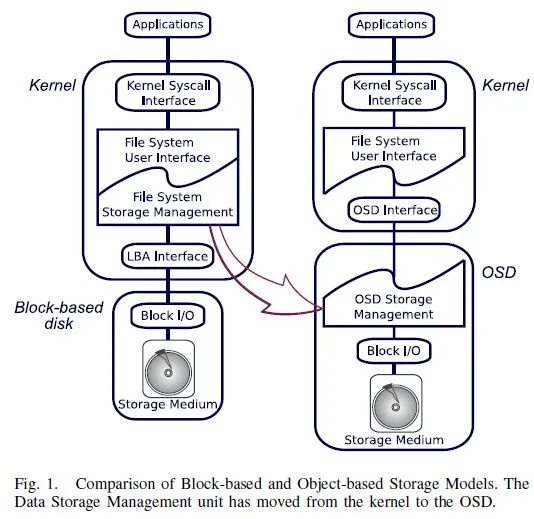

---


---


---

<style scoped>
  p {
    font-size: 18px;
    padding-top: 620px;
  }
</style>


Source: [What are Restful Web Services](https://gocoding.org/what-are-restful-web-services/)

---

### Amazon S3 REST API

<style scoped>
  p {
    font-size: 18px;
    text-align: center;
  }
  li {
    font-size: 25px;
    text-align: left;
  }
</style>

- **GET** on the API's root resource to list all of the Amazon S3 buckets of a caller.
- **GET** on a Folder resource to view a list of all of the objects in an Amazon S3 bucket.
- **PUT** on a Folder resource to add a bucket to Amazon S3.
- **DELETE** on a Folder resource to remove a bucket from Amazon S3.
- **GET** on a Folder/Item resource to view or download an object from an Amazon S3 bucket.
- **PUT** on a Folder/Item resource to upload an object to an Amazon S3 bucket.
- **HEAD** on a Folder/Item resource to get object metadata in an Amazon S3 bucket.
- **DELETE** on a Folder/Item resource to remove an object from an Amazon S3 bucket.

Source: <https://docs.aws.amazon.com/apigateway/latest/developerguide/integrating-api-with-aws-services-s3.html>

---

<style scoped>
  li, p {
    font-size: 18px;
  }
</style>

To access the object-based storage system:

- **secret-access-key** and **access-key-id** – private/public pair of keys that you can generate using different tools or sometimes directly on the provider dashboard
- **endpoint** – the web address of the space

```java
const AWS = require("aws-sdk");

const s3 = new AWS.S3({
  endpoint: "provider-space-endpoint",
  secretAccessKey: "my-secret-key",
  accessKeyId: "my-access-key",
});
```


- <https://lakefs.io/object-storage/>
- <https://docs.aws.amazon.com/apigateway/latest/developerguide/integrating-api-with-aws-services-s3.html>

---

<style scoped>
  p {
    font-size: 20px;
    color: #F0F0F0;
    text-align: right;
  }
</style>


Source: <https://aws.amazon.com/cn/s3/storage-classes/>

---

<style scoped>
  p {
    font-size: 18px;
    text-align: center;
  }
</style>

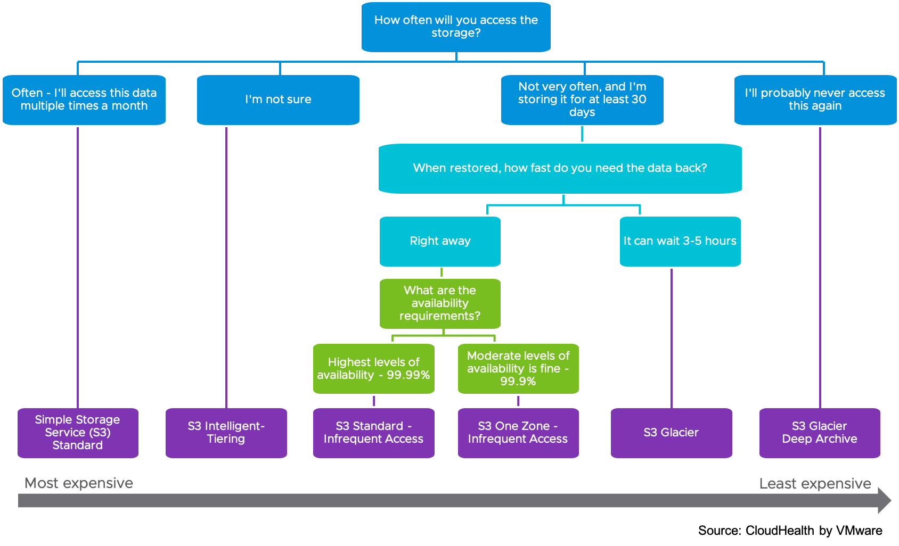

Source: <https://www.cloudhealthtech.com/blog/aws-cost-optimization-s3-storage-class>

---

### **更进一步的扩展**

<style scoped>
  h2 {
    text-align: center;
  }
</style>


<!--
- 实验室早期就跟进最新的网络存储发展，从双通道盘阵开始就在琢磨改装协议命令
- 随后按照协议自研对象存储系统，尽量兼容传统协议栈方便应用整合
 -->

---

### **主动对象存储**

<style scoped>
  h2, p {
    text-align: center;
  }
</style>


**主动对象海量存储系统及关键技术**

<!-- 
- 投入不少经历来研制系统，直到事实标准大行其道，不过万变不离其宗，其中
  - 元数据管理方面的工作仍在继续，索引方面的工作还在发力
  - 控制器方面的工作逐步下推，形成了延续至今的存算一体化硬件小组
  - 从彼时跟踪借鉴 CMU NASD 和 Self-* 自组织、自管理，时至今日牵头推进 AI4Storage
- 过程中不少同学奔赴华为（OceanStore）、腾讯（TFS）、阿里（盘古）、深信服、大普微从事存储系统方向的工作
 -->

---

### 存算一体化

<style scoped>
  p {
    font-size: 18px;
    padding-top: 520px;
  }
</style>


Source: <https://www.snia.org/computationaltwg>, <https://www.snia.org/education/what-is-computational-storage>

<!-- 往后的路 -->
---

### 存算一体化…


- Computational Storage is defined as architectures that provide **Computational Storage Functions (CSF) coupled to storage**, **offloading host processing** or **reducing data movement**.
- These architectures enable improvements in application performance and/or infrastructure efficiency through the integration of compute resources (outside of the traditional compute & memory architecture) either **directly with storage** or **between the host and the storage**.

---

### 典型对象存储系统

<style scoped>
  h3 {
    padding-top: 200px;
    text-align: center;
    font-size: 70px;
  }
</style>

---

- **Amazon S3**: Amazon S3 stores data as objects within resources called “buckets.” AWS S3 offers features like 99.999999999% durability, cross-region replication, event notifications, versioning, encryption, and flexible storage options (redundant and standard).
- **Rackspace Cloud Files**: Cloud Files provides online object storage for files and media. Cloud Files writes each file to three storage disks on separate nodes that have dual power supplies. All traffic between your application and Cloud Files uses SSL to establish a secure, encrypted channel. You can host static websites (for example: blogs, brochure sites, small company sites) entirely from Cloud Files with a global CDN.

---

- **Azure Blob Storage**: For users with large amounts of unstructured data to store in the cloud, Blob storage offers a cost-effective and scalable solution. Every blob is organized into a container with up to a 500 TB storage account capacity limit.
- **Google cloud storage**: Cloud Storage allows you to store data in Google’s cloud. Google Cloud Storage supports individual objects that are terabytes in size. It also supports a large number of buckets per account. Google Cloud Storage provides strong read-after-write consistency for all upload and delete operations. Two types of storage class are available: Standard Storage class and Storage Near line class (with Near Line being MUCH cheaper).

<https://cloudacademy.com/blog/object-storage-block-storage/>

---

- [**阿里云对象存储OSS（Object Storage Service）**](https://www.aliyun.com/product/oss/)是一款海量、安全、低成本、高可靠的云存储服务，提供99.9999999999%(12个9)的数据持久性，99.995%的数据可用性。多种存储类型供选择，全面优化存储成本。
- [**腾讯对象存储（Cloud Object Storage，COS）**](https://cloud.tencent.com/document/product/436)是腾讯云提供的一种存储海量文件的分布式存储服务，具有高扩展性、低成本、可靠安全等优点。通过控制台、API、SDK 和工具等多样化方式，用户可简单、快速地接入 COS，进行多格式文件的上传、下载和管理，实现海量数据存储和管理。
- [**华为对象存储服务（Object Storage Service）**](https://www.huaweicloud.com/product/obs.html)是一款稳定、安全、高效、易用的云存储服务，具备标准Restful API接口，可存储任意数量和形式的非结构化数据。

---

#### OpenStack

<style scoped>
  p {
    font-size: 16px;
    text-align: right;
  }
</style>

- OpenStack was created during the first months of 2010. Rackspace wanted to rewrite the infrastructure code running its Cloud servers offering, and considered open sourcing the existing Cloud files code. At the same time, Anso Labs (contracting for NASA) had published beta code for Nova, a Python-based “cloud computing fabric controller”.
- Both efforts converged and formed the base for OpenStack. The first Design Summit was held in Austin, TX on July 13-14, 2010, and the project was officially announced at OSCON in Portland, OR, on July 21st, 2010.

<https://docs.openstack.org/project-team-guide/introduction.html>

---

#### OpenStack Swift

- OpenStack Object Storage (swift) is used for **redundant, scalable data storage using clusters of standardized servers** to store petabytes of accessible data.
- Swift uses a distributed architecture with **no central point of control**, providing greater scalability, redundancy, and performance.
- Storage clusters **scale horizontally** by adding new nodes, uses software logic to ensure data replication and distribution across different devices, inexpensive **commodity hard drives and servers**.

---

<style scoped>
  p {
    font-size: 20px;
    text-align: right;
  }
</style>

<https://docs.openstack.org/swift/>
<https://github.com/openstack/swift>
Source: <https://docs.openstack.org/security-guide/object-storage.html>


---

#### Ceph as a research project

<style scoped>
  li {
    font-size: 30px
  }
  p {
    font-size: 20px;
    text-align: right;
  }
</style>

- Ceph was developed at **University of California, Santa Cruz, by Sage Weil** in 2003 as a part of his PhD project.
  - The initial project prototype was the Ceph filesystem, written in approximately 40,000 lines of C++ code, which was made open source in 2006 under LGPL to serve as a reference implementation and research platform.
  - LLNL supported Sage's initial research work.
  - The period from 2003 to 2007 was the research period of Ceph. By this time, its core components were emerging, and the community contribution to the project had begun at pace.

[Learning Ceph, Packt, 2015](https://subscription.packtpub.com/book/virtualization-and-cloud/9781783985623/1)

---

#### Ceph

- Ceph uniquely delivers **object, block, and file storage in one unified system**.
- Ceph is highly reliable, easy to manage, and free.
- Ceph delivers extraordinary scalability–thousands of clients accessing petabytes to exabytes of data.
- A Ceph Node leverages **commodity hardware** and intelligent daemons, and a Ceph Storage Cluster accommodates large numbers of nodes, which communicate with each other to **replicate and redistribute data dynamically**.

---

<style scoped>
  p {
    font-size: 20px;
    text-align: right;
  }
</style>

<https://ceph.io/>
<https://github.com/ceph/ceph>
Source: <https://icicimov.github.io/blog/images/CEPH-graphic.png>


---

<style scoped>
  p {
    padding-top: 620px;
    font-size: 20px;
  }
</style>

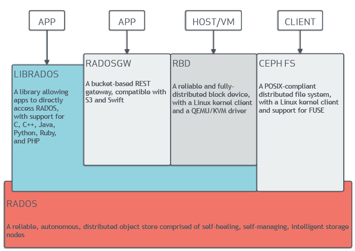

Source: [Ceph Documentation » Architecture](https://docs.ceph.com/en/pacific/architecture/)

---

<style scoped>
  p {
    padding-top: 620px;
    font-size: 20px;
  }
</style>


Source: [Ceph storage on Ubuntu: An overview](https://ubuntu.com/blog/ceph-storage-on-ubuntu-an-overview)

---


<!-- https://www.sandisk.com/business/datacenter/resources/solution-briefs/red-hat-ceph-storage-on-the-infiniflash-all-flash-storage-platform -->

---


---

#### Minio

- MinIO is a High Performance Object Storage released under GNU Affero General Public License v3.0.
- It is **API compatible with Amazon S3** cloud storage service.
- **Standalone MinIO servers** are best suited for early development and evaluation.
- Certain features such as versioning, object locking, and bucket replication require distributed deploying MinIO with **Erasure Coding**.

---

<style scoped>
  p {
    font-size: 20px;
    text-align: right;
  }
</style>

<https://min.io/>
<http://www.minio.org.cn/>
<https://github.com/minio/minio>

Source: <http://www.minio.org.cn/static/picture/architecture_diagram.svg>

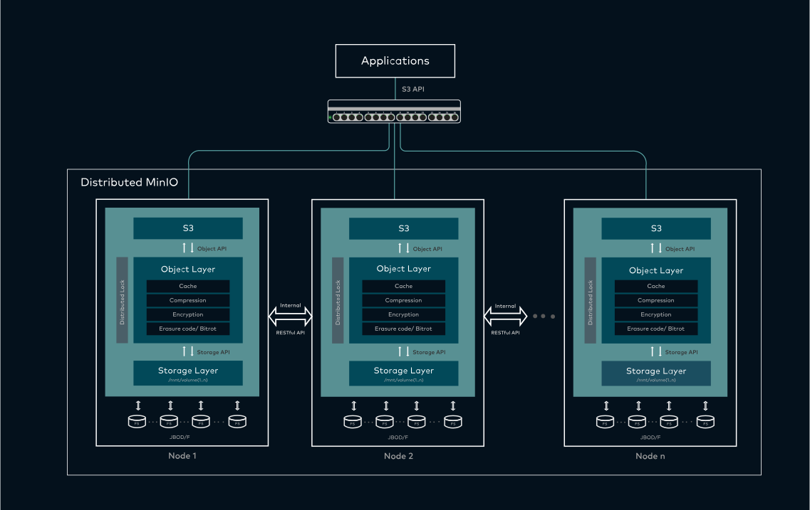

---

### 动手了解对象存储系统

- 说明
  - [对象存储实验](big-data-storage-experiment)
- 内容
  - 认识对象存储系统
    - 快速部署：Minio、mock_s3…
    - 功能特性：RESTful接口
  - 熟悉性能指标：吞吐率、带宽、延迟
    - 观测工具：s3bench、WARP…

---

### 参考文献

<style scoped>
  p {
    font-size: 22px;
  }
</style>

[Object Storage: The Future Building Block for Storage Systems](https://ieeexplore.ieee.org/document/1612479), (MSST '05)

早期对对象存储架构的系统性探讨，提出对象存储作为未来存储系统基础组件的理念。

[Ceph: A Scalable, High-Performance Distributed File System](https://www.usenix.org/conference/osdi-06/ceph-scalable-high-performance-distributed-file-system), (OSDI '06)

Ceph的奠基性论文，提出了去中心化元数据管理、动态数据分布（CRUSH算法）和高可扩展性的设计理念。  

[CRUSH: Controlled, Scalable, Decentralized Placement of Replicated Data](https://ieeexplore.ieee.org/document/4090205), (SC '06)

提出CRUSH算法，解决分布式存储系统中数据分布与复制的核心问题，成为Ceph和后续系统的核心组件。  

[Dynamo: Amazon's Highly Available Key-value Store](https://dl.acm.org/doi/10.1145/1294261.1294281), (SOSP '07)

尽管Dynamo是键值存储，但其去中心化、最终一致性设计对Amazon S3等对象存储系统产生深远影响。  

[RADOS: A Scalable, Reliable Storage Service for Petabyte-scale Storage Clusters](https://dl.acm.org/doi/10.1145/1374596.1374606), (PDSW '07)

描述Ceph的底层对象存储系统RADOS，奠定了大规模分布式对象存储的自治管理机制。

<!-- 华中科技大学信息存储这个专业方向也是在那个时期开始聚焦对象存储系统开展研究的，时至今日，华为、阿里、腾讯活跃着一大批大家的学长前辈，尤其是华为公司的存储业务部门，还有阿里云的云存储业务部门。 -->

---

## 挑战二：长尾

<style scoped>
  h2 {
    padding-top: 200px;
    text-align: center;
    font-size: 60px;
  }
  p {
    text-align: right;
  }
</style>

规模化的代价

<!-- 伴随规模前来，很重要却容易被忽视 -->

---


**长尾**（The Long Tail）这一概念是由《连线》杂志主编Chris Anderson在2004年10月的“长尾”一文中最早提出，用来描述诸如亚马逊和Netflix之类网站的商业和经济模式。

实际上是统计学中幂律（Power Laws）和帕累托分布（Pareto distributions）特征的一个口语化表达。

---


**规模化业务**中，“**尾部**”产生的总体效益甚至会超过“**头部**”。

- *冷门商品的销售量可以达到总额的半数*
- *自然语言中的中低频词对信息量的贡献*
- ...

---

<style scoped>
  p {
    padding-top: 600px;
    text-align: center;
    font-size: 18px;
    color: 0040FF;
  }
</style>


<https://newmedia.fandom.com/wiki/The_Long_Tail>

---

<style scoped>
  p {
    padding-top: 200px;
    text-align: center;
    font-size: 72px;
    color: 0040FF;
  }
  li {
    padding-top: 270px;
    text-align: center;
    font-size: 18px;
    color: 0040FF;
  }
</style>

"**长尾**"即不起眼事件的积累


- <https://newmedia.fandom.com/wiki/The_Long_Tail>

---

### 对系统来说……

<style scoped>
  p {
    padding-top: 150px;
    text-align: center;
    font-size: 72px;
    color: 0040FF;
  }
</style>


系统以规模扩展应对需求增长

---

### 那么代价是……

<style scoped>
  p {
    padding-top: 150px;
    text-align: center;
    font-size: 72px;
    color: 0040FF;
  }
</style>


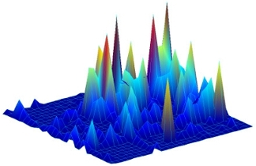

不起眼的事件也在扩展中积累

<!-- https://www.pdl.cmu.edu/Workload/index.shtml -->

---


<!-- https://github.com/kanripo/KR1a0140/ -->


---


---

### 『不起眼』的事件将一直存在

<style scoped>
  p {
    padding-top: 150px;
    text-align: center;
    font-size: 72px;
    color: 0040FF;
  }
</style>


唯一不变的是变化本身

---

### 归纳起来

毫末之变、扩展之鉴

1. 大系统由小组件汇聚而成
2. 汇聚改变的不仅仅是规模
3. 还有伴随组件而来的变化

系统的扩展将同时成为**小概率事件的放大器**！

---

### 实际系统组件异常情况繁复


---

### 虽然各有预案


---

### 仍然难免短板

<style scoped>
  p {
    font-size: 20px;
    text-align: left;
  }
</style>


- 必受各组件状态的影响
  - 设备故障 **Fail**
  - 性能波动 **Tail**

Source: <https://nutrien-ekonomics.com/latest-fertilizer-research/liebigs-law-of-the-minimum/>

---

### 容错

<style scoped>
  p {
    font-size: 16px;
    text-align: center;
  }
</style>

- 必受各组件状态的影响
  - 设备故障——需要 **Fault-Tolerant** 容错！

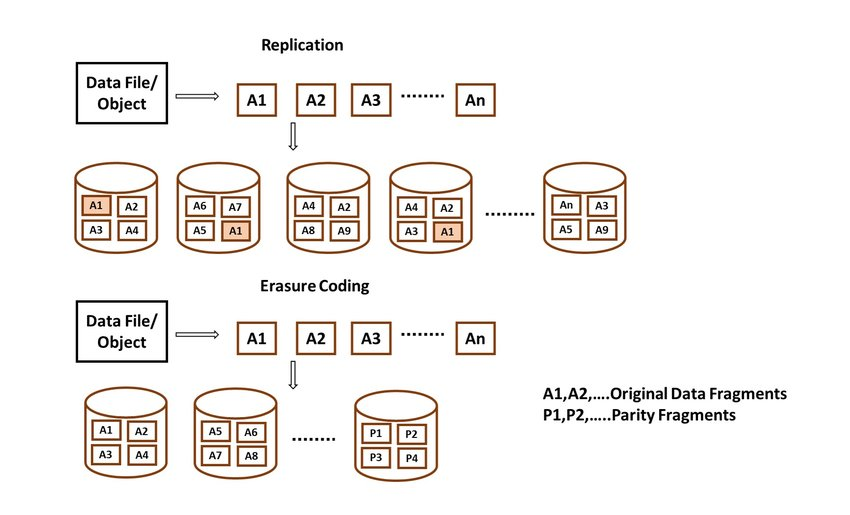

[Cloud Storage Reliability for Big Data Applications: A State of the Art Survey, Journal of Network and Computer Applications 2017](https://linkinghub.elsevier.com/retrieve/pii/S1084804517302734)

---

### 容滞

- 必受各组件状态的影响
  - 设备故障——需要 **Fault-Tolerant** 容错！
  - 性能波动——需要 **Tail-Tolerant** 容滞？

---

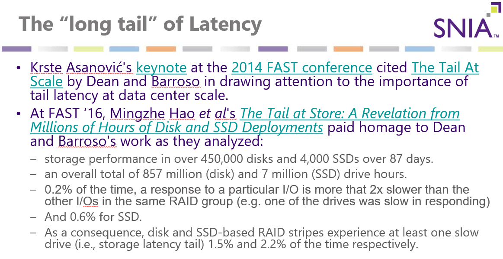

---

<style scoped>
  p {
    padding-top: 620px;
    font-size: 20px;
  }
</style>


Source: <https://bravenewgeek.com/everything-you-know-about-latency-is-wrong/>

---

### 站在应用的角度上

- [Everything You Know About Latency Is Wrong](https://bravenewgeek.com/everything-you-know-about-latency-is-wrong/)
- [中译版](https://blog.csdn.net/u012802702/article/details/86421171)
  - **小概率事件**不能忽视


---

### 经典观测很可能忽视

- [Everything You Know About Latency Is Wrong](https://bravenewgeek.com/everything-you-know-about-latency-is-wrong/)
- [中译版](https://blog.csdn.net/u012802702/article/details/86421171)
  - **小概率事件**不能忽视
  - 延迟可能"**被平均**"

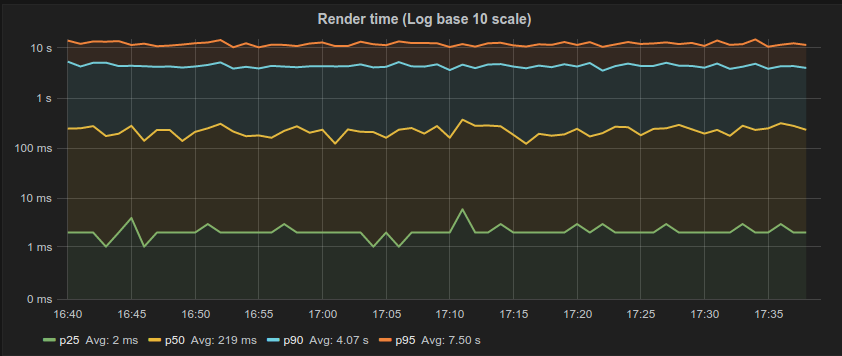

---

### 可是影响其实显著

- [Everything You Know About Latency Is Wrong](https://bravenewgeek.com/everything-you-know-about-latency-is-wrong/)
- [中译版](https://blog.csdn.net/u012802702/article/details/86421171)
  - **小概率事件**不能忽视
  - 延迟可能"**被平均**"
  - 任务可能**被拖累**


---

### 量化描述尾延迟

<style scoped>
  p {
    font-size: 20px;
    text-align: center;
  }
</style>

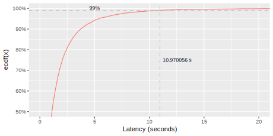

<https://blog.bramp.net/post/2018/01/16/measuring-percentile-latency/>

---

### 横向扩展与尾延迟

<style scoped>
  p {
    font-size: 25px;
  }
</style>


服务器通常响应时间10毫秒，但第P99百分位上的响应时间将达到一秒，即100个请求中将有1个慢请求用时超过1秒。

如果一个用户请求必须并行地从100个这样的服务器收集响应，则63%的用户请求将需要超过一秒的时间（在图表中标记为“x”）。

即使对于请求中只有1/10000（即P9999百分位）超过一秒延迟的服务器，基于2000台这样的服务器的系统也会有近五分之一的用户请求需要超过一秒的时间（在图表中标记为“o”）。

Source：[The Tail at Scale](https://dl.acm.org/doi/10.1145/2408776.2408794), CACM 2013.

<!-- 例如，考虑一个系统，在这个系统中，每个服务器通常的响应时间为10毫秒，但第99百分位的响应时间将达到一秒。如果一个用户请求仅在一个这样的服务器上处理，那么100个用户请求中会有一个请求变慢（一秒）。右图描述了在这种假设情景中，非常小的延迟异常所导致的服务级别延迟的影响。如果一个用户请求必须并行地从100个这样的服务器收集响应，则63%的用户请求将需要超过一秒的时间（在图表中标记为“x”）。即使对于只有万分之一的请求在单个服务器上经历超过一秒延迟的服务，有2,000个这样的服务器的服务也会导致近五分之一的用户请求需要超过一秒的时间（在图表中标记为“o”）。 -->

---

### 纵向扩展与尾延迟

<style scoped>
  p {
    font-size: 30px;
  }
</style>

显然，横向扩展放大了尾延迟，不过另一方面，缓存作为纵向扩展的基本方法，高命中率则帮助减少了尾延迟，事实上是公平减少了所有延迟

当然这样的方法也有其代价，具体在系统结构课堂上已有阐述，那么，有没有更具针对性的减少尾延迟的方法？

执行冗余请求，可以达到和缓存相仿的效果，简单计算比较一下

$MissRate=1\% \rightarrow Latency_{new} = 1\% \times P99 = P9999$

$N_{Hedge}=2 \rightarrow Latency_{new} = P99 \times P99 = P9999$

所以，具体来说

---

### 如何应对？

- 各组件状态的影响
  - 设备故障——容错——**提供冗余部件** *（回顾计算机系统结构课…）*
  - 性能波动——容滞——？

 

---

### 如何应对？…

- 必受各组件状态的影响
  - 设备故障——容错——**提供冗余部件**
  - 性能波动——容滞——**执行冗余操作**

 

---

### 经典应对策略

- [SNIA: Avoiding tail latency by failing IO operations on purpose](https://faststorage.eu/snia-avoiding-tail-latency-by-failing-io-operations-on-purpose/)
  - One of these initiatives is adding a per I/O tag that indicates whether a drive **can fail fast** and return an error if it takes too long to retrieve the data.
  - If there’s a replica of the data somewhere else, it might just be faster to retrieve the data from there, instead of waiting for the slow drive to respond.
  - The other side of the coin is a “**try really hard**” I/O tag, that indicates you’ve exhausted all other options and really need the data from this drive.

---

### 主要方法分类

<style scoped>
  li {
    font-size: 25px;
  }
  p {
    font-size: 16px;
    text-align: right;
  }
</style>

- **对冲请求** Hedged Request
  - Issue the same request to multiple replicas and use the results from whichever replica responds first.
  - "hedged" - a client first sends one request to the replica believed to be the most appropriate, but then falls back on sending a secondary request after some brief delay.
  - The client cancels remaining outstanding requests once the first result is received.
- **关联请求** Tied Request
  - The hedged-requests technique also has a window of vulnerability in which multiple servers can execute the same request unnecessarily.
    - Can be capped by waiting for the P95 expected latency before issuing the hedged request, but limits the benefits to only a small fraction of requests.
  - Permitting more aggressive use of hedged requests with moderate resource consumption requires faster cancellation of requests.

[The Tail at Scale](https://dl.acm.org/doi/10.1145/2408776.2408794), CACM 2013.

---

#### 案例1：HDFS

<style scoped>
  p {
    font-size: 16px;
    text-align: right;
  }
</style>

- **HDFS** (2.4+)
  - If a read from a block is slow, start up another parallel, **'hedged' read** against a different block replica.
  - We then **take the result of which ever read returns first** (*the outstanding read is cancelled*).
  - This 'hedged' read feature will help rein in the outliers, the odd read that takes a long time because it hit a bad patch on the disc, etc.

<https://hadoop.apache.org/docs/stable/hadoop-project-dist/hadoop-common/release/2.4.0/RELEASENOTES.2.4.0.html>

---

#### 案例2：MongoDB

<style scoped>
  p {
    font-size: 16px;
    text-align: right;
  }
</style>

- **mongodb** (4.4+)
  - With hedged reads, the mongos instances can route read operations to **two replica set members per each queried shard** and **return results from the first respondent** per shard.
  - The additional read sent to hedge the read operation uses the **maxTimeMS** value of **maxTimeMSForHedgedReads**.

<https://docs.mongodb.com/manual/core/read-preference-hedge-option/>

---

#### 案例3：字节跳动HDFS改

<style scoped>
  th {
    font-size: 25px;
  }
  td {
    font-size: 25px;
  }
</style>

|Host:X.X.X.X|3 副本Switch Read|2 副本 Hedged Read|3 副本 Hedged Read|3 副本 Fast Switch Read（优化）|
|:-|-:|-:|-:|-:|
|读取时长 p999|977 ms|549 ms|192 ms|128 ms|
|最长读取时间|300 s|125 s|60 s|15.5 s|
|长尾出现次数（大于 500ms）|238 次/天|75 次/天|15 次/天|3 次/天|
|长尾出现次数（大于 1000ms）|196 次/天|64 次/天|6 次/天|3 次/天|

- 优化：根据当前的读取状况动态地调整阈值，动态改变时间窗口的长度以及吞吐量阈值的大小。

[字节跳动 EB 级 HDFS 实践](https://juejin.cn/post/6844904035112189966)

---

### 长尾延迟的观测和预防

- 实验说明
  - [对象存储实验](big-data-storage-experiment)
- 实验内容
  - 分析不同负载下的指标、延迟的分布
  - 观测尾延迟现象
  - 尝试对冲请求方案

---

### 参考文献…

<style scoped>
  p {
    font-size: 22px;
  }
</style>

[The Tail at Scale](https://dl.acm.org/doi/10.1145/2408776.2408794), (CACM 2013)

首次系统性分析了大规模分布式系统中长尾延迟的成因，提出了"对冲请求"等关键策略，成为后续研究的基石。

[Amdahl's Law for Tail Latency](https://dl.acm.org/doi/10.1145/3232559), (CACM 2018)

将阿姆达尔定律扩展至尾部延迟分析，建立了量化尾部延迟与系统并行度的理论框架。

[Rein: Taming Tail Latency in Key-Value Stores via Multiget Scheduling](https://dl.acm.org/doi/10.1145/3064176.3064209), (EuroSys 2017)

针对键值存储系统提出多请求调度算法，通过优化请求并行性显著降低尾部延迟。

[Managing Tail Latency in Datacenter-Scale File Systems Under Production Constraints](https://www.microsoft.com/en-us/research/publication/managing-tail-latency-in-datacenter-scale-file-systems-under-production-constraints/), (EuroSys 2019)

基于微软生产环境数据，提出动态优先级调度和负载均衡策略，有效应对大规模文件系统的尾部延迟挑战。

[Taming Tail Latency for Erasure-coded, Distributed Storage Systems](https://ieeexplore.ieee.org/document/8713931), (IEEE TNSM 2019)

针对纠删码存储系统提出数学建模与优化框架，显著降低尾部延迟概率。

---

## 挑战三：预测

<style scoped>
  h2 {
    padding-top: 200px;
    text-align: center;
    font-size: 60px;
  }
  p {
    text-align: right;
  }
</style>

怎样管控代价

<!-- 来自长尾的麻烦，小概率同时也意味着样本缺乏，仅从统计学入手难免自相矛盾 -->

---

- **容错的代价**
  - …
    - …
    - …
- **容滞的代价**
  - …
    - …
    - …

---

- 容错的代价
  - **浪费的空间**
    - …
    - …
- 容滞的代价
  - **浪费的吞吐**
    - …
    - …

---

- 容错的代价
  - 浪费的空间
    - 从**副本**到**纠删码**、**动态重编码**
    - …
- 容滞的代价
  - 浪费的吞吐
    - **积极对冲**加剧拥塞
    - …

---

- 容错的代价
  - 浪费的空间
    - 从副本到纠删码、动态重编码
    - **故障预测**
- 容滞的代价
  - 浪费的吞吐
    - 积极对冲加剧拥塞
    - **性能预测**

---

- 容错的代价
  - 浪费的空间
    - 从副本到纠删码、动态重编码
    - **故障预测**
- 容滞的代价
  - 浪费的吞吐
    - 积极对冲加剧拥塞
    - **性能预测**
- 更进一步：**从偶然到必然**……

---

### 重温阿姆达尔定律

<style scoped>
  p {
    font-size: 25px;
  }
</style>


请再次回顾计算机系统结构课…

$$
Speedup_{Overall}=\frac{Time_{Before}}{Time_{After}}=\frac{1}{(1-Fraction_{Improved})+\frac{Fraction_{Improved}}{Speedup}}
$$

在优化平均性能时，一些部分性能的提升可能不会对整体性能有太大影响…

但在优化尾部延迟时，**每个部分都可能成为瓶颈**。

因此，**尾延迟（也就是最坏情况下的延迟）会使Amdahl's Law变得更有挑战性**！

---

### 尾延迟与阿姆达尔定律

<style scoped>
  p {
    font-size: 25px;
  }
</style>


**尾延迟（也就是最坏情况下的延迟）会使Amdahl's Law变得更有挑战性**：在优化平均性能时，一些部分性能的提升可能不会对整体性能有太大影响，但在优化尾部延迟时，每个部分都可能成为瓶颈。

**队列理论可以提供准确的基础理论**：帮助我们预测和控制系统中的延迟，以指导如何设计未来交互式服务的硬件。

随着服务响应能力和可预测性变得越来越关键，需要根据应用的需求，**找到计算和内存资源之间的平衡**，以实现最优的系统性能。

Source：[Amdahl's Law for Tail Latency](https://dl.acm.org/doi/10.1145/3232559), CACM 2018.

<!-- 首先，优化尾延迟（也就是最坏情况下的延迟）会使Amdahl's Law变得更重要。Amdahl's Law是计算机科学中的一个概念，它描述的是并行计算中加速比的极限。在优化平均性能时，一些部分性能的提升可能不会对整体性能有太大影响，但在优化尾部延迟时，每个部分都可能成为瓶颈，因此需要考虑Amdahl's Law，确保系统的每个部分都得到充分优化。

其次，队列理论可以提供准确的基础理论，以指导如何设计未来交互式服务的硬件。队列理论是研究等待过程（队列）的数学理论，它可以帮助我们预测和控制系统中的延迟。在设计交互式服务的硬件时，我们需要考虑如何减少延迟，提高系统的响应能力，队列理论可以帮助我们实现这一目标。

最后，随着服务响应能力和可预测性变得越来越关键，找到计算和内存资源之间的平衡也变得越来越重要。计算和内存是计算机系统的两个核心资源，它们之间的平衡直接影响到系统的性能。如果计算资源过多，而内存资源不足，那么系统可能会因为内存瓶颈而无法充分发挥计算资源的能力。反之亦然。因此，我们需要根据应用的需求，找到计算和内存资源之间的平衡，以实现最优的系统性能。 -->

---

### 初步尝试——排队论模型


**平均等待时间** $W = \frac{1}{\mu - \lambda}$
**等待时间分布** $P(W_q \leq t) = 1 - \frac{\lambda}{\mu}e^{-(\mu-\lambda)t}$

---

#### **现实的系统没有简单的队列**

<style scoped>
  li {
    font-size: 25px;
  }
</style>

- 如何建模**非线性的系统**？
  - [Predicting Response Latency Percentiles for Cloud Object Storage Systems](https://ieeexplore.ieee.org/document/8025298), ICPP 2017.
- 怎么分析**请求的分布**？
  - [Understanding the latency distribution of cloud object storage systems](http://www.sciencedirect.com/science/article/pii/S0743731518301175), JPDC 2019.

 $\rightarrow$ 

---

### 研究背景

- **云对象存储重要性**：Amazon S3、OpenStack Swift等支撑现代Web应用，存储海量小文件
- **延迟是关键指标**：直接影响用户体验和收入，尾延迟尤为重要
- **当前问题**：缺乏准确延迟分布理解，导致资源过度配置
- **研究空白**：现有模型关注平均性能，无法预测延迟百分位数
- **应用价值**：容量规划、过载控制、瓶颈识别、弹性存储

---

### 主要挑战

- **多样磁盘操作**：索引查找、元数据和数据读取混合，性能特征各异
- **数据分块传输**：事件驱动架构中请求交错处理，增加建模复杂度
- **accept()等待时间**：连接池等待时间显著影响延迟，缺乏量化分析
- **多进程排队网络**：后端多进程形成复杂排队系统，传统模型不适用
- **成本敏感环境**：使用廉价HDD且内存有限，缓存效果受限

---


---


---

### 关键创新

#### **化繁为简** —— 联合操作抽象

- 打包多样操作为单一"联合操作"
- 整合缓存、数据分块、事件驱动调度

#### **抓住关键** —— accept()等待时间建模

- 量化分析连接池等待时间
- 建立与请求处理队列状态的关系

---

### 实验效果

<style scoped>
  li {
    font-size: 25px;
  }
  .columns {
    display: grid;
    grid-template-columns: 1fr 2fr;
    gap: 2rem;
}
</style>

#### **实验设置**

- 7节点OpenStack Swift集群
- Wikipedia真实媒体访问追踪
- 多种SLA要求(10/50/100ms)

<div class="columns">

<div>

#### **预测精度**

- 平均误差：**4.44%**
- 最坏情况：**16.61%**
- 显著优于基线模型

</div>

<div>

#### **模型贡献**

- 相比忽略多磁盘操作模型：误差降低**36-73%**
- 相比忽略accept()等待模型：误差降低**9-61%**
- 在多种配置下保持稳定表现

</div>

</div>

---

### 更多的问题

<style scoped>
  li {
    font-size: 25px;
  }
</style>

- 用预测提高**缓存算法效率**
  - [A Multi-Factor Adaptive Multi-Level Cooperative Replacement Policy in Block Storage Systems](https://ieeexplore.ieee.org/document/9978474). ICCD 2022
- 用预测协调**缓存和调度公平性**
  - [Fair Will Go On: A Collaboration-Aware Fairness Scheme for NVMe SSD in Cloud Storage System](https://ieeexplore.ieee.org/document/10247718). DAC 2023.
- 用预测改善**服务质量保障**
  - [Graph3PO: A Temporal Graph Data Processing Method for Latency QoS Guarantee in Object Cloud Storage System](https://dl.acm.org/doi/10.1145/3581784.3607075). SC 2023.

---

### 用预测提高**缓存算法效率**


<!-- TODO: 浓缩提炼至每页一个问题及创新 -->

---


---


---


---

### 用预测协调**缓存和调度公平性**


---


---


---

### 用预测改善**服务质量保障**


<!-- 黑盒白盒各有不足 -->

---


<!-- 不要逃避关联结构，要迎难而上 -->

---

### 建立模型预测性能指标

- 实验说明
  - [对象存储实验](big-data-storage-experiment)
- 实验内容
  - 网络存储仿真
  - 排队论模型拟合
  - 思考：准确预测的要素？

---

### 扩展阅读

<style scoped>
  p {
    font-size: 20px;
  }
</style>

[Time Series Machine Learning Models for Precise SSD Access Latency Prediction](https://ieeexplore.ieee.org/document/11045247), (IEEE Computer Architecture Letters 2025)

提出基于时间序列机器学习的SSD访问延迟预测模型，通过硬件级延迟分析实现高精度和高效性。

[LPNS: Scalable and Latency-Predictable Local Storage Virtualization for Unpredictable NVMe SSDs in Clouds](https://www.usenix.org/conference/atc23/presentation/peng), (USENIX ATC 2023)

设计首个具备延迟可预测性的NVMe虚拟化系统，通过自反馈控制与动态调度策略，显著优化云存储尾部延迟。

[TTLoC: Taming Tail Latency for Erasure-Coded Cloud Storage Systems](https://ieeexplore.ieee.org/document/8713931), (IEEE TNSM 2019)

针对纠删码存储系统提出尾部延迟数学建模框架，通过交替优化算法降低尾部延迟概率，实验验证其优于现有算法。

[RL-Watchdog: A Fast and Predictable SSD Liveness Watchdog on Storage Systems](https://www.usenix.org/system/files/atc24-ha.pdf), (USENIX ATC 2024)

基于强化学习的SSD命令超时预测模型（RLTP），动态适应SSD状态变化，实现低误报率与快速故障检测。

[Managing Tail Latency in Datacenter-Scale File Systems Under Production Constraints](https://dl.acm.org/doi/10.1145/3302424.3303973), (EuroSys 2019)

基于微软生产环境数据提出动态优先级调度策略，优化大规模文件系统的尾部延迟管理，减少生产级干扰影响。

---

## 如何做得更好？

<style scoped>
  h2 {
    padding-top: 200px;
    text-align: center;
    font-size: 60px;
  }
  p {
    text-align: right;
  }
</style>

知己更要知彼——负载特征分析

---

### 负载特征分析的必要性

不同以往的负载正在主导存储系统设计，如何识别出这些特征？

 

[Diagnose the form, reveal the root, tune the whole.](https://github.com/LLNL/dftracer)
**诊其形，明其本，调其全。**

---

### 大数据存储负载

<style scoped>
  li {
    font-size: 22px;
  }
</style>

#### 需求：**为系统设计与优化提供依据**

- **指导设计**：理解访问模式（长期趋势、突发性、文件热度）是设计下一代存储系统、缓存策略和数据框架的基础。
- **提升性能**：识别出读取操作占主导、修改罕见、存在日/周周期性强弱波动等特征，有助于进行容量规划和负载均衡。
- **成本优化**：发现负载的周期性低谷，可引导用户利用竞价实例等低成本资源执行非紧急任务。

#### 挑战：**规模、动态与复杂性**

- **数据海量**：原始日志规模庞大（如6个月日志超600TB），对数据收集、存储和处理能力构成挑战。
- **动态演化**：负载特征并非一成不变，例如读取量可能在数月内翻倍，分析必须考虑其长期演变趋势。
- **统计复杂性**：负载表现出重尾分布、突发性等复杂统计特性，难以用简单模型描述，增加了预测和优化的难度。

---

### 云服务负载

<style scoped>
  li {
    font-size: 22px;
  }
</style>

#### 需求：**云平台效率至上**

- **精准优化**：将负载特性（如延迟容忍度、可抢占性、地域无关性）与云平台优化功能（如Spot VM、自动扩缩）精准匹配，实现降本增效。
- **资源效率**：通过分类（如Web Apps, Big Data, DevOps）和剖析，将合适的负载导向合适的资源，提升整个云平台的整体利用率和能效。
- **可靠性保障**：识别高可用性、低容错性的关键负载，确保其获得必要的资源保障，满足服务等级协议。

#### 挑战：**特征获取与隐私**

- **特征隐含**：关键业务特征（如延迟容忍度）无法直接从资源监控指标（CPU、内存）推断，而直接询问用户在超大规模环境下不具可扩展性。
- **数据敏感**：负载数据涉及用户业务细节和云平台内部信息，需进行严格的匿名化处理（如哈希处理），这为数据共享和验证带来障碍。
- **分类依赖专家**：对负载进行有效分类和标注需要深厚的领域知识，依赖专家进行人工判读，过程耗时且难以自动化。

---

### 大语言模型负载

<style scoped>
  li {
    font-size: 22px;
  }
</style>

#### 需求：**软硬件协同设计的基石**

- **瓶颈识别**：精确分析训练和推理中不同算子（如GEMM, GEMV）是计算瓶颈还是内存瓶颈，是进行硬件选型、并行策略选择和性能调优的根本前提。
- **系统规划**：通过性能建模，预测未来硬件（如从A100到B200）和技术（如更先进制程）的性能增益，并为未来芯片、内存和网络的设计指明投资方向。
- **成本控制**：区分训练（成本主要在一次性计算）和推理（成本可能长期持续）的负载特性，对于评估总体拥有成本至关重要。

#### 挑战：**系统复杂性与“黑盒”硬件**

- **复杂度交织**：性能受计算单元、内存层次、节点内/间网络等多层级系统复杂交互的影响，难以准确归因瓶颈。
- **硬件“黑盒”**：商业硬件（如NVIDIA GPU）的底层架构细节不公开，为构建精确的性能模型带来巨大挑战。
- **瓶颈动态转移**：性能瓶颈非静态。随着模型规模、硬件算力和并行策略的变化，瓶颈可能在计算、内存带宽和网络通信之间动态切换。

---

### **负载特征分析的价值**

- **核心目标**：实现**资源与需求的高效精准匹配**。
- **三大价值**：
  - **经济性**：通过智能调度与优化，直接降低计算与存储成本。
  - **前瞻性**：为下一代硬件与软件系统的设计提供关键输入，避免盲目投资。
  - **可靠性**：保障关键应用的性能与稳定性，提升用户体验。

---

### **负载特征分析的挑战**

<style scoped>
  li {
    font-size: 28px;
  }
</style>

- **数据层面**：
  - **规模与隐私**：数据量巨大且包含敏感信息，处理与利用之间存在矛盾。
- **方法层面**：
  - **获取与诠释**：关键特征难以自动获取，依赖专家知识与人工介入，可扩展性差。
  - **动态与演化**：负载特征随业务与技术发展而持续变化，分析必须具备动态视角。
- **系统层面**：
  - **复杂性归因**：在复杂的软硬件栈中，准确归因性能瓶颈极为困难。
  - **硬件不透明**：商业硬件的“黑盒”特性阻碍了第一性原理的精确建模。

---

### **怎么办？**——数据量巨大、内容敏感、业务频繁更新

- 标准化复现工具
  - 不必受制于繁琐的脱敏流程
  - 应对应用的快速迭代
  - 降低分析与复现成本
- 社区维护和验证
  - 分享最佳实践
  - 公平竞争提高
  - 紧跟技术趋势

---

### MLPerf 的诞生背景

- **2018年**：[MLPerf 项目](https://mlcommons.org/benchmarks/)正式启动
  - 由 MLCommons 协会 （前身为 MLPerf 联盟）发起
  - 目标是建立统一的机器学习基准测试标准
  - 解决业界缺乏标准化AI性能评估工具的问题

- **早期发展**：
  - 最初关注计算性能基准测试（训练和推理）
  - 涵盖图像分类、目标检测、机器翻译等任务
  - 得到Google、Facebook、NVIDIA、Intel等巨头支持

---

### Storage Benchmark 的引入

<style scoped>
  li {
    font-size: 27px;
  }
</style>

- **2020年**：MLPerf Storage 子项目开始酝酿
  - 认识到存储系统对AI训练性能的关键影响
  - 大规模AI训练需要高效的存储输入管道

- **2021年**：首个 MLPerf Storage 基准测试发布
  - 专注于AI训练工作负载的存储性能评估
  - 引入了针对数据加载和预处理的标准化测试

- **关键目标**：
  - 统一存储系统性能评估标准
  - 促进AI基础设施优化
  - 提供可比较的存储解决方案基准

---

### MLPerf基准测试设计

<style scoped>
  li {
    font-size: 27px;
  }
</style>

- **工作负载代表性**：
  - 基于真实AI训练场景设计
  - 包括图像分类、推荐系统等典型任务
  - 考虑数据预处理和增强操作

- **性能指标**：
  - 主要指标：达到目标训练吞吐量所需时间
  - 关注端到端数据管道效率
  - 考虑存储系统与计算的协同优化

- **测试维度**：
  - 不同数据集规模（从小型到超大规模）
  - 多种存储配置（本地、网络、云存储）
  - 不同硬件平台和软件栈组合

---

<style scoped>
  table {
    font-size: 25px;
  }
</style>

| Workload      | Domain           | Sample size                     | Total size    | I/O stress pattern             |
|---------------|------------------|---------------------------------|---------------|--------------------------------|
| 3D-UNet       | Biomedical       | 100–150 MB (NPZ)               | 0.1–2 TB      | Bandwidth + moderate metadata  |
| ImageNet      | Computer vision  | ~200 KB (JPEG)                 | 150 GB        | Many small reads + metadata    |
| CosmoFlow     | Cosmology        | 8–64 MB (HDF5) 2MB tfrecord    | 0.5–8 TB      | Large contiguous reads, high BW |
| DeepCAM       | Climate science  | 200–300 MB (netCDF/HDF5)       | 1 TB          | Bandwidth -intensive           |
| FFN           | neuroscience EM, | 16–64 MB (HDF5 or tfrecord)    | TB - PB       | Bandwidth (sub-volume access)  |
| LLM training  | Language         | 1–4 KB tokens (Binary index / text) | 1–20 TB    | Many small random reads        |
| LLM Checkpoint| Language         | Entire model (torch tensor)    | 1 GB – 16 TB  | Large sequential writes        |

---

### AI基准测试发展现状

<style scoped>
  p, li {
    font-size: 27px;
  }
</style>

- MLPerf已被全球顶尖超算中心、云计算厂商和AI实验室广泛采用并认可

  - **存储基准测试演进**：MLPerf Storage v2.0基准测试的核心指标已从"每GPU带宽值"转变为"存储系统能支持的GPU数量"，反映出**万亿参数时代**对存储系统扩展能力的新要求。
  - **行业参与度**：在最新的MLPerf测试中，华为与国家超级计算济南中心合作的高性能存储系统在**三项核心性能指标上刷新世界纪录**，单台存储设备的数据传输速度高达每秒698GiB/s。
  - **客户端AI测试**：2025年7月，MLCommons发布MLPerf Client v1.0，为AI PC和客户端LLM基准测试设立新标准，支持AMD、Intel、NVIDIA和Apple等多种硬件平台。

- **中国标准发展**：作为对MLPerf的补充，清华大学、鹏城实验室、中科院计算所联合推出了**AIPerf**基准测试，基于AutoML算法实现深度学习模型的实时生成，对不同规模机器有自适应扩展性。

---

### CCF Storage Evaluation

<style scoped>
  p, li {
    font-size: 27px;
  }
</style>

- **权威基准的建立**
CCF信息存储技术专业委员会于2025年8月正式发布"[CCF存储评测](https://madsys.cs.tsinghua.edu.cn/eweb#introduction)"，旨在构建国内最权威的存储系统性能测试基准，标志着中国在存储评估领域迈向自主可控。

- **行业需求驱动**
智能时代的数据爆发式增长对存储技术创新提出迫切要求。面对先进制程设备受限、国际供应链摩擦等外部挑战，发展自主评测体系成为保障产业链安全的关键举措。

- **学术研究基础**
中国学术界早有积累，国内大规模存储系统研究已历经20余年，为CCF评测奠定技术基础。

- **国际基准参考**
CCF发展注意到与IO-500等国际基准的接轨。IO-500自2017年发布以来，已成为高性能计算存储系统性能衡量的重要标准，为CCF提供宝贵经验。

---

### 相关研究

<style scoped>
  p {
    font-size: 20px;
  }
</style>

[Towards Workload-aware Cloud Efficiency: A Large-scale Empirical Study of Cloud Workload Characteristics](https://dl.acm.org/doi/10.1145/3676151.3722008), (ICPE ’25)

对微软10万VM层云负载数据，定义六大业务类别并给出可抢占、延迟容忍、地域亲和等关键属性分布，为平台优化提供可落地的匹配规则与收益估算。

[Characterization of Large Language Model Development in the Datacenter](https://www.usenix.org/conference/nsdi24/presentation/hu), (NSDI ’24)

基于数据中心运行日志量化 LLM 工作负载的 GPU/内存利用率、批量大小演进与故障分布，为资源调度提供依据。

[Understanding the Workload Characteristics of Large Language Model Development](https://www.usenix.org/publications/loginonline/understanding-workload-characteristics-large-language-model-development), (USENIX ;Login: 2024)

梳理 LLM 训练-微调全流程的 I/O、计算与通信特征，指出检查点写入与大规模参数同步是主要瓶颈。

[An In-depth Comparative Analysis of Cloud Block Storage Workloads: Findings and Implications](https://dl.acm.org/doi/full/10.1145/3572779), (ACM ToS ’23)

对比阿里与腾讯云盘块存储跟踪（共 28 B 次 I/O）与微软企业盘跟踪，量化负载强度、空间局部性与时间更新模式，揭示云盘写主导、高随机、高突发的新特征，并给出负载均衡、缓存、闪存集群管理三点设计启示。

[Characterization of a Big Data Storage Workload in the Cloud](https://dl.acm.org/doi/10.1145/3297663.3310302), (ICPE ’19)

基于Databricks 6个月生产级Spark-on-S3日志，首次系统刻画云原生大数据对象存储访问：读占绝对主导，日/周存在明显峰谷，文件大小、热度、集群级I/O均呈重尾分布。

---

## 本讲小结

- 对象存储系统的诞生背景、发展现状
- 三大挑战：扩展性、长尾延迟和性能预测
- 典型系统案例和关键技术，在规模化应用中的问题与解决方案
- 展望存算一体化和负载特征分析等前沿方向
- 思考：怎样从实际系统中发现问题？给未来研究生学习做好准备？
