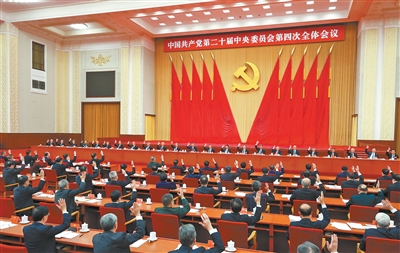
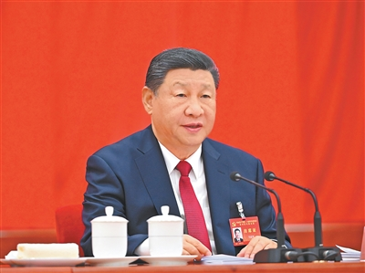

# 二十届四中全会精神学习

## 微党课学习资料

施展 2025年10月30日

---

## 会议基本情况

- **会议名称**：中国共产党第二十届中央委员会第四次全体会议
- **会议时间**：2025年10月20日至23日
- **会议地点**：北京
- **出席人员**：中央委员168人，候补中央委员147人

[二十届四中全会在京举行](https://cpc.people.com.cn/n1/2025/1024/c64094-40588485.html), 新华社

---

## 会议主要议程

1. 听取和讨论习近平总书记受中央政治局委托作的工作报告
2. 审议通过《中共中央关于制定国民经济和社会发展第十五个五年规划的建议》
3. 习近平总书记就《建议（讨论稿）》向全会作说明
4. 决定增补张升民为中共中央军事委员会副主席

---

## 全会充分肯定中央政治局工作

- 认真落实党的二十大和二十届历次全会精神
- 坚持稳中求进工作总基调
- 完整准确全面贯彻新发展理念
- 统筹推进"五位一体"总体布局
- 协调推进"四个全面"战略布局

---

## "十四五"时期重大成就

- 我国发展历程极不寻常、极不平凡
- 经受住世纪疫情严重冲击
- 有效应对一系列重大风险挑战
- 经济实力、科技实力、综合国力跃上新台阶
- 中国式现代化迈出新的坚实步伐

---

## "十五五"时期历史定位

- **关键时期**：基本实现社会主义现代化夯实基础、全面发力
- **重要地位**：承前启后
- **发展环境**：战略机遇和风险挑战并存
- **基本趋势**：长期向好的支撑条件和基本趋势没有变

---

## "十五五"时期指导思想

坚持马克思列宁主义、毛泽东思想、邓小平理论、"三个代表"重要思想、科学发展观，全面贯彻习近平新时代中国特色社会主义思想，深入贯彻党的二十大和二十届历次全会精神。

---

## "十五五"时期必须遵循的原则

- 坚持党的全面领导
- 坚持人民至上
- 坚持高质量发展
- 坚持全面深化改革
- 坚持有效市场和有为政府相结合
- 坚持统筹发展和安全

---

## "十五五"时期主要目标（一）

- 高质量发展取得显著成效
- 科技自立自强水平大幅提高
- 进一步全面深化改革取得新突破
- 社会文明程度明显提升

---

## "十五五"时期主要目标（二）

- 人民生活品质不断提高
- 美丽中国建设取得新的重大进展
- 国家安全屏障更加巩固
- 到2035年基本实现社会主义现代化

---

## 建设现代化产业体系

- 坚持把发展经济的着力点放在实体经济上
- 坚持智能化、绿色化、融合化方向
- 加快建设制造强国、质量强国、航天强国等
- 构建以先进制造业为骨干的现代化产业体系

---

## 加快高水平科技自立自强

- 抓住新一轮科技革命和产业变革历史机遇
- 统筹教育强国、科技强国、人才强国建设
- 提升国家创新体系整体效能
- 全面增强自主创新能力，抢占科技发展制高点

---

## 建设强大国内市场

- 坚持扩大内需这个战略基点
- 惠民生和促消费、投资于物和投资于人紧密结合
- 以新需求引领新供给，以新供给创造新需求
- 坚决破除阻碍全国统一大市场建设卡点堵点

---

## 全面从严治党

- 以党的自我革命引领社会革命
- 持之以恒推进全面从严治党
- 推进党的作风建设常态化长效化
- 坚定不移开展反腐败斗争
- 为实现"十五五"目标提供坚强保证

---

## 全会号召

全党全军全国各族人民要更加紧密地团结在以习近平同志为核心的党中央周围，为基本实现社会主义现代化而共同奋斗，不断开创以中国式现代化全面推进强国建设、民族复兴伟业新局面！

---

# 谢谢观看

## 学习贯彻全会精神

## 为实现中华民族伟大复兴贡献力量
