# 性能预测技术与服务质量保障

<!-- _class: lead -->

**施展**
武汉光电国家研究中心
光电信息存储研究部

<https://shizhan.github.io/>
<https://shi_zhan.gitee.io/>

---

## 内容大纲

<!-- paginate: true -->

<style scoped>
  li {
    font-size: 45px;
  }
  .columns {
    display: grid;
    grid-template-columns: 1fr 1fr;
    gap: 2rem;
  }
</style>

- **背景** 云计算与多租户存储

<div class="columns">

<div>

- 挑战一：**干扰**
  - 共享资源的性能竞争
- 挑战二：**违约**
  - SLO 归因与错误预算

</div>

<div>

- 挑战三：**预测**
  - 三条技术路线
- **我们的工作**
  - 2016→2026 演进线

</div>

</div>

---

### 全景图：从多租户到服务质量保障

<style scoped>
  p {
    font-size: 20px;
    text-align: center;
  }
</style>

服务器整合 → 多租户共享 → 性能干扰 → SLO 违约 → **性能预测** → 服务质量保障

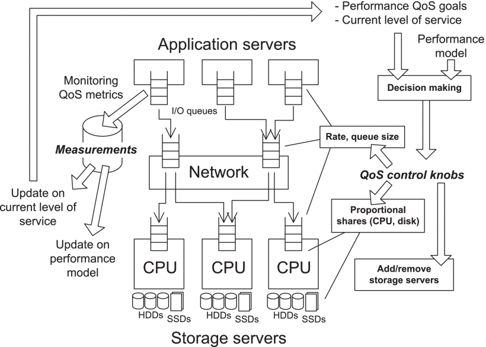

---

## 背景

<style scoped>
  h2 {
    padding-top: 200px;
    text-align: center;
    font-size: 72px;
  }
  p {
    text-align: right;
  }
</style>

云计算与多租户存储

---

### 广泛应用的云


---

<style scoped>
  p {
    padding-top: 620px;
    font-size: 18px;
  }
</style>

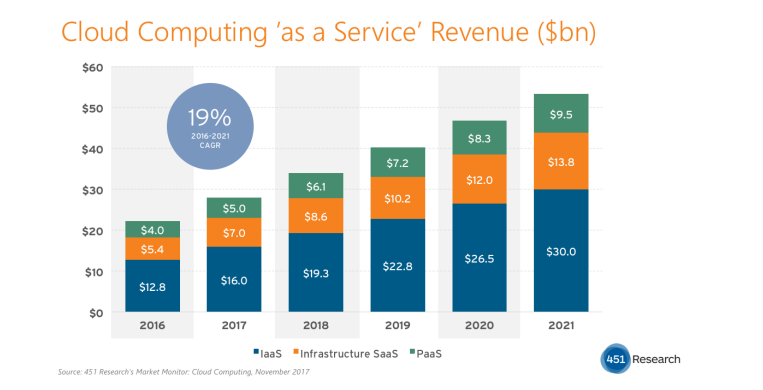

Source: <https://www.kiwiqa.com/top-6-cloud-computing-trends-impacting-cloud-adoption-in-2020/>

---

<style scoped>
  p {
    padding-top: 620px;
    font-size: 18px;
  }
</style>

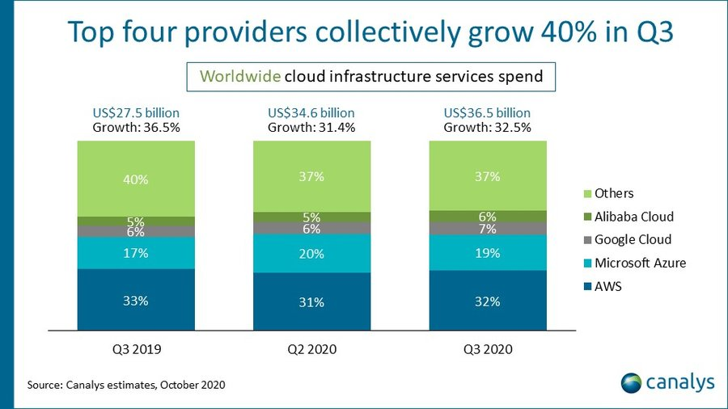

Source: <https://www.canalys.com/newsroom/worldwide-cloud-market-q320>

---

<style scoped>
  p {
    font-size: 72px;
    text-align: center;
    padding: 120px
  }
</style>


Pandemic boosts cloud consumption by a third in Q3 2020

---

## 服务器整合

<style scoped>
  p {
    font-size: 18px;
  }
</style>

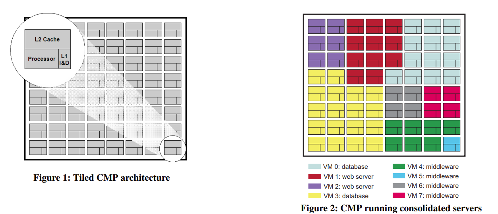

Source: [Virtual hierarchies to support server consolidation, ISCA '07](https://dl.acm.org/doi/10.1145/1250662.1250670)

---

### 机遇

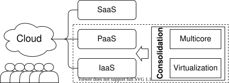

---

### 意义


---

### 更丰富意义

<style scoped>
  p {
    font-size: 18px;
  }
</style>

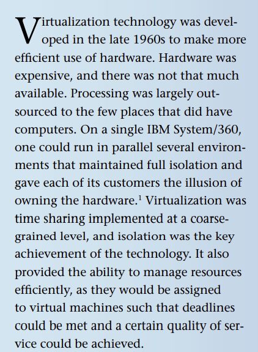

1) 规模化应用部署
2) 扩展、可靠和安全
3) **使能服务质量保障**

Source: [Beyond Server Consolidation, Queue 2008](https://dl.acm.org/doi/10.1145/1348583.1348590)

---

## 多租户存储

<style scoped>
  p {
    font-size: 18px;
  }
</style>

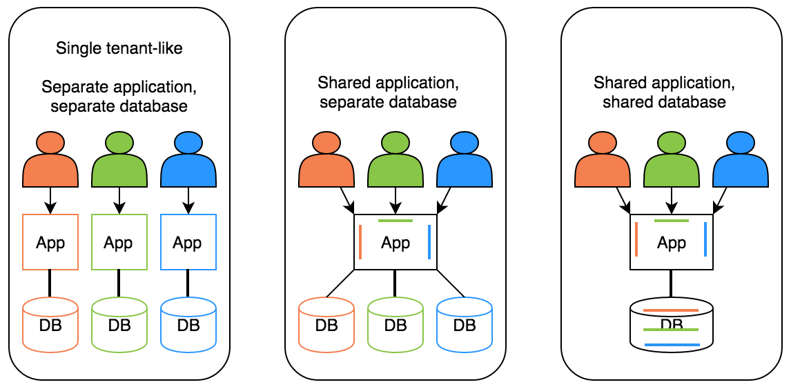

Source: [What is a multi-tenant system?](https://www.prudentdevs.club/mts/)

---

## 服务等级协议、服务等级目标、服务等级指标

- **服务等级协议**(SLA)：协议双方签订的**具有法律约束力**的合同
- **服务等级目标**(SLO)：指定服务所提供功能的一种**期望状态**
- **服务等级指标**(SLI)：经过仔细定义的**测量指标**

Source: [SLO（服务等级目标）与 SLA（服务等级协议）](https://xie.infoq.cn/article/eda3b32806bc800173793118e)

---

<style scoped>
  p {
    padding-top: 620px;
    font-size: 20px;
  }
</style>

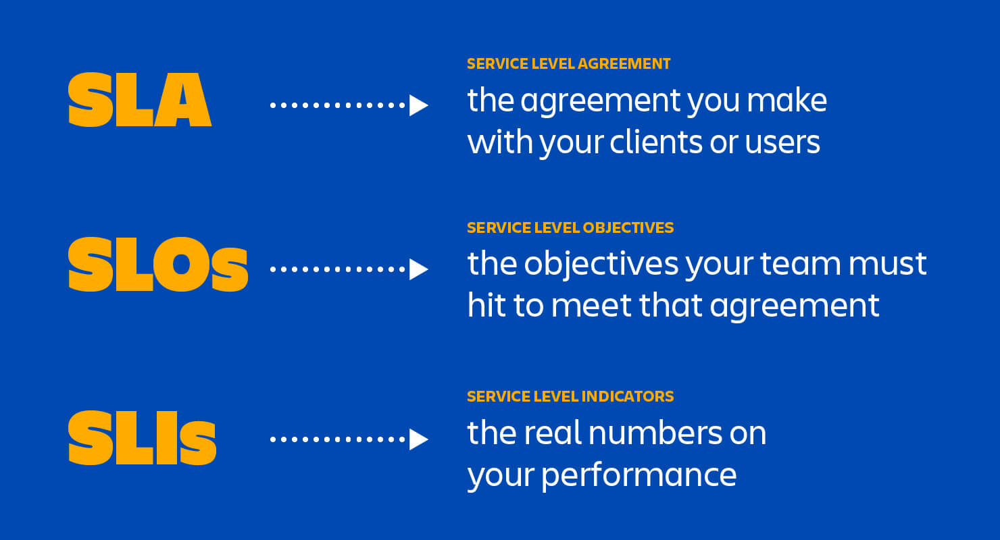

Source: [SLA vs. SLO vs. SLI: What's the difference?](https://www.atlassian.com/incident-management/kpis/sla-vs-slo-vs-sli)

---

### 归纳一下……

<style scoped>
  li {
    font-size: 32px;
    padding: 30px;
  }
</style>

- SLA是法律文书而非技术文档，重在严格约束而非技术实现，**难在协商**
- SLO是细分后的具体目标承诺，重在明确量化而非如何测量，**难在提炼**
- SLI是监控采集的实际观测值，需要精辟选择合适指标，**难在精准观测**

---

### 范例 —— Web 服务器可用性和延迟

- 考察Web服务器**可用性**：成功请求数与请求总数的比率
  - 100个请求成功80个，可用性80%
- 考察Web**服务延迟**：阈值时间内完成的操作比率
  - 10ms内返回80个，延迟满足率80%

Source: [服务级别指标(SLI)和服务级别目标(SLO)示例](https://docs.microsoft.com/zh-cn/learn/modules/improve-reliability-monitoring/7-sli-slo)

---

### 一般评价标准

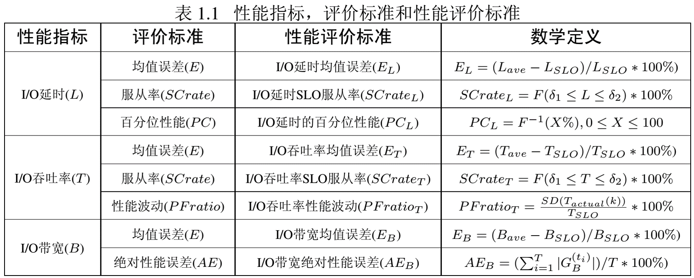

---

### 小结：从"什么是 QoS"到"为什么 QoS 难"

<style scoped>
  li {
    font-size: 30px;
    padding: 20px;
  }
</style>

- QoS 保障的核心：在共享环境中满足每个租户的 SLO
- 难点一：**性能干扰**——共享资源下的性能竞争
- 难点二：**SLO 违约**——归因分解与错误预算管理
- 难点三：**性能预测**——如何从被动响应到主动调控

---

## 挑战一：性能干扰

<style scoped>
  h2 {
    padding-top: 200px;
    text-align: center;
    font-size: 72px;
  }
</style>

共享资源下的性能竞争

---

### 过度供应

<style scoped>
  p {
    font-size: 18px;
  }
</style>

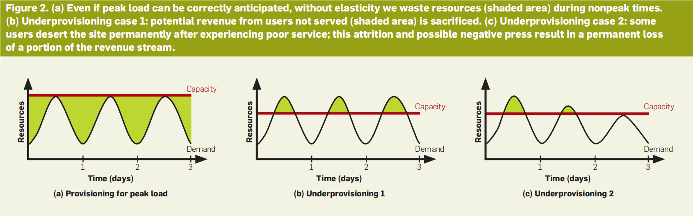

Source: [A View of Cloud Computing. CACM 2010](https://dl.acm.org/doi/10.1145/1721654.1721672)

---

### 性能干扰

<style scoped>
  p {
    font-size: 18px;
  }
</style>

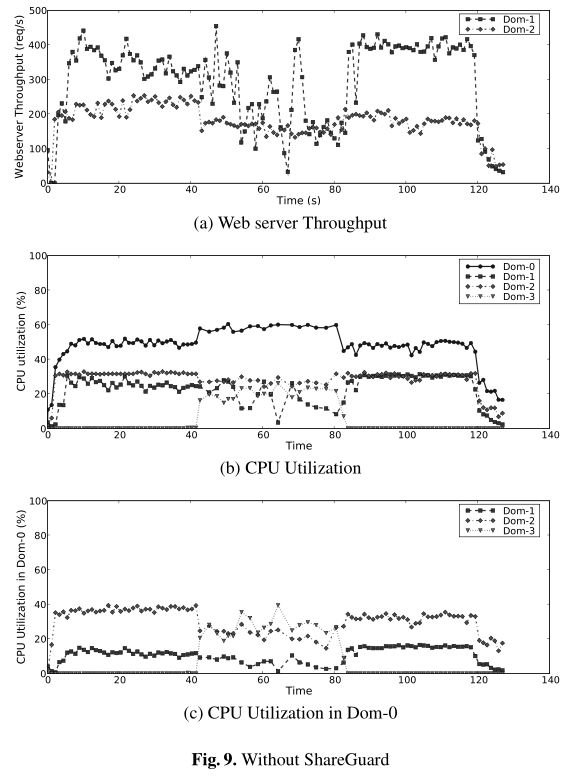 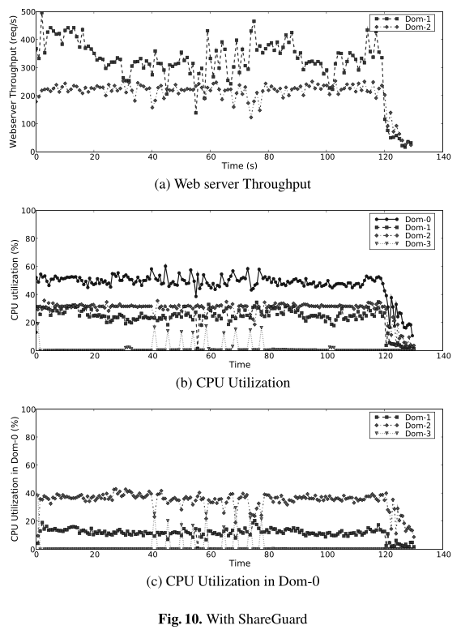

Source: [Enforcing performance isolation across virtual machines in Xen, Middleware '06](https://dl.acm.org/doi/10.5555/1515984.1516011)

---

### 经典机制概览

<style scoped>
  li {
    font-size: 30px;
    padding: 15px;
  }
</style>

- **操作系统**：I/O 管理器
- **虚拟化环境**：虚拟机管理器（VMM）
- **存储系统**：I/O 调度模块

---

### 公平排队的悠久历史

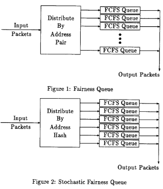

网络领域很早就开始探索……

- [Stochastic fairness queueing, INFOCOM '90](https://ieeexplore.ieee.org/document/91316)
- [On Measuring Fairness in Queues, Advances in Applied Probability 2004](https://www.jstor.org/stable/4140415)

---

### 案例1：cgroup (Linux内核)

<style scoped>
  li {
    font-size: 25px;
  }
  p {
    font-size: 20px;
    text-align: center;
  }
</style>

- [Block IO Controller](https://www.kernel.org/doc/html/latest/admin-guide/cgroup-v1/blkio-controller.html)
  - [BFQ (Budget Fair Queueing)](https://www.kernel.org/doc/html/latest/block/bfq-iosched.html)

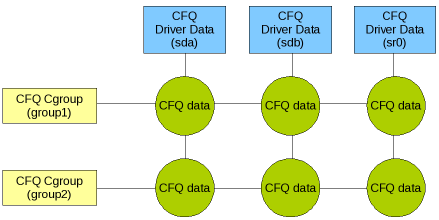

Source: [Variations on fair I/O schedulers](https://lwn.net/Articles/309400/), 2008

---

### BFQ 原理

<style scoped>
  li {
    font-size: 25px;
  }
</style>

- **预算公平**：为每个 I/O 进程分配时间预算
- **权重分配**：按 cgroup 权重比例分配带宽
- **低延迟保证**：交互式请求优先调度
- **局限**：公平 ≠ 满足 SLO——权重相等不保证延迟相等

---

### 案例2：libvirt (KVM, Xen, VMware, QEMU)

<style scoped>
  li {
    font-size: 25px;
  }
  p {
    font-size: 20px;
  }
</style>

- [virsh blkiotune](https://www.libvirt.org/manpages/virsh.html#blkiotune)
- [Quality of Service (QoS) in OpenStack](https://wiki.openstack.org/wiki/QoS)

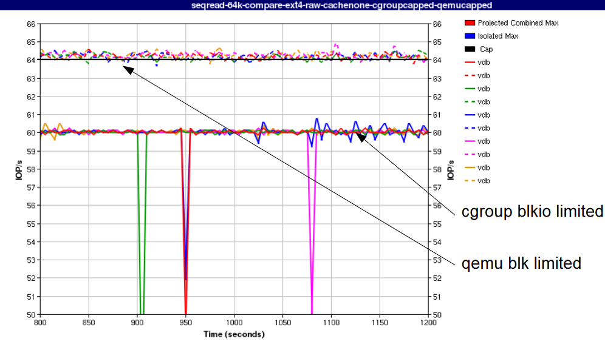 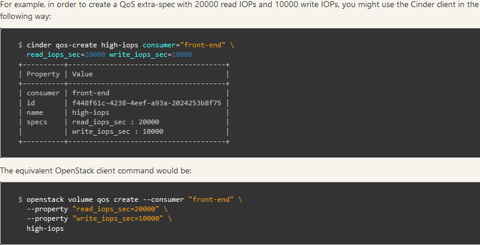

Source: [IO Throttling in QEMU](https://www.linux-kvm.org/images/7/72/2011-forum-keep-a-limit-on-it-io-throttling-in-qemu.pdf)

---

### OpenStack QoS 实践

<style scoped>
  li {
    font-size: 25px;
  }
</style>

- 前端限速：QEMU `io throttling` 配置 IOPS/BPS 上限
- 后端调度：Ceph RBD QoS 通过 `dmclock` 调度
- **局限**：静态阈值无法适应负载波动——突发流量被误杀

---

### 案例3：Object Storage (Ceph)

<style scoped>
  li {
    font-size: 25px;
  }
  p {
    font-size: 20px;
  }
</style>

- [QoS Study with mClock and WPQ Schedulers](https://ceph.com/en/news/blog/2021/qos-study-with-mclock-and-wpq-schedulers/)
- [The dmclock distributed quality of service algorithm](https://github.com/ceph/dmclock)

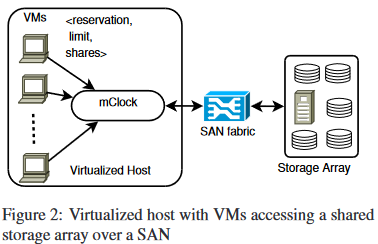 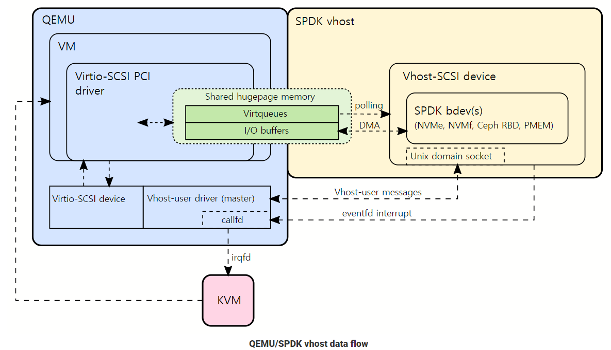

Source: [mClock, OSDI'10](https://www.usenix.org/legacy/events/osdi10/tech/)

---

### mClock 原理

<style scoped>
  li {
    font-size: 25px;
  }
</style>

- **预留**：每个客户端获得最低 IOPS 保证
- **权重**：超出预留部分按权重比例分配
- **上限**：限制客户端最大资源使用
- **分布式扩展**：dmclock 跨节点协调
- **局限**：参数静态配置，无法动态适应负载变化

---

### 静态分配的困境

<style scoped>
  li {
    font-size: 28px;
    padding: 15px;
  }
</style>

- 公平 ≠ 满足 SLO：权重相等不保证延迟达标
- 静态阈值无法应对动态负载
- 过度保守 → 资源浪费；过度激进 → SLO 违约
- **核心矛盾**：需要**预测**负载才能做出正确的资源决策

---

### 小结：挑战一归纳

<style scoped>
  li {
    font-size: 30px;
    padding: 20px;
  }
</style>

- 性能干扰**不可完全消除**——多租户共享是云的本质
- 经典机制提供**公平性**，但不保证 **SLO 合规**
- 从被动隔离到主动调控：**需要预测**负载与性能

---

## 挑战二：SLO 违约与错误预算

<style scoped>
  h2 {
    padding-top: 200px;
    text-align: center;
    font-size: 72px;
  }
</style>

SLO 违约的归因与预算

---

### 回指：长尾现象的三条结论

<style scoped>
  li {
    font-size: 28px;
    padding: 10px;
  }
  blockquote {
    font-size: 20px;
    color: #666;
  }
</style>

1. **规模是小概率事件的放大器**——组件越多，遇上慢组件的概率越高
2. **平均值掩盖尾部**——均值正常不代表用户体验正常
3. **百分位才是有意义的承诺**——P99 / P999 而非 mean

本讲不再重复现象成因，而是回答下一个问题：
**承诺了 P99，违约了怎么办？**

> 长尾的产生机理、经典应对（容错/容滞/对冲/关联请求）与工业案例，详见《对象存储》挑战二

---

### SLO 违约的三类成因

<style scoped>
  table {
    font-size: 24px;
  }
  p {
    font-size: 22px;
  }
</style>

| 类型 | 触发源 | 时间特征 | 典型场景 |
|------|--------|---------|---------|
| **干扰型** | 邻居租户抢占共享资源 | 与邻居负载同步 | 吵闹邻居、突发批处理 |
| **波动型** | 设备自身状态变化 | 周期性 / 阶跃 | SSD 垃圾回收、磨损均衡、副本重构 |
| **排队型** | 本租户负载超出配额 | 与自身负载同步 | 流量峰值、队头阻塞 |

违约不是一种病，是**三种病共用一个症状**

---

### 为什么要做成因分解

<style scoped>
  table {
    font-size: 25px;
  }
  p {
    font-size: 23px;
  }
</style>

| 成因 | 对应治理手段 | 归错因的后果 |
|------|-------------|-------------|
| 干扰型 | 隔离与配额（挑战一的机制） | 误加自身限流 → 白白降低吞吐 |
| 波动型 | 冗余、对冲、**设备状态预测** | 误判为邻居干扰 → 无谓迁移租户 |
| 排队型 | 准入控制、调度优先级 | 误判为设备故障 → 触发无效重构 |

**归错因则治错病**——这是把 SLO 从"监控指标"变成"可执行调控"的第一步

---

### 多租户下的尾延迟叠加

<style scoped>
  p {
    font-size: 23px;
  }
  table {
    font-size: 23px;
  }
</style>

租户 $i$ 只要有**任一邻居**处于突发态，就可能被拖累：

$$P_i(\text{违约}) = 1 - \prod_{j \neq i}\left(1 - p_j\right)$$

| 共享租户数 $N$ | 单租户突发概率 $p=2\%$ | 违约概率 |
|:---:|:---:|:---:|
| 4 | 2% | 5.9% |
| 8 | 2% | 13.2% |
| 32 | 2% | 46.6% |

**与《对象存储》的区别**：那里是一个请求**扇出**到 100 台服务器（fan-out）；这里是 $N$ 个租户**扇入**同一台设备（fan-in）。同样的代数，相反的拓扑。

---

### 错误预算 Error Budget

<style scoped>
  table {
    font-size: 25px;
  }
  p {
    font-size: 23px;
  }
</style>

SLO 的补集不是"失败"，而是一笔**可以花的预算**：

$$\text{Error Budget} = (1 - \text{SLO}) \times \text{统计窗口}$$

| SLO | 30 天窗口内的违约额度 |
|:---:|:---|
| 99% | 7 小时 12 分 |
| **99.9%** | **43.2 分钟** |
| 99.99% | 4.32 分钟 |
| 99.999% | 25.9 秒 |

思路转变：从"**不许违约**"到"**违约是可管理的预算**"——预算没花完，就可以拿去换升级、换成本、换新特性

---

### 错误预算的分配与消耗

<style scoped>
  li {
    font-size: 24px;
  }
  table {
    font-size: 22px;
  }
  p {
    font-size: 21px;
  }
</style>

**燃尽速率**：$\text{burn rate} = \dfrac{\text{实测违约率}}{1 - \text{SLO}}$，为 1 时预算恰好在窗口末尾用尽

| 燃尽速率 | 观测窗口 | 消耗预算 | 告警级别 |
|:---:|:---:|:---:|:---|
| 14.4× | 1 小时 | 2% | 紧急呼叫 |
| 6× | 6 小时 | 5% | 紧急呼叫 |
| 3× | 1 天 | 10% | 工单 |
| 1× | 3 天 | 10% | 工单 |

- **多窗口多速率**告警：既抓快速烧穿，也抓慢性泄漏
- 预算在**租户间**按付费等级分配，在**故障类型间**按成因分账

Source: [Google SRE Workbook, Ch.5 Alerting on SLOs](https://sre.google/workbook/alerting-on-slos/)

---

### 对冲请求的反噬

<style scoped>
  li {
    font-size: 23px;
    padding: 6px;
  }
  p {
    font-size: 22px;
  }
  blockquote {
    font-size: 20px;
    color: #666;
  }
</style>

《对象存储》给出的经典解法——**对冲请求**（P95 未返回则发副本请求）——在多租户下会**反噬**：

- 对冲请求消耗的是**共享设备的真实 IOPS**，不是免费的
- 触发时机恰是设备最拥塞时 → 边际代价远高于名义的 5% 额外请求量
- 本质是**拿 B 租户的预算补 A 租户**——A 的 P99 改善了，B 的错误预算被悄悄花掉
- 正反馈风险：拥塞 → 对冲 → 负载升高 → 更拥塞（**对冲风暴**）

**多租户下的修正**：为对冲设置**每租户配额**，并将跨租户对冲的开销**计入发起方的错误预算**

> 单机视角的最优解，在多租户视角下可能是负和博弈——这是方法层必须重新审视现象层结论的原因

---

### MittOS：毫秒级尾延迟容忍

<style scoped>
  li {
    font-size: 25px;
  }
</style>

- [MittOS: Supporting Millisecond Tail Tolerance with Fast Rejecting SLO-Aware OS Interface](https://dl.acm.org/doi/10.1145/3132747.3132774), SOSP 2017
- 核心思想：**快速拒绝**——当系统无法在 SLO 内完成时，立即返回错误
- 应用端可通过重试或降级处理，而非等待超时

---

### 小结：从被动容滞到主动调控

<style scoped>
  li {
    font-size: 26px;
    padding: 12px;
  }
  p {
    font-size: 22px;
  }
</style>

- 违约有**三类成因**，归错因则治错病
- 错误预算把 SLO 从**布尔判定**变成**可分配的资源**
- 三类成因的治理都指向同一个前提：**提前知道会违约**
  - 干扰型 → 预测邻居负载 | 波动型 → 预测设备状态 | 排队型 → 预测自身流量

事后容滞的天花板已经触到了——下一步必须**预测**

---

### MAPE 闭环：从监控到执行

<style scoped>
  li {
    font-size: 25px;
  }
  p {
    font-size: 18px;
  }
</style>


- **M**onitoring QoS metrics
- **A**nalyzing divergence
- **P**lanning decisions
- **E**xecuting actions

Source: [Decision-Making Approaches for Performance QoS, TPDS 2019](https://ieeexplore.ieee.org/document/8618414)

---

## 挑战三：性能预测

<style scoped>
  h2 {
    padding-top: 200px;
    text-align: center;
    font-size: 72px;
  }
</style>

三条技术路线

---

### 问题描述

<style scoped>
  li {
    font-size: 25px;
  }
</style>

- 目标
  - $(r_i, l^{r}_i, l^{w}_i)$：租户 $i$ 的吞吐与读/写延迟 SLO
  - ${Average\ latency\ over\ time}\ w \leq f_r\cdot l^{r}_i + (1 - f_r)\cdot l^{w}_i$
- 方法分类
  - **静态**：任务初始资源如何分配
  - **动态**：负载、系统变化如何动态适应

---

### 三条技术路线概览

<style scoped>
  table {
    font-size: 22px;
  }
  th {
    background: #e0e0e0;
  }
</style>

| 方法 | 核心思想 | 代表工作 | 优势 | 局限 |
|------|---------|---------|------|------|
| **控制论** | 反馈闭环调控 | PSLO (EuroSys'16) | 理论保证 | 依赖模型 |
| **约束优化** | 全局最优求解 | CoFS (TCAD'24) | 全局最优 | 求解开销 |
| **机器学习** | 数据驱动预测 | Graph3PO (SC'23) | 自适应 | 训练成本 |

---

### 方法一：控制论


反馈控制系统：测量输出 → 比较设定值 → 计算控制量 → 调整输入

---

### PI 控制器原理

<style scoped>
  li {
    font-size: 25px;
  }
</style>

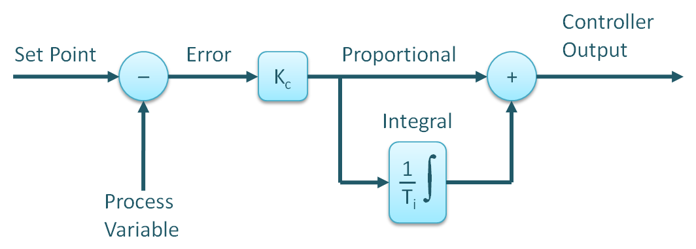

- **比例 (P)**：当前误差 × 增益 $K_p$，快速响应
- **积分 (I)**：累积误差 × 增益 $K_i$，消除稳态误差
- 用于延迟调控：设定 SLO → 测量实际延迟 → PI 计算资源调整量

Source: [PID Controllers Explained](https://blog.opticontrols.com/archives/344)

---

### PSLO 方法 (EuroSys'16)

<style scoped>
  li {
    font-size: 25px;
  }
</style>

- [PSLO: enforcing the Xth percentile latency and throughput SLOs for consolidated VM storage](https://dl.acm.org/doi/10.1145/2901318.2901330)
- **目标**：强制执行 Xth 百分位延迟与吞吐 SLO
- **方法**：
  - PI 控制器监控百分位延迟
  - 动态调整 VM 存储资源配额
  - 合并多 VM 的 SLO 约束

---

### PSLO 效果

<style scoped>
  li {
    font-size: 24px;
  }
  p {
    font-size: 21px;
  }
  blockquote {
    font-size: 19px;
    color: #666;
  }
</style>

- 合并 VM 存储后，**百分位延迟 SLO 得到强制执行**
- 吞吐 SLO 同时满足，控制器收敛快、稳态误差小
- **这个结果说明了什么**：只要能建出可控模型，百分位延迟这种**统计量**也能被闭环控制——控制论并非只适用于均值

> PSLO 在课题组研究脉络中的位置，见后文「我们的工作」（EuroSys'16 作为演进线起点；此处为控制论方法代表案例，完整讲解不重复）

反过来，它也划出了这条路线的边界：模型一旦不准，控制器就失灵

> 该工作在课题组研究脉络中的位置，见后文「我们的工作」

---

### 控制论方法小结

<style scoped>
  li {
    font-size: 28px;
    padding: 12px;
  }
</style>

- ✅ **优点**：理论保证（稳定性、收敛性可证明）
- ✅ **优点**：在线计算开销小
- ❌ **局限**：依赖精确的系统模型
- ❌ **局限**：对非线性、突发性负载响应慢
- ❌ **局限**：多变量耦合时控制器设计复杂

---

### 方法二：约束优化

<style scoped>
  p {
    font-size: 20px;
  }
</style>

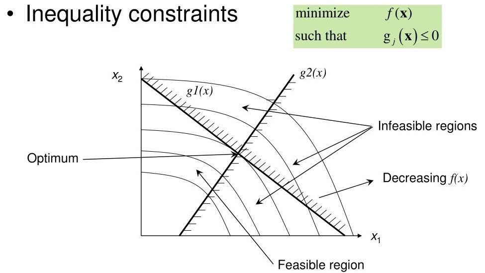

将 QoS 保障建模为优化问题：目标函数 + SLO 约束 + 资源约束

---

### 优化模型

<style scoped>
  li {
    font-size: 24px;
  }
</style>

$$\max \sum_i w_i \cdot QoS_i \quad \text{s.t.} \quad l_i \leq l^{SLO}_i,\ \forall i; \quad \sum_i r_i \leq R_{total}$$

- **目标**：最大化加权 QoS 满足度
- **约束1**：每个租户延迟不超过 SLO
- **约束2**：资源分配总量不超过系统容量
- **求解**：线性规划 / 整数规划 / 启发式

---

### CoFS 方案 (TCAD'24)

<style scoped>
  li {
    font-size: 24px;
  }
</style>

- [CoFS: NVMe SSD 协作感知公平性方案](https://ieeexplore.ieee.org/document/10247718)
- **观察**：多租户 NVMe SSD 上，租户间存在协作机会
- **方法**：
  - 识别租户 I/O 模式的协作性
  - 将公平性约束嵌入优化模型
  - NVMe 多队列调度实现协作感知分配
- **在 M2 视角**：作为"约束优化"方法的代表——SLO 约束 → 全局最优
- **M3 设备层视角**：CoFS 的 NVMe 队列协作感知调度机制将在 M3《闪存存储系统设计》中展开

---

### CoFS 效果

<style scoped>
  li {
    font-size: 25px;
  }
</style>

- 多租户 SLO 合规率显著提升
- 公平性指数（Jain's Index）改善
- 对比静态分配：吞吐不降反升——协作感知释放了并行潜力
- **系统层视角**：约束优化在分布式存储 QoS 中的应用范例

---

### 约束优化方法小结

<style scoped>
  li {
    font-size: 28px;
    padding: 12px;
  }
</style>

- ✅ **优点**：全局最优解（理论上）
- ✅ **优点**：可同时处理多约束
- ❌ **局限**：求解开销随规模增长
- ❌ **局限**：模型精度依赖系统建模
- ❌ **局限**：实时性要求高时需近似求解

---

### 方法三：机器学习

<style scoped>
  p {
    font-size: 20px;
  }
</style>


从"反应式"到"预测式"：用数据驱动方法学习系统行为

---

### 为什么 ML？

<style scoped>
  li {
    font-size: 28px;
    padding: 15px;
  }
</style>

- **非线性系统建模**：真实存储系统不是简单队列
- **负载特征学习**：自动提取时序模式与相关性
- **自适应能力**：模型随环境变化在线更新
- **多变量耦合**：高维输入无需手动建模

---

### 排队论的适用边界

<style scoped>
  table {
    font-size: 22px;
  }
  p {
    font-size: 21px;
  }
  blockquote {
    font-size: 19px;
    color: #666;
  }
</style>

排队论能给出延迟分布的解析解，但 M/M/1 的三条假设在真实系统都会破：

| 假设 | 真实系统的偏离 | 后果 |
|------|--------------|------|
| 到达服从**泊松过程** | 请求成批到达、存在自相关 | 低估队列长度与尾部 |
| 服务时间服从**指数分布** | SSD 有 GC 停顿，服务时间**双峰** | 尾部预测严重偏低 |
| **单队列单服务台** | 多副本、多磁盘、多级缓存并联 | 需逐一手工建模，扩展性差 |

假设越贴近真实，模型越难解析求解——这正是**机器学习方法**的切入点

> 排队论建模的完整推导（联合操作抽象、accept() 等待时间建模、4.44% 平均误差）详见《对象存储》挑战三

---

### 机器学习方法：从特征工程到图学习

<style scoped>
  table {
    font-size: 22px;
  }
  p {
    font-size: 21px;
  }
</style>

| 代际 | 输入表示 | 能捕捉的关系 | 局限 |
|------|---------|------------|------|
| 特征工程 + 回归 | 手工统计量向量 | 单点相关 | 依赖专家先验，丢失结构 |
| 时序模型（RNN/LSTM） | 指标时间序列 | **时间**依赖 | 忽略组件间拓扑 |
| 图神经网络 | 组件拓扑图 | **空间**依赖 | 忽略动态演化 |
| **时序图** | 拓扑 + 时间双维 | 空间 $\times$ 时间 | 训练与推理开销高 |

**时序图的抽象**：节点 = 存储组件（OSD / 磁盘 / 缓存），边 = 数据通路与依赖，节点属性随时间演化 = 负载与延迟

尾延迟的成因往往是**某个组件在某个时刻**变慢并沿数据通路传播——这恰是时序图能表达而前三代不能的

---

### 机器学习方法小结

<style scoped>
  li {
    font-size: 28px;
    padding: 12px;
  }
</style>

- ✅ **优点**：自适应非线性系统
- ✅ **优点**：自动学习负载特征
- ❌ **局限**：训练数据需求大
- ❌ **局限**：模型可解释性差
- ❌ **局限**：在线推理开销

---

### 三方法对比

<style scoped>
  table {
    font-size: 20px;
  }
  th {
    background: #e0e0e0;
  }
</style>

| 维度 | 控制论 | 约束优化 | 机器学习 |
|------|--------|---------|---------|
| 理论保证 | ✅ 强 | ✅ 强 | ❌ 弱 |
| 非线性适应 | ❌ 弱 | ⚠️ 中 | ✅ 强 |
| 实时性 | ✅ 高 | ⚠️ 中 | ⚠️ 中 |
| 可解释性 | ✅ 高 | ✅ 高 | ❌ 低 |
| 部署成本 | ⚠️ 中 | ❌ 高 | ❌ 高 |

---

### 如何精确控制？

<style scoped>
  li {
    font-size: 25px;
  }
</style>

- 波动性与突发性问题
  - 比例积分控制？
  - 机器学习序列预测？
  - ……
- **组合可能**：控制论提供闭环框架 + ML 提供预测能力 + 优化提供决策方法

---

### 扩展阅读

<style scoped>
  li {
    font-size: 22px;
  }
</style>

- 时间序列 ML 延迟预测：LPNS, TTLoC
- RL-Watchdog：强化学习监控异常
- [EuroSys'19](https://dl.acm.org/doi/proceedings/10.1145/3304265)：更多 QoS 保障工作

---

### 三挑战归纳

<style scoped>
  p {
    font-size: 24px;
    text-align: center;
  }
</style>

**干扰** → 不可控的性能竞争
↓
**违约** → 可归因、可预算的 SLO 偏离
↓
**预测** → 从被动到主动的调控

三条路线殊途同归：**预测是 QoS 保障的关键**

---

### 过渡：我们的工作

<style scoped>
  p {
    font-size: 28px;
    text-align: center;
    padding-top: 200px;
  }
</style>

2016 → 2026：从控制论到图预测的方法论演进

本讲聚焦**系统层** QoS 保障，**设备层**优化见 M3《闪存存储系统设计》

---

## 我们的工作：2016→2026 演进线

<style scoped>
  h2 {
    padding-top: 200px;
    text-align: center;
    font-size: 72px;
  }
</style>

---

### 演进总览

<style scoped>
  li {
    font-size: 22px;
  }
  p {
    font-size: 18px;
    text-align: center;
  }
</style>

| 年份 | 工作 | 方法 | 会议/期刊 |
|------|------|------|----------|
| 2016 | PSLO | 控制论 | EuroSys |
| 2017 | Customizable SLO | 控制论 | ToS |
| 2017 | 延迟分布预测 | 排队论 | ICPP |
| 2019 | SLO 合规优化 | 约束优化 | ToSC |
| 2019 | 延迟分布理解 | 排队论 | JPDC |
| 2023 | Graph3PO | 机器学习 | SC |
| 2025 | SPFaaS | 序列预测 | TPDS |
| 2026 | STGraph3PO | 时空图 | TACO |
| 2026 | KGQW | 知识图谱 | TPDS |

本表为**系统层 QoS 主线** 9 篇；设备层三篇（ICCD'22 / DAC'23 / CoFS TCAD'24）见《闪存存储系统设计》

---

### PSLO (EuroSys'16)

<style scoped>
  li {
    font-size: 24px;
  }
</style>

- [PSLO: enforcing the Xth percentile latency and throughput SLOs](https://dl.acm.org/doi/10.1145/2901318.2901330)
- **贡献**：首次将 PI 控制器用于百分位延迟 SLO 强制执行
- **方法**：监控 → 误差计算 → PI 控制器 → 资源配额调整
- **里程碑**：开启课题组"用预测保障 QoS"研究主线


---

### Customizable SLO (ToS'17)

<style scoped>
  li {
    font-size: 25px;
  }
</style>

- [Customizable SLO and Its Near-Precise Enforcement for Storage Bandwidth](https://dl.acm.org/doi/10.1145/2998454)
- **贡献**：可定制 SLO 语义 + 近精确执行
- **突破**：从固定 SLO 到用户自定义 SLO 形态
- **方法**：基于控制论的带宽分配近精确执行

---

### SLO 合规与性能可变性 (ToSC'19)

<style scoped>
  li {
    font-size: 25px;
  }
</style>

- [Storage Sharing Optimization Under Constraints of SLO Compliance and Performance Variability](https://ieeexplore.ieee.org/document/7498602)
- **贡献**：在 SLO 合规约束下优化存储共享
- **方法**：约束优化模型——性能可变性作为约束
- **意义**：将控制论与优化方法结合

---

### 延迟分布预测 (ICPP'17 + JPDC'19)

<style scoped>
  li {
    font-size: 24px;
  }
</style>

- [Predicting Response Latency Percentiles, ICPP 2017](https://ieeexplore.ieee.org/document/8025298)
- [Understanding the latency distribution, JPDC 2019](http://www.sciencedirect.com/science/article/pii/S0743731518301175)
- **贡献**：云对象存储延迟分布建模与百分位预测
- **关键创新**：联合操作抽象 + accept() 等待建模
- **效果**：平均误差 4.44%，最坏 16.61%
- **在演进线中的位置**：解析建模的**高峰**，也是其**边界**——假设一旦放宽便不可解，由此转向机器学习

> 建模细节与实验图表详见《对象存储》挑战三

---

### 设备层对偶：同一项目的另一半

<style scoped>
  table {
    font-size: 22px;
  }
  p {
    font-size: 21px;
  }
  blockquote {
    font-size: 19px;
    color: #666;
  }
</style>

课题组在**设备层**同期开展了三项工作，与本讲的系统层预测同属一个研究项目：

| 年份 | 工作 | 设备层问题 | 与系统层的对应 |
|------|------|-----------|--------------|
| 2022 | 多因子缓存替换 (ICCD) | 缓存该淘汰谁 | 对应系统层的负载预测 |
| 2023 | Fair Will Go On (DAC) | 并行度与公平性冲突 | 对应系统层的配额分配 |
| 2024 | CoFS (TCAD) | NVMe 协作感知调度 | 对应系统层的约束优化 |

**一体两面**：系统层用预测**保障 SLO**，设备层用预测**优化 SSD**——同一套预测思想，作用在不同的抽象层

> 三项工作的完整方法与实验，详见专题讲座《闪存存储系统设计：从介质特性到服务质量》

---

### Graph3PO (SC'23)

<style scoped>
  li {
    font-size: 24px;
  }
</style>

- [Graph3PO: A Temporal Graph Data Processing Method](https://dl.acm.org/doi/10.1145/3581784.3607075), SC 2023
- **贡献**：时序图数据处理方法预测延迟 QoS
- **突破**：从排队论到图学习——捕捉空间相关性与时间动态性
- **效果**：对象云存储尾延迟预测精度显著提升

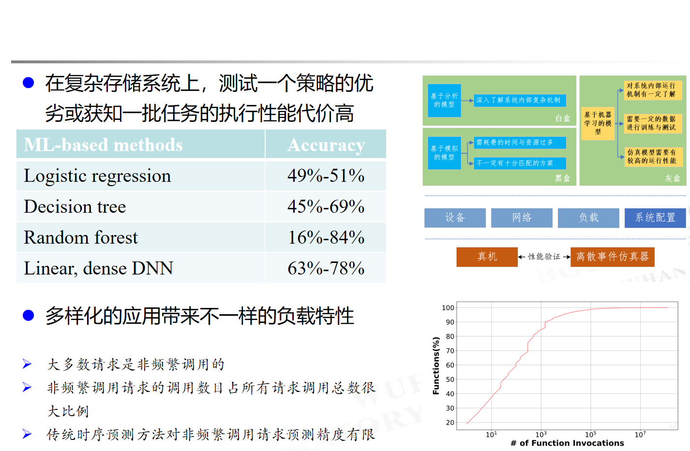

---

### Graph3PO 时序图建模

<style scoped>
  p {
    font-size: 20px;
    text-align: center;
  }
</style>

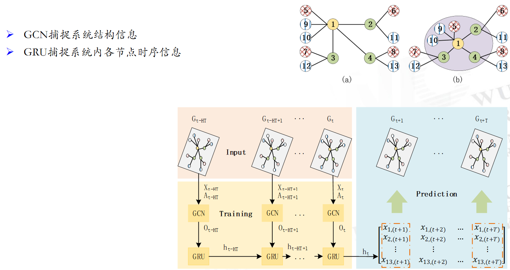

节点 = 存储组件，边 = 数据通路，时序特征 = 请求到达与处理延迟

---

### SPFaaS (TPDS'25)

<style scoped>
  li {
    font-size: 24px;
  }
</style>

- [SPFaaS: Sparse Function Prediction as a Service](https://ieeexplore.ieee.org/xpl/RecentIssue.jsp?punumber=71), IEEE TPDS 2025
- **贡献**：稀疏函数预测——冷启动优化与用户满意度保障
- **方法**：序列预测模型预判函数调用模式
- **意义**：将预测方法从存储 QoS 扩展到 Serverless 场景

---

### STGraph3PO (TACO'26)

<style scoped>
  li {
    font-size: 24px;
  }
</style>

- STGraph3PO: Spatio-Temporal Graph Prediction, ACM TACO 2026
- **贡献**：时空图预测——Graph3PO 的升级版
- **突破**：从时序图到时空图，覆盖异构对象存储
- **效果**：异构环境下 QoS 保障精度进一步提升

---

### KGQW (TPDS'26)

<style scoped>
  li {
    font-size: 24px;
  }
</style>

- KGQW: Knowledge Graph Query Workload Tuning, IEEE TPDS 2026
- **贡献**：知识图谱查询辅助分布式存储参数调优
- **展望定位**：从数据驱动到知识驱动的 QoS 保障
- **意义**：探索"知识增强"的预测与优化新范式

---

### 演进归纳

<style scoped>
  li {
    font-size: 26px;
    padding: 12px;
  }
</style>

方法论演进线：**控制论 → 约束优化 → 机器学习 → 图预测 → 知识图谱**

- 2016-2019：控制论与优化奠基
- 2019-2023：排队论与图学习突破
- 2024-2026：异构场景与知识驱动展望

一以贯之：**用预测方法保障存储系统服务质量**

---

## 课堂演示与实验

<style scoped>
  h2 {
    padding-top: 200px;
    text-align: center;
    font-size: 72px;
  }
</style>

---

### 实践环境

<style scoped>
  li {
    font-size: 25px;
  }
</style>

- 大数据存储实验课 <https://github.com/cs-course/iot-storage-experiment>
- 对象存储入门实验 <https://github.com/cs-course/obs-tutorial>

---

### 实验思路

<style scoped>
  li {
    font-size: 24px;
  }
</style>

- 调节并发数，观察性能约束与提升的空间

```python
with ThreadPoolExecutor(max_workers=1) as executor:
    futures = [executor.submit(access_obs) for i in range(100)]
```

- 尝试反馈控制并发数

```bash
s3bench ... -numClients=8 ...
```

---

### ⚡ POE 预测页

<style scoped>
  p {
    font-size: 28px;
    padding: 30px;
  }
  .highlight {
    background: #fff3cd;
    padding: 20px;
    border-radius: 10px;
  }
</style>

<div class="highlight">

**预测题**（请先写下你的判断，再观看演示）：

突发负载下（并发从 10 突增至 100），以下哪种预测方法误差更大？

A) 移动平均（MA）　　B) ARIMA　　C) 机器学习（Graph3PO）

**理由**：________________

</div>

---

### 演示流程

<style scoped>
  li {
    font-size: 24px;
  }
</style>

- 课前预置：conda 环境 + 数据集 + 基准结果
- 3 段 × 15 min：
  - ① 性能干扰观测（调节并发数 → 观察延迟变化）
  - ② 尾延迟测量（P50/P95/P99 对比）
  - ③ 预测方法对比（MA vs ML 模型）
- 每段后 5 min POE 讨论

---

### 参考文献

<style scoped>
  li {
    font-size: 18px;
  }
</style>

1. [Decision-Making Approaches for Performance QoS in Distributed Storage Systems: A Survey](https://ieeexplore.ieee.org/document/8618414), TPDS 2019.
2. [PSLO: enforcing the Xth percentile latency and throughput SLOs](https://dl.acm.org/doi/10.1145/2901318.2901330), EuroSys 2016.
3. [Customizable SLO and Its Near-Precise Enforcement](https://dl.acm.org/doi/10.1145/2998454), ToS 2017.
4. [Storage Sharing Optimization Under Constraints of SLO Compliance](https://ieeexplore.ieee.org/document/7498602), ToSC 2019.
5. [Predicting Response Latency Percentiles for Cloud Object Storage](https://ieeexplore.ieee.org/document/8025298), ICPP 2017.
6. [Understanding the latency distribution of cloud object storage](http://www.sciencedirect.com/science/article/pii/S0743731518301175), JPDC 2019.
7. [A Multi-Factor Adaptive Multi-Level Cooperative Replacement Policy](https://ieeexplore.ieee.org/document/9978474), ICCD 2022.
8. [Fair Will Go On: A Collaboration-Aware Fairness Scheme](https://ieeexplore.ieee.org/document/10247718), DAC 2023.
9. [Graph3PO: A Temporal Graph Data Processing Method](https://dl.acm.org/doi/10.1145/3581784.3607075), SC 2023.
10. [CoFS: Collaboration-Aware Fairness for NVMe SSD](https://ieeexplore.ieee.org/document/10247718), TCAD 2024.
11. [MittOS: Supporting Millisecond Tail Tolerance](https://dl.acm.org/doi/10.1145/3132747.3132774), SOSP 2017.
12. [Beyond Server Consolidation](https://dl.acm.org/doi/10.1145/1348583.1348590), Queue 2008.
13. [mClock: handling throughput variability for hypervisor IO scheduling](https://dl.acm.org/doi/10.5555/1924943.1924974), OSDI'10.
14. SPFaaS: Sparse Function Prediction as a Service, TPDS 2025.
15. STGraph3PO: Spatio-Temporal Graph Prediction, TACO 2026.
16. KGQW: Knowledge Graph Query Workload Tuning, TPDS 2026.

---

# 致谢与 Q&A

<!-- _class: lead -->

**施展**
武汉光电国家研究中心
光电信息存储研究部

<https://shizhan.github.io/>
<https://shi_zhan.gitee.io/>
