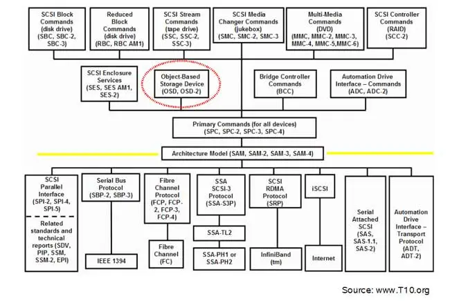
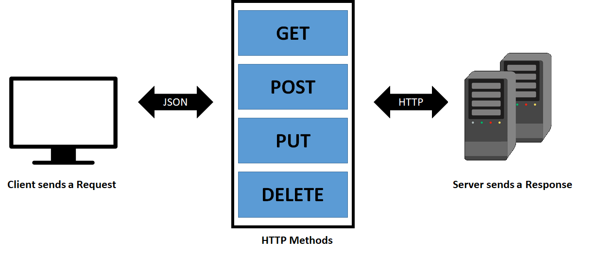
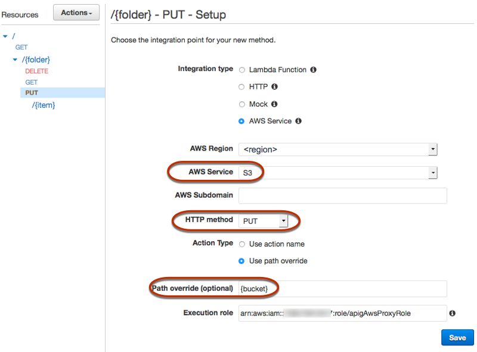
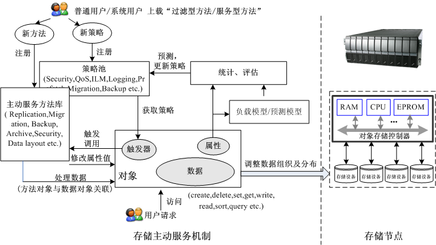
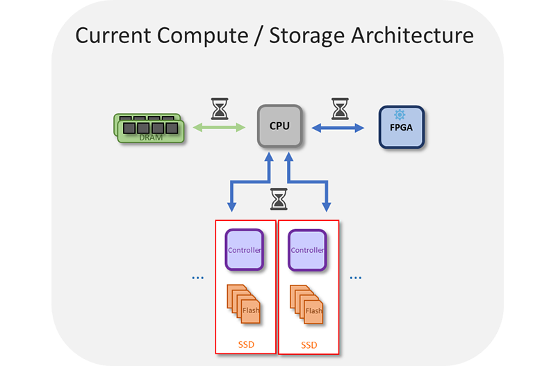
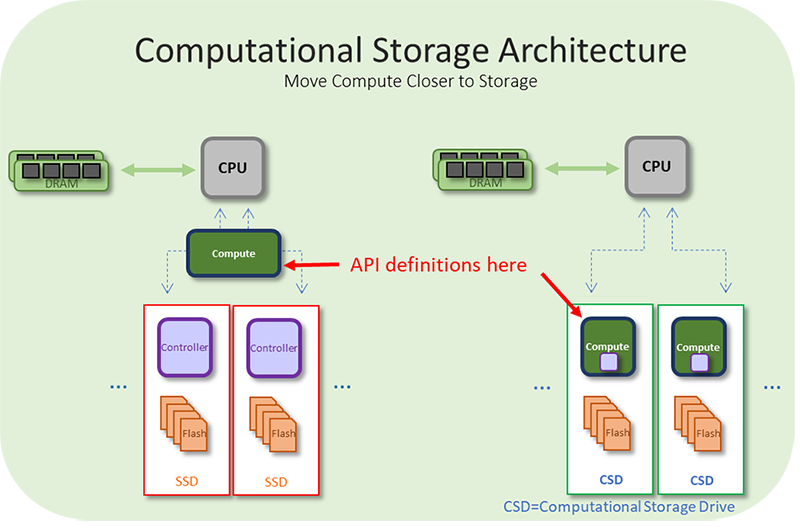

# 面向云应用的系统设计

<!-- _class: lead -->

**施展**
武汉光电国家研究中心
光电信息存储研究部

<https://shizhan.github.io/>
<https://shi_zhan.gitee.io/>

---

## 内容大纲

<!-- paginate: true -->

- 云服务背景
- 对系统的挑战
- 对系统设计的影响
- for (云服务的发展):
  - 新的挑战
  - 对系统的探索

---

## 广泛应用的云

---

## 数据洪流

<style scoped>
  p {
    font-size: 20px;
    text-align: right;
  }
</style>


Source: <https://www.datanami.com/2018/11/27/global-datasphere-to-hit-175-zettabytes-by-2025-idc-says/>

---


---

<style scoped>
  p {
    font-size: 20px;
    text-align: center;
  }
</style>


Source: <https://www.smartinsights.com/internet-marketing-statistics/happens-online-60-seconds/>

---

<style scoped>
  p {
    padding-top: 200px;
    text-align: center;
    font-size: 70px;
  }
</style>

第一个难题：扩展

---

## 两个重点

<style scoped>
  th {
    font-size: 36px;
  }
  tr {
    font-size: 16px;
    vertical-align: bottom;
  }
</style>

|规模|种类|
|:-:|:-:|
|||
| Source: <http://sancluster.com/scale-out-file-system/>| Source: <http://storagegaga.com/the-future-is-intelligent-objects/>|

---

## 对元数据提出要求

<style scoped>
  th {
    font-size: 36px;
  }
  tr {
    font-size: 30px;
    vertical-align: bottom;
  }
</style>

|规模|种类|
|:-:|:-:|
|||
|**检索地址**|**区分内容**|

---

## 对象存储系统的提出

<style scoped>
  p {
    font-size: 25px;
    text-align: right;
  }
</style>

- Object storage originated in the late 1990s:
- Seagate specifications from 1999
  - [Object Based Storage: A Vision](https://www.t10.org/ftp/t10/document.99/99-341r0.pdf)
  - [Object based storage devices: a command set proposal](https://pdfs.semanticscholar.org/bcd1/97cb0f8544b651289dfdb95efd0b1fd70753.pdf)
- [Dr. Garth Gibson](http://www.cs.cmu.edu/~garth/), CMU & [NASD project](https://www.pdl.cmu.edu/NASD/index.shtml)
  - High-bandwidth, Low-latency, Scalable Storage Systems
  - File Server Scaling with Network-Attached Secure Disks (NASD), 1997


Source: <https://www.snia.org/educational-library/object-storage-what-how-and-why-2020>

---

## 和传统存储系统的比较

<style scoped>
  p {
    text-align: center;
  }
</style>


Source: <https://usdc.vn/object-storage-vs-traditional-storage/>

---

### 传统存储系统

<style scoped>
  p {
    text-align: center;
  }
</style>


Source: <https://www.ibm.com/cloud/learn/object-storage>

---

### 对象、文件、块和归档存储

<style scoped>
  p {
    text-align: center;
  }
  tr {
    font-size: 25px;
  }
</style>

| Object | File | Block | Archive |
|:-|:-|:-|:-|
| Object Storage | NAS | SAN | Tape |
| Videos, photos serving streaming | All kinds of file | Attach to server | The file needs to be saved permanently |
| Read (download) data regularly | Read data regularly, install as a network drive | Run data directly on Storage | Rarely to download |
| High upload / download speed | High upload / download speed | Very High upload / download speed | High upload speed, slow download |
| Use with CDN | Many usage scenarios | Use with server (VM) | Use independently |

Source: <https://usdc.vn/object-storage-vs-traditional-storage/>

---

## 定义

- [What is Object Storage?](https://www.snia.org/education/what-is-object-storage)
  - Object Storage is a method of storing and subsequently retrieving sets of data as collections of single, uniquely identifiable indivisible items or objects. **It applies to any forms of data that can be wrapped up and managed as an object.**
  - Objects are treated as an atomic unit. **There is no structure corresponding to a hierarchy of directories in a file system**; each object is uniquely identified in the system by a unique object identifier.

---

## 特性

- [What is Object Storage?](https://www.snia.org/education/what-is-object-storage)
  - When you create an object on this type of storage, the **entire set of data** is handled and processed without regard to what sub-parts it may have.
  - When reading from object storage, you can **read either the whole object, or ask to read parts of it**.
  - There is often no capability to update to the object or parts of the object; **the entire object is usually required to be re-written**.
  - Most object storage allows for objects to be deleted.

---

## 特性…

- [What is Object Storage?](https://www.snia.org/education/what-is-object-storage)
  - Object storage often supports meta-data.
    - This is data that is part of the object, but that is in addition to the object ID and the data.
    - It is often expressed as an **attribute-value pair**; for instance, an attribute of COLOR in our collection of objects may have the value RED for some objects and BLUE for others.
    - These permit collections of objects, individually addressable by their object ID, **to be searched, filtered and read in groups** without needing to know the specific object IDs.

---

## 标准化

- **Storage Networking Industry Association** - SNIA
  - [Object Storage: What, How and Why, 2020](https://www.snia.org/educational-library/object-storage-what-how-and-why-2020)
    - Object storage, as a definition, can be: A storage system that manages and manipulates data storage as **distinct units**, called objects
  - [CDMI Cloud Storage Standard, 2.0a, 2020](https://www.snia.org/cloud/cdmi)
    - The Cloud Data Management Interface (CDMI) defines the **functional interface** that applications will use to create, retrieve, update and delete data elements from the Cloud.

---

<style scoped>
  p {
    font-size: 18px;
    padding-top: 620px;
  }
</style>


Source: <https://www.snia.org/educational-library/object-based-storage-device-osd-architecture-and-systems-2007>

---


---



---


---

<style scoped>
  p {
    font-size: 18px;
    padding-top: 620px;
  }
</style>



Source: [What are Restful Web Services](https://gocoding.org/what-are-restful-web-services/)

---

### Amazon S3 REST API

<style scoped>
  p {
    font-size: 18px;
    text-align: center;
  }
  li {
    font-size: 25px;
    text-align: left;
  }
</style>

- **GET** on the API's root resource to list all of the Amazon S3 buckets of a caller.
- **GET** on a Folder resource to view a list of all of the objects in an Amazon S3 bucket.
- **PUT** on a Folder resource to add a bucket to Amazon S3.
- **DELETE** on a Folder resource to remove a bucket from Amazon S3.
- **GET** on a Folder/Item resource to view or download an object from an Amazon S3 bucket.
- **PUT** on a Folder/Item resource to upload an object to an Amazon S3 bucket.
- **HEAD** on a Folder/Item resource to get object metadata in an Amazon S3 bucket.
- **DELETE** on a Folder/Item resource to remove an object from an Amazon S3 bucket.

Source: <https://docs.aws.amazon.com/apigateway/latest/developerguide/integrating-api-with-aws-services-s3.html>

---

<style scoped>
  li, p {
    font-size: 18px;
  }
</style>

To access the object-based storage system:

- **secret-access-key** and **access-key-id** – private/public pair of keys that you can generate using different tools or sometimes directly on the provider dashboard
- **endpoint** – the web address of the space

```java
const AWS = require("aws-sdk");

const s3 = new AWS.S3({
  endpoint: "provider-space-endpoint",
  secretAccessKey: "my-secret-key",
  accessKeyId: "my-access-key",
});
```



- <https://lakefs.io/object-storage/>
- <https://docs.aws.amazon.com/apigateway/latest/developerguide/integrating-api-with-aws-services-s3.html>

---

<style scoped>
  p {
    font-size: 20px;
    color: #F0F0F0;
    text-align: right;
  }
</style>


Source: <https://aws.amazon.com/cn/s3/storage-classes/>

---

<style scoped>
  p {
    font-size: 18px;
    text-align: center;
  }
</style>


Source: <https://www.cloudhealthtech.com/blog/aws-cost-optimization-s3-storage-class>

---

## 更进一步的扩展

<style scoped>
  h2 {
    text-align: center;
  }
</style>



---

### 主动对象存储

<style scoped>
  h2, p {
    text-align: center;
  }
</style>


**主动对象海量存储系统及关键技术**

---

### 算存一体化

<style scoped>
  p {
    font-size: 18px;
    padding-top: 520px;
  }
</style>




Source: <https://www.snia.org/computationaltwg>, <https://www.snia.org/education/what-is-computational-storage>

---

### 算存一体化…


- Computational Storage is defined as architectures that provide **Computational Storage Functions (CSF) coupled to storage**, **offloading host processing** or **reducing data movement**.
- These architectures enable improvements in application performance and/or infrastructure efficiency through the integration of compute resources (outside of the traditional compute & memory architecture) either **directly with storage** or **between the host and the storage**.

---

## 性能上的不确定性

---

<style scoped>
  p {
    padding-top: 200px;
    text-align: center;
    font-size: 70px;
  }
</style>

第二个难题：长尾

---

## 延迟和尾延迟

---

<style scoped>
  p {
    padding-top: 200px;
    text-align: center;
    font-size: 70px;
  }
</style>

第三个难题：预测

---

## 时序预测

---

## 分析模型

---
