# 面向图应用的系统设计

<!-- _class: lead -->

**施展**
武汉光电国家研究中心
光电信息存储研究部

<https://shizhan.github.io/>
<https://shi_zhan.gitee.io/>

---

## 参考资料

- [CS224W: Machine Learning with Graphs(Stanford)](http://web.stanford.edu/class/cs224w/)
  - [B站搬运 2021版](https://www.bilibili.com/video/BV18FNQeYEzz/)

## 参考书

- [Graph Representation Learning Book](https://www.cs.mcgill.ca/~wlh/grl_book/)
- [Network Science](http://networksciencebook.com/)
- [Networks, Crowds, and Markets:
Reasoning About a Highly Connected World](https://www.cs.cornell.edu/home/kleinber/networks-book/)

---

## 内容大纲

<!-- paginate: true -->

- 影响深远的**图应用**
- 追求高效的**图系统**
- **表示学习**与随机游走
- **知识图谱**
- 大语言模型和知识图谱
- 实践作业

---

## 影响深远的图应用

<style scoped>
  h2 {
    padding-top: 200px;
    text-align: center;
    font-size: 72px;
  }
</style>

---

## 图有着广泛的应用

<style scoped>
  h2 {
    padding-top: 260px;
    text-align: center;
  }
</style>


<!-- 首先当然要了解一下这类系统服务的对象，请大家想一想身旁的图数据相关应用都有哪些？不拘泥于几年前课堂上所学的最短路径算法 -->

---


---

### 经典图算法——最短路径

<style scoped>
  li {
    font-size: 18px;
  }
  p {
    font-size: 36px;
    text-align: center;
  }
</style>

 

- [Stanford Network Analysis Project](http://snap.stanford.edu/)
- [The Stony Brook Algorithm Repository](https://www.algorist.com/algorist.html)
- [The Network Data Repository with Interactive Graph Analytics and Visualization](https://networkrepository.com/)

---

### 经典图算法——网页排名

<style scoped>
  li {
    font-size: 18px;
  }
  p {
    font-size: 36px;
    text-align: center;
  }
</style>

  

- [Malewicz G, Austern M H, Bik A J C et al. **Pregel: A System for Large-Scale Graph Processing**. SIGMOD 2010.](https://dl.acm.org/doi/10.1145/1807167.1807184)

---

### 经典图算法——子图匹配


---

#### 人工提取属性

```SQL
源电话拨打过电话的联系人的总数目
源电话拨打目标圈的总通话次数
源电话拨打目标圈的总通话时长
源电话拨打目标圈的平均通话时长
源电话拨打目标圈的平均通话次数
源电话与每个目标圈的联系人平均通话的活跃天数
目标圈内有回拨源电话的联系人的总数
目标圈内回拨源电话的总通话个数
目标圈内回拨源电话的平均回拨通话时长
...
```

---

### 动态图分析

<style scoped>
  li {
    font-size: 27px;
  }
</style>


- 动态图不仅规模巨大，其拓扑结构亦持续变化
  - Facebook: 月活跃用户达25亿
  - Twitter: 每天500亿条推文被发送
  - 淘宝: 每秒54.4万笔订单被创建
- 分析目标
  - 复盘各时状态
  - 找出演化趋势

---


---

### 社交网络：关联即生产力

<style scoped>
  table, tr, td {
    font-size: 27px;
  }
</style>

| 场景 | 关键指标 | 图数据价值 |
|---|---|---|
| 实时推荐 | 双十一每秒新增25万商品节点，传统方案需每2小时全图重训练，GMV损失预估达15亿/天 | 跨品类推荐GMV ↑ 27% （相当于日均增收4.3亿） ([CSDN](https://blog.csdn.net/qq_43664407/article/details/148517081)) |
| 30 亿节点社交图谱 | 1.8 EB 邻接矩阵 → 采样后 14 min 训练 | GraphSAGE 归纳式学习，新用户 0.3 s 生成嵌入 ([CSDN](https://blog.csdn.net/qq_43664407/article/details/148517081)) |
| 团伙欺诈 | 亿级边，10 层传播路径 | 3 跳环检测 50 倍提速，欺诈率 ↓50 % ([计算机学报](http://cjc.ict.ac.cn/online/onlinepaper/002-%E5%88%98%E5%AE%87%E6%B6%B5-H-2022425163952.pdf)) |

📈 **经济收益**：阿里年增营收 ≈ 200 亿元；平台活跃度 ↑7 %  
🎯 **规模特征**：30 B 节点 / 1 000 B 边，日增 5 % 动态图  
⚡ **性能亮点**：采样训练 14 min vs 4 h；线上 < 30 ms  

<!-- GMV（Gross Merchandise Volume，商品交易总额）指在一定时间段内，平台上所有已付款订单的金额总和，不含优惠券、退款及任何形式的手续费。在电商大促场景中，它是衡量平台成交规模和业务增长的核心指标。 -->

---

### 信息安全：攻防新战场

<style scoped>
  table, tr, td {
    font-size: 27px;
  }
</style>

| 威胁 | 传统方案 | 图数据方案 |
|---|---|---|
| 账户匿名化 | 单点特征失效 | 子图匹配 97 % 去匿名化准确率 ([计算机学报](http://cjc.ict.ac.cn/online/onlinepaper/002-%E5%88%98%E5%AE%87%E6%B6%B5-H-2022425163952.pdf))  |
| 洗钱环路 | SQL 5 跳超时 | 图查询 5 跳 < 100 ms，环路发现 ↑50 倍 |
| 恶意软件家族 | MD5 黑名单滞后 | 函数调用图嵌入，变种检出率 ↑35 % |

🎯 **数据规模**：100 B 节点事件图谱，日增量 8 TB  
⚡ **性能提升**：深链查询 1 994×（4 跳）~ 10 000×（5 跳）  
💰 **经济价值**：全球反洗钱年节省合规成本 ≈ 150 亿美元  

---

### 基础设施：秒级排障，绿色运维

<style scoped>
  table, tr, td {
    font-size: 27px;
  }
</style>

| 场景 | 传统方式 | 图数据方式 |
|---|---|---|
| 全国基站拓扑 | 15 分钟人工定位 | 图算法 2 秒根因定位，故障影响面 ↓80 % |
| 30 天话单溯源 | 批处理 6 h | 图数据库 3 跳查询 < 200 ms |
| 腾讯怀来瑞北云 DC | 告警风暴需人工逐条分析 | 图计算+物模型 秒级收敛，自动定位准确率 99 % |

📈 **经济收益**：腾讯年省运维人力 **30 %**；单 DC 年节电 **1 600 万 kWh**  
🎯 **规模特征**：**百万级**监控点 / **亿级**拓扑边，**秒级**告警洪流  
⚡ **性能亮点**：告警压缩 **95 %**；故障定位 **< 5 s**；PUE ↓ **0.08**  

> 来源：中国信通院《[数据中心智能化运维发展研究报告](http://www.caict.ac.cn/kxyj/qwfb/ztbg/202303/P020230323582881859045.pdf)》，2023-03  

<!-- 以面向对象的物模型（Device-Model）描述数据中心内所有可被监控的实体（供配电、暖通、安防、服务器、虚拟机、容器、告警事件等），并将实体之间的拓扑依赖自动转化为图模型；利用实时图计算引擎对流式告警进行秒级收敛、根因定位与影响面分析。换言之，“物模型” 就是 IDC 运维场景下的设备数字化模型，把每个物理或逻辑对象抽象为带属性、带关系的节点；图计算引擎在这些节点/边上运行连通性、最短路径、子图匹配等算法，实现秒级故障定位。 -->

---

### 卫生健康：图追踪阻断新冠传播

<style scoped>
  table, tr, td {
    font-size: 27px;
  }
</style>

| 场景 | 传统方式 | 图数据方式 |
|---|---|---|
| 海南疫时接触者追踪 | 人工电话 48 h/人 | **图数据库** 10 万条记录中 **秒级** 锁定 **10 871** 名接触者 |
| 密接判定 | 纸质问卷易遗漏 | 3 跳关系网络挖出 **378** 名密接 & 高风险场所 |
| 隔离决策 | 经验驱动 | 数据驱动 **1** 名确诊即隔离，**R0 由 3.2 → 0.8** |

📈 **经济收益**：单省节省流调人力 **65 %**；封控时间 ↓**7 天** → **3 天**  
🎯 **规模特征**：**千万级** 节点（人/车/场所）/ **亿级** 边，日增 **8 TB** 轨迹  
⚡ **性能亮点**：深链查询 **< 200 ms**；密接识别准确率 **> 95 %**  

> 来源：[Mao Zijun 等，*JMIR mHealth uHealth*](https://mhealth.jmir.org/2021/1/e26836)，2021-01-22

<!-- 密接（Close Contact） 的判定基于时空重叠度，具体定义如下：

如果两个人在 同一场所（同一小区、同一超市、同一交通工具等） 且 时间差 ≤ 30 分钟，则在该有向图上建立一条 “可能接触” 边，并标记 接触时长 与 空间距离 两个属性。

当接触时长 ≥ 10 分钟 且 距离 ≤ 1 米 时，该边被进一步升级为 “密切接触” 边，视为需要隔离的高风险关系。
文章随后利用图数据库的 3 跳查询，一次性把满足上述条件的 所有密切接触者和场所 全部拉出，用于后续精准隔离与流调。 -->

---

## 追求高效的图系统

<style scoped>
  h2 {
    padding-top: 200px;
    text-align: center;
    font-size: 72px;
  }
</style>

---

## 经典图系统

<style scoped>
  li {
    font-size: 18px;
  }
  p {
    font-size: 20px;
    text-align: center;
  }
</style>


[Malewicz G, Austern M H, Bik A J C et al. **Pregel: A System for Large-Scale Graph Processing**. SIGMOD 2010.](https://dl.acm.org/doi/10.1145/1807167.1807184)

---

<style scoped>
  p {
    padding-top: 620px;
    font-size: 20px;
    text-align: center;
  }
</style>

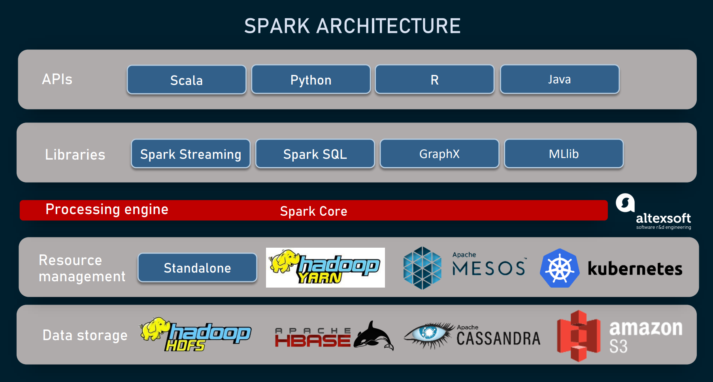

[Apache Spark - A Unified engine for large-scale data analytics](https://spark.apache.org/docs/latest/index.html)

<!-- 正如知名的Hadoop系统，其实是MapReduce框架的开源实现，其上构建的Spark GraphX也是Pregel的重视复现 -->

---


<!-- 系统内以属性图的形式，通过规范化的编程框架来实现复杂的图应用 -->

---

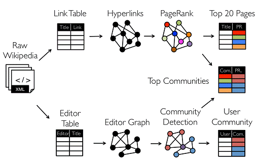

<!-- 比方说这个用来找寻维基百科热门社区的应用，里面就包含了两路并行的图分析过程 -->

---

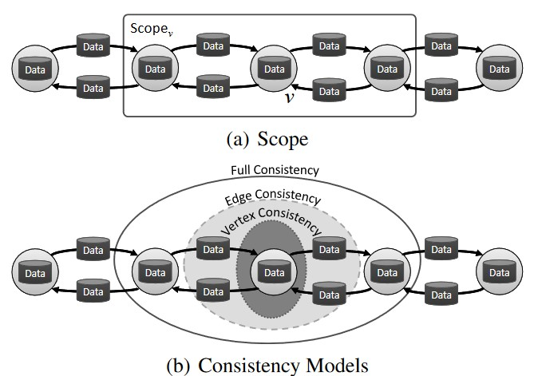 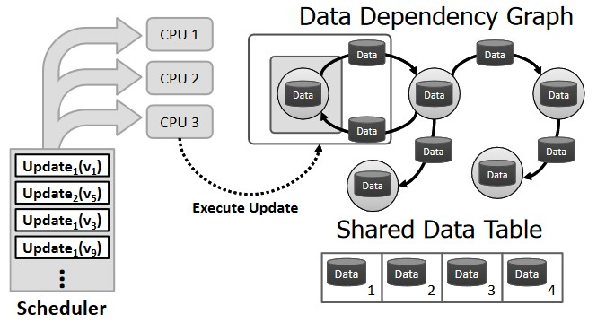

[The Story of GraphLab – From Scaling Machine Learning to Shaping Graph Systems Research (VLDB 2023 Test-of-time Award Talk)](https://www.vldb.org/pvldb/vol16/p4138-gonzalez.pdf)

<!-- 作为高校的科研成果，GraphLab则更强调处理的范式，结合Pregel的顶点中心计算框架，提出了GAS模型 -->

---

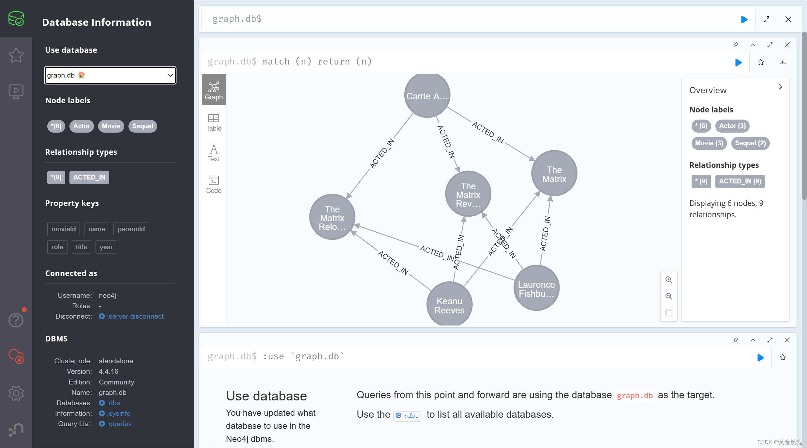

<!-- 专攻图数据处理的系统，还专门分支出了一个门类，如今被归类为一种NoSQL的图数据库，曾经风光一时，但是其中最具标志意义的创业公司Neo4j的发展却颇为坎坷，最近倒是又有新的契机闪过，即KG与LLM的合作 -->

---

## 早期形态（2005–2010）

| 关键词 | 具体表现 |
| --- | --- |
| **通用框架缺位** | 无专用图引擎，先用 **MapReduce** 硬跑：邻表 → 迭代 → 磁盘 → 再迭代 |
| **单节点内存版** | 研究者把 **< 1 GB** 的 Web 图强行塞进单机内存，写 200 行 C++ 即发 SIGMOD |
| **BSP 原型** | 在 **MPI** 上手工实现 3 步超步，验证 PageRank 收敛即可登上高分论文 |
| **磁盘为王** | 2008 年单机能把 **10M 顶点 / 100M 边** 的图在 **SATA 盘** 上跑通就算“可扩展” |

> 一句话：**“能跑完”就是创新，“跑得快”是奢侈。**

<!-- 这里指代的就是前面提到的 Pregel 系统以及 GraphChi。 -->

---

## 影响后续图系统设计的基本概念

| 概念 | 早期论文里的原话 & 今天对应术语 |
| --- | --- |
| **Vertex-centric** | “Think like a vertex” (Pregel, 2010) → 今日 GNN 消息传递前身 |
| **Bulk Synchronous Parallel** | “Super-step makes global sync easy” → 今日 BSP/ASP/SSP 全家桶 |
| **Edge-cuts vs Vertex-cuts** | “Min-cut graph partitioning” → 今日 Balanced & Streaming Partition |
| **Graph-centric Storage** | “Adjacency lists stored in column blocks” → 今日 CSR/CSC/Compressed Adj. List |

---

## 回顾经典系统结构


- 并行结构
  - 指令级、线程级、数据级、请求级
- 层次存储
  - 缓存、内存、外存

<!-- 为了深入认识这些图处理系统背后的设计方法，有必要回顾一下我们以往学习的计算机系统相关知识 -->

---

### 并行结构

<style scoped>
  h3 {
    padding-top: 500px;
  }
  p {
    font-size: 18px;
  }
</style>


[Computer Architecture A Quantitative Approach 6th Edition](https://www.elsevier.com/books/computer-architecture/hennessy/978-0-12-811905-1), Chapter 4, 5.

<!-- 这就是一个典型的并行处理结构，试问其并行任务工作在什么级别呢？ -->

---

### 层次存储

<style scoped>
  h3 {
    padding-top: 500px;
  }
  p {
    font-size: 18px;
  }
</style>


[Computer Architecture A Quantitative Approach 6th Edition](https://www.elsevier.com/books/computer-architecture/hennessy/978-0-12-811905-1), Chapter 2.

<!-- 这里则是一个典型的层次存储结构，试问其出现的动机又是什么呢？ -->

---

## 图应用访存特点

<style scoped>
  p {
    font-size: 72px;
    text-align: center;
  }
</style>

偏斜性

随机性

<!-- 趁着刚刚重温了相关概念，这里审视一下目标应用的特点，首先点个题，图应用最突出的存储器访问特点在于这两者：偏斜性和随机性，两者分别是分布式处理和分层存储架构的大敌 -->

---

### 偏斜性

<style scoped>
  li {
    font-size: 18px;
  }
</style>

 

- [Faloutsos M, Faloutsos P, Faloutsos C. On power-law relationships of the Internet topology. SIGCOMM 1999.](https://dl.acm.org/doi/10.1145/316188.316229)
- [Gonzalez J E, Low Y, Gu H et al. PowerGraph: distributed graph-parallel computation on natural graphs. OSDI 2012.](https://www.usenix.org/system/files/conference/osdi12/osdi12-final-167.pdf)

---

#### SNAP真实图数据集

<style scoped>
  h5 {
    font-style: italic;
  }
  th {
    font-size: 20px;
  }
  td {
    font-size: 16px;
  }
</style>

|Name|Type|Nodes|Edges|Communities|Description|
|:-|:-|-:|-:|-:|:-|
|[com-LiveJournal](http://snap.stanford.edu/data/com-LiveJournal.html)|Undirected, Communities|3,997,962|34,681,189|287,512|LiveJournal online social network|
|[com-Friendster](http://snap.stanford.edu/data/com-Friendster.html)|Undirected, Communities|65,608,366|1,806,067,135|957,154|Friendster online social network|
|[com-Orkut](http://snap.stanford.edu/data/com-Orkut.html)|Undirected, Communities|3,072,441|117,185,083|6,288,363|Orkut online social network|
|[com-Youtube](http://snap.stanford.edu/data/com-Youtube.html)|Undirected, Communities|1,134,890|2,987,624|8,385|Youtube online social network|
|[com-DBLP](http://snap.stanford.edu/data/com-DBLP.html)|Undirected, Communities|317,080|1,049,866|13,477|DBLP collaboration network|
|[com-Amazon](http://snap.stanford.edu/data/com-Amazon.html)|Undirected, Communities|334,863|925,872|75,149|Amazon product network|
|[email-Eu-core](http://snap.stanford.edu/data/email-Eu-core.html)|Directed, Communities|1,005|25,571|42|E-mail network|
|[wiki-topcats](http://snap.stanford.edu/data/wiki-topcats.html)|Directed, Communities|1,791,489|28,511,807|17,364|Wikipedia hyperlinks|

#### 统计度分布

```bash
grep -v "^#" com-amazon.ungraph.txt | awk '{print $1"\n"$2}' | sort -n | uniq -c
```

---

### 随机性

<style scoped>
  p {
    text-align: center;
  }
  li {
    font-size: 18px;
  }
</style>


- [Kyrola A, Blelloch G, Guestrin C. **GraphChi: Large-Scale Graph Computation on Just a PC**. OSDI 2012.](https://www.usenix.org/conference/osdi12/technical-sessions/presentation/kyrola)

---

<style scoped>
  li {
    padding-top: 600px;
    font-size: 18px;
  }
</style>


- <https://github.com/snap-stanford/snap/blob/master/tutorials/demo-bfsdfs.cpp>

---

### 重温CacheLab

<style scoped>
  p {
    font-size: 27px;
  }
</style>


[Computer Systems: A Programmer's Perspective, 3/E (CS:APP3e)](http://csapp.cs.cmu.edu/3e/home.html), Randal E. Bryant and David R. O'Hallaron, Carnegie Mellon University

[深入理解计算机系统（原书第3版）](https://item.jd.com/12006637.html)

[Introduction to Computer Systems (ICS)](http://www.cs.cmu.edu/~213/), [2015 CMU 15-213 CSAPP 深入理解计算机系统](https://www.bilibili.com/video/BV1iW411d7hd/)

Lecture12 Cache Memory

<!-- 上次我们谈到图这种特点鲜明，价值深远的应用，其构造具有偏斜性，行为具有随机性，而支撑其运转的系统，则仰赖各个层级的并行性，以及塑造层次存储的局部性，然而这里面涌现出天然的矛盾，构成了我们面前的第一重挑战 -->

---

#### 实验准备

- [实验扩展](https://gitee.com/computer-architecture-hust/computer-architecture-experiment), [作业参考](https://github.com/cs-course/bfs_cachelab_handin)
  - 基于 CacheLab 观察经典图算法访存行为
- [辅助工具](https://github.com/ShiZhan/generator)
  - 4种经典随机图生成器，合成具备自然图特征的实验数据集
  - 清理自连边、重复边脚本，重编号脚本
- [SNAP工具包](http://snap.stanford.edu/snap/download.html)
  - Windows版本需要Cygwin，Linux版本需要Ubuntu

<!-- 从这个问题开始，我们演示一下作为一名研究生，大致的学习过程应该是怎样的

首先，之前学习的记忆里，告诉我们局部性这样一个概念，我们很自然的希望从如今的实验环境中找出来

当时课本上是一个什么样的表述呢？我们少许回顾一下 -->

---

#### 经典BFS算法：两个关键数据结构，两重循环体

```C
void bfs(int source) {
    int v = source, n;
    long long int i, front = 0, rear = 0;
    visited[v] = true;
    frontier[rear] = v;
    while (front <= rear) {
        v = frontier[front]; /* delete from queue */
        front++;
        for (i = csr_index[v]; i < csr_index[v + 1]; i++) {
            /* Check for adjacent unvisited nodes */
            n = csr_edges[i];
            if (visited[n] == false) {
                visited[n] = true;
                rear++;
                frontier[rear] = n;
            }   
        }
    }
}
```

---

#### CSR构造

<style scoped>
  p {
    font-size: 20px;
  }
</style>


[**When is Graph Reordering an Optimization? Studying the Effect of Lightweight Graph Reordering Across Applications and Input Graphs**](http://abstract.ece.cmu.edu/pubs/graphreordering-preprint.pdf), IISWC 2018, ***Best Paper Award***.

---

#### 尝试哪些布局？

- 原始顺序
- 度降序排列
  - [SIGMOD '16](https://dl.acm.org/doi/abs/10.1145/2882903.2915220)
- 遍历顺序排列
  - [ICPE '14](https://dl.acm.org/doi/10.1145/2568088.2576761)

---

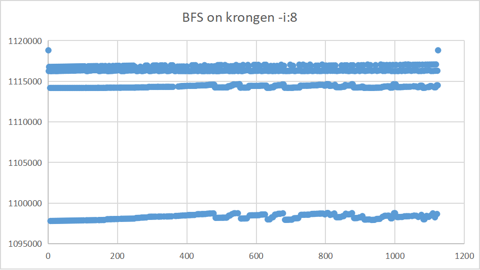

---

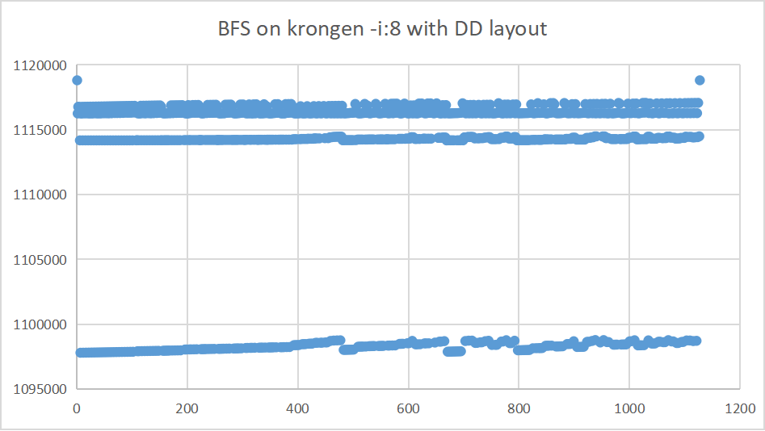

---

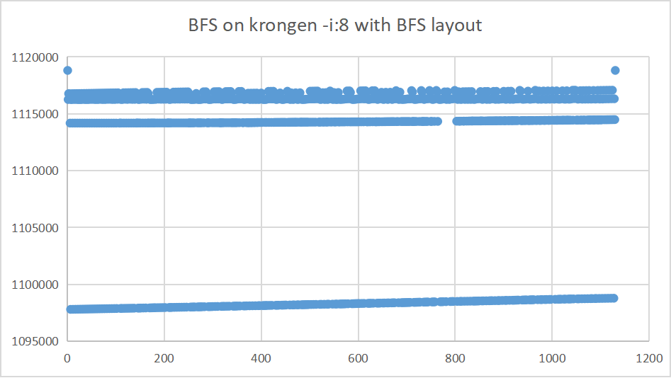

---

<style scoped>
  p {
    padding-top: 200px;
    text-align: center;
    font-size: 72px;
  }
  li {
    font-size: 25px;
  }
</style>

实践出真知

- 图应用和传统应用访存有什么区别？
- 重排图访存模式有什么变化？
- 对缓存性能造成什么影响？
- 效果是否明确？适用是否广泛？
- ……
- *干脆躺平放弃排序* X-Stream, SOSP '13
- *一次搞定还是每次重排？* GrafBoost, ISCA '18

---

## 怎样使布局亲和架构？

<style scoped>
  h2 {
    padding-top: 200px;
    text-align: center;
    font-size: 72px;
  }
</style>

---

## 系统怎么设计？

- 分布式架构
- 分层式架构
- 分布式、分层架构

---

<style scoped>
  p {
    padding-top: 100px;
    text-align: center;
    font-size: 72px;
  }
</style>

## 系统怎么设计？……

<style scoped>
  p {
    padding-top: 50px;
    text-align: center;
    font-size: 72px;
  }
</style>

- 分布式架构
- 分层式架构
- 分布式、分层架构

软件、硬件怎样相互协同？

---

### 分布式架构

<style scoped>
  p {
    font-size: 18px;
  }
</style>

- 让足量内存应对随机访存，然而…


Pregel[SIGMOD’10] ,GraphLab[OSDI’12], Gemini[OSDI’16]

---

### 分布式架构…

<style scoped>
  p {
    font-size: 18px;
  }
</style>

- 让足量内存应对随机访存，然而…
- MapReduce的问题
  - 漫长迭代、不平衡负载
- 图分区的矛盾
  - 尺寸平衡，切割少
  - 过度分区

[Gonzalez J E, Low Y, Gu H et al. **PowerGraph: distributed graph-parallel computation on natural graphs**. OSDI 2012.](https://www.usenix.org/conference/osdi12/technical-sessions/presentation/gonzalez)
[Chen R, Shi J, Chen Y et al. **PowerLyra: differentiated graph computation and partitioning on skewed graphs**. EuroSys 2015.](https://dl.acm.org/doi/10.1145/2741948.2741970)
[Tsourakakis C, Gkantsidis C, Radunovic B et al. **FENNEL: streaming graph partitioning for massive scale graphs**. WSDM 2014.](https://dl.acm.org/doi/10.1145/2556195.2556213)
[Shi Z, Li J, Guo P et al. **Partitioning dynamic graph asynchronously with distributed FENNEL**. FGCS 2017.](https://www.sciencedirect.com/science/article/pii/S0167739X1730033X)
...

---

### 分层式架构

<style scoped>
  p {
    font-size: 18px;
  }
</style>

- 让足量外存实现扩展避免网络分布，可是…

GraphChi[OSDI’12], X-Stream[SOSP'13], GridGraph[ATC'15]，CLIP[ATC'17]


[Roy A, Mihailovic I, Zwaenepoel W. X-Stream: edge-centric graph processing using streaming partitions. SOSP 2013.](https://dl.acm.org/doi/10.1145/2517349.2522740)

---

### 分层式架构…

<style scoped>
  p {
    font-size: 18px;
  }
</style>

- 让足量外存实现扩展避免网络分布，可是…
- 外存模式
  - 大块访问的实现
  - 顺序访问的实现
- 分批问题
  - 如何排序

---

### 分布式、分层架构

<style scoped>
  p {
    text-align: center;
  }
  li {
    font-size: 18px;
  }
</style>


- [Roy A, Bindschaedler L, Malicevic J et al. **Chaos: Scale-Out Graph Processing from Secondary Storage**. SOSP 2015.](https://dl.acm.org/doi/10.1145/2815400.2815408)

---

### 图处理系统发展


---

### **反思重排**

- 提高数据访问速度
  - Optimizing cpu cache performance for pregel-like graph computation  [ICDEW’15]
  - Speedup Graph Processing by Graph Ordering  [SIGMOD’16]
  - MOSAIC [EuroSys’17]
- 减少冗余I/O
  - Load the Edges You Need [ATC’16]
  - CLIP [ATC’17]

---

### **两个都要**

<style scoped>
  p {
    text-align: center;
    font-size: 60px;
  }
</style>

- 提高数据访问速度

活跃数据

- 减少冗余I/O

不活跃数据

---


<!-- 不过，不同阶段，重点可不一样，前面更关注活跃数据的主流，后面则更关注不活跃数据的淘汰 -->

---

- 如何在重排图数据时，兼顾活跃数据和不活跃数据？
  - **为什么？**…集中驻留与高效淘汰…
  - **试一试**：可以围绕CacheLab、Gem5、SNAP做进一步实验观察

```bash
./build/X86/gem5.opt -d $HOME/snap-cc-rmat21-base -r \
  -e configs/example/se.py -n 4 \
    --caches --l2cache --l3cache --l1d_size=32kB --l1i_size=32kB --l2_size=256kB --l3_size=8MB --mem-size=4GB \
  -c $HOME/snap/examples/concomp/concomp -o " -i:$HOME/rmat21.txt "
./build/X86/gem5.opt -d $HOME/snap-cc-rmat21-gor -r \
  -e configs/example/se.py -n 4 \
  --caches --l2cache --l3cache --l1d_size=32kB --l1i_size=32kB --l2_size=256kB --l3_size=8MB --mem-size=4GB \
  -c $HOME/snap/examples/concomp/concomp -o " -i:$HOME/rmat21_reorder.txt "
./build/X86/gem5.opt -d $HOME/snap-cc-rmat21-act -r \
  -e configs/example/se.py -n 4 \
  --caches --l2cache --l3cache --l1d_size=32kB --l1i_size=32kB --l2_size=256kB --l3_size=8MB --mem-size=4GB \
  -c $HOME/snap/examples/concomp/concomp -o " -i $HOME/rmat21_sort.txt "
```

---

### **预判活跃顶点：中介中心性**

<style scoped>
  p {
    padding-top: 400px;
    text-align: center;
    font-size: 60px;
  }
</style>


碰运气？回想一下Pregel的顶点计算…

---

### **汇聚不活跃顶点：直接邻居**


---

<style scoped>
  p {
    padding-top: 600px;
    text-align: center;
    font-size: 25px;
  }
</style>


[Cache-friendly data layout for massive graph](https://ieeexplore.ieee.org/document/8515737/). NAS '18.

---

## 如何高效时空检索？

<style scoped>
  h2 {
    padding-top: 200px;
    text-align: center;
    font-size: 72px;
  }
</style>

---

### **研究背景**

<style scoped>
  p {
    text-align: center;
    font-size: 25px;
  }
</style>

- **时序图 (Temporal Graphs)** 广泛存在于现实世界（如社交网络、知识图谱），其结构和关系随时间不断演化。
- 时序图核心挑战：如何在**存储开销**和**查询时间**之间取得高效平衡。


怎样找出10分钟以内的社媒账号同IP多开？…一个号码呼出10个以上被叫号码？…

---

### **现有存储模型及其局限**

<style scoped>
  li {
    font-size: 22px;
  }
</style>


- **Copy-Based (副本式)**
  - **优点:** 查询速度快，结构局部性好。
  - **缺点:** 存储冗余高，连续快照间差异小但存储成本巨大。

- **Log-Based (日志式)**
  - **优点:** 存储开销小，只记录增量更新。
  - **缺点:** 查询时需重建快照，时间开销大。

- **Hybrid (混合式, 如Pensieve)**
  - 尝试结合两者优点，但**假设顶点度分布是静态的**。
  - **关键问题:** 现实图中顶点度偏斜性会**随时间动态变化**，静态假设导致性能下降。

---

### **一系列动态图系统研究**

<style scoped>
  li {
    font-size: 27px;
  }
</style>


- 快照模型: $G=<G_0, G_1, G_2, \dots, G_t>$
- 日志模型: $G=<ev_0, ev_1, ev_2, \dots, ev_t>$
- 全图模型: $G_[t_1, t_n]=<V_[t_1, t_n], E_[t_1, t_n]>$
- 混合模型: 基于偏斜性感知或基于相关性感知

---

### **LSM-Subgraph**

[LSM-Subgraph: Log-Structured Merge-Subgraph for Temporal Graph Processing, APWeb-WAIM 2022](https://link.springer.com/chapter/10.1007/978-3-031-25158-0_39)

- 提出一种新型**时序图混合存储模型 LSM-Subgraph**，通过关键快照和中间日志，综合副本（copy-based）和日志（log-based）模式特长
- 基于 PMA（Packed Memory Array）的邻接数组模型，提出一种**动态空位分配**策略，根据图演化特征分配空位，提升更新效率
- 提出基于**波动感知**（fluctuation-aware）的关键快照创建方法，设定阈值 β，在存储开销和查询时间之间实现最优平衡

---

### **基于PMA的邻接数组**

- **目标:** 高效支持更新，避免全局重建。
- **方法:**
  - 用 **Packed Memory Array (PMA)** 存储快照，元素间预留空隙。
  - 插入/删除操作可通过局部移动元素完成，大幅降低更新开销。
  - 提出新的空隙分配与再平衡策略，适应时序图的动态特性。

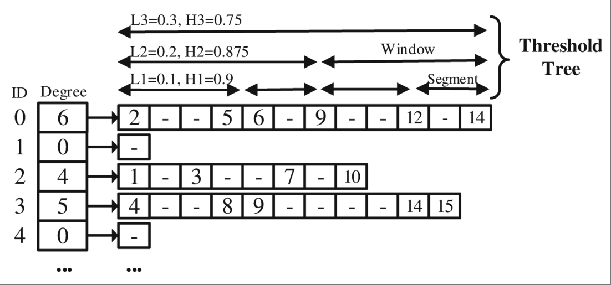

---

### **变化感知的快照创建**

- **目标:** 智能选择何时创建关键快照 (Key Snapshot)。
- **方法:**
  - 定义差异度 `TD` (Temporal Discrepancy) 衡量连续快照间变化度。
  - 当 `TD > β` (阈值，经验值 **0.03**) 时，才创建新的关键快照。
  - 克服了基于固定时间或固定日志大小方法的缺陷，实现动态优化。

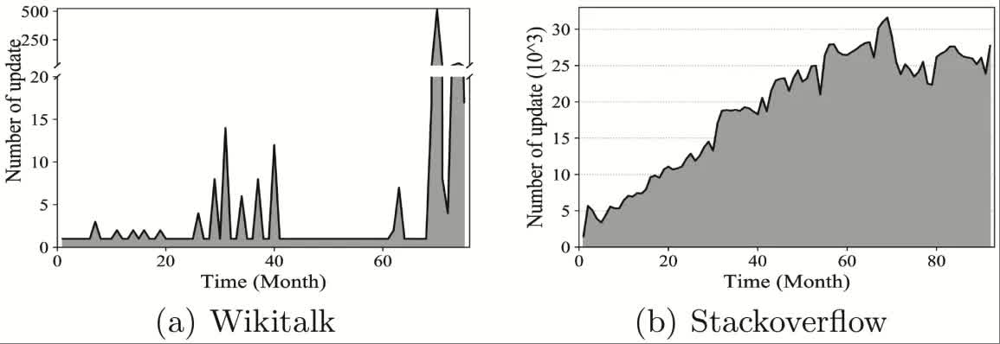 $TD(K_1, K_2) = \frac{|E_G|}{|E_{K_1}| + |E_{K_2}|}$

---

### **日志合并方法**

- **目标:** 减少查询时需要处理的日志量。
- **方法:**
  - 在合并前对日志进行预处理，消除对同一元素的冗余操作。
  - 例如：多次插入视为最后一次插入；插入后删除则视为无操作。

### **系统设计**

- **数据结构:** 将数据划分为多个 **Shard**，每个 Shard 包含一个PMA快照和一段日志。
- **查询引擎:** 查询时，找到最近的关键快照，应用合并后的日志，快速重构目标时间点的图状态。

---

### **实验效果**

- **对比对象:** Chronos (Copy-Based), GraphPool (Log-Based), Pensieve (Hybrid)。
- **结果:**
  - **vs. GraphPool:** 查询效率 **平均提升86%**，内存开销降低 **9%~57%**。
  - **vs. Chronos:** 查询效率 **平均提升53%**，内存开销 **大幅降低**。
  - **vs. Pensieve:** 查询时间 **最多减少12.5倍** (因避免远程重建)，内存开销约为其3.2倍但**是可接受的权衡**。
- **自身组件的有效性:** PMA模型更新效率远高于CSR/AdjList；波动感知策略在存储和查询时间上均优于基于周期或随机的方法。

---

## 表示学习与随机游走

<style scoped>
  h2 {
    padding-top: 200px;
    text-align: center;
    font-size: 72px;
  }
</style>

---

### 图表示学习

<style scoped>
  li {
    font-size: 27px;
  }
</style>

- 图数据持续增大 --> 空间开销（状态向量，邻接矩阵）算力需求（矩阵运算）开销巨大
- 图表示学习 --> 对于 $\forall v \in V$ 有 $f: v \rightarrow R^d(d \ll |V|)$，映射为低维稠密的实值向量


- 将分类、预测等任务转化为对向量的计算

---

### 图抽样方法

<style scoped>
  th {
    font-size: 25px;
  }
  td {
    font-size: 25px;
  }
</style>

|类别|代表方法|特点|
|:-|:-|:-|
|基于矩阵分解|LLE(Science'00), Laplacian Eigenmaps(NIPS'01), HOPE(SIGKDD'16), STRAP(KDD’19), ProNE(ICAJI’19)|时间和空间开销大、依赖相似矩阵的选择|
|基于随机游走|DeepWalk(KDD'14), LINE(KDD'15), Node2Vec(KDD'16), Struct2Vec(KDD’17), DiaRW(FGCS’19)|扩展性更好（时间和空间）、适应性更强|


---

### **怎样优化表示学习系统**

- 样本规模数十倍于图数据，不能在一周内完成千万个节点的表示学习
  - 动态调节采样，减少冗余 [FGCS 2019](http://www.sciencedirect.com/science/article/pii/S0167739X19300378)
    - 找出**顶点度与游走冗余之间的关系**，实现动态游走
  - 用理论来准确指导采样过程，充分优化样本尺寸 [ICDE 2021](https://doi.ieeecomputersociety.org/10.1109/ICDE51399.2021.00198)
    - 用**信息熵理论**来估计游走冗余
  - 多核**并行增强**系统扩展能力 [IEEE ToBD 2023](https://ieeexplore.ieee.org/document/9749008)

---

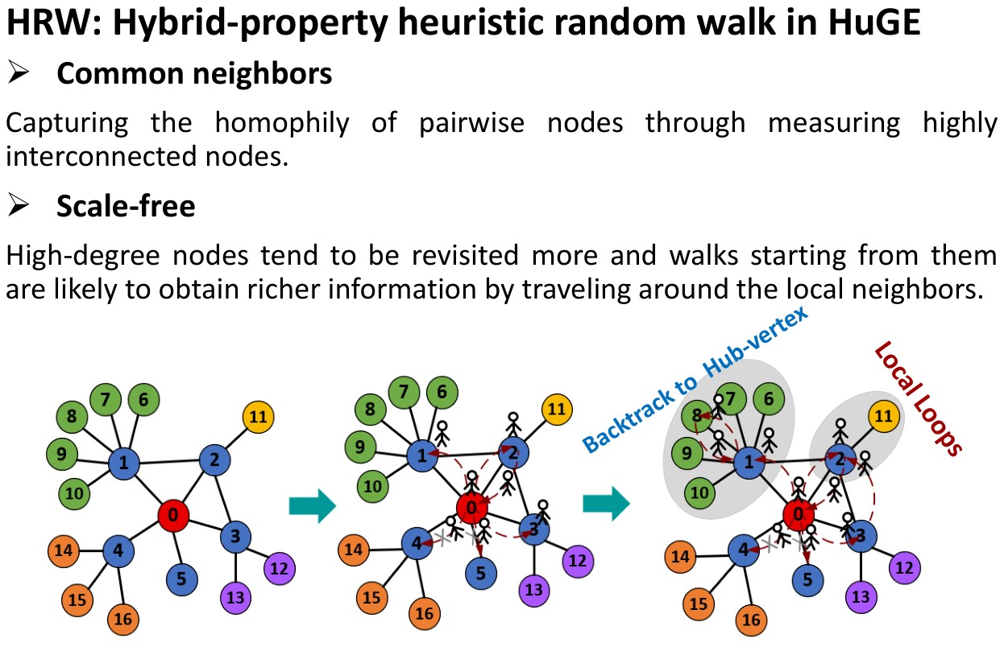

---

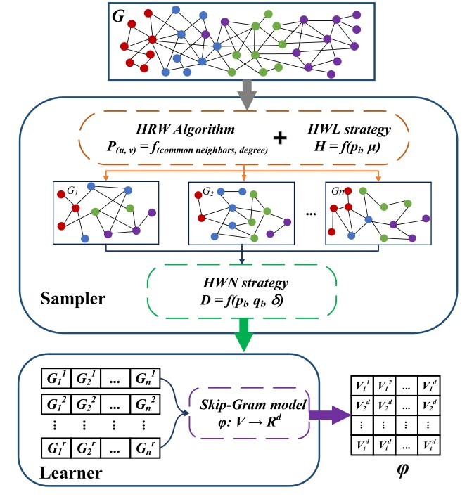

- 节省游走
  - 启发式随机游走
  - 自适应游走长度
  - 自适应游走次数
- 实现
  - 内存占用优化
  - 细粒度、多线程并行

<!-- 启发式随机游走：HuGE+采用混合属性启发式随机游走（HRW），它在每一步随机游走中考虑了节点的公共邻居数量和节点信息内容，从而更有效地捕捉节点特征，减少了对计算资源的需求。

自适应游走长度：HuGE+使用启发式方法来确定随机游走的长度，而不是采用固定的游走长度。这种方法通过观察信息熵的变化来决定何时停止游走，从而避免了生成过多冗余信息，提高了计算效率。

自适应游走次数：HuGE+还提出了一种方法来决定每个节点的游走次数，它通过计算相对熵（即Kullback-Leibler散度）来评估生成的语料库与图的度分布之间的差异，从而确定合适的游走次数，以确保语料库的质量和效率。

内存占用优化：HuGE+显著减少了内存占用，平均减少了68.9%。这是通过优化游走策略和减少生成的语料库大小实现的，从而使得方法能够扩展到更大规模的图。

并行化处理：HuGE+的设计允许并行化执行，这意味着它可以利用多核处理器来同时处理多个任务，从而进一步提高处理大规模图的速度。

线性运行时间：在合成图上的实验表明，HuGE+的运行时间与图的大小呈线性关系，这表明它能够以可控的方式处理大规模图。

高效的训练方法：HuGE+使用Skip-Gram模型来训练节点的嵌入向量，并通过负采样等技术优化了训练过程，减少了计算和存储开销。 -->

---

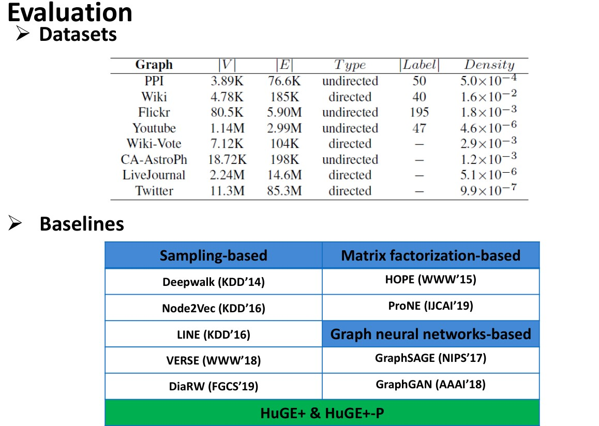

---


---

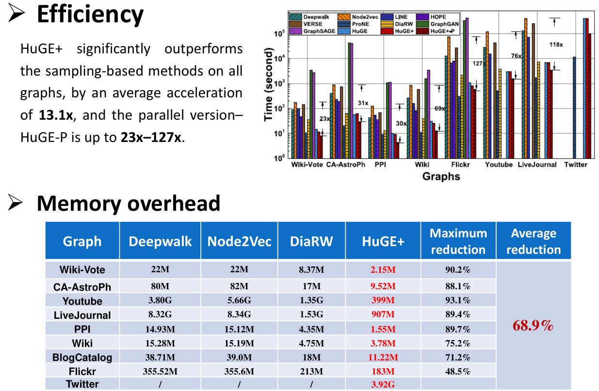

---

### 发挥传统分级存储优势

- **以矩阵记录游走**（Walk Matrix）：提出了一种走矩阵来避免加载不可更新的游走，从而消除无用的游走I/O操作。
- **效益感知I/O模型**（Benefit-Aware I/O Model）：开发了一种效益感知的I/O模型，用于加载包含最大累积可更新游走的多个数据块，以提高I/O利用率。
- **块集导向游走更新方案**（Block Set-Oriented Walk Updating Scheme）：采用了一种块集导向的游走更新方案，允许每个游走在已加载的数据块集中尽可能多地移动步数，从而显著提高游走更新率。
[SOWalker: An I/O-Optimized Out-of-Core Graph Processing System for Second-Order Random Walks](https://www.usenix.org/conference/atc23/presentation/wu), ATC 23

---


---

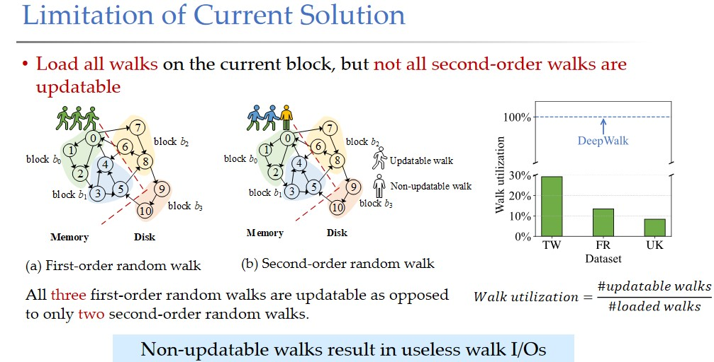

---

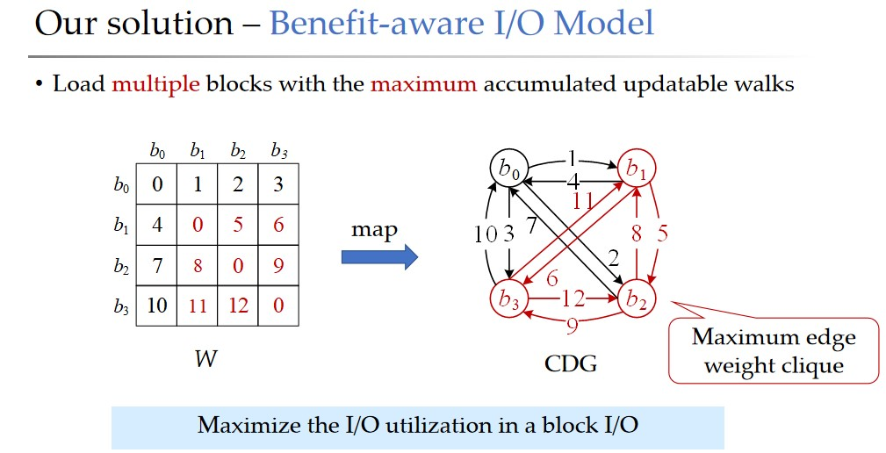

---

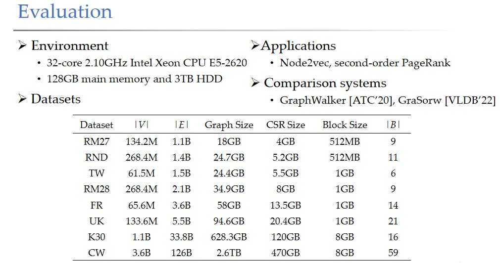

---

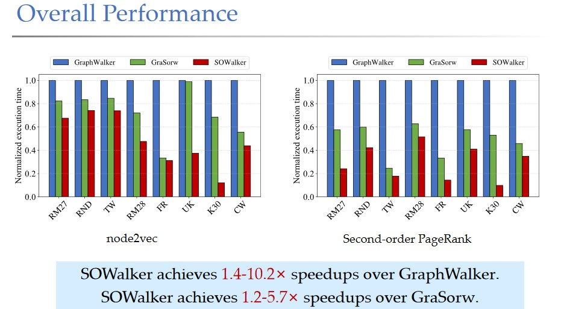

---

## 知识图谱

<style scoped>
  h2 {
    padding-top: 200px;
    text-align: center;
    font-size: 72px;
  }
</style>

---

### 异构图与知识图谱基础

- **异构图**：图中包含多种节点类型和边类型。
- **知识图谱（KG）**是一种典型的异构图：
  - 节点表示实体（如人、药物、论文等）。
  - 边表示实体之间的关系（如“作者”、“治疗”、“引用”等）。
- **知识图谱的特点**：
  - 大规模（数百万节点和边）。
  - 不完整（很多真实关系缺失）。
  - 无法枚举所有可能的事实，因此需要**预测缺失的链接**。

---

### 知识图谱嵌入（KG Embedding）

目标：将实体和关系嵌入到低维向量空间中，使得存在的关系在嵌入空间中“接近”。

#### 基本思想

- 每个实体和关系都用一个向量表示。
- 定义一个**评分函数** \( f_r(h, t) \) 来衡量三元组 \( (h, r, t) \) 的合理性。
- 通过训练使得真实三元组的得分高，虚假三元组的得分低。

---

#### 常见的KG嵌入模型

<style scoped>
  table, th, td {
    border: 1px solid black;
    font-size: 30px;
  }
</style>

| 模型     | 嵌入空间 | 评分函数 | 对称性 | 反对称性 | 逆关系 | 组合性 | 一对多 |
|----------|----------|----------|--------|----------|--------|--------|--------|
| **TransE**   | ℝ^d      | −‖h + r − t‖ | ✗      | ✓        | ✓      | ✓      | ✗      |
| **TransR**   | ℝ^d → ℝ^k | −‖M_r h + r − M_r t‖ | ✓      | ✓        | ✓      | ✓      | ✓      |
| **DistMult** | ℝ^d      | ⟨h, r, t⟩ | ✓      | ✗        | ✗      | ✗      | ✓      |
| **ComplEx**  | ℂ^d      | Re(⟨h, r, t⟩) | ✓      | ✓        | ✓      | ✗      | ✓      |
| **RotatE**   | ℂ^d      | −‖h ∘ r − t‖ | ✓      | ✓        | ✓      | ✓      | ✗（弱支持）|

---

#### 模型特点与适用场景

- **TransE**：简单高效，适合快速实验，但不能处理对称关系和一对多关系。
- **TransR**：通过引入关系特定的投影矩阵，增强了表达能力，能建模更复杂的关系。
- **DistMult**：使用点积，能处理对称关系，但无法区分头尾实体，无法建模反对称关系。
- **ComplEx**：引入复数空间，能建模反对称和逆关系，是目前常用的强模型之一。
- **RotatE**：在复数空间中进行旋转操作，能建模多种关系类型，性能较好。

---

#### 实际建议

- 不同知识图谱的关系模式差异大，没有通用最优模型。
- **快速尝试**：先用 TransE。
- **进一步提升**：使用 ComplEx 或 RotatE 等更具表达力的模型。

---

## 大语言模型和知识图谱

<style scoped>
  h2 {
    padding-top: 200px;
    text-align: center;
    font-size: 72px;
  }
</style>

---

<style scoped>
  table, th, td {
    border: 1px solid black;
    font-size: 22px;
  }
</style>

| 技术路径            | 核心机制                                         | 对LLM的要求                   | 优点                          | 缺点/挑战                           | 代表性工作               |
| :-------------- | :------------------------------------------- | :------------------------ | :-------------------------- | :------------------------------ | :------------------ |
| **基于数据集微调**     | 利用包含推理路径的特定领域数据集对LLM进行微调，将知识内化到模型参数中。        | 需要访问模型参数并进行训练。            | 推理速度快（无需实时检索）；能深度整合领域知识。    | 知识更新困难，需要重新训练；训练成本高；可能过拟合特定数据集。 | [MedReason](https://arxiv.org/abs/2504.00993v2), [JKEM](https://www.mdpi.com/2078-2489/15/11/666) |
| **基于提示工程与检索增强** | 在推理时，从KG中检索相关知识，并将其作为上下文（Prompt）的一部分输入给LLM。  | 无需修改模型参数，可应用于任何LLM。       | 灵活、高效，知识可实时更新；实现相对简单。       | 受限于上下文窗口长度；检索质量直接影响性能；可能引入无关噪声。 | [DR.KNOWS](https://ai.jmir.org/2025/1/e58670)  |
| **基于推理路径探索与验证** | 将LLM作为智能体，在KG上动态探索、生成并评估多条推理路径，选择最优路径作为答案依据。 | 需要LLM具备强大的零样本或少样本推理和评估能力。 | 可解释性强，能提供完整的推理链条；无需训练，通用性好。 | 推理过程复杂，计算开销大；路径探索的效率和准确性是关键。    | [RwT](https://aclanthology.org/2025.coling-main.211/), [REKG-MCTS](https://aclanthology.org/2025.findings-acl.484/)     |

---

### 知识图谱帮助思维链

- 大语言模型 (LLMs) 在诸多NLP任务上表现出色，但在复杂推理（算数、常识、符号）任务上仍存在显著局限。
- 思维链推理 (Chain-of-Thought Reasoning) 通过让LLM生成中间推理步骤，有效提升了多步推理任务的性能。

---

#### **关键问题**

- 通用思维链难专精
  - 推理链生成基于LLM自身生成，无法利用知识图谱形成严谨逻辑
  - 在医疗、法律、金融等高风险领域，此问题带来不可估量的风险
    - 例: 在AQuA数据集上，多种CoT方法的准确率均低于55%。

- 自然语言提示词表述模糊
  - 自然语言思维链易理解，但推理准确性不如代码式提示
  - 代码提示复杂性高、领域局限性大、语言风格单一

---

[CoT-RAG: Integrating Chain of Thought and Retrieval-Augmented Generation to Enhance Reasoning in Large Language Models](https://arxiv.org/abs/2504.13534v3), EMNLP 2025

通过结构化知识表示、动态检索机制和伪程序化推理执行，解决现有 CoT 方法在可靠性和推理性能上的两大瓶颈，为 LLM 在复杂和垂直领域的可靠推理提供新范式。

- 知识图谱驱动的 CoT 生成 (Knowledge Graph-driven CoT Generation)
- 可学习的知识案例感知 RAG (Learnable Knowledge Case-aware RAG)
- 伪程序提示执行 (Pseudo-Program Prompting Execution)

<!-- 
**三阶段设计 (Three-Stage Design)**

**Stage 1: 知识图谱驱动的CoT生成 (Knowledge Graph-driven CoT Generation)**
*   **专家介入:** 领域专家构建一次性的、粗粒度的**决策树 (DT)**，封装领域推理逻辑。
*   **LLM转化:** LLM将DT分解并转化为结构清晰、高度透明的**知识图谱 (KG)**。
*   **KG节点:** 每个实体包含 `Sub-question`, `Sub-case`, `Sub-description`, `Answer` 属性。
*   **优势:** 增强可控性、可靠性与领域适应性。

**Stage 2: 可学习的知识案例感知RAG (Learnable Knowledge Case-aware RAG)**
*   **LLM驱动的检索:** （非传统向量检索）利用LLM从用户长查询描述中，为KG中的每个实体精准提取对应的 `Sub-description`。
*   **动态更新:** 新的用户查询可以反过来动态更新DT中的 `Knowledge case`，使知识图谱持续进化。

**Stage 3: 伪程序提示执行 (Pseudo-Program Prompting Execution)**
*   **执行方式:** LLM将KG表示为**伪程序知识图谱 (PKG)** 并逐步执行。
*   **优势:**
    *   **兼具NL与Code优点:** 像代码一样逻辑严谨，又如自然语言一般易于理解和通用。
    *   **无需外部解释器:** 摆脱对Python解释器等环境的依赖。
    *   **可扩展性强:** 可适配C++, Java等语言风格（见附录）。
 -->

---

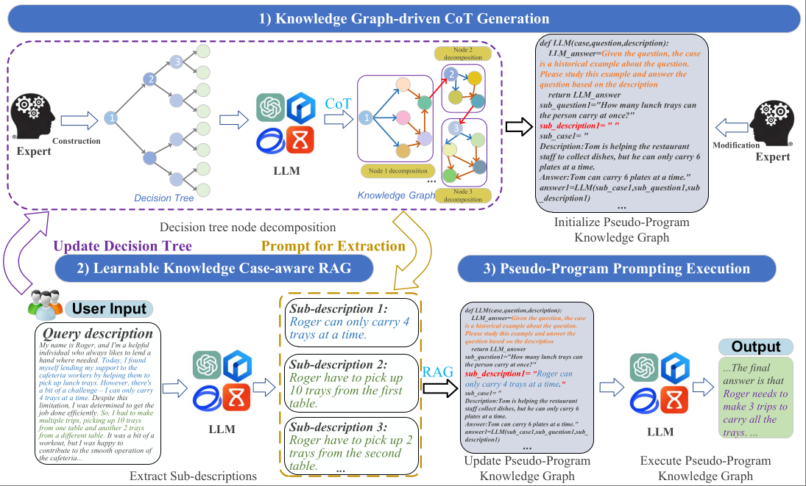

---

#### **实验设置**

- **模型:** ERNIE-Speed, GPT-4o mini, GLM-4-flash, GPT-4o等
- **数据集 (9个):**
  - **通用领域:** AQuA, GSM8K, MultiArith, SingleEq, HotpotQA, CSQA, SIQA, Last Letter, Coin Flip.
  - **垂直领域:** LawBench, LegalBench, CFBenchmark, AGIEval.

---

#### **主要结果**

<style scoped>
  p, li, th, td {
    font-size: 25px;
  }
</style>

##### 提升通用任务

| Method | AQuA | GSM8K | ... | **Average** |
| :--- | :---: | :---: | :---: | :---: |
| Zero-shot-CoT | 43.4 | 78.3 | ... | 72.4 |
| Manual-CoT | 54.3 | 85.8 | ... | 77.3 |
| PS | 50.1 | 82.8 | ... | 75.2 |
| **CoT-RAG** | **65.7** | **94.7** | ... | **89.1** |

- ↑ 准确率提升幅度: **4.0% ~ 44.3%**

##### 适配垂直领域

- 准确率远超其他基于图谱的RAG方法（如KG-CoT, GraphRAG, ToG等）。
- 专家构建的DT至关重要：零专家参与（LLM自建DT）的变体性能下降 **7.8%**。

<!-- 
其实将GNN和LLM的融合才刚刚开始
 -->

---

## 实践作业

<style scoped>
  h2 {
    padding-top: 200px;
    text-align: center;
    font-size: 72px;
  }
</style>

---

<style scoped>
  h3 {
    font-size: 25px;
  }
  p, li {
    font-size: 20px;
  }
</style>

## 知识图谱案例实验

来源：[【天池经典打榜赛】赛道四-知识图谱预测赛](https://tianchi.aliyun.com/competition/entrance/532419/)

### 实验背景

- 知识图谱是AI时代一项非常重要的技术，然而知识图谱普遍存在不完备的问题，知识图谱链接预测任务主要基于实体和关系的表示对缺失三元组进行预测。
- 任务旨在提升电商场景下知识图谱嵌入效果，满足商品推荐等应用对推理商品潜在关联性的需求。

### 实验内容

- 知识图谱表示：**三元组（h,r,t）**，其中h被称为头实体，t为尾实体，r为连接头、尾实体的关系。
- 由于知识图谱构建中**部分知识的缺失**及**知识动态变化**等原因，现有的知识图谱通常是不完备的，知识图谱中总是存在关系r下头实体h或者尾实体t缺失的情况。
  - 基于知识图谱的**链接预测任务**，就是已知头实体（或尾实体）和关系的情况下，预测缺失的尾实体（或头实体）的任务。
  - 此任务中所提供的知识图谱的头实体h通常为商品，尾实体t通常为商品所对应相关属性信息，如颜色、适用人群、细分市场等，关系r为具体的属性类型。
  - 因为商品属性关系中多对一的情况十分普遍，所以在做关系推理和链接预测任务时只考虑预测尾实体。

---

<style scoped>
  p, li {
    font-size: 23px;
  }
</style>

### 实验要求

- **赛题数据、格式、指标**：详见[官网](https://tianchi.aliyun.com/competition/entrance/532419/)。
- **结果提交**：向官网提交OpenBG500_test.tsv文件，**向微助教平台提交Python Notebook文件**。
- **实验报告**：不另外撰写，**在Notebook中逐栏介绍**实验采用的模型、过程、结果分析及结论。

#### 时间安排

- 开始日期：**2025年09月23日**
- 天池提交：**2025年09月30日**
- 微助教提交：**2025年10月10日**

请在规定时间内完成实验，并按照要求完成官网和微助教提交。

<!-- 如果因特殊原因赶不上官网提交，请及时联系老师，在微助教提交时同时提交实验Notebook和csv文件，并说明原因。 -->
