# 面向图应用的系统设计

<!-- _class: lead -->

**施展**
武汉光电国家研究中心
光电信息存储研究部

<https://shizhan.github.io/>
<https://shi_zhan.gitee.io/>

---

## 参考资料

<style scoped>
  li {
    font-size: 30px;
  }
</style>

- [CS224W: Machine Learning with Graphs(Stanford)](http://web.stanford.edu/class/cs224w/)
  - [B站搬运 2021版](https://www.bilibili.com/video/BV18FNQeYEzz/)

## 参考书

- [Graph Representation Learning Book](https://www.cs.mcgill.ca/~wlh/grl_book/)
- [Network Science](http://networksciencebook.com/)
- [Networks, Crowds, and Markets:
Reasoning About a Highly Connected World](https://www.cs.cornell.edu/home/kleinber/networks-book/)

---

## 内容大纲

<!-- paginate: true -->

- 影响深远的**图应用**
- 追求高效的**图系统**
- **表示学习**与随机游走
- **知识图谱**
- 大语言模型和知识图谱
- 实践作业

---

## 影响深远的图应用

<style scoped>
  h2 {
    padding-top: 200px;
    text-align: center;
    font-size: 72px;
  }
</style>

---

## 图有着广泛的应用

<style scoped>
  h2 {
    padding-top: 260px;
    text-align: center;
  }
</style>
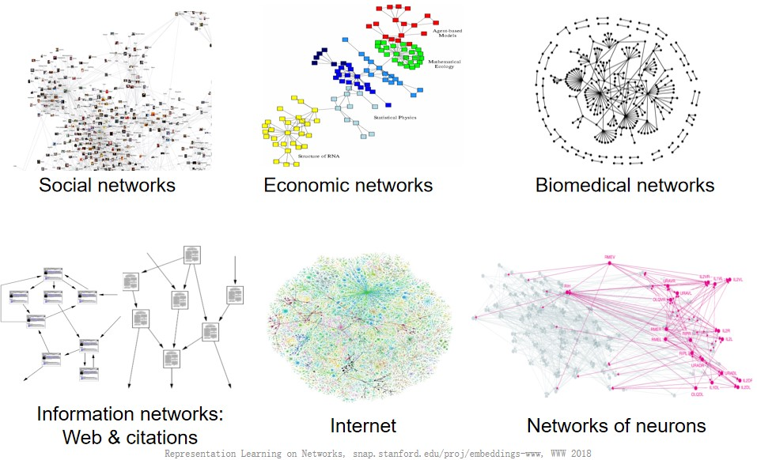

<!-- 首先当然要了解一下这类系统服务的对象，请大家想一想身旁的图数据相关应用都有哪些？不拘泥于几年前课堂上所学的最短路径算法 -->

---

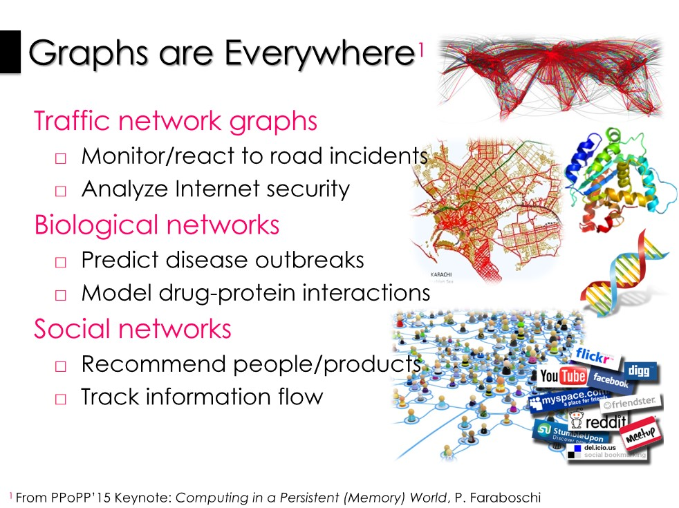

---

### 经典图算法——最短路径

<style scoped>
  li {
    font-size: 18px;
  }
  p {
    font-size: 36px;
    text-align: center;
  }
</style>

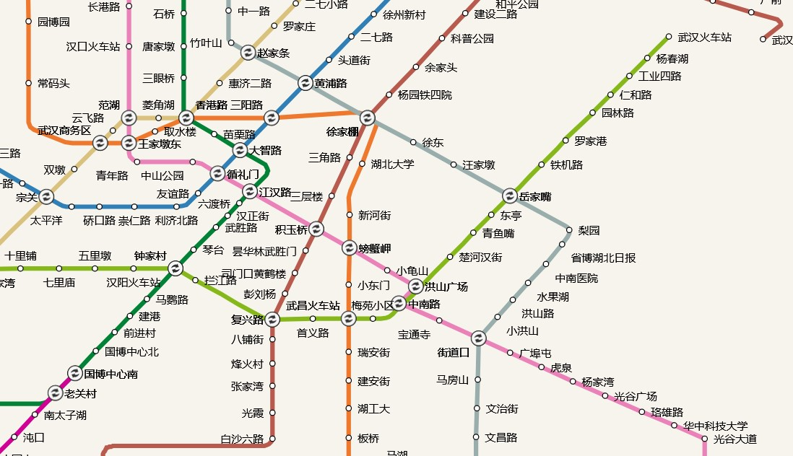 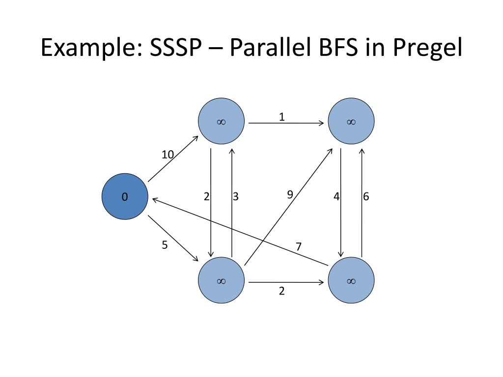

- [Stanford Network Analysis Project](http://snap.stanford.edu/)
- [The Stony Brook Algorithm Repository](https://www.algorist.com/algorist.html)
- [The Network Data Repository with Interactive Graph Analytics and Visualization](https://networkrepository.com/)

---

### 经典图算法——网页排名

<style scoped>
  li {
    font-size: 18px;
  }
  p {
    font-size: 36px;
    text-align: center;
  }
</style>

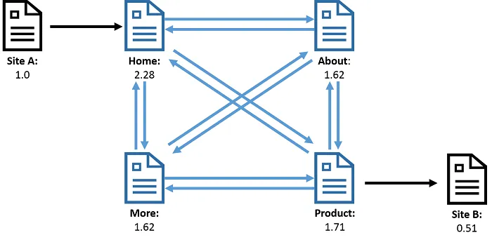 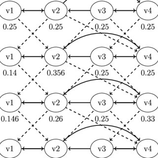 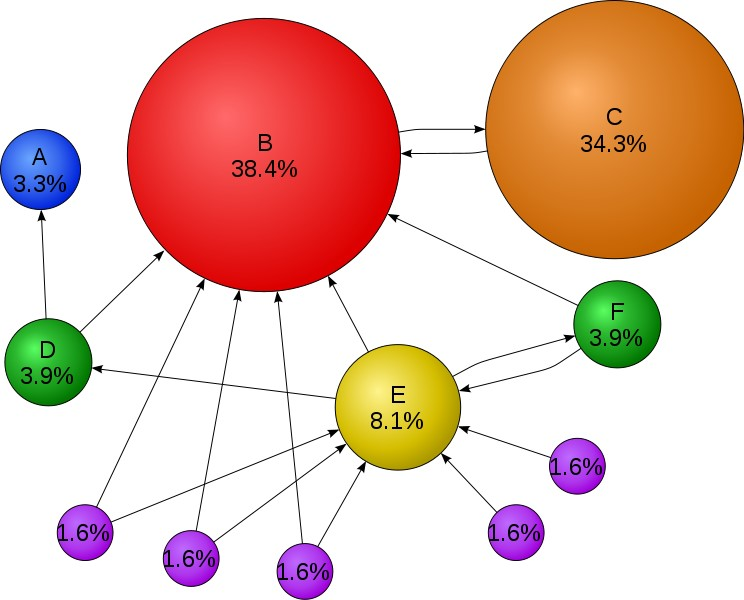

- [Malewicz G, Austern M H, Bik A J C et al. **Pregel: A System for Large-Scale Graph Processing**. SIGMOD 2010.](https://dl.acm.org/doi/10.1145/1807167.1807184)

---

### 经典图算法——子图匹配

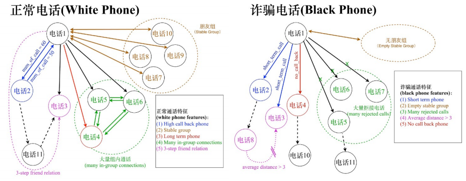

---

#### 人工提取属性

```SQL
源电话拨打过电话的联系人的总数目
源电话拨打目标圈的总通话次数
源电话拨打目标圈的总通话时长
源电话拨打目标圈的平均通话时长
源电话拨打目标圈的平均通话次数
源电话与每个目标圈的联系人平均通话的活跃天数
目标圈内有回拨源电话的联系人的总数
目标圈内回拨源电话的总通话个数
目标圈内回拨源电话的平均回拨通话时长
...
```

---

### 动态图分析

<style scoped>
  li {
    font-size: 27px;
  }
</style>


- 动态图不仅规模巨大，其拓扑结构亦持续变化
  - Facebook: 月活跃用户达25亿
  - Twitter: 每天500亿条推文被发送
  - 淘宝: 每秒54.4万笔订单被创建
- 分析目标
  - 复盘各时状态
  - 找出演化趋势

---

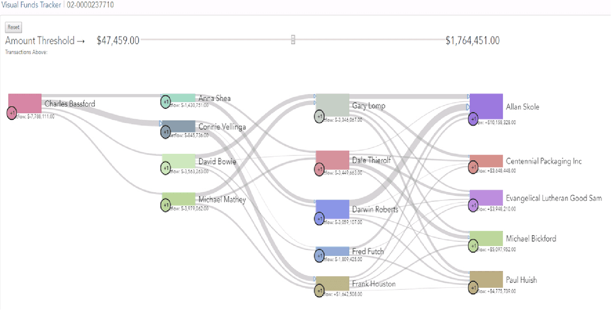

---

### 社交网络：关联即生产力

<style scoped>
  table, tr, td {
    font-size: 23px;
  }
</style>

| 场景 | 关键指标 | 图数据价值 |
|---|---|---|
| 实时推荐 | 双十一每秒新增25万商品节点，传统方案需每2小时全图重训练，GMV损失预估达15亿/天 | 跨品类推荐GMV ↑ 27% （相当于日均增收4.3亿） ([CSDN](https://blog.csdn.net/qq_43664407/article/details/148517081)) |
| 30 亿节点社交图谱 | 1.8 EB 邻接矩阵 → 采样后 14 min 训练 | GraphSAGE 归纳式学习，新用户 0.3 s 生成嵌入 ([CSDN](https://blog.csdn.net/qq_43664407/article/details/148517081)) |
| 团伙欺诈 | 亿级边，10 层传播路径 | 3 跳环检测 50 倍提速，欺诈率 ↓50 % ([计算机学报](http://cjc.ict.ac.cn/online/onlinepaper/002-%E5%88%98%E5%AE%87%E6%B6%B5-H-2022425163952.pdf)) |

📈 **经济收益**：阿里年增营收 ≈ 200 亿元；平台活跃度 ↑7 %  
🎯 **规模特征**：30 B 节点 / 1 000 B 边，日增 5 % 动态图  
⚡ **性能亮点**：采样训练 14 min vs 4 h；线上 < 30 ms  

<!-- GMV（Gross Merchandise Volume，商品交易总额）指在一定时间段内，平台上所有已付款订单的金额总和，不含优惠券、退款及任何形式的手续费。在电商大促场景中，它是衡量平台成交规模和业务增长的核心指标。 -->

---

### 信息安全：攻防新战场

<style scoped>
  table, tr, td {
    font-size: 27px;
  }
</style>

| 威胁 | 传统方案 | 图数据方案 |
|---|---|---|
| 账户匿名化 | 单点特征失效 | 子图匹配 97 % 去匿名化准确率 ([计算机学报](http://cjc.ict.ac.cn/online/onlinepaper/002-%E5%88%98%E5%AE%87%E6%B6%B5-H-2022425163952.pdf))  |
| 洗钱环路 | SQL 5 跳超时 | 图查询 5 跳 < 100 ms，环路发现 ↑50 倍 |
| 恶意软件家族 | MD5 黑名单滞后 | 函数调用图嵌入，变种检出率 ↑35 % |

🎯 **数据规模**：100 B 节点事件图谱，日增量 8 TB  
⚡ **性能提升**：深链查询 1 994×（4 跳）~ 10 000×（5 跳）  
💰 **经济价值**：全球反洗钱年节省合规成本 ≈ 150 亿美元  

---

### 基础设施：秒级排障，绿色运维

<style scoped>
  table, tr, td {
    font-size: 27px;
  }
</style>

| 场景 | 传统方式 | 图数据方式 |
|---|---|---|
| 全国基站拓扑 | 15 分钟人工定位 | 图算法 2 秒根因定位，故障影响面 ↓80 % |
| 30 天话单溯源 | 批处理 6 h | 图数据库 3 跳查询 < 200 ms |
| 腾讯怀来瑞北云 DC | 告警风暴需人工逐条分析 | 图计算+物模型 秒级收敛，自动定位准确率 99 % |

📈 **经济收益**：腾讯年省运维人力 **30 %**；单 DC 年节电 **1 600 万 kWh**  
🎯 **规模特征**：**百万级**监控点 / **亿级**拓扑边，**秒级**告警洪流  
⚡ **性能亮点**：告警压缩 **95 %**；故障定位 **< 5 s**；PUE ↓ **0.08**  

> 来源：中国信通院《[数据中心智能化运维发展研究报告](http://www.caict.ac.cn/kxyj/qwfb/ztbg/202303/P020230323582881859045.pdf)》，2023-03  

<!-- 以面向对象的物模型（Device-Model）描述数据中心内所有可被监控的实体（供配电、暖通、安防、服务器、虚拟机、容器、告警事件等），并将实体之间的拓扑依赖自动转化为图模型；利用实时图计算引擎对流式告警进行秒级收敛、根因定位与影响面分析。换言之，“物模型” 就是 IDC 运维场景下的设备数字化模型，把每个物理或逻辑对象抽象为带属性、带关系的节点；图计算引擎在这些节点/边上运行连通性、最短路径、子图匹配等算法，实现秒级故障定位。 -->

---

### 卫生健康：图追踪阻断新冠传播

<style scoped>
  table, tr, td {
    font-size: 27px;
  }
</style>

| 场景 | 传统方式 | 图数据方式 |
|---|---|---|
| 海南疫时接触者追踪 | 人工电话 48 h/人 | **图数据库** 10 万条记录中 **秒级** 锁定 **10 871** 名接触者 |
| 密接判定 | 纸质问卷易遗漏 | 3 跳关系网络挖出 **378** 名密接 & 高风险场所 |
| 隔离决策 | 经验驱动 | 数据驱动 **1** 名确诊即隔离，**R0 由 3.2 → 0.8** |

📈 **经济收益**：单省节省流调人力 **65 %**；封控时间 ↓**7 天** → **3 天**  
🎯 **规模特征**：**千万级** 节点（人/车/场所）/ **亿级** 边，日增 **8 TB** 轨迹  
⚡ **性能亮点**：深链查询 **< 200 ms**；密接识别准确率 **> 95 %**  

> 来源：[Mao Zijun 等，*JMIR mHealth uHealth*](https://mhealth.jmir.org/2021/1/e26836)，2021-01-22

<!-- 密接（Close Contact） 的判定基于时空重叠度，具体定义如下：

如果两个人在 同一场所（同一小区、同一超市、同一交通工具等） 且 时间差 ≤ 30 分钟，则在该有向图上建立一条 “可能接触” 边，并标记 接触时长 与 空间距离 两个属性。

当接触时长 ≥ 10 分钟 且 距离 ≤ 1 米 时，该边被进一步升级为 “密切接触” 边，视为需要隔离的高风险关系。
文章随后利用图数据库的 3 跳查询，一次性把满足上述条件的 所有密切接触者和场所 全部拉出，用于后续精准隔离与流调。 -->

---

## 追求高效的图系统

<style scoped>
  h2 {
    padding-top: 200px;
    text-align: center;
    font-size: 72px;
  }
</style>

---

## 经典图系统

<style scoped>
  li {
    font-size: 18px;
  }
  p {
    font-size: 20px;
    text-align: center;
  }
</style>

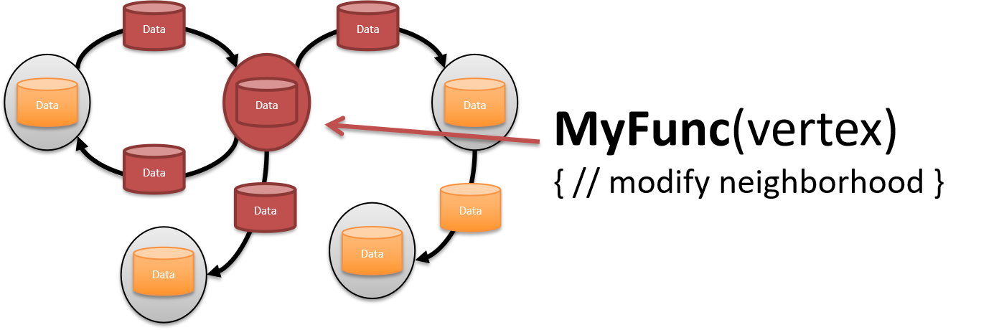

[Malewicz G, Austern M H, Bik A J C et al. **Pregel: A System for Large-Scale Graph Processing**. SIGMOD 2010.](https://dl.acm.org/doi/10.1145/1807167.1807184)

---

<style scoped>
  p {
    padding-top: 620px;
    font-size: 20px;
    text-align: center;
  }
</style>

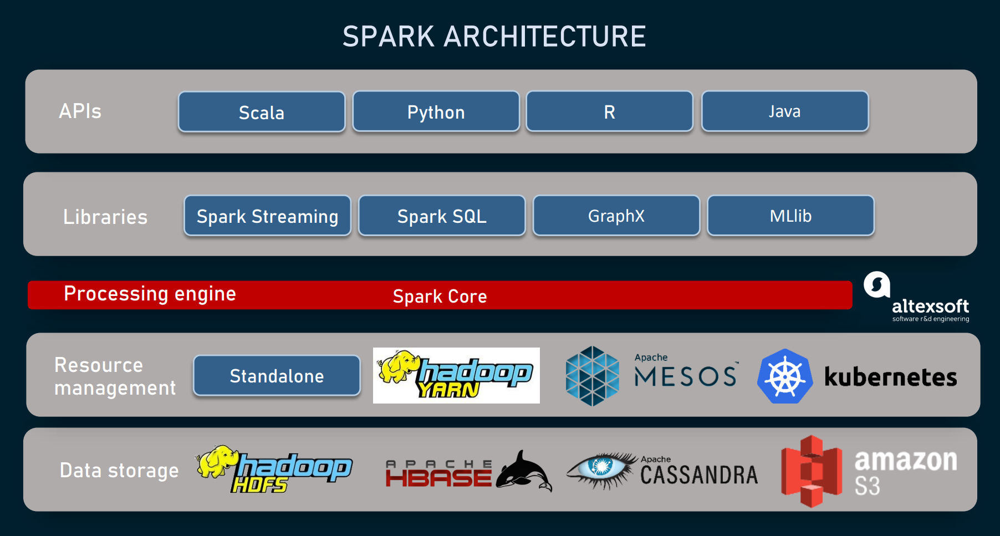

[Apache Spark - A Unified engine for large-scale data analytics](https://spark.apache.org/docs/latest/index.html)

<!-- 正如知名的Hadoop系统，其实是MapReduce框架的开源实现，其上构建的Spark GraphX也是Pregel的重视复现 -->

---

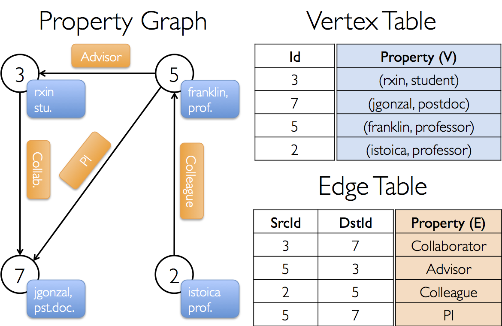

<!-- 系统内以属性图的形式，通过规范化的编程框架来实现复杂的图应用 -->

---

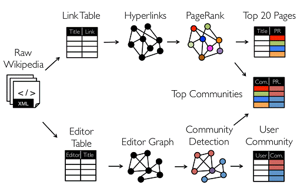

<!-- 比方说这个用来找寻维基百科热门社区的应用，里面就包含了两路并行的图分析过程 -->

---

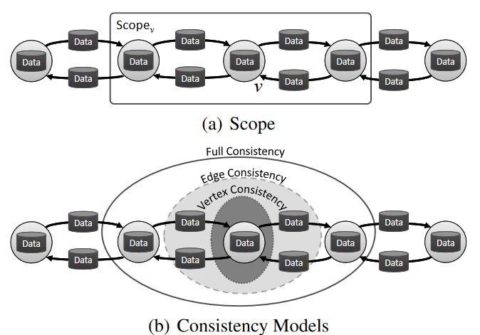 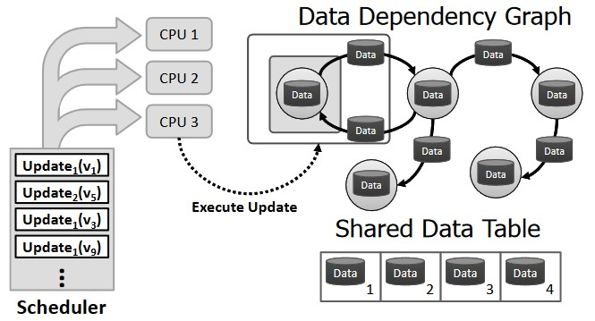

[The Story of GraphLab – From Scaling Machine Learning to Shaping Graph Systems Research (VLDB 2023 Test-of-time Award Talk)](https://www.vldb.org/pvldb/vol16/p4138-gonzalez.pdf)

<!-- 作为高校的科研成果，GraphLab则更强调处理的范式，结合Pregel的顶点中心计算框架，提出了GAS模型 -->

---

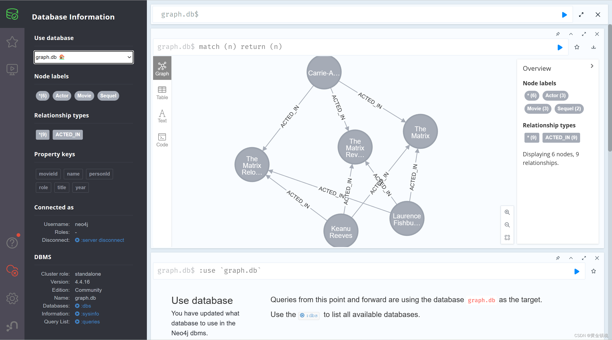

<!-- 专攻图数据处理的系统，还专门分支出了一个门类，如今被归类为一种NoSQL的图数据库，曾经风光一时，但是其中最具标志意义的创业公司Neo4j的发展却颇为坎坷，最近倒是又有新的契机闪过，即KG与LLM的合作 -->

---

## 早期形态（2005–2010）

<style scoped>
  table, tr, td {
    font-size: 25px;
  }
</style>

| 关键词 | 具体表现 |
| --- | --- |
| **通用框架缺位** | 无专用图引擎，先用 **MapReduce** 硬跑：邻表 → 迭代 → 磁盘 → 再迭代 |
| **单节点内存版** | 研究者把 **< 1 GB** 的 Web 图强行塞进单机内存，写 200 行 C++ 即发 SIGMOD |
| **BSP 原型** | 在 **MPI** 上手工实现 3 步超步，验证 PageRank 收敛即可登上高分论文 |
| **磁盘为王** | 2008 年单机能把 **10M 顶点 / 100M 边** 的图在 **SATA 盘** 上跑通就算“可扩展” |

> 一句话：**“能跑完”就是创新，“跑得快”是奢侈。**

<!-- 这里指代的就是前面提到的 Pregel 系统以及 GraphChi。 -->

---

## 影响后续图系统设计的基本概念

<style scoped>
  table, tr, td {
    font-size: 27px;
  }
</style>

| 概念 | 早期论文里的原话 & 今天对应术语 |
| --- | --- |
| **Vertex-centric** | “Think like a vertex” (Pregel, 2010) → 今日 GNN 消息传递前身 |
| **Bulk Synchronous Parallel** | “Super-step makes global sync easy” → 今日 BSP/ASP/SSP 全家桶 |
| **Edge-cuts vs Vertex-cuts** | “Min-cut graph partitioning” → 今日 Balanced & Streaming Partition |
| **Graph-centric Storage** | “Adjacency lists stored in column blocks” → 今日 CSR/CSC/Compressed Adj. List |

---

## 回顾经典系统结构

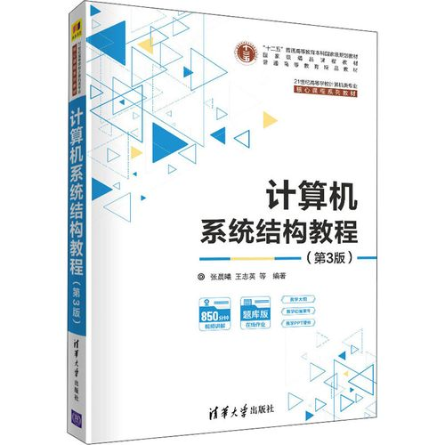

- 并行结构
  - 指令级、线程级、数据级、请求级
- 层次存储
  - 缓存、内存、外存

<!-- 为了深入认识这些图处理系统背后的设计方法，有必要回顾一下我们以往学习的计算机系统相关知识 -->

---

### 并行结构

<style scoped>
  h3 {
    padding-top: 500px;
  }
  p {
    font-size: 18px;
  }
</style>

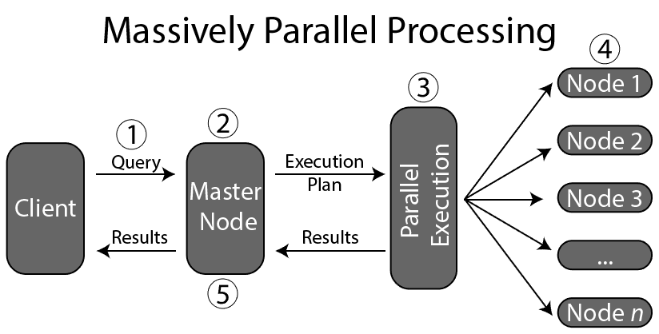

[Computer Architecture A Quantitative Approach 6th Edition](https://www.elsevier.com/books/computer-architecture/hennessy/978-0-12-811905-1), Chapter 4, 5.

<!-- 这就是一个典型的并行处理结构，试问其并行任务工作在什么级别呢？ -->

---

### 层次存储

<style scoped>
  h3 {
    padding-top: 500px;
  }
  p {
    font-size: 18px;
  }
</style>

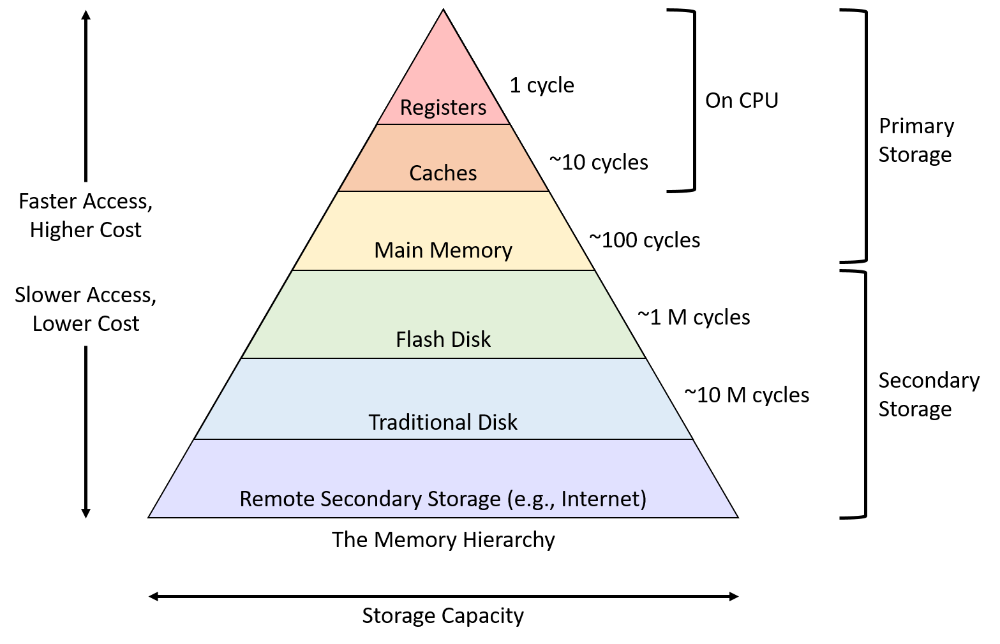

[Computer Architecture A Quantitative Approach 6th Edition](https://www.elsevier.com/books/computer-architecture/hennessy/978-0-12-811905-1), Chapter 2.

<!-- 这里则是一个典型的层次存储结构，试问其出现的动机又是什么呢？ -->

---

## 图应用访存特点

<style scoped>
  p {
    font-size: 72px;
    text-align: center;
  }
</style>

偏斜性

随机性

<!-- 趁着刚刚重温了相关概念，这里审视一下目标应用的特点，首先点个题，图应用最突出的存储器访问特点在于这两者：偏斜性和随机性，两者分别是分布式处理和分层存储架构的大敌 -->

---

### 偏斜性

<style scoped>
  li {
    font-size: 18px;
  }
</style>

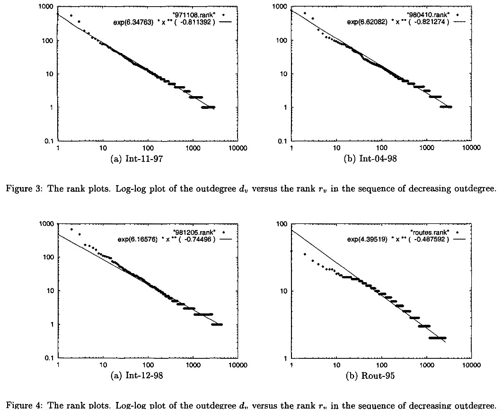 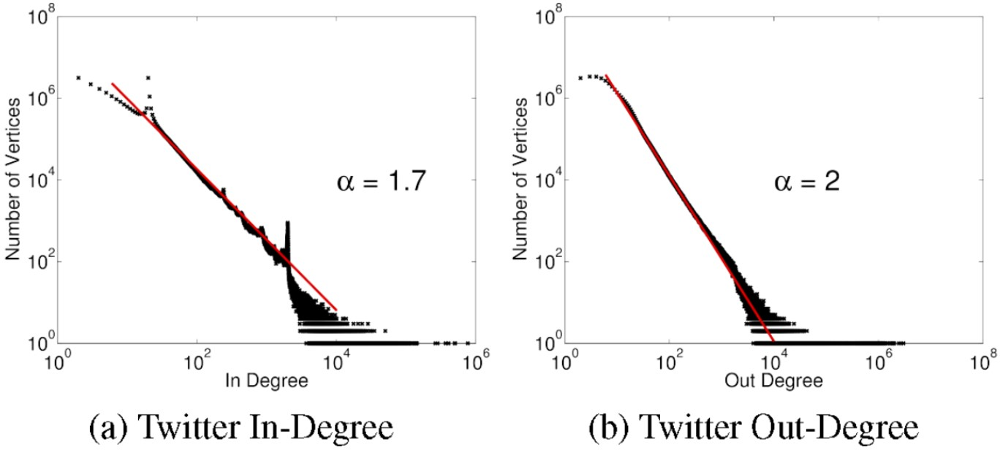

- [Faloutsos M, Faloutsos P, Faloutsos C. On power-law relationships of the Internet topology. SIGCOMM 1999.](https://dl.acm.org/doi/10.1145/316188.316229)
- [Gonzalez J E, Low Y, Gu H et al. PowerGraph: distributed graph-parallel computation on natural graphs. OSDI 2012.](https://www.usenix.org/system/files/conference/osdi12/osdi12-final-167.pdf)

---

#### SNAP真实图数据集

<style scoped>
  h5 {
    font-style: italic;
  }
  th {
    font-size: 20px;
  }
  td {
    font-size: 16px;
  }
</style>

|Name|Type|Nodes|Edges|Communities|Description|
|:-|:-|-:|-:|-:|:-|
|[com-LiveJournal](http://snap.stanford.edu/data/com-LiveJournal.html)|Undirected, Communities|3,997,962|34,681,189|287,512|LiveJournal online social network|
|[com-Friendster](http://snap.stanford.edu/data/com-Friendster.html)|Undirected, Communities|65,608,366|1,806,067,135|957,154|Friendster online social network|
|[com-Orkut](http://snap.stanford.edu/data/com-Orkut.html)|Undirected, Communities|3,072,441|117,185,083|6,288,363|Orkut online social network|
|[com-Youtube](http://snap.stanford.edu/data/com-Youtube.html)|Undirected, Communities|1,134,890|2,987,624|8,385|Youtube online social network|
|[com-DBLP](http://snap.stanford.edu/data/com-DBLP.html)|Undirected, Communities|317,080|1,049,866|13,477|DBLP collaboration network|
|[com-Amazon](http://snap.stanford.edu/data/com-Amazon.html)|Undirected, Communities|334,863|925,872|75,149|Amazon product network|
|[email-Eu-core](http://snap.stanford.edu/data/email-Eu-core.html)|Directed, Communities|1,005|25,571|42|E-mail network|
|[wiki-topcats](http://snap.stanford.edu/data/wiki-topcats.html)|Directed, Communities|1,791,489|28,511,807|17,364|Wikipedia hyperlinks|

#### 统计度分布

```bash
grep -v "^#" com-amazon.ungraph.txt | awk '{print $1"\n"$2}' | sort -n | uniq -c
```

---

### 随机性

<style scoped>
  p {
    text-align: center;
  }
  li {
    font-size: 18px;
  }
</style>

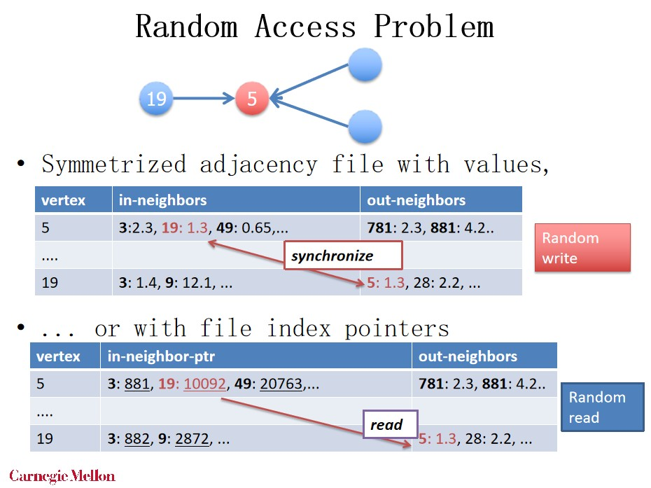

- [Kyrola A, Blelloch G, Guestrin C. **GraphChi: Large-Scale Graph Computation on Just a PC**. OSDI 2012.](https://www.usenix.org/conference/osdi12/technical-sessions/presentation/kyrola)

---

<style scoped>
  li {
    padding-top: 600px;
    font-size: 18px;
  }
</style>

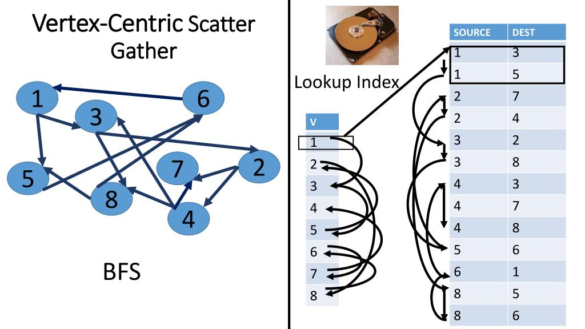

- <https://github.com/snap-stanford/snap/blob/master/tutorials/demo-bfsdfs.cpp>

---

### 重温CacheLab

<style scoped>
  p {
    font-size: 27px;
  }
</style>

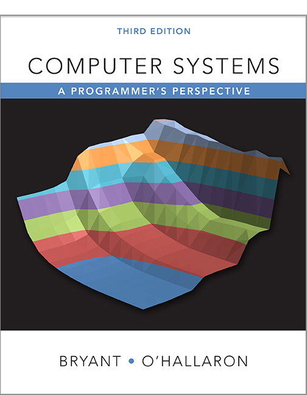

[Computer Systems: A Programmer's Perspective, 3/E (CS:APP3e)](http://csapp.cs.cmu.edu/3e/home.html), Randal E. Bryant and David R. O'Hallaron, Carnegie Mellon University

[深入理解计算机系统（原书第3版）](https://item.jd.com/12006637.html)

[Introduction to Computer Systems (ICS)](http://www.cs.cmu.edu/~213/), [2015 CMU 15-213 CSAPP 深入理解计算机系统](https://www.bilibili.com/video/BV1iW411d7hd/)

Lecture12 Cache Memory

<!-- 上次我们谈到图这种特点鲜明，价值深远的应用，其构造具有偏斜性，行为具有随机性，而支撑其运转的系统，则仰赖各个层级的并行性，以及塑造层次存储的局部性，然而这里面涌现出天然的矛盾，构成了我们面前的第一重挑战 -->

---

#### 实验准备

- [实验扩展](https://gitee.com/computer-architecture-hust/computer-architecture-experiment), [作业参考](https://github.com/cs-course/bfs_cachelab_handin)
  - 基于 CacheLab 观察经典图算法访存行为
- [辅助工具](https://github.com/ShiZhan/generator)
  - 4种经典随机图生成器，合成具备自然图特征的实验数据集
  - 清理自连边、重复边脚本，重编号脚本
- [SNAP工具包](http://snap.stanford.edu/snap/download.html)
  - Windows版本需要Cygwin，Linux版本需要Ubuntu

<!-- 从这个问题开始，我们演示一下作为一名研究生，大致的学习过程应该是怎样的

首先，之前学习的记忆里，告诉我们局部性这样一个概念，我们很自然的希望从如今的实验环境中找出来

当时课本上是一个什么样的表述呢？我们少许回顾一下 -->

---

#### 经典BFS算法：两个关键数据结构，两重循环体

<style scoped>
  pre {
    font-size: 27px;
  }
</style>

```C
void bfs(int source) {
    int v = source, n;
    long long int i, front = 0, rear = 0;
    visited[v] = true;
    frontier[rear] = v;
    while (front <= rear) {
        v = frontier[front]; /* delete from queue */
        front++;
        for (i = csr_index[v]; i < csr_index[v + 1]; i++) {
            /* Check for adjacent unvisited nodes */
            n = csr_edges[i];
            if (visited[n] == false) {
                visited[n] = true;
                rear++;
                frontier[rear] = n;
            }   
        }
    }
}
```

---

#### CSR构造

<style scoped>
  p {
    font-size: 20px;
  }
</style>

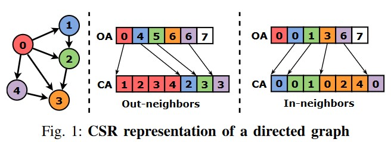

[**When is Graph Reordering an Optimization? Studying the Effect of Lightweight Graph Reordering Across Applications and Input Graphs**](http://abstract.ece.cmu.edu/pubs/graphreordering-preprint.pdf), IISWC 2018, ***Best Paper Award***.

---

#### 尝试哪些布局？

- 原始顺序
- 度降序排列
  - [SIGMOD '16](https://dl.acm.org/doi/abs/10.1145/2882903.2915220)
- 遍历顺序排列
  - [ICPE '14](https://dl.acm.org/doi/10.1145/2568088.2576761)

---

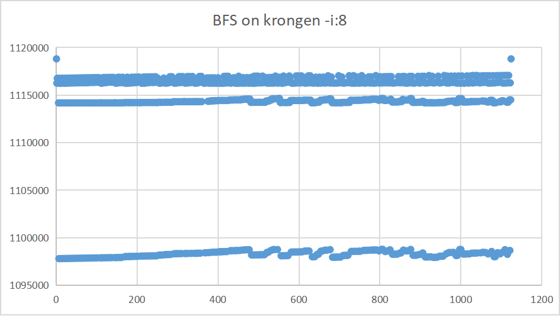

---

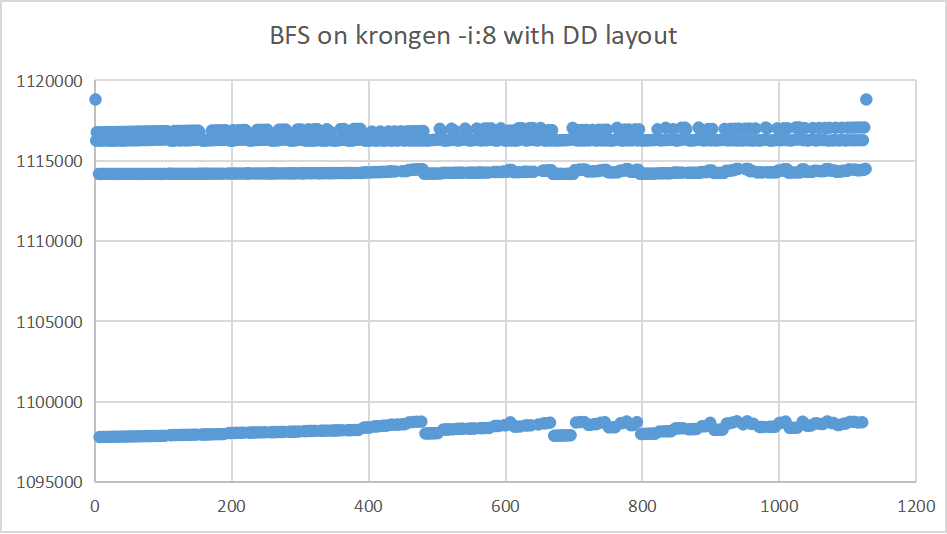

---

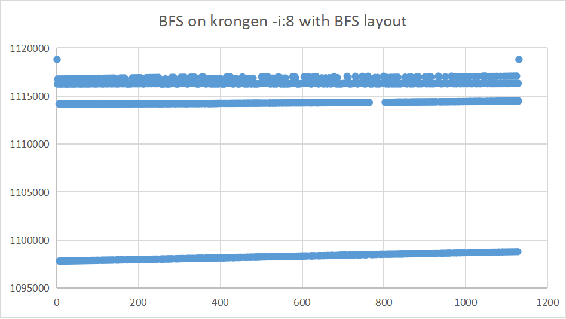

---

<style scoped>
  p {
    padding-top: 100px;
    text-align: center;
    font-size: 72px;
  }
  li {
    font-size: 23px;
  }
</style>

实践出真知

- 图应用和传统应用访存有什么区别？
- 重排图访存模式有什么变化？
- 对缓存性能造成什么影响？
- 效果是否明确？适用是否广泛？
- ……
- *干脆躺平放弃排序* X-Stream, SOSP '13
- *一次搞定还是每次重排？* GrafBoost, ISCA '18

---

## 怎样使布局亲和架构？

<style scoped>
  h2 {
    padding-top: 200px;
    text-align: center;
    font-size: 72px;
  }
</style>

---

## 系统怎么设计？

- 分布式架构
- 分层式架构
- 分布式、分层架构

---

<style scoped>
  p {
    padding-top: 100px;
    text-align: center;
    font-size: 72px;
  }
</style>

## 系统怎么设计？……

<style scoped>
  p {
    padding-top: 50px;
    text-align: center;
    font-size: 72px;
  }
</style>

- 分布式架构
- 分层式架构
- 分布式、分层架构

软件、硬件怎样相互协同？

---

### 分布式架构

<style scoped>
  p {
    font-size: 18px;
  }
</style>

- 让足量内存应对随机访存，然而…

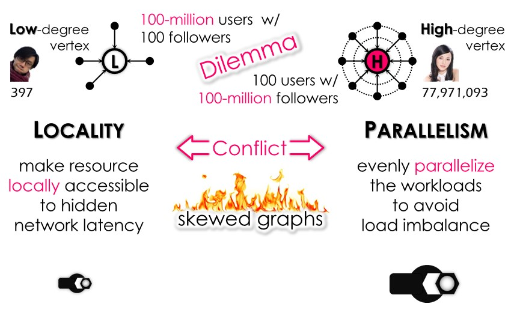

Pregel[SIGMOD’10] ,GraphLab[OSDI’12], Gemini[OSDI’16]

---

### 分布式架构…

<style scoped>
  p {
    font-size: 18px;
  }
  li {
    font-size: 25px;
  }
</style>

- 让足量内存应对随机访存，然而…
- MapReduce的问题
  - 漫长迭代、不平衡负载
- 图分区的矛盾
  - 尺寸平衡，切割少
  - 过度分区

[Gonzalez J E, Low Y, Gu H et al. **PowerGraph: distributed graph-parallel computation on natural graphs**. OSDI 2012.](https://www.usenix.org/conference/osdi12/technical-sessions/presentation/gonzalez)
[Chen R, Shi J, Chen Y et al. **PowerLyra: differentiated graph computation and partitioning on skewed graphs**. EuroSys 2015.](https://dl.acm.org/doi/10.1145/2741948.2741970)
[Tsourakakis C, Gkantsidis C, Radunovic B et al. **FENNEL: streaming graph partitioning for massive scale graphs**. WSDM 2014.](https://dl.acm.org/doi/10.1145/2556195.2556213)
[Shi Z, Li J, Guo P et al. **Partitioning dynamic graph asynchronously with distributed FENNEL**. FGCS 2017.](https://www.sciencedirect.com/science/article/pii/S0167739X1730033X)
...

---

### 分层式架构

<style scoped>
  p {
    font-size: 18px;
  }
</style>

- 让足量外存实现扩展避免网络分布，可是…

GraphChi[OSDI’12], X-Stream[SOSP'13], GridGraph[ATC'15]，CLIP[ATC'17]

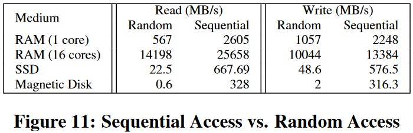

[Roy A, Mihailovic I, Zwaenepoel W. X-Stream: edge-centric graph processing using streaming partitions. SOSP 2013.](https://dl.acm.org/doi/10.1145/2517349.2522740)

---

### 分层式架构…

<style scoped>
  p {
    font-size: 18px;
  }
</style>

- 让足量外存实现扩展避免网络分布，可是…
- 外存模式
  - 大块访问的实现
  - 顺序访问的实现
- 分批问题
  - 如何排序

---

### 分布式、分层架构

<style scoped>
  p {
    text-align: center;
  }
  li {
    font-size: 18px;
  }
</style>

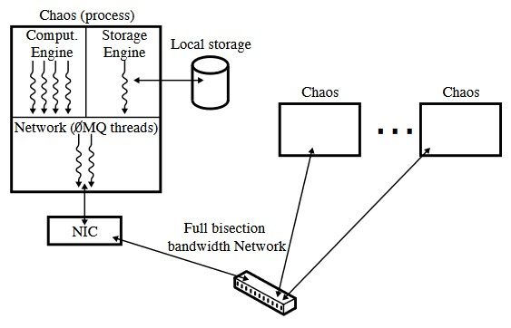

- [Roy A, Bindschaedler L, Malicevic J et al. **Chaos: Scale-Out Graph Processing from Secondary Storage**. SOSP 2015.](https://dl.acm.org/doi/10.1145/2815400.2815408)

---

### 图处理系统发展

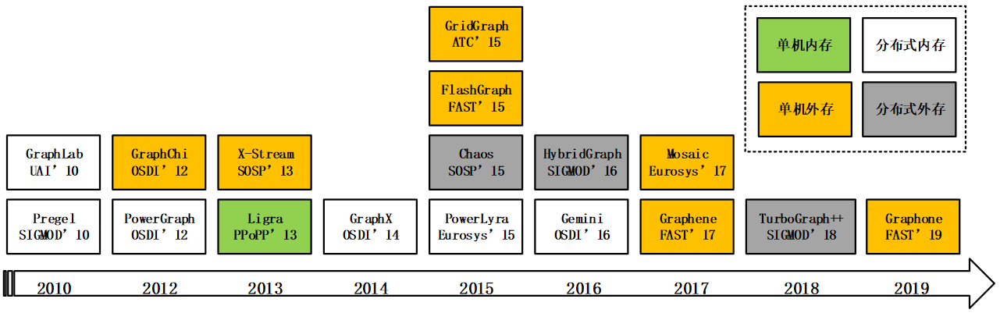

---

### **反思重排**

- 提高数据访问速度
  - Optimizing cpu cache performance for pregel-like graph computation  [ICDEW’15]
  - Speedup Graph Processing by Graph Ordering  [SIGMOD’16]
  - MOSAIC [EuroSys’17]
- 减少冗余I/O
  - Load the Edges You Need [ATC’16]
  - CLIP [ATC’17]

---

### **两个都要**

<style scoped>
  p {
    text-align: center;
    font-size: 60px;
  }
</style>

- 提高数据访问速度

活跃数据

- 减少冗余I/O

不活跃数据

---

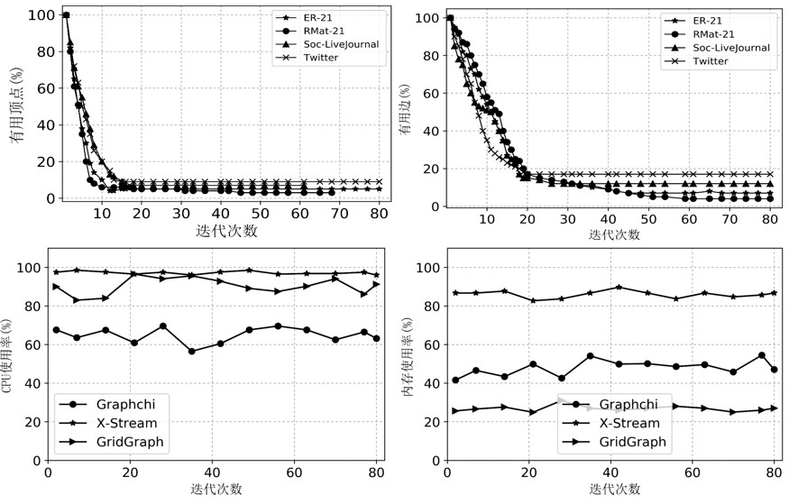

<!-- 不过，不同阶段，重点可不一样，前面更关注活跃数据的主流，后面则更关注不活跃数据的淘汰 -->

---

- 如何在重排图数据时，兼顾活跃数据和不活跃数据？
  - **为什么？**…集中驻留与高效淘汰…
  - **试一试**：可以围绕CacheLab、Gem5、SNAP做进一步实验观察

```bash
./build/X86/gem5.opt -d $HOME/snap-cc-rmat21-base -r \
  -e configs/example/se.py -n 4 \
    --caches --l2cache --l3cache --l1d_size=32kB --l1i_size=32kB --l2_size=256kB --l3_size=8MB --mem-size=4GB \
  -c $HOME/snap/examples/concomp/concomp -o " -i:$HOME/rmat21.txt "
./build/X86/gem5.opt -d $HOME/snap-cc-rmat21-gor -r \
  -e configs/example/se.py -n 4 \
  --caches --l2cache --l3cache --l1d_size=32kB --l1i_size=32kB --l2_size=256kB --l3_size=8MB --mem-size=4GB \
  -c $HOME/snap/examples/concomp/concomp -o " -i:$HOME/rmat21_reorder.txt "
./build/X86/gem5.opt -d $HOME/snap-cc-rmat21-act -r \
  -e configs/example/se.py -n 4 \
  --caches --l2cache --l3cache --l1d_size=32kB --l1i_size=32kB --l2_size=256kB --l3_size=8MB --mem-size=4GB \
  -c $HOME/snap/examples/concomp/concomp -o " -i $HOME/rmat21_sort.txt "
```

---

### **预判活跃顶点：中介中心性**

<style scoped>
  p {
    padding-top: 400px;
    text-align: center;
    font-size: 60px;
  }
</style>

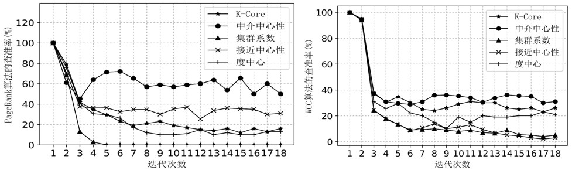

碰运气？回想一下Pregel的顶点计算…

---

### **汇聚不活跃顶点：直接邻居**

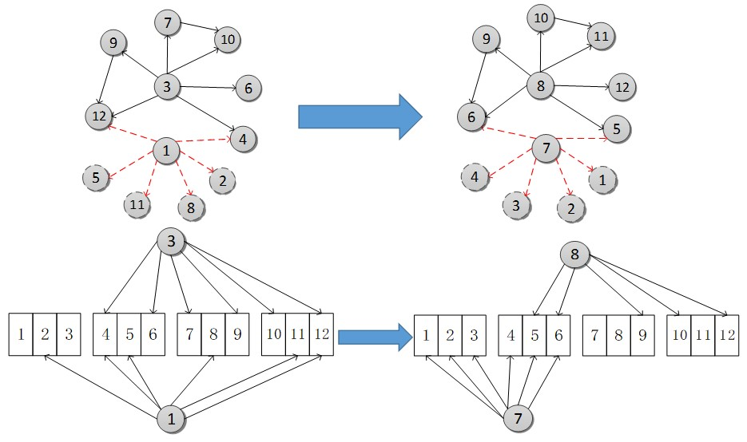

---

<style scoped>
  p {
    padding-top: 600px;
    text-align: center;
    font-size: 25px;
  }
</style>

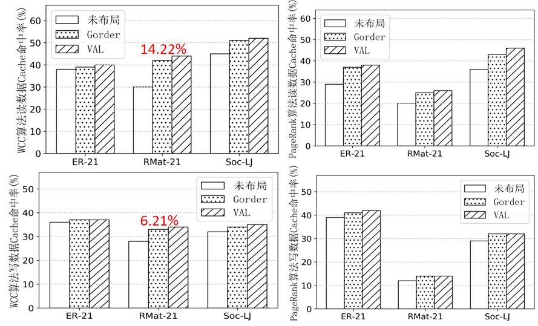

[Cache-friendly data layout for massive graph](https://ieeexplore.ieee.org/document/8515737/). NAS '18.

---

## 如何高效时空检索？

<style scoped>
  h2 {
    padding-top: 200px;
    text-align: center;
    font-size: 72px;
  }
</style>

---

### **研究背景**

<style scoped>
  p {
    text-align: center;
    font-size: 25px;
  }
</style>

- **时序图 (Temporal Graphs)** 广泛存在于现实世界（如社交网络、知识图谱），其结构和关系随时间不断演化。
- 时序图核心挑战：如何在**存储开销**和**查询时间**之间取得高效平衡。

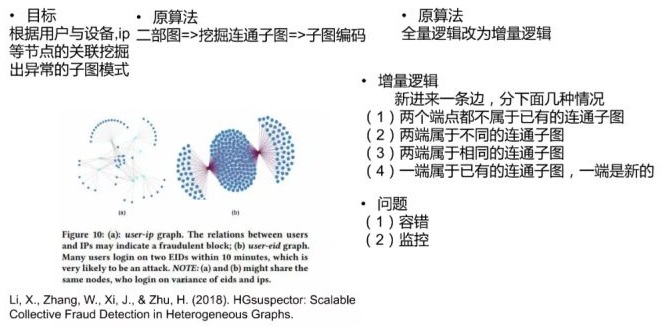

怎样找出10分钟以内的社媒账号同IP多开？…一个号码呼出10个以上被叫号码？…

---

### **现有存储模型及其局限**

<style scoped>
  li {
    font-size: 22px;
  }
</style>

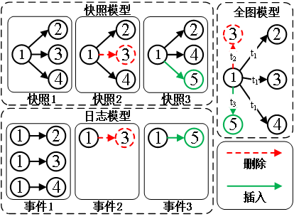

- **Copy-Based (副本式)**
  - **优点:** 查询速度快，结构局部性好。
  - **缺点:** 存储冗余高，连续快照间差异小但存储成本巨大。

- **Log-Based (日志式)**
  - **优点:** 存储开销小，只记录增量更新。
  - **缺点:** 查询时需重建快照，时间开销大。

- **Hybrid (混合式, 如Pensieve)**
  - 尝试结合两者优点，但**假设顶点度分布是静态的**。
  - **关键问题:** 现实图中顶点度偏斜性会**随时间动态变化**，静态假设导致性能下降。

---

### **一系列动态图系统研究**

<style scoped>
  li {
    font-size: 27px;
  }
</style>

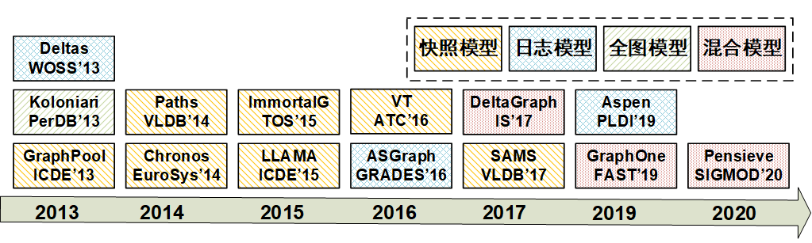

- 快照模型: $G=<G_0, G_1, G_2, \dots, G_t>$
- 日志模型: $G=<ev_0, ev_1, ev_2, \dots, ev_t>$
- 全图模型: $G_{[t_1, t_n]}=\langle V_{[t_1, t_n]}, E_{[t_1, t_n]}\rangle$
- 混合模型: 基于偏斜性感知或基于相关性感知

---

### **LSM-Subgraph**

[LSM-Subgraph: Log-Structured Merge-Subgraph for Temporal Graph Processing, APWeb-WAIM 2022](https://link.springer.com/chapter/10.1007/978-3-031-25158-0_39)

- 提出一种新型**时序图混合存储模型 LSM-Subgraph**，通过关键快照和中间日志，综合副本（copy-based）和日志（log-based）模式特长
- 基于 PMA（Packed Memory Array）的邻接数组模型，提出一种**动态空位分配**策略，根据图演化特征分配空位，提升更新效率
- 提出基于**波动感知**（fluctuation-aware）的关键快照创建方法，设定阈值 β，在存储开销和查询时间之间实现最优平衡

---

### **基于PMA的邻接数组**

- **目标:** 高效支持更新，避免全局重建。
- **方法:**
  - 用 **Packed Memory Array (PMA)** 存储快照，元素间预留空隙。
  - 插入/删除操作可通过局部移动元素完成，大幅降低更新开销。
  - 提出新的空隙分配与再平衡策略，适应时序图的动态特性。

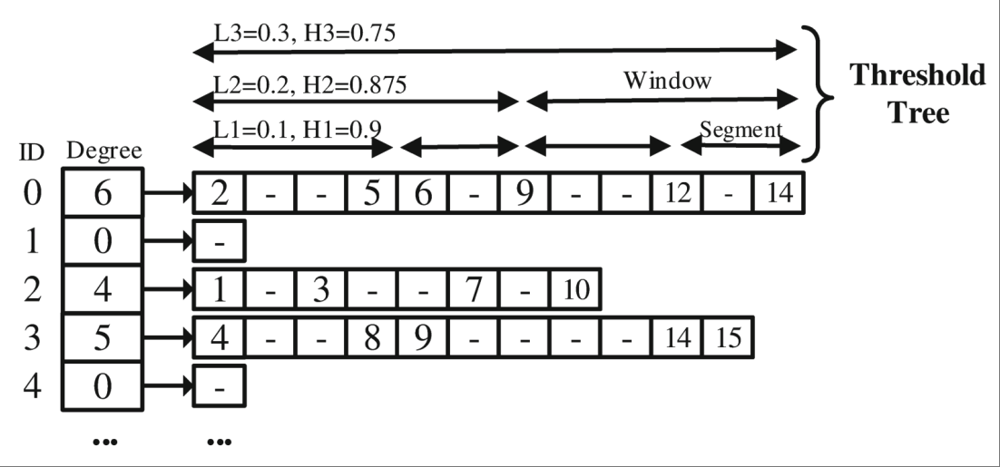

---

### **变化感知的快照创建**

- **目标:** 智能选择何时创建关键快照 (Key Snapshot)。
- **方法:**
  - 定义差异度 `TD` (Temporal Discrepancy) 衡量连续快照间变化度。
  - 当 `TD > β` (阈值，经验值 **0.03**) 时，才创建新的关键快照。
  - 克服了基于固定时间或固定日志大小方法的缺陷，实现动态优化。

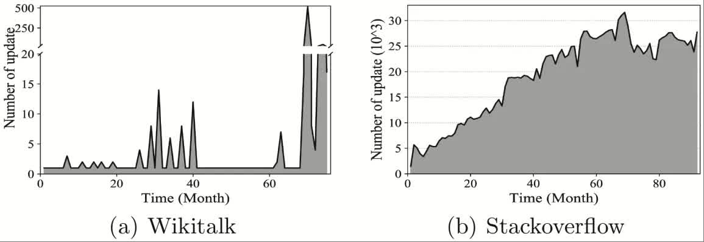 $TD(K_1, K_2) = \frac{|E_G|}{|E_{K_1}| + |E_{K_2}|}$

---

### **日志合并方法**

<style scoped>
  li {
    font-size: 27px;
  }
</style>

- **目标:** 减少查询时需要处理的日志量。
- **方法:**
  - 在合并前对日志进行预处理，消除对同一元素的冗余操作。
  - 例如：多次插入视为最后一次插入；插入后删除则视为无操作。

### **系统设计**

- **数据结构:** 将数据划分为多个 **Shard**，每个 Shard 包含一个PMA快照和一段日志。
- **查询引擎:** 查询时，找到最近的关键快照，应用合并后的日志，快速重构目标时间点的图状态。

---

### **实验效果**

<style scoped>
  li {
    font-size: 27px;
  }
</style>

- **对比对象:** Chronos (Copy-Based), GraphPool (Log-Based), Pensieve (Hybrid)。
- **结果:**
  - **vs. GraphPool:** 查询效率 **平均提升86%**，内存开销降低 **9%~57%**。
  - **vs. Chronos:** 查询效率 **平均提升53%**，内存开销 **大幅降低**。
  - **vs. Pensieve:** 查询时间 **最多减少12.5倍** (因避免远程重建)，内存开销约为其3.2倍但**是可接受的权衡**。
- **自身组件的有效性:** PMA模型更新效率远高于CSR/AdjList；波动感知策略在存储和查询时间上均优于基于周期或随机的方法。

---

## 表示学习与随机游走

<style scoped>
  h2 {
    padding-top: 200px;
    text-align: center;
    font-size: 72px;
  }
</style>

---

### 本节主线：从一阶游走到二阶随机游走

- 图表示学习把节点映射为低维向量；**随机游走是生成训练语料的核心手段**
- 递进：一阶(DeepWalk) → 二阶定义(node2vec) → 系统挑战 → 系统方案(SOWalker) → 有偏一阶优化(HuGE) → 分布式(DistGER-Pipe)
- 核心问题：**"二阶"二阶在哪？为什么二阶比一阶更难？**

---

### 图表示学习：为什么需要它

<style scoped>
  li {
    font-size: 27px;
  }
</style>

- 图数据持续增大 → 空间开销（状态向量，邻接矩阵）算力需求（矩阵运算）开销巨大
- 图表示学习 → 对于 $\forall v \in V$ 有 $f: v \rightarrow R^d(d \ll |V|)$，映射为低维稠密的实值向量

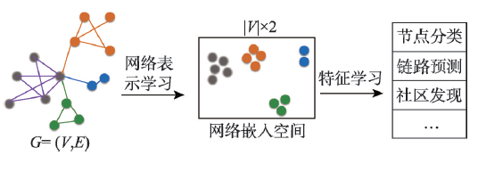

- 将分类、预测等任务转化为对向量的计算

---

### 随机游走是一类图抽样方法

<style scoped>
  th {
    font-size: 25px;
  }
  td {
    font-size: 25px;
  }
</style>

|类别|代表方法|特点|
|:-|:-|:-|
|基于矩阵分解|LLE(Science'00), Laplacian Eigenmaps(NIPS'01), HOPE(SIGKDD'16), STRAP(KDD’19), ProNE(IJCAI'19)|时间和空间开销大、依赖相似矩阵的选择|
|基于随机游走|DeepWalk(KDD'14), LINE(KDD'15), Node2Vec(KDD'16), Struct2Vec(KDD’17), DiaRW(FGCS’19)|扩展性更好（时间和空间）、适应性更强|

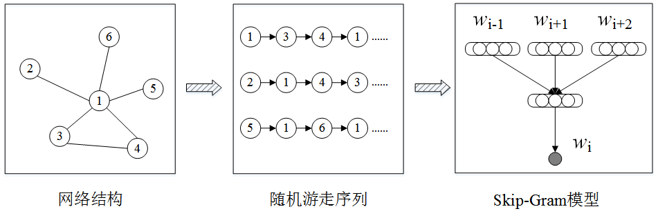

---

### DeepWalk：一阶随机游走 + Skip-gram (KDD'14)

- **做法**：在图上做随机游走生成节点序列 → 当作"句子"用 Skip-gram 训练嵌入
- **一阶转移**：下一步只依赖当前节点 $v_i$

$$P(v_{i+1} \mid v_i)$$

- 状态空间仅 **O(|V|)**，整张图可顺序读入内存

---

### node2vec：把"二阶"形式化 (KDD'16)

<style scoped>
  li {
    font-size: 27px;
  }
</style>

- 一阶游走丢失结构信息：无法同时刻画**同质性(homophily)**与**结构等价性(structural equivalence)**
- node2vec 用 **p, q 参数**控制游走偏置，转移概率由"前驱 + 当前"联合状态决定

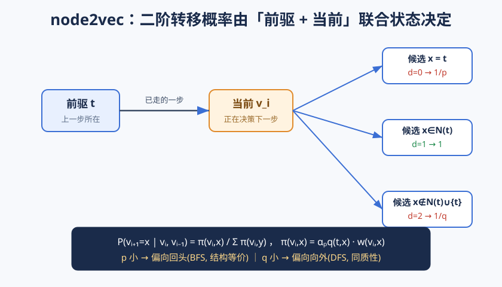

---

### node2vec：二阶转移概率

<style scoped>
  p, li {
    font-size: 29px;
  }
</style>

- 下一步 $x$ 的选择概率：

$$P(v_{i+1}=x \mid v_i, v_{i-1}) = \frac{\pi_{v_i x}}{\sum_{y\in N(v_i)}\pi_{v_i y}},\quad \pi_{v_i x}=\alpha_{pq}(t,x)\cdot w_{v_i x}$$

- 其中 $t$ 为前驱节点，最短距离 $d_{tx}\in\{0,1,2\}$：

$$\alpha_{pq}(t,x)=\begin{cases}1/p & d_{tx}=0\\ 1 & d_{tx}=1\\ 1/q & d_{tx}=2\end{cases}$$

- **这就是"二阶"**：状态是 $(t, v_i)$ 而非仅 $v_i$，状态空间膨胀到 **O(|E|)**

---

### 二阶游走的系统挑战

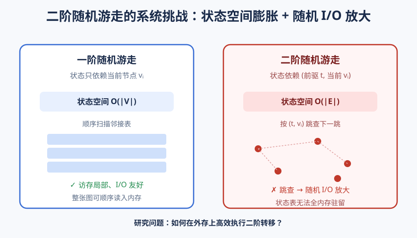

---

### 研究问题：外存上的二阶转移

- 一阶：顺序扫描邻接表，I/O 友好
- 二阶：每一步都要查"从 $(t, v_i)$ 出发的候选"，外存上产生大量小随机读
- **核心问题**：如何在外存(out-of-core)上高效执行二阶转移，把随机 I/O 压下去？

---

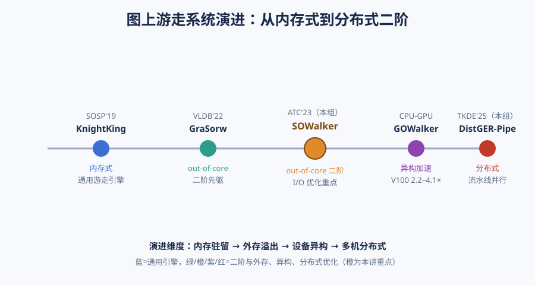

---

### KnightKing 与 GraSorw

- **KnightKing (SOSP'19)**：分布式**内存式**通用游走引擎，支持一阶/二阶语义，但状态全在内存，难扩展到超大图
- **GraSorw (VLDB'22)**：首个 **out-of-core 二阶游走**系统，把状态溢出到外存，但 I/O 调度仍非最优
- 二者铺垫出本组工作的切入点：**面向二阶的 I/O 优化**

---

### SOWalker：I/O 优化的外存二阶游走 (ATC'23)

- 背景：现有系统在二阶转移上产生大量随机 I/O，成为性能瓶颈

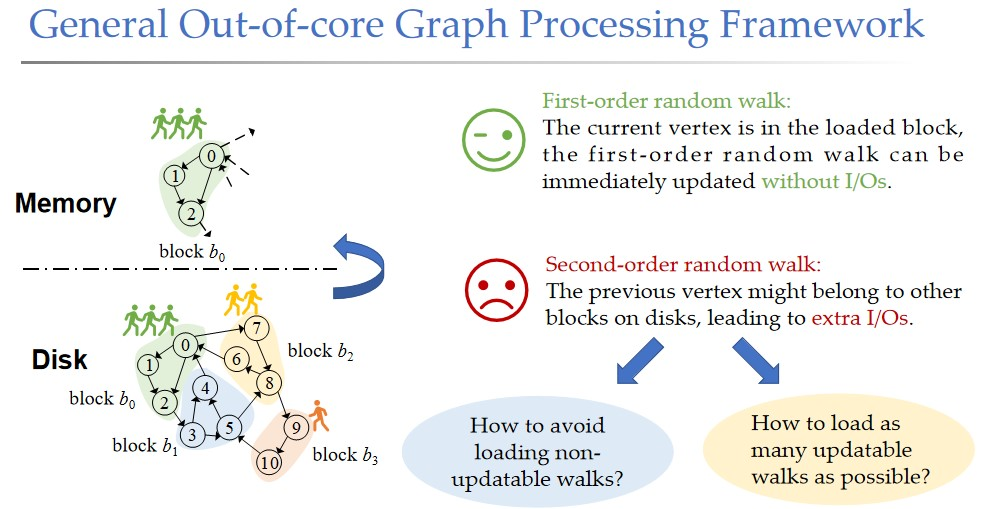

---

### SOWalker：动机

- 关键观察：二阶游走中大量状态更新是"不可更新/冗余"的，直接加载造成 I/O 浪费

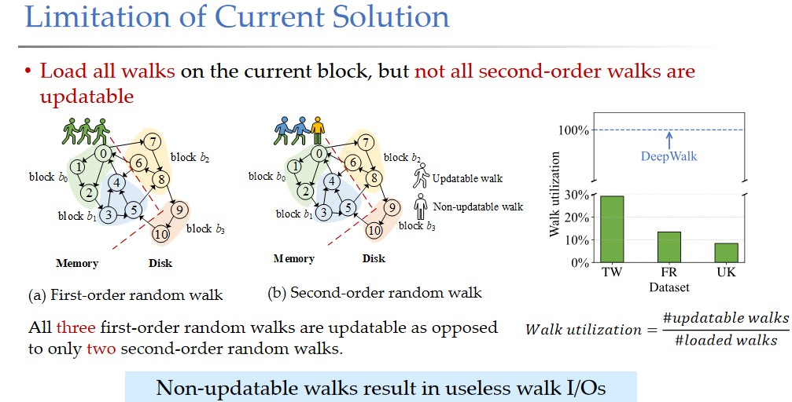

---

### SOWalker：三大贡献

<style scoped>
  li {
    font-size: 25px;
  }
</style>

- **Walk Matrix（游走矩阵）**：记录游走、避免加载不可更新的游走，消除无用游走 I/O
- **Benefit-Aware I/O Model（效益感知 I/O 模型）**：优先加载累积可更新游走最多的数据块
- **Block Set-Oriented Walk Updating（块集导向更新）**：每个游走在已加载块内尽可能多走步

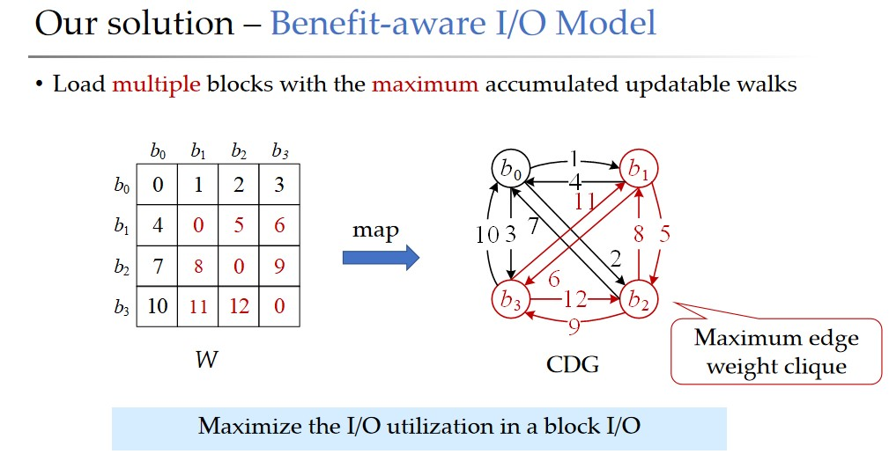

---

### SOWalker：评测

<style scoped>
  li {
    font-size: 27px;
  }
</style>

- vs GraphWalker：最高 **10.2×** 加速
- vs GraSorw：**5.7×** 加速，I/O 量减少 **80%+**

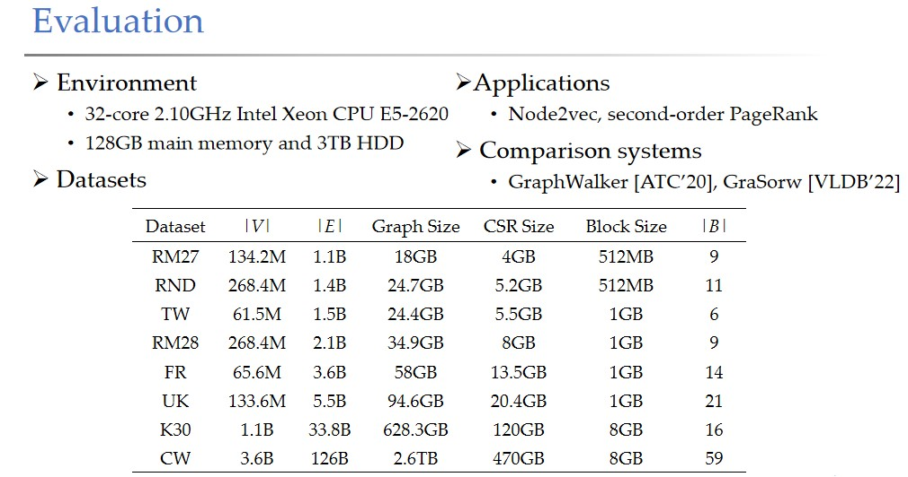

---

### SOWalker：评测（扩展性）

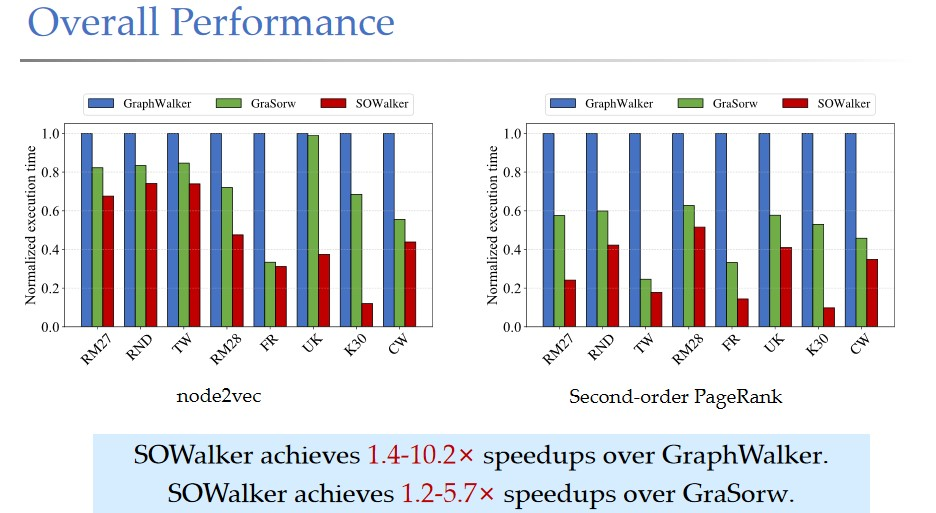

---

### 另一条路：熵驱动的有偏一阶游走 (HuGE / HuGE+)

<style scoped>
  li {
    font-size: 22px;
  }
</style>

- 注意：HuGE 系列是**信息熵驱动的有偏一阶游走**，定位为"**游走质量优化**"，并非二阶系统
- 样本规模数十倍于图数据，无法在一周内完成千万节点表示学习
  - 动态调节采样，减少冗余 [FGCS 2019]：顶点度与游走冗余的关系
  - 用**信息熵理论**估计游走冗余 [ICDE 2021]
  - 多核**并行增强**系统扩展 [IEEE ToBD 2023]

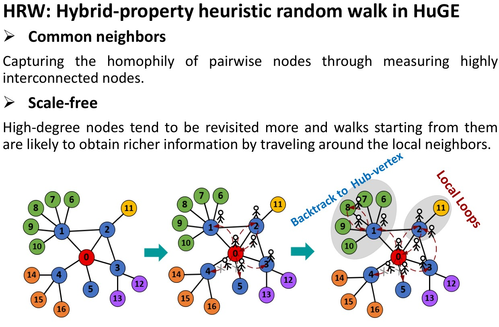

---

### HuGE 的启发式随机游走 (HRW)

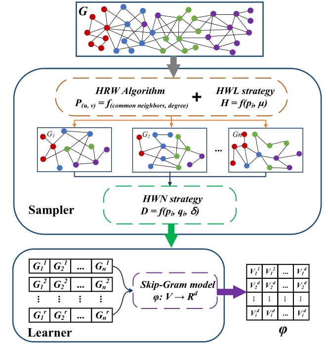

- 节省游走：启发式随机游走(HRW) / 自适应游走长度 / 自适应游走次数
- 实现：内存占用优化 / 细粒度多线程并行

---

### HuGE/HuGE+ 评测

- 内存占用平均降低 **68.9%**，运行时间与图大小呈线性关系

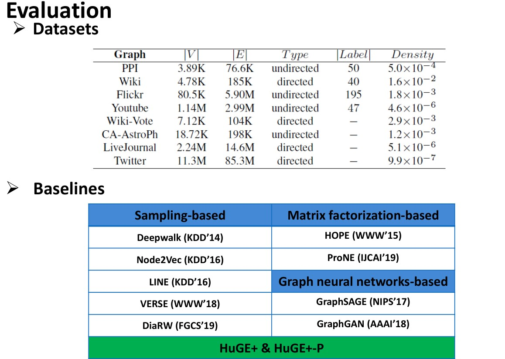

---

### HuGE/HuGE+ 评测（链接预测与分类）

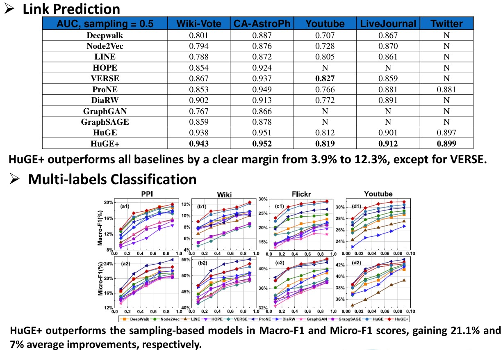

---

### HuGE/HuGE+ 评测（效率与内存）

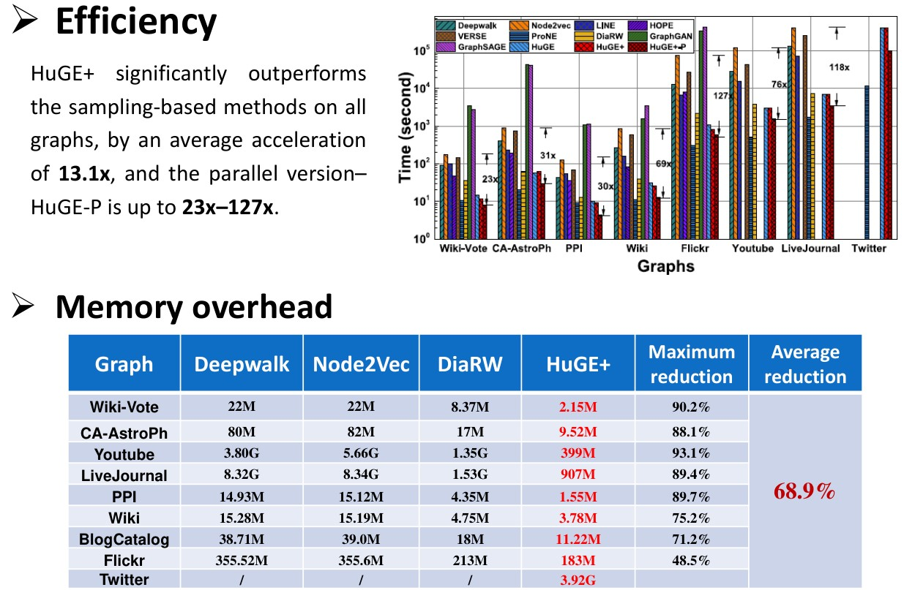

---

### 定位小结：有偏一阶 vs 二阶

- **HuGE 系（有偏一阶）**：优化游走质量、降冗余、省内存 —— 与二阶**互补不替代**
- **SOWalker（二阶）**：攻克外存二阶的随机 I/O 挑战
- 二者分别回答"游走得更好"与"游走得动更大图"

---

### 走向分布式：DistGER-Pipe (TKDE'25)

<style scoped>
  li {
    font-size: 27px;
  }
</style>

- 单图外存之上，进一步用**多机流水线**执行二阶游走
- 图划分 → 二阶采样 → I/O 优化层 → 嵌入训练，各分区并行、I/O 与计算重叠

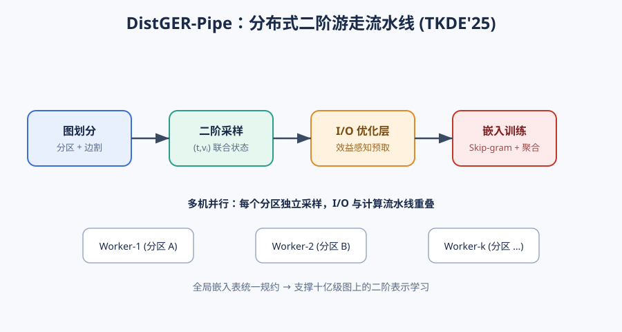

---

### 异构加速与应用衔接

- **GOWalker（CPU-GPU 异构）**：V100 平台上较 CPU 实现加速 **2.2–4.1×**
- **KOWalker（KG 增强问答）**：把二阶游走嵌入用于知识图谱问答，H@1 / F1 提升 **8.2 / 5.5** 个百分点
- → 下一节进入**知识图谱**，看表示学习如何支撑 KG 与 LLM

---

## 知识图谱

<style scoped>
  h2 {
    padding-top: 200px;
    text-align: center;
    font-size: 72px;
  }
</style>

---

### 异构图与知识图谱基础

- **异构图**：图中包含多种节点类型和边类型。
- **知识图谱（KG）**是一种典型的异构图：
  - 节点表示实体（如人、药物、论文等）。
  - 边表示实体之间的关系（如“作者”、“治疗”、“引用”等）。
- **知识图谱的特点**：
  - 大规模（数百万节点和边）。
  - 不完整（很多真实关系缺失）。
  - 无法枚举所有可能的事实，因此需要**预测缺失的链接**。

---

### 知识图谱嵌入（KG Embedding）

目标：将实体和关系嵌入到低维向量空间中，使得存在的关系在嵌入空间中“接近”。

#### 基本思想

- 每个实体和关系都用一个向量表示。
- 定义一个**评分函数** $f_r(h, t)$ 来衡量三元组 $(h, r, t)$ 的合理性。
- 通过训练使得真实三元组的得分高，虚假三元组的得分低。

---

#### 常见的KG嵌入模型

<style scoped>
  table, th, td {
    border: 1px solid black;
    font-size: 30px;
  }
</style>

| 模型     | 嵌入空间 | 评分函数 | 对称性 | 反对称性 | 逆关系 | 组合性 | 一对多 |
|----------|----------|----------|--------|----------|--------|--------|--------|
| **TransE**   | ℝ^d      | −‖h + r − t‖ | ✗      | ✓        | ✓      | ✓      | ✗      |
| **TransR**   | ℝ^d → ℝ^k | −‖M_r h + r − M_r t‖ | ✓      | ✓        | ✓      | ✓      | ✓      |
| **DistMult** | ℝ^d      | ⟨h, r, t⟩ | ✓      | ✗        | ✗      | ✗      | ✓      |
| **ComplEx**  | ℂ^d      | Re(⟨h, r, t⟩) | ✓      | ✓        | ✓      | ✗      | ✓      |
| **RotatE**   | ℂ^d      | −‖h ∘ r − t‖ | ✓      | ✓        | ✓      | ✓      | ✗（弱支持）|

---

#### 模型特点与适用场景

<style scoped>
  li {
    font-size: 27px;
  }
</style>

- **TransE**：简单高效，适合快速实验，但不能处理对称关系和一对多关系。
- **TransR**：通过引入关系特定的投影矩阵，增强了表达能力，能建模更复杂的关系。
- **DistMult**：使用点积，能处理对称关系，但无法区分头尾实体，无法建模反对称关系。
- **ComplEx**：引入复数空间，能建模反对称和逆关系，是目前常用的强模型之一。
- **RotatE**：在复数空间中进行旋转操作，能建模多种关系类型，性能较好。

---

#### 实际建议

- 不同知识图谱的关系模式差异大，没有通用最优模型。
- **快速尝试**：先用 TransE。
- **进一步提升**：使用 ComplEx 或 RotatE 等更具表达力的模型。

---

## 大语言模型和知识图谱

<style scoped>
  h2 {
    padding-top: 200px;
    text-align: center;
    font-size: 72px;
  }
</style>

---

<style scoped>
  table, th, td {
    border: 1px solid black;
    font-size: 20px;
  }
</style>

| 技术路径            | 核心机制                                         | 对LLM的要求                   | 优点                          | 缺点/挑战                           | 代表性工作               |
| :-------------- | :------------------------------------------- | :------------------------ | :-------------------------- | :------------------------------ | :------------------ |
| **基于数据集微调**     | 利用包含推理路径的特定领域数据集对LLM进行微调，将知识内化到模型参数中。        | 需要访问模型参数并进行训练。            | 推理速度快（无需实时检索）；能深度整合领域知识。    | 知识更新困难，需要重新训练；训练成本高；可能过拟合特定数据集。 | [MedReason](https://arxiv.org/abs/2504.00993v2), [JKEM](https://www.mdpi.com/2078-2489/15/11/666) |
| **基于提示工程与检索增强** | 在推理时，从KG中检索相关知识，并将其作为上下文（Prompt）的一部分输入给LLM。  | 无需修改模型参数，可应用于任何LLM。       | 灵活、高效，知识可实时更新；实现相对简单。       | 受限于上下文窗口长度；检索质量直接影响性能；可能引入无关噪声。 | [DR.KNOWS](https://ai.jmir.org/2025/1/e58670)  |
| **基于推理路径探索与验证** | 将LLM作为智能体，在KG上动态探索、生成并评估多条推理路径，选择最优路径作为答案依据。 | 需要LLM具备强大的零样本或少样本推理和评估能力。 | 可解释性强，能提供完整的推理链条；无需训练，通用性好。 | 推理过程复杂，计算开销大；路径探索的效率和准确性是关键。    | [RwT](https://aclanthology.org/2025.coling-main.211/), [REKG-MCTS](https://aclanthology.org/2025.findings-acl.484/)     |

---

### 知识图谱帮助思维链

- 大语言模型 (LLMs) 在诸多NLP任务上表现出色，但在复杂推理（算数、常识、符号）任务上仍存在显著局限。
- 思维链推理 (Chain-of-Thought Reasoning) 通过让LLM生成中间推理步骤，有效提升了多步推理任务的性能。

---

#### **关键问题**

<style scoped>
  li {
    font-size: 24px;
  }
</style>

- 通用思维链难专精
  - 推理链生成基于LLM自身生成，无法利用知识图谱形成严谨逻辑
  - 在医疗、法律、金融等高风险领域，此问题带来不可估量的风险
    - 例: 在AQuA数据集上，多种CoT方法的准确率均低于55%。

- 自然语言提示词表述模糊
  - 自然语言思维链易理解，但推理准确性不如代码式提示
  - 代码提示复杂性高、领域局限性大、语言风格单一

---

[CoT-RAG: Integrating Chain of Thought and Retrieval-Augmented Generation to Enhance Reasoning in Large Language Models](https://arxiv.org/abs/2504.13534v3), EMNLP 2025

<style scoped>
  p, li {
    font-size: 27px;
  }
</style>

通过结构化知识表示、动态检索机制和伪程序化推理执行，解决现有 CoT 方法在可靠性和推理性能上的两大瓶颈，为 LLM 在复杂和垂直领域的可靠推理提供新范式。

- 知识图谱驱动的 CoT 生成 (Knowledge Graph-driven CoT Generation)
- 可学习的知识案例感知 RAG (Learnable Knowledge Case-aware RAG)
- 伪程序提示执行 (Pseudo-Program Prompting Execution)

<!-- 
**三阶段设计 (Three-Stage Design)**

**Stage 1: 知识图谱驱动的CoT生成 (Knowledge Graph-driven CoT Generation)**
*   **专家介入:** 领域专家构建一次性的、粗粒度的**决策树 (DT)**，封装领域推理逻辑。
*   **LLM转化:** LLM将DT分解并转化为结构清晰、高度透明的**知识图谱 (KG)**。
*   **KG节点:** 每个实体包含 `Sub-question`, `Sub-case`, `Sub-description`, `Answer` 属性。
*   **优势:** 增强可控性、可靠性与领域适应性。

**Stage 2: 可学习的知识案例感知RAG (Learnable Knowledge Case-aware RAG)**
*   **LLM驱动的检索:** （非传统向量检索）利用LLM从用户长查询描述中，为KG中的每个实体精准提取对应的 `Sub-description`。
*   **动态更新:** 新的用户查询可以反过来动态更新DT中的 `Knowledge case`，使知识图谱持续进化。

**Stage 3: 伪程序提示执行 (Pseudo-Program Prompting Execution)**
*   **执行方式:** LLM将KG表示为**伪程序知识图谱 (PKG)** 并逐步执行。
*   **优势:**
    *   **兼具NL与Code优点:** 像代码一样逻辑严谨，又如自然语言一般易于理解和通用。
    *   **无需外部解释器:** 摆脱对Python解释器等环境的依赖。
    *   **可扩展性强:** 可适配C++, Java等语言风格（见附录）。
 -->

---

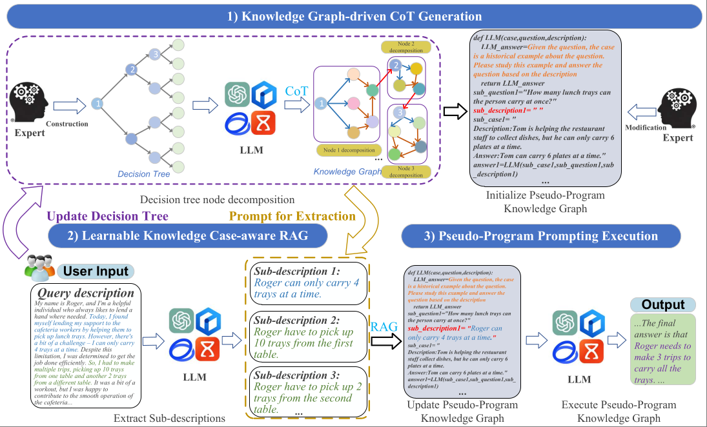

---

#### **实验设置**

- **模型:** ERNIE-Speed, GPT-4o mini, GLM-4-flash, GPT-4o等
- **数据集 (9个):**
  - **通用领域:** AQuA, GSM8K, MultiArith, SingleEq, HotpotQA, CSQA, SIQA, Last Letter, Coin Flip.
  - **垂直领域:** LawBench, LegalBench, CFBenchmark, AGIEval.

---

#### **主要结果**

<style scoped>
  p, li, th, td {
    font-size: 18px;
  }
  td, th {
    padding: 3px 6px;
  }
</style>

##### 提升通用任务

| Method | AQuA | GSM8K | ... | **Average** |
| :--- | :---: | :---: | :---: | :---: |
| Zero-shot-CoT | 43.4 | 78.3 | ... | 72.4 |
| Manual-CoT | 54.3 | 85.8 | ... | 77.3 |
| PS | 50.1 | 82.8 | ... | 75.2 |
| **CoT-RAG** | **65.7** | **94.7** | ... | **89.1** |

- ↑ 准确率提升幅度: **4.0% ~ 44.3%**

##### 适配垂直领域

- 准确率远超其他基于图谱的RAG方法（如KG-CoT, GraphRAG, ToG等）。
- 专家构建的DT至关重要：零专家参与（LLM自建DT）的变体性能下降 **7.8%**。

<!-- 
其实将GNN和LLM的融合才刚刚开始
 -->

---

## 实践作业

<style scoped>
  h2 {
    padding-top: 200px;
    text-align: center;
    font-size: 72px;
  }
</style>

---

<style scoped>
  h3 {
    font-size: 25px;
  }
  p, li {
    font-size: 22px;
  }
</style>

## 二阶随机游走采样器实验（主实验）

### 实验背景

- 回顾本节：二阶随机游走的瓶颈是外存上的**随机 I/O**——状态空间从 O(|V|) 膨胀到 O(|E|)，每一步都要按 $(t, v_i)$ 跳查下一跳。
- 本实验要求你**亲手实现一个 out-of-core 的二阶游走采样器**，在范例图上体会数据布局与 I/O 优化的权衡。

### 实验内容

- **必做**：实现二阶转移——按 $(t, v_i)$ 联合状态查下一跳，支持 node2vec 的 p/q 偏置；
- **I/O 优化（至少选一）**：分块加载邻接表 / Walk Matrix 避免冗余游走 / 效益感知预取（呼应 SOWalker 三贡献）；

---

<style scoped>
  h1 {
    font-size: 50px;
  }
  h3 {
    font-size: 22px;
  }
  p, li {
    font-size: 19px;
  }
</style>

## 二阶随机游走采样器实验：评测与提交

### 评测指标（双指标）

- **采样吞吐**（samples/s）：在给定图上达到的每秒游走步数；
- **访存开销**：分块加载次数。
- **评分构成**：方法报告与可复现性 **≥ 70%**，排行榜排名占比 **≤ 30%**。

### 提交要求

- 提交 Python Notebook / 源码 + 实验报告（在 Notebook 中逐栏说明模型、I/O 优化、结果与结论）；
- 向[**头歌平台**](https://www.educoder.net/shixuns/sfyi7xbr/challenges)提交。

#### 时间安排

- 开始日期 / 提交日期：TBA。
