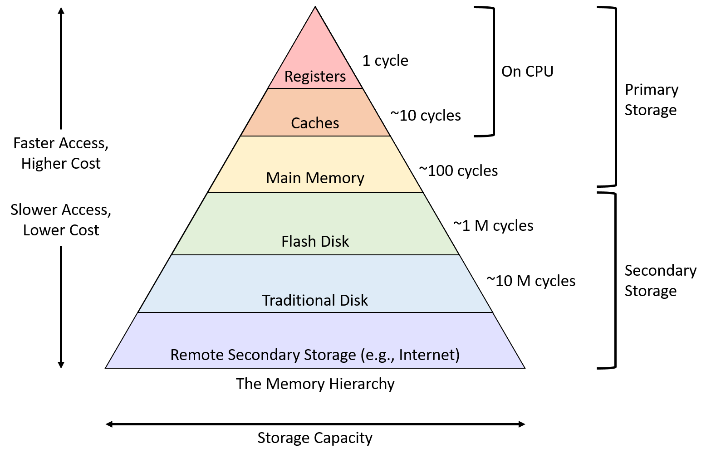

# 面向图应用的系统设计

<!-- _class: lead -->

**施展**
武汉光电国家研究中心
光电信息存储研究部

<https://shizhan.github.io/>
<https://shi_zhan.gitee.io/>

---

## 内容大纲

<!-- paginate: true -->

- 经典图应用及算法
- 对系统的挑战
- 对系统设计的影响
- 图应用的发展
- 新的挑战
- 对系统的探索

---

## 经典图应用

<style scoped>
  li {
    font-size: 18px;
  }
  p {
    font-size: 36px;
    text-align: center;
  }
</style>

 

最短路径、网页排名

- [Stanford Network Analysis Project](http://snap.stanford.edu/)
- [The Stony Brook Algorithm Repository](https://www.algorist.com/algorist.html)
- [The Network Data Repository with Interactive Graph Analytics and Visualization](https://networkrepository.com/)

---

## 经典图应用及算法

<style scoped>
  li {
    font-size: 18px;
  }
  p {
    font-size: 36px;
    text-align: center;
  }
</style>

  

最短路径、网页排名

- [Malewicz G, Austern M H, Bik A J C et al. **Pregel: A System for Large-Scale Graph Processing**. SIGMOD 2010.](https://dl.acm.org/doi/10.1145/1807167.1807184)

---

## 对系统的挑战

### 经典系统结构回顾

- 并行结构
- 层次存储

### 图应用带来什么问题

- 偏斜性
- 随机性

---

#### 并行结构

<style scoped>
  h4 {
    padding-top: 500px;
  }
  p {
    font-size: 18px;
  }
</style>


[Computer Architecture A Quantitative Approach 6th Edition](https://www.elsevier.com/books/computer-architecture/hennessy/978-0-12-811905-1), Chapter 4, 5.

---

#### 层次存储

<style scoped>
  h4 {
    padding-top: 500px;
  }
  p {
    font-size: 18px;
  }
</style>



[Computer Architecture A Quantitative Approach 6th Edition](https://www.elsevier.com/books/computer-architecture/hennessy/978-0-12-811905-1), Chapter 2.

---

#### 偏斜性

<style scoped>
  li {
    font-size: 18px;
  }
</style>

 

- [Faloutsos M, Faloutsos P, Faloutsos C. On power-law relationships of the Internet topology. SIGCOMM 1999.](https://dl.acm.org/doi/10.1145/316188.316229)
- [Gonzalez J E, Low Y, Gu H et al. PowerGraph: distributed graph-parallel computation on natural graphs. OSDI 2012.](https://www.usenix.org/system/files/conference/osdi12/osdi12-final-167.pdf)

---

##### SNAP真实图数据集

<style scoped>
  h5 {
    font-style: italic;
  }
  th {
    font-size: 20px;
  }
  td {
    font-size: 16px;
  }
</style>

|Name|Type|Nodes|Edges|Communities|Description|
|:-|:-|-:|-:|-:|:-|
|[com-LiveJournal](http://snap.stanford.edu/data/com-LiveJournal.html)|Undirected, Communities|3,997,962|34,681,189|287,512|LiveJournal online social network|
|[com-Friendster](http://snap.stanford.edu/data/com-Friendster.html)|Undirected, Communities|65,608,366|1,806,067,135|957,154|Friendster online social network|
|[com-Orkut](http://snap.stanford.edu/data/com-Orkut.html)|Undirected, Communities|3,072,441|117,185,083|6,288,363|Orkut online social network|
|[com-Youtube](http://snap.stanford.edu/data/com-Youtube.html)|Undirected, Communities|1,134,890|2,987,624|8,385|Youtube online social network|
|[com-DBLP](http://snap.stanford.edu/data/com-DBLP.html)|Undirected, Communities|317,080|1,049,866|13,477|DBLP collaboration network|
|[com-Amazon](http://snap.stanford.edu/data/com-Amazon.html)|Undirected, Communities|334,863|925,872|75,149|Amazon product network|
|[email-Eu-core](http://snap.stanford.edu/data/email-Eu-core.html)|Directed, Communities|1,005|25,571|42|E-mail network|
|[wiki-topcats](http://snap.stanford.edu/data/wiki-topcats.html)|Directed, Communities|1,791,489|28,511,807|17,364|Wikipedia hyperlinks|

##### 统计度分布

```bash
grep -v "^#" com-amazon.ungraph.txt | awk '{print $1"\n"$2}' | sort -n | uniq -c
```

---

#### 随机性

---

##### 经典BFS遍历顺序

<style scoped>
  h5 {
    font-style: italic;
  }
  li {
    font-size: 18px;
  }
</style>

- <https://github.com/snap-stanford/snap/blob/master/tutorials/demo-bfsdfs.cpp>

---

## 对系统设计的影响

- 分布式架构
- 分层式架构
- 分布式、分层架构

---

### 分布式架构

<style scoped>
  p {
    font-size: 18px;
  }
</style>

- MapReduce的问题
- 图分区的矛盾

Source: [Shi Z, Li J, Guo P et al. Partitioning dynamic graph asynchronously with distributed FENNEL. Future Generation Computer Systems, 2017.](https://www.sciencedirect.com/science/article/pii/S0167739X1730033X)

---

### 分层式架构

- 外存模式
  - 大块访问的实现
  - 顺序访问的实现
- 布局问题
  - 如何排序

---

### 图处理系统发展


---

## 图应用的发展

- **电信欺诈**——异常模式侦测
- **金融欺诈**——动态图分析

---

### 异常模式侦测


---

源电话拨打过电话的联系人的总数目
源电话拨打目标圈的总通话次数
源电话拨打目标圈的总通话时长
源电话拨打目标圈的平均通话时长
源电话拨打目标圈的平均通话次数
源电话与每个目标圈的联系人平均通话的活跃天数
目标圈内有回拨源电话的联系人的总数
目标圈内回拨源电话的总通话个数
目标圈内回拨源电话的平均回拨通话时长
...

---

### 动态图分析

<style scoped>
  li {
    font-size: 27px;
  }
</style>


- 动态图不仅规模巨大，其拓扑结构亦持续变化
  - Facebook: 月活跃用户达25亿
  - Twitter: 每天500亿条推文被发送
  - 淘宝: 每秒54.4万笔订单被创建
- 分析目标
  - 复盘各时状态
  - 找出演化趋势

---

## 新的挑战

<style scoped>
  li {
    font-size: 18px;
  }
</style>

### 庞大的数据集、复杂的模式…

？

### 在检索中综合时空条件…

？

---

## 新的挑战…

<style scoped>
  li {
    font-size: 18px;
  }
</style>

### 庞大的数据集、复杂的模式

以表示学习取代点边遍历

### 在检索中综合时空条件

结合各类数据结构特长以综合使用

- [CS224W: Machine Learning with Graphs(Stanford)](http://web.stanford.edu/class/cs224w/), [B站搬运](https://www.bilibili.com/video/BV1me411x7Rm)
- [Kumar P, Huang H H. GraphOne: A Data Store for Real-time Analytics on Evolving Graphs. FAST 2019.](https://www.usenix.org/conference/fast19/presentation/kumar)

---

## 对系统的探索——图表示学习

<style scoped>
  li {
    font-size: 27px;
  }
</style>

- 图数据持续增大 --> 空间开销（状态向量，邻接矩阵）算力需求（矩阵运算）开销巨大
- 图表示学习 --> 对于 $\forall v \in V$ 有 $f: v \rightarrow R^d(d \ll |V|)$，映射为低维稠密的实值向量


- 将分类、预测等任务转化为对向量的计算

---

## 对系统的探索——图抽样系统

<style scoped>
  th {
    font-size: 25px;
  }
  td {
    font-size: 25px;
  }
</style>

|类别|代表方法|特点|
|:-|:-|:-|
|基于矩阵分解|LLE(Science'00), Laplacian Eigenmaps(NIPS'01), HOPE(SIGKDD'16), STRAP(KDD’19), ProNE(ICAJI’19)|时间和空间开销大、依赖相似矩阵的选择|
|基于随机游走|DeepWalk(KDD'14), LINE(KDD'15), Node2Vec(KDD'16), Struct2Vec(KDD’17), DiaRW(FGCS’19)|扩展性更好（时间和空间）、适应性更强|


---

## 对系统的探索——数据结构分析

<style scoped>
  li {
    font-size: 27px;
  }
</style>


- 快照模型: 支持高效地查询，但存储开销大
- 日志模型: 降低了存储开销，但查询时间成本高
- 全图模型: 存储开销大，且查询效率低

---

## 对系统的探索——动态图系统

<style scoped>
  li {
    font-size: 27px;
  }
</style>


- 快照模型: $G=<G_0, G_1, G_2, \dots, G_t>$
- 日志模型: $G=<ev_0, ev_1, ev_2, \dots, ev_t>$
- 全图模型: $G_[t_1, t_n]=<V_[t_1, t_n], E_[t_1, t_n]>$
- 混合模型: 基于偏斜性感知或基于相关性感知

---

<style scoped>
  li {
    font-size: 27px;
  }
</style>

## 我们的尝试——表示学习样本缩减

- 样本规模数十倍于图数据，不能在一周内完成千万个节点的表示学习
  - 动态调节采样，减少冗余 [FGCS 2019](http://www.sciencedirect.com/science/article/pii/S0167739X19300378)
    - 找出顶点度与游走冗余之间的关系，实现动态游走
  - 用理论来准确指导采样过程，充分优化样本尺寸 [ICDE 2021](https://doi.ieeecomputersociety.org/10.1109/ICDE51399.2021.00198)
    - 用信息熵理论来估计游走冗余

## 我们的尝试——时空检索数据结构

- 快照与日志的动态调整以支持高效率时空检索 APWeb-WAIM 2022
  - 基于偏斜性感知动态设置关键快照
  - 偏斜性包括度的偏斜性(空间)和访问频率(时间)的偏斜性

---

## 更多参考

- <https://github.com/jbmusso/awesome-graph>
- <https://github.com/Team309/awesome-graph-processing>
