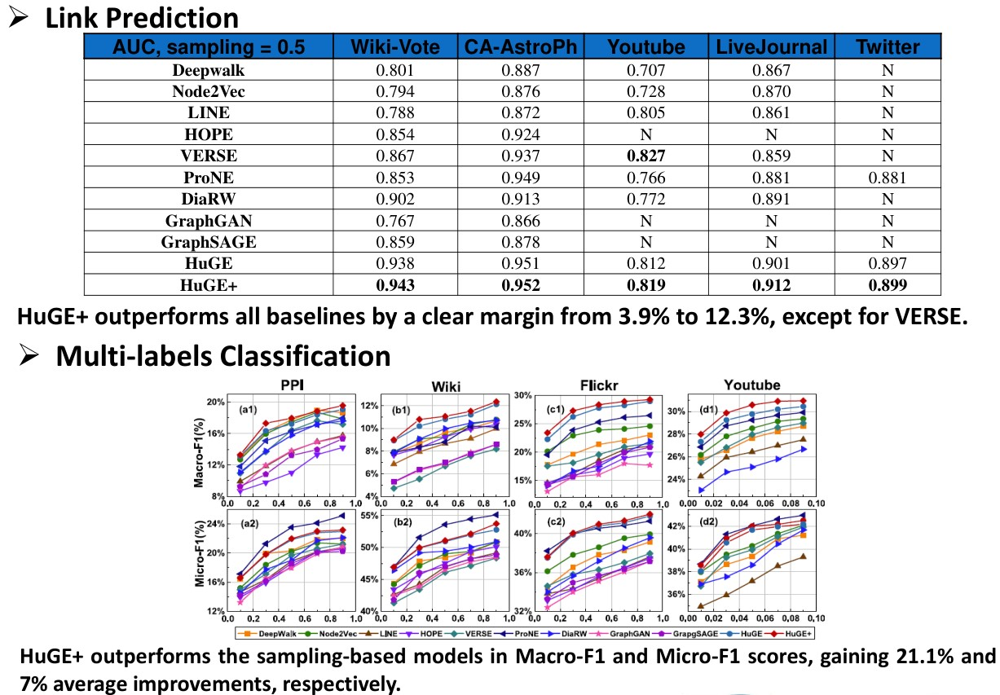

# 面向图应用的系统设计

<!-- _class: lead -->

**施展**
武汉光电国家研究中心
光电信息存储研究部

<https://shizhan.github.io/>
<https://shi_zhan.gitee.io/>

<!-- 这门课之目的在于以图应用为例，探讨计算机系统设计的相关实践，大家应该还有一门课叫图神经网络，和这门课有背景知识的交叉，不过估摸着你们不少人没选那门课，所以我们也不得不在这里进行一些必要的科普 -->

---

## 内容大纲


<!-- paginate: true -->

- 经典图应用及算法
- 对系统的挑战
- 对系统设计的影响
- 图应用的发展
- 新的挑战
- 对系统的探索

---

## 图有着广泛的应用

<style scoped>
  h2 {
    padding-top: 260px;
    text-align: center;
  }
</style>


<!-- 首先当然要了解一下这类系统服务的对象，请大家想一想身旁的图数据相关应用都有哪些？不拘泥于几年前课堂上所学的最短路径算法 -->

---


---

## 经典图应用

<style scoped>
  li {
    font-size: 18px;
  }
  p {
    font-size: 36px;
    text-align: center;
  }
</style>

 

最短路径、网页排名

- [Stanford Network Analysis Project](http://snap.stanford.edu/)
- [The Stony Brook Algorithm Repository](https://www.algorist.com/algorist.html)
- [The Network Data Repository with Interactive Graph Analytics and Visualization](https://networkrepository.com/)

---

## 经典图应用及算法

<style scoped>
  li {
    font-size: 18px;
  }
  p {
    font-size: 36px;
    text-align: center;
  }
</style>

  

最短路径、网页排名

- [Malewicz G, Austern M H, Bik A J C et al. **Pregel: A System for Large-Scale Graph Processing**. SIGMOD 2010.](https://dl.acm.org/doi/10.1145/1807167.1807184)

---

## 背后的系统

<style scoped>
  li {
    font-size: 18px;
  }
  p {
    font-size: 20px;
    text-align: center;
  }
</style>


[Malewicz G, Austern M H, Bik A J C et al. **Pregel: A System for Large-Scale Graph Processing**. SIGMOD 2010.](https://dl.acm.org/doi/10.1145/1807167.1807184)

---

<style scoped>
  p {
    padding-top: 620px;
    font-size: 20px;
    text-align: center;
  }
</style>


[Apache Spark - A Unified engine for large-scale data analytics](https://spark.apache.org/docs/latest/index.html)

<!-- 正如知名的Hadoop系统，其实是MapReduce框架的开源实现，其上构建的Spark GraphX也是Pregel的重视复现 -->

---


<!-- 系统内以属性图的形式，通过规范化的编程框架来实现复杂的图应用 -->

---


<!-- 比方说这个用来找寻维基百科热门社区的应用，里面就包含了两路并行的图分析过程 -->

---

 

[The Story of GraphLab – From Scaling Machine Learning to Shaping Graph Systems Research (VLDB 2023 Test-of-time Award Talk)](https://www.vldb.org/pvldb/vol16/p4138-gonzalez.pdf)

<!-- 作为高校的科研成果，GraphLab则更强调处理的范式，结合Pregel的顶点中心计算框架，提出了GAS模型 -->

---


<!-- 专攻图数据处理的系统，还专门分支出了一个门类，如今被归类为一种NoSQL的图数据库，曾经风光一时，但是其中最具标志意义的创业公司Neo4j的发展却颇为坎坷，最近倒是又有新的契机闪过，即KG与LLM的合作 -->

---

## 想了解更多……

<https://github.com/Team309/awesome-graph-processing>

<https://chwan1016.github.io/awesome-gnn-systems/>

[A software resource for large graph processing and analysis](https://www.nature.com/articles/s43588-023-00466-7), Nature Computational Science volume 3, pages 586–587 (2023)

---

## 经典系统结构回顾


- 并行结构
  - 指令级、线程级、数据级、请求级
- 层次存储
  - 缓存、内存、外存

<!-- 为了深入认识这些图处理系统背后的设计方法，有必要回顾一下我们以往学习的计算机系统相关知识 -->

---

### 并行结构

<style scoped>
  h3 {
    padding-top: 500px;
  }
  p {
    font-size: 18px;
  }
</style>


[Computer Architecture A Quantitative Approach 6th Edition](https://www.elsevier.com/books/computer-architecture/hennessy/978-0-12-811905-1), Chapter 4, 5.

<!-- 这就是一个典型的并行处理结构，试问其并行任务工作在什么级别呢？ -->

---

### 层次存储

<style scoped>
  h3 {
    padding-top: 500px;
  }
  p {
    font-size: 18px;
  }
</style>


[Computer Architecture A Quantitative Approach 6th Edition](https://www.elsevier.com/books/computer-architecture/hennessy/978-0-12-811905-1), Chapter 2.

<!-- 这里则是一个典型的层次存储结构，试问其出现的动机又是什么呢？ -->

---

## 图应用访存特点

- 偏斜性
- 随机性

<!-- 趁着刚刚重温了相关概念，这里审视一下目标应用的特点，首先点个题，图应用最突出的存储器访问特点在于这两者：偏斜性和随机性，两者分别是分布式处理和分层存储架构的大敌 -->

---

### 偏斜性

<style scoped>
  li {
    font-size: 18px;
  }
</style>

 

- [Faloutsos M, Faloutsos P, Faloutsos C. On power-law relationships of the Internet topology. SIGCOMM 1999.](https://dl.acm.org/doi/10.1145/316188.316229)
- [Gonzalez J E, Low Y, Gu H et al. PowerGraph: distributed graph-parallel computation on natural graphs. OSDI 2012.](https://www.usenix.org/system/files/conference/osdi12/osdi12-final-167.pdf)

---

#### SNAP真实图数据集

<style scoped>
  h5 {
    font-style: italic;
  }
  th {
    font-size: 20px;
  }
  td {
    font-size: 16px;
  }
</style>

|Name|Type|Nodes|Edges|Communities|Description|
|:-|:-|-:|-:|-:|:-|
|[com-LiveJournal](http://snap.stanford.edu/data/com-LiveJournal.html)|Undirected, Communities|3,997,962|34,681,189|287,512|LiveJournal online social network|
|[com-Friendster](http://snap.stanford.edu/data/com-Friendster.html)|Undirected, Communities|65,608,366|1,806,067,135|957,154|Friendster online social network|
|[com-Orkut](http://snap.stanford.edu/data/com-Orkut.html)|Undirected, Communities|3,072,441|117,185,083|6,288,363|Orkut online social network|
|[com-Youtube](http://snap.stanford.edu/data/com-Youtube.html)|Undirected, Communities|1,134,890|2,987,624|8,385|Youtube online social network|
|[com-DBLP](http://snap.stanford.edu/data/com-DBLP.html)|Undirected, Communities|317,080|1,049,866|13,477|DBLP collaboration network|
|[com-Amazon](http://snap.stanford.edu/data/com-Amazon.html)|Undirected, Communities|334,863|925,872|75,149|Amazon product network|
|[email-Eu-core](http://snap.stanford.edu/data/email-Eu-core.html)|Directed, Communities|1,005|25,571|42|E-mail network|
|[wiki-topcats](http://snap.stanford.edu/data/wiki-topcats.html)|Directed, Communities|1,791,489|28,511,807|17,364|Wikipedia hyperlinks|

#### 统计度分布

```bash
grep -v "^#" com-amazon.ungraph.txt | awk '{print $1"\n"$2}' | sort -n | uniq -c
```

---

### 随机性

<style scoped>
  p {
    text-align: center;
  }
  li {
    font-size: 18px;
  }
</style>


- [Kyrola A, Blelloch G, Guestrin C. **GraphChi: Large-Scale Graph Computation on Just a PC**. OSDI 2012.](https://www.usenix.org/conference/osdi12/technical-sessions/presentation/kyrola)

---

<style scoped>
  li {
    padding-top: 600px;
    font-size: 18px;
  }
</style>


- <https://github.com/snap-stanford/snap/blob/master/tutorials/demo-bfsdfs.cpp>

---

### 重温CacheLab

<style scoped>
  p {
    font-size: 27px;
  }
</style>


[Computer Systems: A Programmer's Perspective, 3/E (CS:APP3e)](http://csapp.cs.cmu.edu/3e/home.html), Randal E. Bryant and David R. O'Hallaron, Carnegie Mellon University

[深入理解计算机系统（原书第3版）](https://item.jd.com/12006637.html)

[Introduction to Computer Systems (ICS)](http://www.cs.cmu.edu/~213/), [2015 CMU 15-213 CSAPP 深入理解计算机系统](https://www.bilibili.com/video/BV1iW411d7hd/)

Lecture12 Cache Memory

<!-- 上次我们谈到图这种特点鲜明，价值深远的应用，其构造具有偏斜性，行为具有随机性，而支撑其运转的系统，则仰赖各个层级的并行性，以及塑造层次存储的局部性，然而这里面涌现出天然的矛盾，构成了我们面前的第一重挑战 -->

---

#### 实验准备

- [实验扩展](https://gitee.com/computer-architecture-hust/computer-architecture-experiment), [作业参考](https://github.com/cs-course/bfs_cachelab_handin)
  - 基于 CacheLab 观察经典图算法访存行为
- [辅助工具](https://github.com/ShiZhan/generator)
  - 4种经典随机图生成器，合成具备自然图特征的实验数据集
  - 清理自连边、重复边脚本，重编号脚本
- [SNAP工具包](http://snap.stanford.edu/snap/download.html)
  - Windows版本需要Cygwin，Linux版本需要Ubuntu

<!-- 从这个问题开始，我们演示一下作为一名研究生，大致的学习过程应该是怎样的

首先，之前学习的记忆里，告诉我们局部性这样一个概念，我们很自然的希望从如今的实验环境中找出来

当时课本上是一个什么样的表述呢？我们少许回顾一下 -->

---

#### 经典BFS算法：两个关键数据结构，两重循环体

```C
void bfs(int source) {
    int v = source, n;
    long long int i, front = 0, rear = 0;
    visited[v] = true;
    frontier[rear] = v;
    while (front <= rear) {
        v = frontier[front]; /* delete from queue */
        front++;
        for (i = csr_index[v]; i < csr_index[v + 1]; i++) {
            /* Check for adjacent unvisited nodes */
            n = csr_edges[i];
            if (visited[n] == false) {
                visited[n] = true;
                rear++;
                frontier[rear] = n;
            }   
        }
    }
}
```

---

#### CSR构造

<style scoped>
  p {
    font-size: 20px;
  }
</style>


[**When is Graph Reordering an Optimization? Studying the Effect of Lightweight Graph Reordering Across Applications and Input Graphs**](http://abstract.ece.cmu.edu/pubs/graphreordering-preprint.pdf), IISWC 2018, ***Best Paper Award***.

---

#### 尝试哪些布局？

- 原始顺序
- 度降序排列
  - [SIGMOD '16](https://dl.acm.org/doi/abs/10.1145/2882903.2915220)
- 遍历顺序排列
  - [ICPE '14](https://dl.acm.org/doi/10.1145/2568088.2576761)

---


---

<style scoped>
  p {
    padding-top: 200px;
    text-align: center;
    font-size: 72px;
  }
  li {
    font-size: 25px;
  }
</style>

实践出真知……

- 图应用和传统应用访存有什么区别？
- 重排图访存模式有什么变化？
- 缓存性能有什么影响？
- 效果是否明确？适用是否广泛？
- ……
- *干脆躺平放弃排序* X-Stream, SOSP '13
- *一次搞定还是每次重排？* GrafBoost, ISCA '18

---

## 挑战

<style scoped>
  p {
    padding-top: 100px;
    text-align: center;
    font-size: 72px;
  }
</style>

怎样布局？

---

## 系统怎么设计？

- 分布式架构
- 分层式架构
- 分布式、分层架构

---

<style scoped>
  p {
    padding-top: 100px;
    text-align: center;
    font-size: 72px;
  }
</style>

## 系统怎么设计？……

<style scoped>
  p {
    padding-top: 50px;
    text-align: center;
    font-size: 72px;
  }
</style>

- 分布式架构
- 分层式架构
- 分布式、分层架构

软件、硬件怎样相互协同？

---

### 分布式架构

<style scoped>
  p {
    font-size: 18px;
  }
</style>

- 让足量内存应对随机访存，然而…


Pregel[SIGMOD’10] ,GraphLab[OSDI’12], Gemini[OSDI’16]

---

### 分布式架构…

<style scoped>
  p {
    font-size: 18px;
  }
</style>

- 让足量内存应对随机访存，然而…
- MapReduce的问题
  - 漫长迭代、不平衡负载
- 图分区的矛盾
  - 尺寸平衡，切割少
  - 过度分区

[Gonzalez J E, Low Y, Gu H et al. **PowerGraph: distributed graph-parallel computation on natural graphs**. OSDI 2012.](https://www.usenix.org/conference/osdi12/technical-sessions/presentation/gonzalez)
[Chen R, Shi J, Chen Y et al. **PowerLyra: differentiated graph computation and partitioning on skewed graphs**. EuroSys 2015.](https://dl.acm.org/doi/10.1145/2741948.2741970)
[Tsourakakis C, Gkantsidis C, Radunovic B et al. **FENNEL: streaming graph partitioning for massive scale graphs**. WSDM 2014.](https://dl.acm.org/doi/10.1145/2556195.2556213)
[Shi Z, Li J, Guo P et al. **Partitioning dynamic graph asynchronously with distributed FENNEL**. FGCS 2017.](https://www.sciencedirect.com/science/article/pii/S0167739X1730033X)
...

---

### 分层式架构

<style scoped>
  p {
    font-size: 18px;
  }
</style>

- 让足量外存实现扩展避免网络分布，可是…

GraphChi[OSDI’12], X-Stream[SOSP'13], GridGraph[ATC'15]，CLIP[ATC'17]


[Roy A, Mihailovic I, Zwaenepoel W. X-Stream: edge-centric graph processing using streaming partitions. SOSP 2013.](https://dl.acm.org/doi/10.1145/2517349.2522740)

---

### 分层式架构…

<style scoped>
  p {
    font-size: 18px;
  }
</style>

- 让足量外存实现扩展避免网络分布，可是…
- 外存模式
  - 大块访问的实现
  - 顺序访问的实现
- 分批问题
  - 如何排序

---

### 分布式、分层架构

<style scoped>
  p {
    text-align: center;
  }
  li {
    font-size: 18px;
  }
</style>


- [Roy A, Bindschaedler L, Malicevic J et al. **Chaos: Scale-Out Graph Processing from Secondary Storage**. SOSP 2015.](https://dl.acm.org/doi/10.1145/2815400.2815408)

---

### 图处理系统发展


---

## 我们的一些工作

### 反思重排

- 提高数据访问速度
  - Optimizing cpu cache performance for pregel-like graph computation  [ICDEW’15]
  - Speedup Graph Processing by Graph Ordering  [SIGMOD’16]
  - MOSAIC [EuroSys’17]
- 减少冗余I/O
  - Load the Edges You Need [ATC’16]
  - CLIP [ATC’17]

---

<style scoped>
  p {
    text-align: center;
    font-size: 60px;
  }
</style>

- 提高数据访问速度

活跃数据

- 减少冗余I/O

不活跃数据

---


<!-- 不过，不同阶段，重点可不一样，前面更关注活跃数据的主流，后面则更关注不活跃数据的淘汰 -->

---

- 如何在重排图数据时，兼顾活跃数据和不活跃数据？
  - **为什么？**…集中驻留与高效淘汰…
  - **试一试**：可以围绕CacheLab、Gem5、SNAP做进一步实验观察

```bash
./build/X86/gem5.opt -d $HOME/snap-cc-rmat21-base -r \
  -e configs/example/se.py -n 4 \
    --caches --l2cache --l3cache --l1d_size=32kB --l1i_size=32kB --l2_size=256kB --l3_size=8MB --mem-size=4GB \
  -c $HOME/snap/examples/concomp/concomp -o " -i:$HOME/rmat21.txt "
./build/X86/gem5.opt -d $HOME/snap-cc-rmat21-gor -r \
  -e configs/example/se.py -n 4 \
  --caches --l2cache --l3cache --l1d_size=32kB --l1i_size=32kB --l2_size=256kB --l3_size=8MB --mem-size=4GB \
  -c $HOME/snap/examples/concomp/concomp -o " -i:$HOME/rmat21_reorder.txt "
./build/X86/gem5.opt -d $HOME/snap-cc-rmat21-act -r \
  -e configs/example/se.py -n 4 \
  --caches --l2cache --l3cache --l1d_size=32kB --l1i_size=32kB --l2_size=256kB --l3_size=8MB --mem-size=4GB \
  -c $HOME/snap/examples/concomp/concomp -o " -i $HOME/rmat21_sort.txt "
```

---

#### 预判活跃顶点：中介中心性

<style scoped>
  p {
    padding-top: 400px;
    text-align: center;
    font-size: 60px;
  }
</style>


碰运气？回想一下Pregel的顶点计算…

---

#### 汇聚不活跃顶点：直接邻居


---

<style scoped>
  p {
    padding-top: 600px;
    text-align: center;
    font-size: 25px;
  }
</style>


[Cache-friendly data layout for massive graph](https://ieeexplore.ieee.org/document/8515737/). NAS '18.

---

### 相关研究

<style scoped>
  li {
    font-size: 27px;
  }
</style>

- Lee E, Kim J, Lim K, Noh S H, Seo J. **Pre-Select Static Caching and Neighborhood Ordering for BFS-like Algorithms on Disk-based Graph Engines**, ATC 2019.
- V. Balaji, B. Lucia. **When is Graph Reordering an Optimization? Studying the Effect of Lightweight Graph Reordering Across Applications and Input Graphs**, IISWC 2018.
- K. Lakhotia, S. Singapura, R. Kannan, V. Prasanna. **ReCALL: Reordered Cache Aware Locality Based Graph Processing**, HiPC 2017.
- J. Arai, H. Shiokawa, T. Yamamuro, M. Onizuka, S. Iwamura. **Rabbit Order: Just-in-Time Parallel Reordering for Fast Graph Analysis**, IPDPS 2016.
- Wei H, Yu J X, Lu C, Lin X. **Speedup Graph Processing by Graph Ordering**, SIGMOD 2016.

---

### 怎样分拆

#### 分拆很耗时


---

#### 也影响吞吐


---

#### LOSC: Locality-optimized Subgraph Construction

- 子图内，优先保证边(邻居)顺序访问
  - 调整分块条件
  - **子图创建提速**
    - GraphChi不够细
- 子图间，适当冗余减少子图切换
  - 允许边复制
  - **用空间换效率**
    - X-Stream太极端

---

<style scoped>
  p {
    font-size: 20px;
  }
</style>


[Xu X, Wang F, Jiang H et al. **HUS-Graph: I/O-Efficient Out-of-Core Graph Processing with Hybrid Update Strategy**](https://dl.acm.org/doi/10.1145/3225058.3225108). ICPP 2018.
[LOSC:Efficient Out-of-Core Graph Processing with Locality-optimized Subgraph Construction](https://ieeexplore.ieee.org/document/9068600). IWQoS 2019.
[A Hybrid Update Strategy for I/O-Efficient Out-of-Core Graph Processing](https://ieeexplore.ieee.org/document/8994089). IEEE TPDS 2020.

---

### 相关研究…

<style scoped>
  li {
    font-size: 27px;
  }
</style>

- Zhao J, Zhang Y, Liao X, He L, He B, Jin H, Liu H, Chen Y. **GraphM: An Efficient Storage System for High Throughput of  Concurrent Graph Processing**, SC 2019.
- Pacaci A, Özsu M T. **Experimental Analysis of Streaming Algorithms for Graph Partitioning**, SIGMOD 2019.
- M. Zhang, Y. Zhuo, C. Wang, M. Gao, Y. Wu, K. Chen, C. Kozyrakis, X. Qian. **GraphP: Reducing Communication for PIM-Based Graph Processing with Efficient Data Partition**, HPCA 2018.
- Li X, Zhang M, Chen K, Wu Y. **ReGraph: A Graph Processing Framework that Alternately Shrinks and Repartitions the Graph**, SC 2018.
- Lakhotia K, Kannan R, Prasanna V. **Accelerating PageRank using Partition-Centric Processing**, ATC 2018.

---

## 图应用的发展

- **电信欺诈**——异常模式侦测
- **金融欺诈**——动态图分析

---

### 异常模式侦测


---

#### 人工提取属性

```SQL
源电话拨打过电话的联系人的总数目
源电话拨打目标圈的总通话次数
源电话拨打目标圈的总通话时长
源电话拨打目标圈的平均通话时长
源电话拨打目标圈的平均通话次数
源电话与每个目标圈的联系人平均通话的活跃天数
目标圈内有回拨源电话的联系人的总数
目标圈内回拨源电话的总通话个数
目标圈内回拨源电话的平均回拨通话时长
...
```

---

### 动态图分析

<style scoped>
  li {
    font-size: 27px;
  }
</style>


- 动态图不仅规模巨大，其拓扑结构亦持续变化
  - Facebook: 月活跃用户达25亿
  - Twitter: 每天500亿条推文被发送
  - 淘宝: 每秒54.4万笔订单被创建
- 分析目标
  - 复盘各时状态
  - 找出演化趋势

---


---

## 新的挑战

<style scoped>
  li {
    font-size: 18px;
  }
</style>

问题1：**复杂模式**…

超算可以拼GTEPS，可是还有那么多任务形式那么多应用？

问题2：**时空检索**…

…10分钟以内的账号同IP多开…？


---

## 新的挑战…

<style scoped>
  li {
    font-size: 18px;
  }
</style>

问题1：**复杂模式**

以表示学习取代点边遍历

问题2：**时空检索**

结合各类数据结构特长以综合使用

- [CS224W: Machine Learning with Graphs(Stanford)](http://web.stanford.edu/class/cs224w/), [B站搬运](https://www.bilibili.com/video/BV1me411x7Rm)
- [Kumar P, Huang H H. GraphOne: A Data Store for Real-time Analytics on Evolving Graphs. FAST 2019.](https://www.usenix.org/conference/fast19/presentation/kumar)

---

## 对系统的探索——图表示学习

<style scoped>
  li {
    font-size: 27px;
  }
</style>

- 图数据持续增大 --> 空间开销（状态向量，邻接矩阵）算力需求（矩阵运算）开销巨大
- 图表示学习 --> 对于 $\forall v \in V$ 有 $f: v \rightarrow R^d(d \ll |V|)$，映射为低维稠密的实值向量


- 将分类、预测等任务转化为对向量的计算

---

## 对系统的探索——图抽样系统

<style scoped>
  th {
    font-size: 25px;
  }
  td {
    font-size: 25px;
  }
</style>

|类别|代表方法|特点|
|:-|:-|:-|
|基于矩阵分解|LLE(Science'00), Laplacian Eigenmaps(NIPS'01), HOPE(SIGKDD'16), STRAP(KDD’19), ProNE(ICAJI’19)|时间和空间开销大、依赖相似矩阵的选择|
|基于随机游走|DeepWalk(KDD'14), LINE(KDD'15), Node2Vec(KDD'16), Struct2Vec(KDD’17), DiaRW(FGCS’19)|扩展性更好（时间和空间）、适应性更强|


---

## 对系统的探索——数据结构分析

<style scoped>
  li {
    font-size: 27px;
  }
</style>


- 快照模型: 支持高效地查询，但存储开销大
- 日志模型: 降低了存储开销，但查询时间成本高
- 全图模型: 存储开销大，且查询效率低

---

## 对系统的探索——动态图系统

<style scoped>
  li {
    font-size: 27px;
  }
</style>


- 快照模型: $G=<G_0, G_1, G_2, \dots, G_t>$
- 日志模型: $G=<ev_0, ev_1, ev_2, \dots, ev_t>$
- 全图模型: $G_[t_1, t_n]=<V_[t_1, t_n], E_[t_1, t_n]>$
- 混合模型: 基于偏斜性感知或基于相关性感知

---

## 我们的尝试

- **节流**: 缩减表示学习样本
- **开源**: 重新挖掘传统分级存储特性
- **适应**: 平衡动态图上的时空检索

---

<style scoped>
  li {
    font-size: 27px;
  }
</style>

### 表示学习样本缩减

- 样本规模数十倍于图数据，不能在一周内完成千万个节点的表示学习
  - 动态调节采样，减少冗余 [FGCS 2019](http://www.sciencedirect.com/science/article/pii/S0167739X19300378)
    - 找出顶点度与游走冗余之间的关系，实现动态游走
  - 用理论来准确指导采样过程，充分优化样本尺寸 [ICDE 2021](https://doi.ieeecomputersociety.org/10.1109/ICDE51399.2021.00198)
    - 用信息熵理论来估计游走冗余
  - 进一步优化内存使用及多核并行增强系统扩展能力[IEEE ToBD](https://ieeexplore.ieee.org/document/9749008)

---


---


- 节省游走
  - 启发式随机游走
  - 自适应游走长度
  - 自适应游走次数
- 实现
  - 内存占用优化
  - 细粒度、多线程并行

<!-- 启发式随机游走：HuGE+采用混合属性启发式随机游走（HRW），它在每一步随机游走中考虑了节点的公共邻居数量和节点信息内容，从而更有效地捕捉节点特征，减少了对计算资源的需求。

自适应游走长度：HuGE+使用启发式方法来确定随机游走的长度，而不是采用固定的游走长度。这种方法通过观察信息熵的变化来决定何时停止游走，从而避免了生成过多冗余信息，提高了计算效率。

自适应游走次数：HuGE+还提出了一种方法来决定每个节点的游走次数，它通过计算相对熵（即Kullback-Leibler散度）来评估生成的语料库与图的度分布之间的差异，从而确定合适的游走次数，以确保语料库的质量和效率。

内存占用优化：HuGE+显著减少了内存占用，平均减少了68.9%。这是通过优化游走策略和减少生成的语料库大小实现的，从而使得方法能够扩展到更大规模的图。

并行化处理：HuGE+的设计允许并行化执行，这意味着它可以利用多核处理器来同时处理多个任务，从而进一步提高处理大规模图的速度。

线性运行时间：在合成图上的实验表明，HuGE+的运行时间与图的大小呈线性关系，这表明它能够以可控的方式处理大规模图。

高效的训练方法：HuGE+使用Skip-Gram模型来训练节点的嵌入向量，并通过负采样等技术优化了训练过程，减少了计算和存储开销。 -->

---


---



---


---

### 发挥传统分级存储优势

- **以矩阵记录游走**（Walk Matrix）：提出了一种走矩阵来避免加载不可更新的游走，从而消除无用的游走I/O操作。
- **效益感知I/O模型**（Benefit-Aware I/O Model）：开发了一种效益感知的I/O模型，用于加载包含最大累积可更新游走的多个数据块，以提高I/O利用率。
- **块集导向游走更新方案**（Block Set-Oriented Walk Updating Scheme）：采用了一种块集导向的游走更新方案，允许每个游走在已加载的数据块集中尽可能多地移动步数，从而显著提高游走更新率。
[SOWalker: An I/O-Optimized Out-of-Core Graph Processing System for Second-Order Random Walks](https://www.usenix.org/conference/atc23/presentation/wu), ATC 23

---


---


---


---


---


---

<style scoped>
  li {
    font-size: 27px;
  }
</style>

### 时空检索数据结构

- 快照与日志的动态调整以支持高效率时空检索 APWeb-WAIM 2022
  - 基于偏斜性感知动态设置关键快照
  - 偏斜性包括度的偏斜性(空间)和访问频率(时间)的偏斜性

---

<style scoped>
  p, li {
    font-size: 23px;
  }
</style>

## 图学习案例实验

### 实验背景

随着图神经网络（GNNs）在图数据挖掘研究中的广泛应用，研究者开始关注其在异构图（Heterogeneous Graphs）上的潜力。异构图由多种类型的节点和边组成，携带丰富的侧信息，连接了新颖有效的图学习算法与复杂多变的工业场景，如推荐系统。为了应对异构性的挑战，提出了多种异构图神经网络（HGNNs）模型来处理节点分类、链接预测和知识感知推荐等任务。然而，由于每个模型采用独特的数据处理和设置，我们对这些模型实际进展的理解仍然有限。

为了促进健壮且开放的HGNN发展，构建了异构图基准（HGB）。HGB目前包含11个异构图数据集，这些数据集在异构性（节点和边类型的数目）、任务（节点分类、链接预测和知识感知推荐）和领域（如学术图、用户-项目图和知识图）方面各不相同。HGB提供了统一的接口用于数据加载、特征处理和评估，为比较HGNN模型提供了便捷一致的方式。

---

<style scoped>
  p, li {
    font-size: 23px;
  }
</style>

### 实验要求

- **组队要求**：每3名同学一组。各组需共同完成模型的选择、实现、调优、评估和报告撰写等任务。
- **算法实现**：基于HGB提供的异构图数据集，实现一个或多个异构图神经网络模型，进行节点分类任务。
- **性能评估**：使用Micro-F1和Macro-F1作为评价指标，对模型性能进行评估。
- **代码提交**：按照HGB官方排行榜的要求，通过HGB在线表格提交代码，并在验证后加入官方排行榜。
- **结果提交**：提交一个包含4个数据集预测结果的zip文件，每个数据集运行5次，共20个文件。文件命名格式为数据集名_序号.txt。
- **实验报告**：撰写**实验报告**，介绍实验采用的模型、过程、结果分析及结论。明确标注小组成员的贡献。

#### 时间安排

- 开始日期：**2024年10月10日**
- 提交截止：**2024年10月24日**

请在规定时间内完成实验，并按照要求提交代码、预测结果和实验报告。各组需确保在实验过程中积极协作，充分发挥团队成员的专长和创意。

---

<style scoped>
  p, li {
    font-size: 23px;
  }
</style>

### 参考资料

[HGB官网](https://www.biendata.xyz/hgb/)：提供HGB的详细介绍、数据集和使用指南。
[HGB节点分类任务](https://www.biendata.xyz/competition/hgb-1/)：介绍节点分类任务的背景和数据集。
[HGB竞赛规则](https://www.biendata.xyz/competition/hgb-1/rules/)：详细说明如何提交算法代码和论文，以及如何加入官方排行榜。
[HGB评估标准](https://www.biendata.xyz/competition/hgb-1/evaluation/)：介绍Micro-F1和Macro-F1评估指标，以及提交格式要求。
[HGB GitHub仓库](https://github.com/THUDM/HGB)：提供数据加载、特征处理和评估的脚本，以及如何生成预测结果文件的指南。

---

## 思考

昨天诺贝尔物理学奖和今天化学奖，都颁给AI：ANN和AlphaFold

学术社区也认为，真正属于传统学科的伟大创新已凤毛麟角？

为AI设计的系统又有哪些关键挑战问题？怎样去探索？
